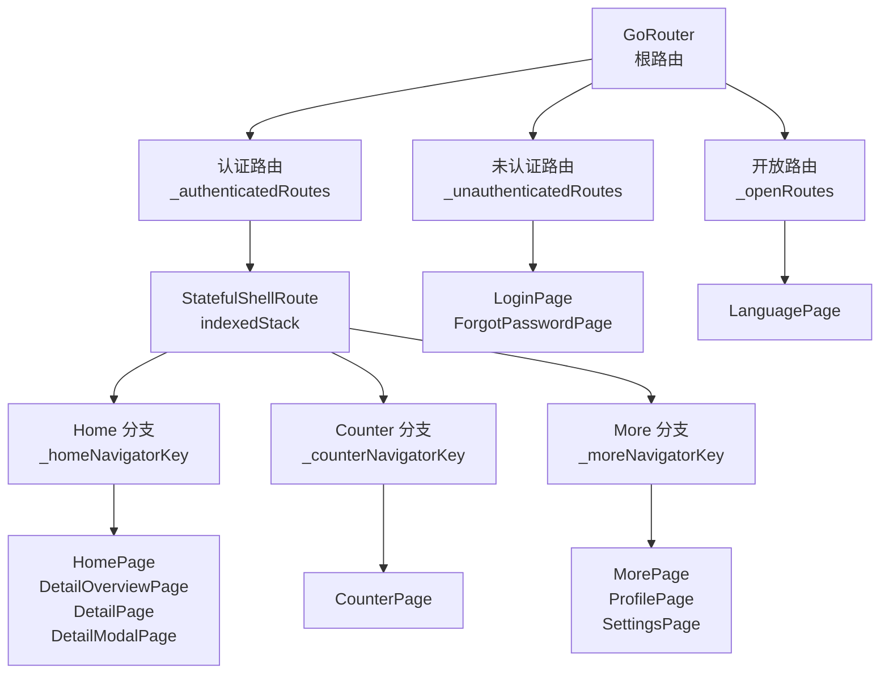
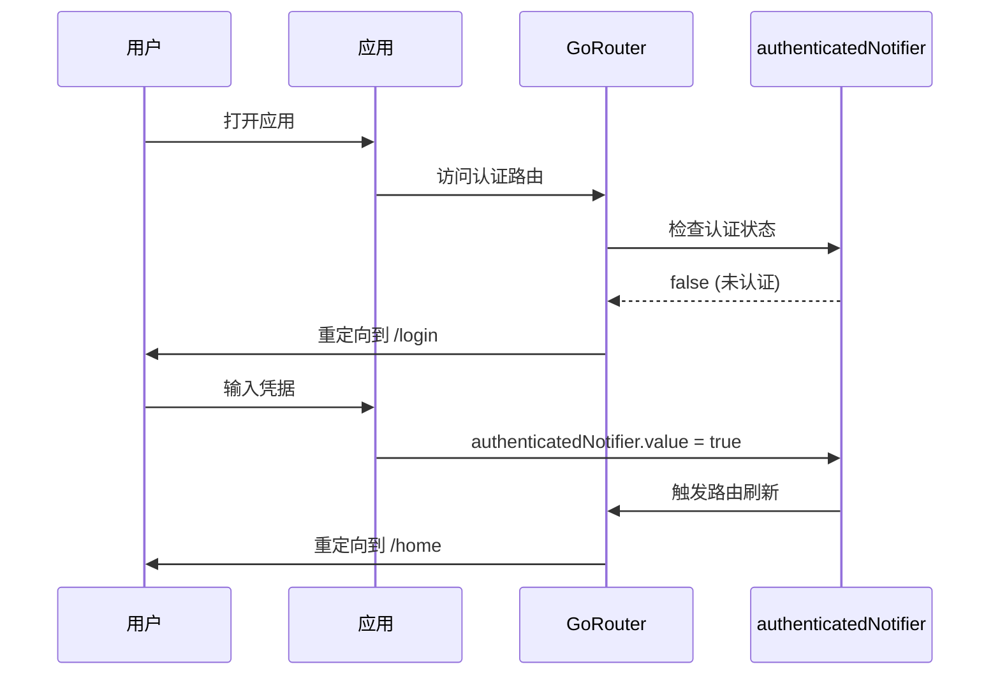

# app_router.dart 代码讲解

## 文件概述

`app_router.dart` 是应用的路由配置中心，使用 `GoRouter` 管理整个应用的路由系统。这个文件展示了如何将 `flutter_adaptive_scaffold` 与 `GoRouter` 的 `StatefulShellRoute` 集成，实现复杂的多分支导航结构。

### 核心功能

- **路由配置**：定义应用的所有路由和页面
- **认证管理**：处理用户认证状态和路由守卫
- **分支导航**：使用 `StatefulShellRoute` 实现多分支导航结构
- **深度链接支持**：支持通过 URL 直接访问特定页面

### 路由架构



## 路由结构分析

### 根路由配置

```dart 22:49:example/lib/go_router_demo/app_router.dart
/// The [AppRouter] maintains the main route configuration for the app.
///
/// Routes that are `fullScreenDialogs` should also set `_rootNavigatorKey` as
/// the `parentNavigatorKey` to ensure that the dialog is displayed correctly.
class AppRouter {
  /// The authentication status of the user.
  static ValueNotifier<bool> authenticatedNotifier = ValueNotifier<bool>(false);

  /// The router with the routes of pages that should be displayed.
  static final GoRouter router = GoRouter(
    navigatorKey: rootNavigatorKey,
    debugLogDiagnostics: true,
    errorPageBuilder: (BuildContext context, GoRouterState state) {
      return const MaterialPage<void>(child: NavigationErrorPage());
    },
    redirect: (BuildContext context, GoRouterState state) {
      if (state.uri.path == '/') {
        return HomePage.path;
      }
      return null;
    },
    refreshListenable: authenticatedNotifier,
    routes: <RouteBase>[
      _unauthenticatedRoutes,
      _authenticatedRoutes,
      ..._openRoutes,
    ],
  );
```

#### 关键配置说明

1. **navigatorKey: rootNavigatorKey**

```dart 12:13:example/lib/go_router_demo/app_router.dart
final GlobalKey<NavigatorState> rootNavigatorKey =
    GlobalKey<NavigatorState>(debugLabel: 'root');
```

`rootNavigatorKey` 是根导航器的键，用于：

- 管理全局导航栈
- 显示全屏对话框（如 `DetailModalPage`）
- 处理需要脱离分支导航栈的路由

2. **debugLogDiagnostics: true**

启用路由诊断日志，在开发时帮助调试路由问题。

3. **errorPageBuilder**

```dart 34:36:example/lib/go_router_demo/app_router.dart
    errorPageBuilder: (BuildContext context, GoRouterState state) {
      return const MaterialPage<void>(child: NavigationErrorPage());
    },
```

当路由匹配失败时，显示自定义错误页面。

4. **redirect 逻辑**

```dart 37:42:example/lib/go_router_demo/app_router.dart
    redirect: (BuildContext context, GoRouterState state) {
      if (state.uri.path == '/') {
        return HomePage.path;
      }
      return null;
    },
```

将根路径 `/` 重定向到 `HomePage.path`（`/home`）。

5. **refreshListenable: authenticatedNotifier**

```dart 43:43:example/lib/go_router_demo/app_router.dart
    refreshListenable: authenticatedNotifier,
```

当 `authenticatedNotifier` 的值改变时，`GoRouter` 会重新评估路由，触发认证相关的重定向。

6. **routes 配置**

```dart 44:48:example/lib/go_router_demo/app_router.dart
    routes: <RouteBase>[
      _unauthenticatedRoutes,
      _authenticatedRoutes,
      ..._openRoutes,
    ],
```

路由按优先级顺序排列：

- `_unauthenticatedRoutes`：未认证用户可访问的路由
- `_authenticatedRoutes`：需要认证的路由
- `_openRoutes`：公开访问的路由（使用展开运算符 `...`）

### 未认证路由

```dart 51:74:example/lib/go_router_demo/app_router.dart
  static final GoRoute _unauthenticatedRoutes = GoRoute(
    name: LoginPage.name,
    path: LoginPage.path,
    pageBuilder: (BuildContext context, GoRouterState state) {
      return const MaterialPage<void>(child: LoginPage());
    },
    redirect: (BuildContext context, GoRouterState state) {
      if (authenticatedNotifier.value) {
        return HomePage.path;
      }
      return null;
    },
    routes: <RouteBase>[
      GoRoute(
        name: ForgotPasswordPage.name,
        path: ForgotPasswordPage.path,
        pageBuilder: (BuildContext context, GoRouterState state) {
          return const MaterialPage<void>(
            child: ForgotPasswordPage(),
          );
        },
      ),
    ],
  );
```

#### 路由结构

- **主路由**：`LoginPage`（`/login`）
- **子路由**：`ForgotPasswordPage`（`/login/forgot-password`）

#### 重定向逻辑

```dart 57:62:example/lib/go_router_demo/app_router.dart
    redirect: (BuildContext context, GoRouterState state) {
      if (authenticatedNotifier.value) {
        return HomePage.path;
      }
      return null;
    },
```

如果用户已认证，访问登录页面时会被重定向到首页。这防止已登录用户看到登录页面。

### 认证路由（StatefulShellRoute）

```dart 76:184:example/lib/go_router_demo/app_router.dart
  static final StatefulShellRoute _authenticatedRoutes =
      StatefulShellRoute.indexedStack(
    parentNavigatorKey: rootNavigatorKey,
    builder: (
      BuildContext context,
      GoRouterState state,
      StatefulNavigationShell navigationShell,
    ) {
      return ScaffoldShell(navigationShell: navigationShell);
    },
    redirect: (BuildContext context, GoRouterState state) {
      if (!authenticatedNotifier.value) {
        return LoginPage.path;
      }
      return null;
    },
    branches: <StatefulShellBranch>[
      // 分支配置...
    ],
  );
```

这是整个路由系统的核心，使用 `StatefulShellRoute.indexedStack` 实现多分支导航。

#### StatefulShellRoute.indexedStack

`indexedStack` 是 `StatefulShellRoute` 的工厂构造函数，它：

- **维护独立导航栈**：每个分支有自己独立的导航栈
- **保持状态**：切换分支时，每个分支的状态会被保留
- **索引管理**：通过索引（0, 1, 2...）来标识和切换分支

#### parentNavigatorKey

```dart 78:78:example/lib/go_router_demo/app_router.dart
    parentNavigatorKey: rootNavigatorKey,
```

设置为 `rootNavigatorKey`，使得：

- 全屏对话框可以显示在所有分支之上
- 模态页面可以脱离分支导航栈

#### builder 回调

```dart 79:84:example/lib/go_router_demo/app_router.dart
    builder: (
      BuildContext context,
      GoRouterState state,
      StatefulNavigationShell navigationShell,
    ) {
      return ScaffoldShell(navigationShell: navigationShell);
    },
```

`builder` 接收 `navigationShell` 参数，这是 `StatefulNavigationShell` 的实例，包含了：

- `currentIndex`：当前选中的分支索引
- `goBranch()`：切换到指定分支的方法
- `route.branches`：所有分支的路由信息

#### 认证重定向

```dart 86:91:example/lib/go_router_demo/app_router.dart
    redirect: (BuildContext context, GoRouterState state) {
      if (!authenticatedNotifier.value) {
        return LoginPage.path;
      }
      return null;
    },
```

如果用户未认证，访问认证路由时会被重定向到登录页面。

## 路由分支详解

### NavigatorKey 定义

```dart 15:20:example/lib/go_router_demo/app_router.dart
final GlobalKey<NavigatorState> _homeNavigatorKey =
    GlobalKey<NavigatorState>(debugLabel: 'home');
final GlobalKey<NavigatorState> _counterNavigatorKey =
    GlobalKey<NavigatorState>(debugLabel: 'counter');
final GlobalKey<NavigatorState> _moreNavigatorKey =
    GlobalKey<NavigatorState>(debugLabel: 'more');
```

每个分支都有独立的 `NavigatorKey`，用于：

- 管理该分支的导航栈
- 支持该分支内的路由导航
- 在分支切换时保持导航状态

### Home 分支

```dart 92:138:example/lib/go_router_demo/app_router.dart
      StatefulShellBranch(
        navigatorKey: _homeNavigatorKey,
        routes: <RouteBase>[
          GoRoute(
            name: HomePage.name,
            path: HomePage.path,
            pageBuilder: (BuildContext context, GoRouterState state) {
              return const NoTransitionPage<void>(
                child: HomePage(),
              );
            },
            routes: <RouteBase>[
              GoRoute(
                  name: DetailOverviewPage.name,
                  path: DetailOverviewPage.path,
                  pageBuilder: (BuildContext context, GoRouterState state) {
                    return const MaterialPage<void>(
                      child: DetailOverviewPage(),
                    );
                  },
                  routes: <RouteBase>[
                    GoRoute(
                      name: DetailPage.name,
                      path: DetailPage.path,
                      pageBuilder: (BuildContext context, GoRouterState state) {
                        return MaterialPage<void>(
                          child: DetailPage(
                              itemName: state.uri.queryParameters['itemName']!),
                        );
                      },
                    ),
                  ]),
              GoRoute(
                name: DetailModalPage.name,
                path: DetailModalPage.path,
                parentNavigatorKey: rootNavigatorKey,
                pageBuilder: (BuildContext context, GoRouterState state) {
                  return const MaterialPage<void>(
                    fullscreenDialog: true,
                    child: DetailModalPage(),
                  );
                },
              ),
            ],
          ),
        ],
      ),
```

#### 路由层级

```text
Home 分支 (索引 0)
├── HomePage (/home)
│   ├── DetailOverviewPage (/home/detail-overview)
│   │   └── DetailPage (/home/detail-overview/detail?itemName=xxx)
│   └── DetailModalPage (/home/detail-modal) [全屏对话框]
```

#### NoTransitionPage

```dart 100:102:example/lib/go_router_demo/app_router.dart
              return const NoTransitionPage<void>(
                child: HomePage(),
              );
```

`NoTransitionPage` 用于分支的主页面，因为：

- 分支切换时，`AdaptiveScaffold` 已经处理了过渡动画
- 避免双重动画效果
- 提供更流畅的用户体验

#### 嵌套路由

```dart 104:124:example/lib/go_router_demo/app_router.dart
            routes: <RouteBase>[
              GoRoute(
                  name: DetailOverviewPage.name,
                  path: DetailOverviewPage.path,
                  pageBuilder: (BuildContext context, GoRouterState state) {
                    return const MaterialPage<void>(
                      child: DetailOverviewPage(),
                    );
                  },
                  routes: <RouteBase>[
                    GoRoute(
                      name: DetailPage.name,
                      path: DetailPage.path,
                      pageBuilder: (BuildContext context, GoRouterState state) {
                        return MaterialPage<void>(
                          child: DetailPage(
                              itemName: state.uri.queryParameters['itemName']!),
                        );
                      },
                    ),
                  ]),
```

展示了多级嵌套路由：

- `DetailOverviewPage` 是 `HomePage` 的子路由
- `DetailPage` 是 `DetailOverviewPage` 的子路由
- `DetailPage` 从 URL 查询参数中获取 `itemName`

#### 查询参数

```dart 118:120:example/lib/go_router_demo/app_router.dart
                          child: DetailPage(
                              itemName: state.uri.queryParameters['itemName']!),
```

从 `GoRouterState` 的 `uri.queryParameters` 中获取 URL 查询参数。`!` 表示非空断言，假设参数一定存在。

#### 全屏对话框

```dart 125:135:example/lib/go_router_demo/app_router.dart
              GoRoute(
                name: DetailModalPage.name,
                path: DetailModalPage.path,
                parentNavigatorKey: rootNavigatorKey,
                pageBuilder: (BuildContext context, GoRouterState state) {
                  return const MaterialPage<void>(
                    fullscreenDialog: true,
                    child: DetailModalPage(),
                  );
                },
              ),
```

**关键配置**：

- `parentNavigatorKey: rootNavigatorKey`：使用根导航器，脱离分支导航栈
- `fullscreenDialog: true`：全屏对话框样式，通常带有从底部滑入的动画

### Counter 分支

```dart 139:151:example/lib/go_router_demo/app_router.dart
      StatefulShellBranch(
        navigatorKey: _counterNavigatorKey,
        routes: <RouteBase>[
          GoRoute(
            name: CounterPage.name,
            path: CounterPage.path,
            pageBuilder: (BuildContext context, GoRouterState state) {
              return const NoTransitionPage<void>(child: CounterPage());
            },
          ),
        ],
      ),
```

Counter 分支是最简单的分支，只有一个页面：

```text
Counter 分支 (索引 1)
└── CounterPage (/counter)
```

### More 分支

```dart 152:182:example/lib/go_router_demo/app_router.dart
      StatefulShellBranch(
        navigatorKey: _moreNavigatorKey,
        routes: <RouteBase>[
          GoRoute(
            name: MorePage.name,
            path: MorePage.path,
            pageBuilder: (BuildContext context, GoRouterState state) {
              return const NoTransitionPage<void>(
                key: ValueKey<String>(MorePage.name),
                child: MorePage(),
              );
            },
            routes: <RouteBase>[
              GoRoute(
                path: ProfilePage.path,
                name: ProfilePage.name,
                pageBuilder: (BuildContext context, GoRouterState state) {
                  return const MaterialPage<void>(child: ProfilePage());
                },
              ),
              GoRoute(
                name: SettingsPage.name,
                path: SettingsPage.path,
                pageBuilder: (BuildContext context, GoRouterState state) {
                  return const MaterialPage<void>(child: SettingsPage());
                },
              ),
            ],
          ),
        ],
      ),
```

#### 路由层级

```text
More 分支 (索引 2)
└── MorePage (/more)
    ├── ProfilePage (/more/profile)
    └── SettingsPage (/more/settings)
```

#### ValueKey 的使用

```dart 159:160:example/lib/go_router_demo/app_router.dart
                key: ValueKey<String>(MorePage.name),
                child: MorePage(),
```

为 `MorePage` 指定了 `ValueKey`，这确保了：

- Widget 的身份识别
- 状态保持
- 在某些场景下避免不必要的重建

### 开放路由

```dart 186:196:example/lib/go_router_demo/app_router.dart
  static final List<GoRoute> _openRoutes = <GoRoute>[
    GoRoute(
      name: LanguagePage.name,
      path: LanguagePage.path,
      pageBuilder: (BuildContext context, GoRouterState state) {
        return const MaterialPage<void>(
          child: LanguagePage(),
        );
      },
    ),
  ];
```

开放路由是不需要认证即可访问的路由，例如：

- 语言设置页面
- 帮助页面
- 关于页面

## 认证机制详解

### authenticatedNotifier

```dart 28:28:example/lib/go_router_demo/app_router.dart
  static ValueNotifier<bool> authenticatedNotifier = ValueNotifier<bool>(false);
```

`authenticatedNotifier` 是一个 `ValueNotifier<bool>`，用于：

- 跟踪用户的认证状态
- 触发路由重定向
- 响应式更新 UI

### 认证流程



### 使用认证状态

在登录页面中，当用户成功登录后：

```dart
// 在 LoginPage 中
AppRouter.authenticatedNotifier.value = true;
```

这会触发 `GoRouter` 重新评估路由，因为 `refreshListenable` 被设置为 `authenticatedNotifier`。

## 路由导航方法

### 命名路由导航

在代码中，使用 `context.goNamed()` 进行导航：

```dart
// 在 HomePage 中
context.goNamed(DetailOverviewPage.name);
context.goNamed(DetailModalPage.name);

// 在 MorePage 中
context.goNamed(ProfilePage.name);
context.goNamed(SettingsPage.name);
```

### 路径导航

也可以使用路径进行导航：

```dart
context.go(HomePage.path);  // /home
context.go('/home/detail-overview');
```

### 查询参数

带查询参数的导航：

```dart
context.go('/home/detail-overview/detail?itemName=Apple');
```

## 最佳实践

### 1. 路由命名规范

- 使用页面类的 `name` 常量，而不是字符串字面量
- `name` 和 `path` 都定义为静态常量
- 保持命名一致性

### 2. NavigatorKey 管理

- 为每个分支定义独立的 `NavigatorKey`
- 使用有意义的 `debugLabel`
- 根导航器使用 `rootNavigatorKey`

### 3. 页面类型选择

- **NoTransitionPage**：用于分支主页面
- **MaterialPage**：用于普通页面和嵌套路由
- **fullscreenDialog: true**：用于全屏对话框

### 4. 认证路由守卫

- 在路由级别使用 `redirect` 进行认证检查
- 使用 `ValueNotifier` 管理认证状态
- 设置 `refreshListenable` 以响应状态变化

### 5. 错误处理

- 提供自定义错误页面
- 处理路由匹配失败的情况
- 验证查询参数的存在性

## 常见问题

### Q1: 为什么分支主页面使用 NoTransitionPage？

**A**: 因为 `AdaptiveScaffold` 在分支切换时已经提供了过渡动画，使用 `NoTransitionPage` 可以避免双重动画，提供更流畅的体验。

### Q2: 什么时候使用 parentNavigatorKey？

**A**: 当需要显示全屏对话框或模态页面时，应该使用 `rootNavigatorKey` 作为 `parentNavigatorKey`，这样页面可以显示在所有分支之上。

### Q3: 如何添加新的路由分支？

**A**:

1. 定义新的 `NavigatorKey`
2. 在 `branches` 列表中添加新的 `StatefulShellBranch`
3. 在 `scaffold_shell.dart` 中添加对应的 `NavigationDestination` 映射

### Q4: 认证状态改变后路由不更新？

**A**: 确保 `GoRouter` 的 `refreshListenable` 设置为 `authenticatedNotifier`，并且使用 `ValueNotifier.value = ...` 来更新状态。

## 总结

`app_router.dart` 展示了如何使用 `GoRouter` 构建复杂的路由系统：

- **多分支导航**：使用 `StatefulShellRoute.indexedStack` 实现独立的分支导航栈
- **认证管理**：通过 `ValueNotifier` 和 `redirect` 实现路由守卫
- **灵活的路由结构**：支持嵌套路由、查询参数、全屏对话框等
- **深度链接支持**：通过 URL 路径和查询参数支持深度链接

通过理解这个文件的结构和设计，你可以构建出功能强大、结构清晰的路由系统。
