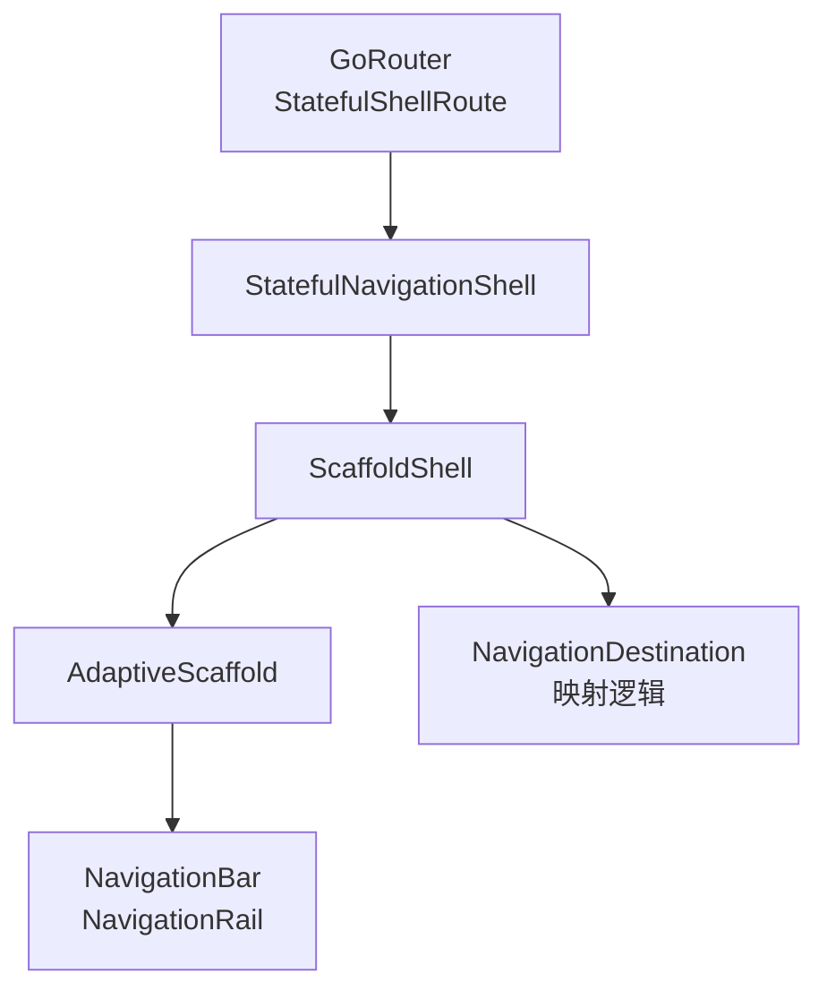
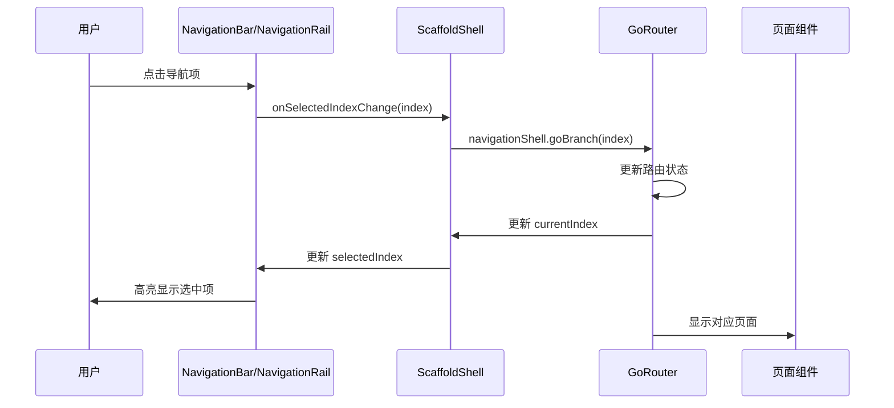

# scaffold_shell.dart 代码讲解

## 文件概述

`scaffold_shell.dart` 是一个关键的集成组件，它将 `AdaptiveScaffold` 与 `GoRouter` 的 `StatefulShellRoute` 无缝连接起来。这个文件实现了一个 `ScaffoldShell` 组件，作为应用的主要布局容器，负责处理导航状态与路由状态的同步。

### 核心作用

- **桥接组件**：连接 `AdaptiveScaffold` 和 `GoRouter` 的 `StatefulNavigationShell`
- **状态同步**：确保 UI 导航状态与路由状态保持一致
- **布局容器**：为应用提供自适应的导航布局（底部导航栏或侧边导航栏）

### 与相关组件的关系



## 类结构分析

### ScaffoldShell 类定义

```dart 11:13:example/lib/go_router_demo/scaffold_shell.dart
/// The [ScaffoldShell] is a [StatelessWidget] that uses the [AdaptiveScaffold]
/// to create a shell for the application.
class ScaffoldShell extends StatelessWidget {
```

`ScaffoldShell` 是一个无状态的 Widget，这意味着它不维护自己的状态，而是完全依赖传入的参数。这种设计使得组件更加轻量和可预测。

### 构造函数参数

```dart 14:21:example/lib/go_router_demo/scaffold_shell.dart
  /// Create a new instance of [AppScaffoldShell]
  const ScaffoldShell({
    required this.navigationShell,
    super.key,
  });

  /// The navigation shell to use with the navigation.
  final StatefulNavigationShell navigationShell;
```

**关键参数说明**：

- `navigationShell`：`StatefulNavigationShell` 类型，这是 `GoRouter` 提供的导航 shell，包含了当前的路由状态和导航方法
- `super.key`：Widget 的键，用于 Flutter 的 Widget 树管理

### StatefulNavigationShell 的作用

`StatefulNavigationShell` 是 `GoRouter` 提供的核心对象，它：

1. **维护导航状态**：跟踪当前选中的分支索引（`currentIndex`）
2. **提供导航方法**：`goBranch()` 方法用于切换到不同的路由分支
3. **包含路由信息**：`route.branches` 提供了所有可用的路由分支

## 核心实现解析

### AdaptiveScaffold 配置

```dart 24:34:example/lib/go_router_demo/scaffold_shell.dart
  @override
  Widget build(BuildContext context) {
    return AdaptiveScaffold(
      useDrawer: false,
      body: (BuildContext context) => navigationShell,
      selectedIndex: navigationShell.currentIndex,
      onSelectedIndexChange: (int index) {
        navigationShell.goBranch(
          index,
          initialLocation: index == navigationShell.currentIndex,
        );
      },
```

让我们逐行分析这个配置：

#### 1. useDrawer: false

```dart 26:26:example/lib/go_router_demo/scaffold_shell.dart
      useDrawer: false,
```

禁用抽屉导航。这意味着在小屏幕上，应用会使用底部导航栏（`NavigationBar`）而不是抽屉菜单。

#### 2. body 配置

```dart 27:27:example/lib/go_router_demo/scaffold_shell.dart
      body: (BuildContext context) => navigationShell,
```

`body` 接收一个 `BuildContext` 并返回 `navigationShell`。`navigationShell` 本身就是一个 Widget，它会根据当前路由状态显示对应的页面内容。

#### 3. selectedIndex 同步

```dart 28:28:example/lib/go_router_demo/scaffold_shell.dart
      selectedIndex: navigationShell.currentIndex,
```

将 `AdaptiveScaffold` 的选中索引与 `navigationShell` 的当前索引同步。这确保了导航栏的高亮状态与当前路由分支一致。

#### 4. onSelectedIndexChange 回调

```dart 29:34:example/lib/go_router_demo/scaffold_shell.dart
      onSelectedIndexChange: (int index) {
        navigationShell.goBranch(
          index,
          initialLocation: index == navigationShell.currentIndex,
        );
      },
```

当用户点击导航项时，这个回调会被触发：

- `navigationShell.goBranch(index)`：切换到指定的路由分支
- `initialLocation` 参数：如果切换到的分支就是当前分支（`index == navigationShell.currentIndex`），则设置为 `true`，表示导航到该分支的初始位置；否则为 `false`，保持当前分支内的路由状态

**为什么需要 `initialLocation` 参数？**

假设用户在 Home 分支的详情页面，然后再次点击 Home 导航项。如果 `initialLocation` 为 `true`，会导航回 Home 的初始页面；如果为 `false`，则保持在详情页面。

### destinations 映射逻辑

```dart 35:49:example/lib/go_router_demo/scaffold_shell.dart
      destinations: navigationShell.route.branches.map(
        (StatefulShellBranch e) {
          return switch (e.defaultRoute?.name) {
            HomePage.name => const NavigationDestination(
                icon: Icon(Icons.home), label: 'Home'),
            CounterPage.name => const NavigationDestination(
                icon: Icon(Icons.add), label: 'Counter'),
            MorePage.name => const NavigationDestination(
                icon: Icon(Icons.account_circle), label: 'More'),
            _ => throw UnimplementedError(
                'The route ${e.defaultRoute?.name} is not implemented.',
              ),
          };
        },
      ).toList(),
```

这是整个组件的核心逻辑，将路由分支映射为导航目标。

#### 映射过程

1. **获取所有分支**：`navigationShell.route.branches` 返回所有配置的路由分支
2. **遍历每个分支**：使用 `map()` 方法将每个 `StatefulShellBranch` 转换为 `NavigationDestination`
3. **匹配路由名称**：使用 `switch` 表达式根据分支的默认路由名称（`e.defaultRoute?.name`）匹配对应的页面
4. **创建导航目标**：为每个匹配的路由创建带有图标和标签的 `NavigationDestination`

#### Switch 表达式详解

这是 Dart 3.0 引入的 `switch` 表达式语法，比传统的 `switch` 语句更简洁：

```dart
return switch (e.defaultRoute?.name) {
  HomePage.name => const NavigationDestination(...),
  CounterPage.name => const NavigationDestination(...),
  MorePage.name => const NavigationDestination(...),
  _ => throw UnimplementedError(...),  // 默认情况
};
```

**特点**：

- 直接返回表达式结果，不需要 `return` 语句
- `_` 是通配符，匹配所有未明确处理的情况
- 如果路由名称不匹配任何已知页面，抛出 `UnimplementedError` 异常

#### 路由名称常量

代码中使用了页面类的 `name` 常量（如 `HomePage.name`），这些常量在各自的页面类中定义。例如：

```dart
class HomePage extends StatelessWidget {
  static const String name = 'home';
  static const String path = '/home';
  // ...
}
```

使用常量而不是字符串字面量的好处：

- **类型安全**：编译时检查，避免拼写错误
- **易于重构**：IDE 可以自动重命名
- **代码提示**：IDE 可以提供自动完成

## 导航流程

让我们通过一个流程图来理解完整的导航流程：



## 使用场景和最佳实践

### 何时使用 ScaffoldShell

`ScaffoldShell` 适用于以下场景：

1. **使用 GoRouter 进行路由管理**：需要与 `StatefulShellRoute` 集成
2. **需要底部导航栏或侧边导航栏**：利用 `AdaptiveScaffold` 的自适应能力
3. **多分支导航结构**：应用有多个主要功能模块，每个模块有独立的路由栈

### 与 StatefulShellRoute 的配合

在 `app_router.dart` 中，`ScaffoldShell` 是这样使用的：

```dart
StatefulShellRoute.indexedStack(
  builder: (context, state, navigationShell) {
    return ScaffoldShell(navigationShell: navigationShell);
  },
  branches: [
    // 路由分支配置
  ],
)
```

**关键点**：

- `builder` 回调接收 `navigationShell` 参数
- 将 `navigationShell` 传递给 `ScaffoldShell`
- `branches` 中定义的路由顺序决定了导航项的索引

### 注意事项

1. **路由分支顺序很重要**：`branches` 列表中的顺序决定了导航项的索引。第一个分支对应索引 0，第二个对应索引 1，以此类推。

2. **路由名称必须匹配**：`destinations` 映射中的路由名称必须与页面类中定义的 `name` 常量完全匹配。

3. **至少需要两个分支**：`AdaptiveScaffold` 要求至少有两个 `destinations`，因此 `StatefulShellRoute` 也需要至少两个分支。

4. **错误处理**：如果添加了新的路由分支但没有在 `switch` 表达式中处理，应用会在运行时抛出 `UnimplementedError`。记得及时更新映射逻辑。

## 扩展建议

### 添加新的导航项

要添加新的导航项，需要：

1. 在 `app_router.dart` 中添加新的 `StatefulShellBranch`
2. 在 `scaffold_shell.dart` 的 `switch` 表达式中添加新的 case
3. 确保页面类定义了 `name` 常量

示例：

```dart
// 在 switch 表达式中添加
SettingsPage.name => const NavigationDestination(
    icon: Icon(Icons.settings), label: 'Settings'),
```

### 自定义导航样式

如果需要自定义导航项的样式，可以修改 `NavigationDestination` 的配置：

```dart
NavigationDestination(
  icon: Icon(Icons.home),
  selectedIcon: Icon(Icons.home_filled),  // 选中时的图标
  label: 'Home',
  tooltip: 'Home page',  // 工具提示
)
```

## 总结

`ScaffoldShell` 是一个精心设计的桥接组件，它：

- 简化了 `AdaptiveScaffold` 与 `GoRouter` 的集成
- 自动处理导航状态与路由状态的同步
- 提供了清晰的映射逻辑，将路由分支转换为导航目标
- 支持自适应的导航布局（底部导航栏 ↔ 侧边导航栏）

通过理解这个组件的实现，你可以更好地掌握如何在 Flutter 应用中实现复杂的导航结构。
