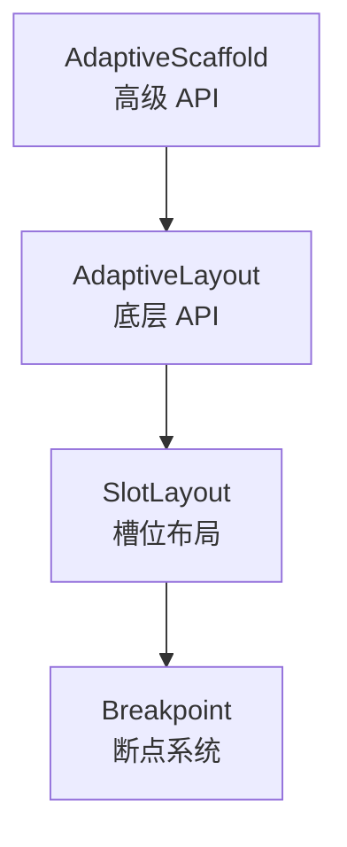

# 第 2 章 核心概念解析

## 引言

在深入使用 `flutter_adaptive_scaffold` 之前，我们需要理解其核心架构和设计理念。本章将深入解析 `AdaptiveScaffold` 和 `AdaptiveLayout` 的关系、槽位系统的工作原理，以及响应式布局的实现机制。

## AdaptiveScaffold vs AdaptiveLayout

### 设计层次

`flutter_adaptive_scaffold` 库采用了分层设计：



**AdaptiveScaffold** 是高级抽象，提供了便捷的默认实现；**AdaptiveLayout** 是底层 API，提供了完全的控制权。

### AdaptiveScaffold：开箱即用

`AdaptiveScaffold` 的设计目标是**简化常见场景**。它内部使用 `AdaptiveLayout`，但为你处理了大部分配置：

```dart
AdaptiveScaffold(
  destinations: destinations,
  body: (_) => Content(),
  smallBody: (_) => MobileLayout(),
  largeBody: (_) => DesktopLayout(),
)
```

**特点**：

- **预设布局**：自动处理导航栏的切换（BottomNavigationBar ↔ NavigationRail）
- **默认动画**：提供流畅的过渡效果
- **简化配置**：只需要配置 destinations 和不同断点的 body
- **限制**：定制能力有限，适合标准场景

**内部实现**：

`AdaptiveScaffold` 实际上是将你的配置转换为 `AdaptiveLayout` 的配置：

```dart
// AdaptiveScaffold 内部大致实现逻辑
AdaptiveLayout(
  primaryNavigation: SlotLayout(
    config: {
      Breakpoints.small: useDrawer ? Drawer : null,
      Breakpoints.medium: NavigationRail(...),
    },
  ),
  body: SlotLayout(
    config: {
      Breakpoints.small: smallBody ?? body,
      Breakpoints.medium: body,
      Breakpoints.large: largeBody ?? body,
    },
  ),
  bottomNavigation: SlotLayout(
    config: {
      Breakpoints.small: BottomNavigationBar(...),
    },
  ),
)
```

### AdaptiveLayout：完全控制

`AdaptiveLayout` 提供了**完全的控制权**，但需要更多的配置代码：

```dart
AdaptiveLayout(
  primaryNavigation: SlotLayout(
    config: {
      Breakpoints.medium: SlotLayout.from(
        key: const Key('Nav Medium'),
        builder: (_) => CustomNavigationRail(...),
      ),
    },
  ),
  body: SlotLayout(
    config: {
      Breakpoints.small: SlotLayout.from(
        key: const Key('Body Small'),
        builder: (_) => ListView(...),
      ),
    },
  ),
)
```

**特点**：

- **完全控制**：可以配置所有槽位
- **灵活布局**：可以实现任意复杂的布局
- **自定义动画**：可以定义每个槽位的动画
- **复杂度**：需要更多代码和配置

### 选择建议

**使用 AdaptiveScaffold 当**：

- 你的需求符合 Material Design 3 的标准布局
- 你希望快速实现响应式布局
- 你不需要复杂的自定义

**使用 AdaptiveLayout 当**：

- 你需要完全自定义的布局
- 你需要控制每个槽位的细节
- 你需要实现非标准的布局模式

## 槽位（Slots）系统详解

### 槽位的概念

`AdaptiveLayout` 将屏幕划分为多个**槽位**（Slots），每个槽位可以独立配置在不同断点下的显示内容。

### 槽位类型

#### 1. primaryNavigation（主导航）

**位置**：屏幕左侧（LTR）或右侧（RTL）

**用途**：通常用于显示主导航，如 `NavigationRail`

**特点**：

- 固定宽度（由内容决定）
- 从 `topNavigation` 下方延伸到 `bottomNavigation` 上方
- 在小屏幕上通常隐藏或使用 Drawer

**示例**：

```dart
primaryNavigation: SlotLayout(
  config: {
    Breakpoints.medium: SlotLayout.from(
      key: const Key('Primary Nav'),
      builder: (_) => NavigationRail(
        destinations: destinations,
        selectedIndex: selectedIndex,
      ),
    ),
  },
)
```

#### 2. secondaryNavigation（次导航）

**位置**：屏幕右侧（LTR）或左侧（RTL）

**用途**：较少使用，可用于辅助导航或工具栏

**特点**：

- 与 `primaryNavigation` 对称
- 通常用于特殊场景，如邮件应用的文件夹列表

#### 3. topNavigation（顶部导航）

**位置**：屏幕顶部，全宽

**用途**：应用栏、工具栏等

**特点**：

- 必须定义固定高度
- 全宽显示
- 通常用于 `AppBar` 或自定义顶部栏

**示例**：

```dart
topNavigation: SlotLayout(
  config: {
    Breakpoints.standard: SlotLayout.from(
      key: const Key('Top Nav'),
      builder: (_) => AppBar(title: Text('My App')),
    ),
  },
)
```

#### 4. bottomNavigation（底部导航）

**位置**：屏幕底部，全宽

**用途**：底部导航栏，通常在小屏幕上使用

**特点**：

- 必须定义固定高度
- 全宽显示
- 通常只在 `Breakpoints.small` 时显示

**示例**：

```dart
bottomNavigation: SlotLayout(
  config: {
    Breakpoints.small: SlotLayout.from(
      key: const Key('Bottom Nav'),
      builder: (_) => BottomNavigationBar(
        items: items,
        currentIndex: currentIndex,
      ),
    ),
  },
)
```

#### 5. body（主内容区）

**位置**：剩余空间的主要区域

**用途**：应用的主要内容

**特点**：

- 灵活尺寸，填充剩余空间
- 通常是最重要的槽位
- 可以配合 `secondaryBody` 实现主从视图

**示例**：

```dart
body: SlotLayout(
  config: {
    Breakpoints.small: SlotLayout.from(
      key: const Key('Body Small'),
      builder: (_) => ListView(...),
    ),
    Breakpoints.large: SlotLayout.from(
      key: const Key('Body Large'),
      builder: (_) => GridView(...),
    ),
  },
)
```

#### 6. secondaryBody（次内容区）

**位置**：`body` 右侧的剩余空间

**用途**：详情视图、侧边栏等

**特点**：

- 灵活尺寸，填充剩余空间
- 通常与 `body` 配合实现主从视图
- 在小屏幕上通常隐藏，使用模态显示

**示例**：

```dart
secondaryBody: SlotLayout(
  config: {
    Breakpoints.mediumAndUp: SlotLayout.from(
      key: const Key('Secondary Body'),
      builder: (_) => DetailView(...),
    ),
  },
)
```

### 槽位布局顺序

槽位的布局顺序（从上到下，从左到右）：

1. **topNavigation**：顶部，全宽
2. **中间行**（从上到下）：
   - **primaryNavigation**（左侧，固定宽度）
   - **body**（中间，灵活宽度）
   - **secondaryBody**（右侧，灵活宽度）
   - **secondaryNavigation**（最右侧，固定宽度）
3. **bottomNavigation**：底部，全宽

### 槽位协调机制

多个槽位需要协调工作，例如：

- **小屏幕**：`primaryNavigation` 隐藏，`bottomNavigation` 显示
- **大屏幕**：`primaryNavigation` 显示，`bottomNavigation` 隐藏
- **主从视图**：`body` 显示列表，`secondaryBody` 显示详情

这种协调通过 `SlotLayout` 的配置来实现，每个槽位独立配置，但需要整体考虑。

## 响应式布局的基本原理

### 断点检测

响应式布局的核心是**断点检测**。库会实时检测当前屏幕尺寸，并匹配对应的断点：

```dart
// 伪代码：断点检测逻辑
Breakpoint? activeBreakpoint = Breakpoint.activeBreakpointIn(
  context,
  availableBreakpoints,
);

if (activeBreakpoint != null) {
  // 使用该断点对应的配置
  Widget widget = config[activeBreakpoint]?.build();
}
```

### 布局切换

当屏幕尺寸变化时，库会：

1. **检测新断点**：判断当前屏幕属于哪个断点
2. **选择配置**：从 `SlotLayout.config` 中选择对应的 `SlotLayoutConfig`
3. **执行动画**：使用配置的动画进行过渡
4. **更新布局**：显示新的布局

### 性能优化

为了性能，库使用了以下策略：

1. **延迟构建**：使用 `builder` 函数，只在需要时构建 Widget
2. **Key 管理**：使用 `Key` 来识别 Widget 的变化
3. **动画复用**：复用 `AnimatedSwitcher` 进行过渡

## 平台适配机制

### 平台检测

库可以检测运行平台（mobile、desktop、web），并据此调整布局：

```dart
Breakpoint.small(platform: Breakpoint.mobile)  // 仅移动设备
Breakpoint.small(platform: Breakpoint.desktop) // 仅桌面设备
```

### 平台特定行为

不同平台可能有不同的默认行为：

- **Mobile**：倾向于使用 `BottomNavigationBar` 和全屏视图
- **Desktop**：倾向于使用 `NavigationRail` 和多面板布局
- **Web**：需要考虑浏览器窗口大小

### 方向适配

库还支持根据屏幕方向（横屏/竖屏）调整布局，虽然主要通过宽度断点来实现。

## 实际应用示例

让我们看一个完整的例子，理解这些概念如何协同工作：

```dart
AdaptiveLayout(
  // 主导航：小屏幕隐藏，中等屏幕显示紧凑 NavigationRail，大屏幕显示扩展 NavigationRail
  primaryNavigation: SlotLayout(
    config: {
      Breakpoints.medium: SlotLayout.from(
        key: const Key('Nav Medium'),
        builder: (_) => NavigationRail(
          extended: false,
          destinations: destinations,
        ),
      ),
      Breakpoints.large: SlotLayout.from(
        key: const Key('Nav Large'),
        builder: (_) => NavigationRail(
          extended: true,
          destinations: destinations,
        ),
      ),
    },
  ),
  
  // 主内容：小屏幕用 ListView，大屏幕用 GridView
  body: SlotLayout(
    config: {
      Breakpoints.small: SlotLayout.from(
        key: const Key('Body Small'),
        builder: (_) => ListView(...),
      ),
      Breakpoints.large: SlotLayout.from(
        key: const Key('Body Large'),
        builder: (_) => GridView(...),
      ),
    },
  ),
  
  // 详情视图：仅在大屏幕上显示
  secondaryBody: SlotLayout(
    config: {
      Breakpoints.large: SlotLayout.from(
        key: const Key('Secondary Body'),
        builder: (_) => DetailView(...),
      ),
    },
  ),
  
  // 底部导航：仅在小屏幕上显示
  bottomNavigation: SlotLayout(
    config: {
      Breakpoints.small: SlotLayout.from(
        key: const Key('Bottom Nav'),
        builder: (_) => BottomNavigationBar(...),
      ),
    },
  ),
)
```

这个配置实现了：

- **小屏幕**：底部导航 + ListView（无侧边栏，无详情视图）
- **中等屏幕**：紧凑 NavigationRail + ListView
- **大屏幕**：扩展 NavigationRail + GridView + 详情视图

## 总结

本章我们深入了解了：

- **AdaptiveScaffold vs AdaptiveLayout**：高级 API 与底层 API 的区别和选择
- **槽位系统**：6 种槽位的用途和特点
- **响应式布局原理**：断点检测和布局切换机制
- **平台适配**：如何根据平台调整布局

在下一章中，我们将深入探讨断点系统，理解如何定义和使用断点。

## 练习

1. 分析 `adaptive_scaffold_demo.dart`，识别它使用了哪些槽位
2. 尝试修改 `adaptive_layout_demo.dart`，添加 `topNavigation` 槽位
3. 思考如何在小屏幕上隐藏 `secondaryBody`，在大屏幕上显示

## 检查清单

- [ ] 理解 AdaptiveScaffold 和 AdaptiveLayout 的区别
- [ ] 掌握 6 种槽位的用途和特点
- [ ] 理解响应式布局的基本原理
- [ ] 了解平台适配机制
- [ ] 能够分析槽位配置的协调关系
