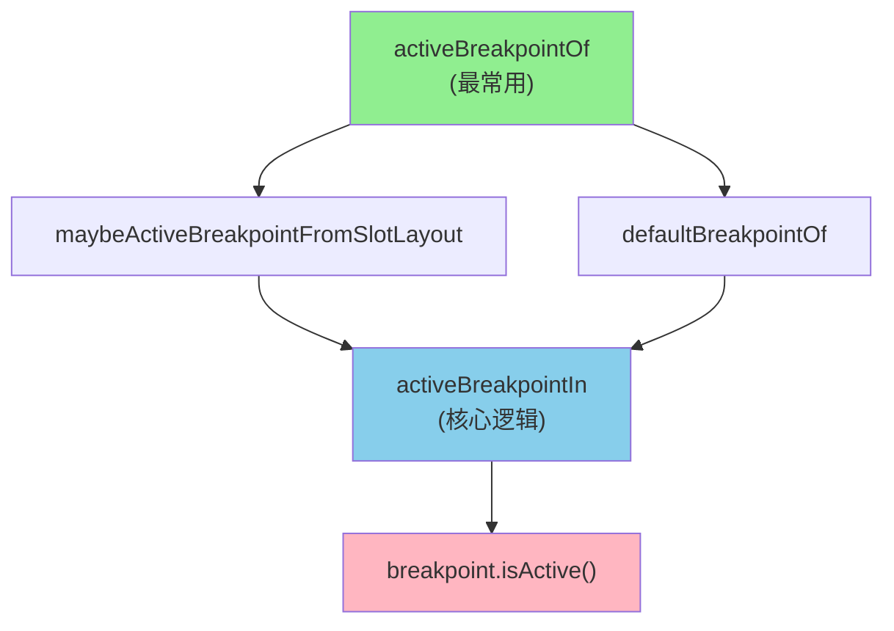
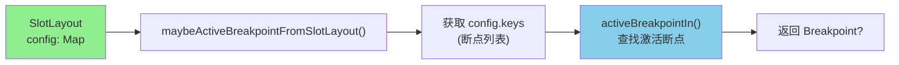
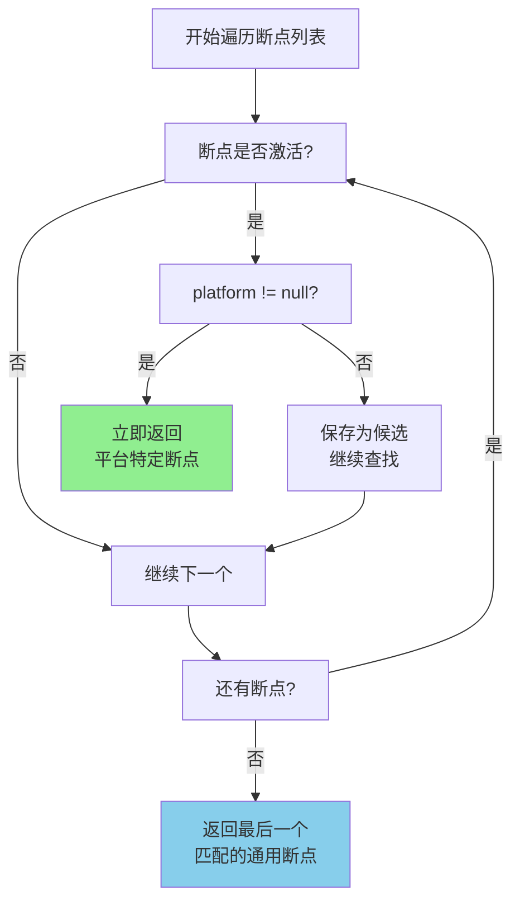
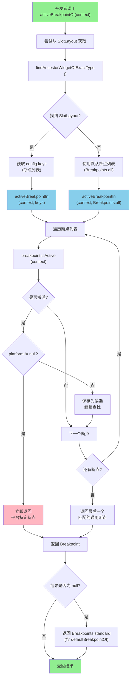

# Breakpoint 激活方法详解

## 引言

`Breakpoint` 类提供了四个静态方法用于获取当前激活的断点，这些方法是响应式布局系统的核心工具。它们帮助开发者在运行时确定当前屏幕应该使用哪个断点，从而选择合适的布局配置。这些方法设计精巧，通过优先级机制和回退策略，确保在任何情况下都能返回一个有效的断点。

## 方法概述

`Breakpoint` 类提供了以下四个静态方法来获取激活的断点：

1. **`activeBreakpointOf`**：获取当前激活的断点（最常用，推荐使用）
2. **`maybeActiveBreakpointFromSlotLayout`**：从 `SlotLayout` 中获取激活断点（可能为 `null`）
3. **`defaultBreakpointOf`**：获取默认断点（基于标准断点列表）
4. **`activeBreakpointIn`**：从指定断点列表中查找激活的断点（核心查找逻辑）

### 方法调用关系

这些方法之间存在清晰的调用关系：



**调用层次**：

- **顶层方法**：`activeBreakpointOf` - 最常用的方法，总是返回有效断点
- **中间层方法**：`maybeActiveBreakpointFromSlotLayout` 和 `defaultBreakpointOf` - 处理不同的断点来源
- **核心方法**：`activeBreakpointIn` - 执行实际的断点查找逻辑
- **基础方法**：`breakpoint.isActive()` - 判断单个断点是否激活

## 方法详解

### 1. activeBreakpointOf() - 获取当前激活的断点

**方法签名**：

```dart
static Breakpoint activeBreakpointOf(BuildContext context)
```

**作用**：获取当前激活的断点，这是最常用的方法。

**返回值**：总是返回一个有效的 `Breakpoint`（不会为 `null`）。

**实现逻辑**：

```dart 306:326:lib/src/breakpoints.dart
  /// Returns the currently active [Breakpoint] based on the [SlotLayout] in the
  /// context.
  static Breakpoint? maybeActiveBreakpointFromSlotLayout(BuildContext context) {
    final SlotLayout? slotLayout =
        context.findAncestorWidgetOfExactType<SlotLayout>();

    return slotLayout != null
        ? activeBreakpointIn(context, slotLayout.config.keys.toList())
        : null;
  }

  /// Returns the default [Breakpoint] based on the [BuildContext].
  static Breakpoint defaultBreakpointOf(BuildContext context) {
    return activeBreakpointIn(context, Breakpoints.all) ?? Breakpoints.standard;
  }

  /// Returns the currently active [Breakpoint].
  static Breakpoint activeBreakpointOf(BuildContext context) {
    return maybeActiveBreakpointFromSlotLayout(context) ??
        defaultBreakpointOf(context);
  }
```

**执行流程**：

1. 首先尝试从 `SlotLayout` 中获取断点（调用 `maybeActiveBreakpointFromSlotLayout`）
2. 如果未找到（返回 `null`），则使用默认断点（调用 `defaultBreakpointOf`）
3. 使用空值合并操作符（`??`）确保总是返回有效值

**使用场景**：

- 在任何 Widget 中获取当前激活的断点
- 根据断点调整布局、样式或行为
- 在自定义 Widget 中实现响应式逻辑

**示例**：

```dart
// 在 Widget 的 build 方法中获取当前断点
@override
Widget build(BuildContext context) {
  final currentBreakpoint = Breakpoint.activeBreakpointOf(context);
  
  // 根据断点调整布局
  if (currentBreakpoint.recommendedPanes >= 2) {
    return Row(
      children: [
        Expanded(child: leftPanel),
        Expanded(child: rightPanel),
      ],
    );
  } else {
    return SingleChildScrollView(child: content);
  }
}

// 根据断点调整间距
final spacing = Breakpoint.activeBreakpointOf(context).spacing;
return Padding(
  padding: EdgeInsets.all(spacing),
  child: content,
);
```

**特点**：

- **总是返回有效值**：通过回退机制确保不会返回 `null`
- **优先级明确**：优先使用 `SlotLayout` 中的断点，其次使用标准断点
- **使用简单**：只需传入 `BuildContext`，无需其他参数

### 2. maybeActiveBreakpointFromSlotLayout() - 从 SlotLayout 获取断点

**方法签名**：

```dart
static Breakpoint? maybeActiveBreakpointFromSlotLayout(BuildContext context)
```

**作用**：从上下文中的 `SlotLayout` 组件获取当前激活的断点。

**返回值**：如果找到 `SlotLayout` 且存在激活的断点，返回该断点；否则返回 `null`。

**实现逻辑**：

```dart 306:315:lib/src/breakpoints.dart
  /// Returns the currently active [Breakpoint] based on the [SlotLayout] in the
  /// context.
  static Breakpoint? maybeActiveBreakpointFromSlotLayout(BuildContext context) {
    final SlotLayout? slotLayout =
        context.findAncestorWidgetOfExactType<SlotLayout>();

    return slotLayout != null
        ? activeBreakpointIn(context, slotLayout.config.keys.toList())
        : null;
  }
```

**执行流程**：

1. 使用 `context.findAncestorWidgetOfExactType<SlotLayout>()` 查找最近的 `SlotLayout` 祖先组件
2. 如果找到 `SlotLayout`：
   - 从 `slotLayout.config.keys` 获取断点列表（`config` 的键就是断点）
   - 调用 `activeBreakpointIn` 在这些断点中查找激活的断点
3. 如果未找到 `SlotLayout`，返回 `null`

**使用场景**：

- 在 `SlotLayout` 的子组件中获取当前使用的断点
- 需要区分是否在 `SlotLayout` 上下文中
- 实现依赖于特定 `SlotLayout` 配置的逻辑

**示例**：

```dart
// 在 SlotLayout 的子组件中获取断点
class MyContentWidget extends StatelessWidget {
  @override
  Widget build(BuildContext context) {
    // 尝试从 SlotLayout 获取断点
    final breakpoint = Breakpoint.maybeActiveBreakpointFromSlotLayout(context);
    
    if (breakpoint != null) {
      // 在 SlotLayout 上下文中，使用特定配置
      return _buildSlotLayoutContent(breakpoint);
    } else {
      // 不在 SlotLayout 上下文中，使用默认布局
      return _buildDefaultContent();
    }
  }
}
```

**特点**：

- **可能返回 `null`**：如果不在 `SlotLayout` 上下文中
- **使用 `SlotLayout` 的配置**：只从 `SlotLayout.config` 的键中查找断点
- **上下文感知**：通过 Widget 树查找 `SlotLayout` 组件

**与 SlotLayout 的关系**：



### 3. defaultBreakpointOf() - 获取默认断点

**方法签名**：

```dart
static Breakpoint defaultBreakpointOf(BuildContext context)
```

**作用**：获取基于 `BuildContext` 的默认断点，使用标准断点列表。

**返回值**：从 `Breakpoints.all` 中查找激活的断点，如果未找到则返回 `Breakpoints.standard`。

**实现逻辑**：

```dart 317:320:lib/src/breakpoints.dart
  /// Returns the default [Breakpoint] based on the [BuildContext].
  static Breakpoint defaultBreakpointOf(BuildContext context) {
    return activeBreakpointIn(context, Breakpoints.all) ?? Breakpoints.standard;
  }
```

**执行流程**：

1. 在 `Breakpoints.all` 列表中查找激活的断点（调用 `activeBreakpointIn`）
2. 如果找到，返回该断点
3. 如果未找到（返回 `null`），返回 `Breakpoints.standard` 作为回退

**使用场景**：

- 当没有 `SlotLayout` 时，获取系统默认的断点
- 需要基于标准 Material Design 3 断点的逻辑
- 作为 `activeBreakpointOf` 的回退机制

**示例**：

```dart
// 获取默认断点（不依赖 SlotLayout）
final defaultBreakpoint = Breakpoint.defaultBreakpointOf(context);

// 根据默认断点调整全局样式
final theme = Theme.of(context).copyWith(
  spacing: defaultBreakpoint.spacing,
  margin: defaultBreakpoint.margin,
);
```

**特点**：

- **总是返回有效值**：通过 `Breakpoints.standard` 确保回退
- **使用标准断点**：基于 `Breakpoints.all` 列表
- **独立于 SlotLayout**：不依赖 `SlotLayout` 的存在

**标准断点列表**：

`Breakpoints.all` 包含所有预定义的标准断点，按优先级排序：

```dart
static const List<Breakpoint> all = <Breakpoint>[
  smallDesktop,      // 平台特定（优先）
  smallMobile,
  small,
  mediumDesktop,
  mediumMobile,
  medium,
  mediumLargeDesktop,
  mediumLargeMobile,
  mediumLarge,
  largeDesktop,
  largeMobile,
  large,
  extraLargeDesktop,
  extraLargeMobile,
  extraLarge,
  smallAndUp,        // 范围断点
  mediumAndUp,
  mediumLargeAndUp,
  largeAndUp,
  standard,          // 回退断点
];
```

### 4. activeBreakpointIn() - 从指定列表查找激活断点

**方法签名**：

```dart
static Breakpoint? activeBreakpointIn(
    BuildContext context, List<Breakpoint> breakpoints)
```

**作用**：从给定的断点列表中查找当前激活的断点，这是核心的查找逻辑。

**参数**：

- `context`：构建上下文，用于获取屏幕信息和平台信息
- `breakpoints`：要检查的断点列表

**返回值**：找到的激活断点，如果未找到则返回 `null`。

**实现逻辑**：

```dart 328:346:lib/src/breakpoints.dart
  /// Returns the currently active [Breakpoint] based on the [BuildContext] and
  /// a list of [Breakpoint]s.
  static Breakpoint? activeBreakpointIn(
      BuildContext context, List<Breakpoint> breakpoints) {
    Breakpoint? currentBreakpoint;

    for (final Breakpoint breakpoint in breakpoints) {
      if (breakpoint.isActive(context)) {
        if (breakpoint.platform != null) {
          // Prioritize platform-specific breakpoints.
          return breakpoint;
        } else {
          // Fallback to non-platform-specific.
          currentBreakpoint = breakpoint;
        }
      }
    }
    return currentBreakpoint;
  }
```

**执行流程**：

1. 初始化 `currentBreakpoint` 为 `null`
2. 遍历断点列表中的每个断点：
   - 调用 `breakpoint.isActive(context)` 检查断点是否激活
   - 如果激活：
     - **平台特定断点**（`platform != null`）：立即返回，不再继续查找
     - **通用断点**（`platform == null`）：保存为候选，继续查找
3. 返回最后一个匹配的通用断点，或平台特定断点

**优先级机制**：



**优先级规则**：

1. **平台特定断点优先**：如果找到平台特定的激活断点（`platform != null`），立即返回，不再继续查找
2. **通用断点作为候选**：如果找到通用的激活断点（`platform == null`），保存为候选，继续查找
3. **返回最后一个匹配**：如果遍历完所有断点，返回最后一个匹配的通用断点

**为什么平台特定断点优先？**

平台特定断点（如 `Breakpoints.smallDesktop`、`Breakpoints.mediumMobile`）针对特定平台进行了优化，应该优先使用。通用断点（如 `Breakpoints.small`、`Breakpoints.medium`）作为回退选项。

**使用场景**：

- 在自定义断点列表中查找激活的断点
- 实现自定义的断点选择逻辑
- 被其他方法内部调用（`maybeActiveBreakpointFromSlotLayout`、`defaultBreakpointOf`）

**示例**：

```dart
// 自定义断点列表
final customBreakpoints = [
  Breakpoint.small(platform: Breakpoint.desktop),  // 桌面小屏幕
  Breakpoint.small(platform: Breakpoint.mobile),    // 移动小屏幕
  Breakpoint.small(),                               // 通用小屏幕（回退）
  Breakpoint.medium(),
  Breakpoint.large(),
];

// 查找激活的断点
final active = Breakpoint.activeBreakpointIn(context, customBreakpoints);

if (active != null) {
  print('当前激活的断点: ${active.beginWidth}-${active.endWidth}');
} else {
  print('没有找到激活的断点');
}
```

**特点**：

- **核心查找逻辑**：所有其他方法都依赖此方法
- **优先级处理**：平台特定断点优先于通用断点
- **可能返回 `null`**：如果列表中没有断点激活
- **顺序敏感**：对于通用断点，返回最后一个匹配的

## 方法调用关系详解

### 完整调用流程图



### 方法选择指南

根据使用场景选择合适的方法：

| 方法 | 使用场景 | 返回值 | 是否依赖 SlotLayout |
|------|---------|--------|-------------------|
| `activeBreakpointOf` | **推荐**：大多数情况下使用 | 总是有效 | 可选 |
| `maybeActiveBreakpointFromSlotLayout` | 需要区分是否在 SlotLayout 中 | 可能为 `null` | 必需 |
| `defaultBreakpointOf` | 需要标准断点，不依赖 SlotLayout | 总是有效 | 不依赖 |
| `activeBreakpointIn` | 自定义断点列表 | 可能为 `null` | 不依赖 |

## 优先级机制详解

### 平台特定断点的优先级

`activeBreakpointIn` 方法实现了平台特定断点的优先级机制：

**优先级规则**：

1. **平台特定断点（`platform != null`）**：
   - 一旦找到激活的平台特定断点，立即返回
   - 不再继续查找其他断点
   - 优先级最高

2. **通用断点（`platform == null`）**：
   - 如果激活，保存为候选
   - 继续查找，可能被后续的平台特定断点覆盖
   - 如果遍历完所有断点，返回最后一个匹配的通用断点

**示例场景**：

假设当前屏幕宽度为 500 dp，平台为桌面（Desktop），断点列表为：

```dart
final breakpoints = [
  Breakpoint.small(),                    // 通用小屏幕（激活）
  Breakpoint.small(platform: desktop),    // 桌面小屏幕（激活，优先）
  Breakpoint.medium(),                    // 通用中等屏幕（未激活）
];
```

**执行过程**：

1. 检查 `Breakpoint.small()`：激活（宽度 500 < 600），`platform == null`，保存为候选
2. 检查 `Breakpoint.small(platform: desktop)`：激活，`platform != null`，**立即返回**
3. 不再检查 `Breakpoint.medium()`

**结果**：返回 `Breakpoint.small(platform: desktop)`

### 断点列表顺序的重要性

对于通用断点，顺序很重要，因为方法返回**最后一个匹配**的断点：

```dart
// 场景 1：顺序正确
final breakpoints1 = [
  Breakpoint.small(),      // 0-600 dp
  Breakpoint.medium(),     // 600-840 dp
  Breakpoint.large(),      // 1200-1600 dp
];

// 场景 2：顺序错误（small 在最后）
final breakpoints2 = [
  Breakpoint.medium(),     // 600-840 dp
  Breakpoint.large(),      // 1200-1600 dp
  Breakpoint.small(),      // 0-600 dp（会覆盖前面的）
];
```

**问题**：如果屏幕宽度为 700 dp，在 `breakpoints2` 中：

- `Breakpoint.medium()` 激活（600-840 dp）
- `Breakpoint.small()` 也激活（0-600 dp，但使用了 `andUp` 或范围重叠）
- 返回 `Breakpoint.small()`（最后一个匹配），这是错误的

**最佳实践**：将更具体的断点放在前面，通用断点放在后面。

## 使用示例

### 示例 1：根据断点调整布局

```dart
class ResponsiveContent extends StatelessWidget {
  @override
  Widget build(BuildContext context) {
    final breakpoint = Breakpoint.activeBreakpointOf(context);
    
    // 根据推荐面板数调整布局
    if (breakpoint.recommendedPanes >= 2) {
      return Row(
        children: [
          Expanded(flex: 1, child: leftPanel),
          Expanded(flex: 2, child: rightPanel),
        ],
      );
    } else {
      return SingleChildScrollView(
        child: Column(
          children: [leftPanel, rightPanel],
        ),
      );
    }
  }
}
```

### 示例 2：在 SlotLayout 子组件中获取断点

```dart
class SlotContent extends StatelessWidget {
  @override
  Widget build(BuildContext context) {
    // 尝试从 SlotLayout 获取断点
    final slotBreakpoint = Breakpoint.maybeActiveBreakpointFromSlotLayout(context);
    
    if (slotBreakpoint != null) {
      // 在 SlotLayout 上下文中，使用特定配置
      return _buildSlotContent(slotBreakpoint);
    } else {
      // 不在 SlotLayout 上下文中，使用默认布局
      return _buildDefaultContent();
    }
  }
  
  Widget _buildSlotContent(Breakpoint breakpoint) {
    return Container(
      padding: EdgeInsets.all(breakpoint.padding),
      margin: EdgeInsets.all(breakpoint.margin),
      child: content,
    );
  }
  
  Widget _buildDefaultContent() {
    return Container(child: content);
  }
}
```

### 示例 3：自定义断点列表

```dart
class CustomBreakpointWidget extends StatelessWidget {
  @override
  Widget build(BuildContext context) {
    // 定义自定义断点列表
    final customBreakpoints = [
      // 平台特定断点（优先）
      Breakpoint.small(platform: Breakpoint.desktop),
      Breakpoint.small(platform: Breakpoint.mobile),
      
      // 通用断点（回退）
      Breakpoint.small(),
      Breakpoint.medium(),
      Breakpoint.large(),
      
      // 回退断点
      Breakpoints.standard,
    ];
    
    // 查找激活的断点
    final active = Breakpoint.activeBreakpointIn(context, customBreakpoints);
    
    if (active != null) {
      return _buildContent(active);
    } else {
      // 理论上不会到达这里（有 standard 作为回退）
      return _buildFallback();
    }
  }
  
  Widget _buildContent(Breakpoint breakpoint) {
    return Container(
      padding: EdgeInsets.all(breakpoint.padding),
      child: Text('当前断点: ${breakpoint.beginWidth}-${breakpoint.endWidth}'),
    );
  }
  
  Widget _buildFallback() {
    return Container(child: Text('未找到断点'));
  }
}
```

### 示例 4：根据断点调整主题

```dart
class ThemedWidget extends StatelessWidget {
  @override
  Widget build(BuildContext context) {
    final breakpoint = Breakpoint.activeBreakpointOf(context);
    
    // 根据断点创建主题
    final theme = Theme.of(context).copyWith(
      // 使用断点的间距和边距
      cardTheme: CardTheme(
        margin: EdgeInsets.all(breakpoint.margin),
      ),
    );
    
    return Theme(
      data: theme,
      child: Card(
        child: Padding(
          padding: EdgeInsets.all(breakpoint.padding),
          child: content,
        ),
      ),
    );
  }
}
```

## 最佳实践

### 1. 优先使用 activeBreakpointOf

**推荐**：在大多数情况下使用 `activeBreakpointOf`，因为它：

- 总是返回有效值（不会为 `null`）
- 自动处理 `SlotLayout` 和默认断点的优先级
- 使用简单，只需传入 `BuildContext`

```dart
// 推荐
final breakpoint = Breakpoint.activeBreakpointOf(context);

// 不推荐（需要处理 null）
final breakpoint = Breakpoint.maybeActiveBreakpointFromSlotLayout(context);
if (breakpoint == null) {
  breakpoint = Breakpoint.defaultBreakpointOf(context);
}
```

### 2. 理解优先级机制

**平台特定断点优先**：

- 在 `SlotLayout.config` 中，将平台特定断点放在通用断点之前
- 在自定义断点列表中，遵循相同的优先级规则

```dart
// 推荐：平台特定在前
SlotLayout(
  config: {
    Breakpoints.smallDesktop: ...,  // 优先
    Breakpoints.smallMobile: ...,   // 优先
    Breakpoints.small: ...,         // 回退
  },
)

// 不推荐：通用在前
SlotLayout(
  config: {
    Breakpoints.small: ...,         // 可能被覆盖
    Breakpoints.smallDesktop: ...,  // 优先级高但位置不对
  },
)
```

### 3. 合理使用 maybeActiveBreakpointFromSlotLayout

**使用场景**：

- 需要区分是否在 `SlotLayout` 上下文中
- 实现依赖于特定 `SlotLayout` 配置的逻辑
- 需要处理 `null` 的情况

```dart
// 正确使用
final slotBreakpoint = Breakpoint.maybeActiveBreakpointFromSlotLayout(context);
if (slotBreakpoint != null) {
  // 在 SlotLayout 中的特定逻辑
} else {
  // 不在 SlotLayout 中的逻辑
}

// 不推荐：直接使用（可能为 null）
final breakpoint = Breakpoint.maybeActiveBreakpointFromSlotLayout(context);
final spacing = breakpoint.spacing;  // 错误：可能为 null
```

### 4. 自定义断点列表的顺序

**原则**：

1. 平台特定断点在前
2. 通用断点在后
3. 更具体的断点在前
4. 回退断点（`Breakpoints.standard`）在最后

```dart
// 推荐顺序
final breakpoints = [
  // 1. 平台特定断点（最具体）
  Breakpoint.small(platform: Breakpoint.desktop),
  Breakpoint.small(platform: Breakpoint.mobile),
  
  // 2. 通用断点（按尺寸从小到大）
  Breakpoint.small(),
  Breakpoint.medium(),
  Breakpoint.large(),
  
  // 3. 回退断点（最后）
  Breakpoints.standard,
];
```

### 5. 性能考虑

**优化建议**：

- `activeBreakpointOf` 会被频繁调用，但实现高效
- 避免在 `build` 方法中创建大量断点对象
- 使用 `const` 断点（如 `Breakpoints.small`）而不是每次创建新实例

```dart
// 推荐：使用 const 断点
final breakpoint = Breakpoint.activeBreakpointOf(context);

// 不推荐：每次创建新实例（如果可能）
final breakpoint = Breakpoint.small();  // 应该使用 Breakpoints.small
```

### 6. 错误处理

**处理 null 的情况**：

- `activeBreakpointOf` 和 `defaultBreakpointOf` 不会返回 `null`
- `maybeActiveBreakpointFromSlotLayout` 和 `activeBreakpointIn` 可能返回 `null`，需要检查

```dart
// 安全使用
final breakpoint = Breakpoint.activeBreakpointOf(context);
// 不需要检查 null

// 需要检查 null
final breakpoint = Breakpoint.activeBreakpointIn(context, customList);
if (breakpoint != null) {
  // 使用 breakpoint
} else {
  // 处理未找到的情况
}
```

## 总结

`Breakpoint` 类的激活方法提供了灵活而强大的断点查询机制，通过优先级处理和回退策略，确保在任何情况下都能获取到合适的断点。

### 关键要点

1. **`activeBreakpointOf` 是最常用的方法**：总是返回有效值，自动处理优先级
2. **优先级机制**：平台特定断点优先于通用断点
3. **回退策略**：通过 `Breakpoints.standard` 确保总是有断点可用
4. **与 SlotLayout 集成**：优先使用 `SlotLayout` 中的断点配置
5. **顺序重要**：对于通用断点，返回最后一个匹配的

### 方法选择指南

- **大多数情况**：使用 `activeBreakpointOf`
- **需要区分 SlotLayout**：使用 `maybeActiveBreakpointFromSlotLayout`
- **需要标准断点**：使用 `defaultBreakpointOf`
- **自定义逻辑**：使用 `activeBreakpointIn`

通过合理使用这些方法，开发者可以轻松实现响应式布局，创建适配各种屏幕尺寸和平台的 Flutter 应用。
