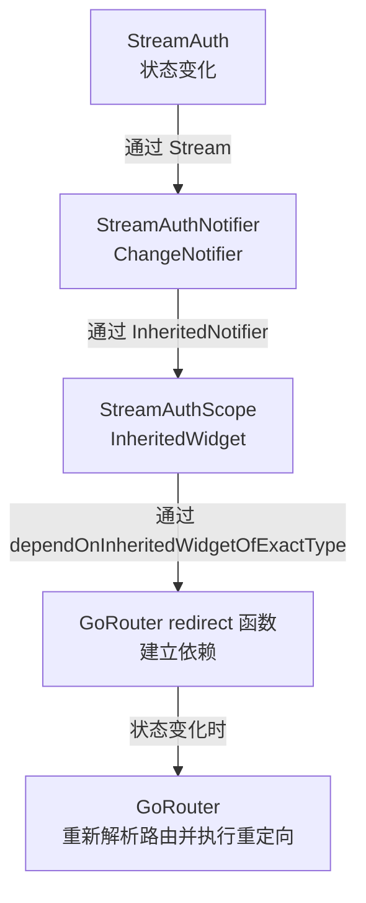
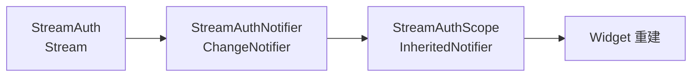

# async_redirection.dart 代码解析

## 概述

这个示例演示了如何在 Flutter 应用中使用 `go_router` 处理异步登录流程和路由重定向。它展示了一个完整的认证系统，包括：

- 异步登录/登出功能
- 基于认证状态的路由重定向
- 使用 `InheritedNotifier` 实现状态管理
- 模拟类似 `google_sign_in` 的流式认证服务

## 核心工作原理

这个示例的关键在于建立 `go_router` 与认证状态之间的依赖关系。当认证状态发生变化时，`go_router` 会自动重新解析当前路由并触发重定向逻辑。

### 依赖关系链



## 组件详解

### 1. 应用入口和路由配置

```dart 20:73:example/lib/async_redirection.dart
void main() => runApp(StreamAuthScope(child: App()));

/// The main app.
class App extends StatelessWidget {
  /// Creates an [App].
  App({super.key});

  /// The title of the app.
  static const String title = 'GoRouter Example: Redirection';

  // add the login info into the tree as app state that can change over time
  @override
  Widget build(BuildContext context) => MaterialApp.router(
    routerConfig: _router,
    title: title,
    debugShowCheckedModeBanner: false,
  );

  late final GoRouter _router = GoRouter(
    routes: <GoRoute>[
      GoRoute(
        path: '/',
        builder: (BuildContext context, GoRouterState state) =>
            const HomeScreen(),
      ),
      GoRoute(
        path: '/login',
        builder: (BuildContext context, GoRouterState state) =>
            const LoginScreen(),
      ),
    ],

    // redirect to the login page if the user is not logged in
    redirect: (BuildContext context, GoRouterState state) async {
      // Using `of` method creates a dependency of StreamAuthScope. It will
      // cause go_router to reparse current route if StreamAuth has new sign-in
      // information.
      final bool loggedIn = await StreamAuthScope.of(context).isSignedIn();
      final loggingIn = state.matchedLocation == '/login';
      if (!loggedIn) {
        return '/login';
      }

      // if the user is logged in but still on the login page, send them to
      // the home page
      if (loggingIn) {
        return '/';
      }

      // no need to redirect at all
      return null;
    },
  );
}
```

**关键点**：

1. **应用入口**：使用 `StreamAuthScope` 包裹整个应用，使认证状态在整个应用树中可用。

2. **路由配置**：
   - `/`：首页，需要登录才能访问
   - `/login`：登录页面

3. **重定向逻辑**：
   - 使用 `StreamAuthScope.of(context)` 建立依赖关系，这是核心机制
   - 当用户未登录时，重定向到 `/login`
   - 当用户已登录但仍停留在登录页时，重定向到首页
   - 返回 `null` 表示不需要重定向

### 2. 登录界面

```dart 75:128:example/lib/async_redirection.dart
/// The login screen.
class LoginScreen extends StatefulWidget {
  /// Creates a [LoginScreen].
  const LoginScreen({super.key});

  @override
  State<LoginScreen> createState() => _LoginScreenState();
}

class _LoginScreenState extends State<LoginScreen>
    with TickerProviderStateMixin {
  bool loggingIn = false;
  late final AnimationController controller;

  @override
  void initState() {
    super.initState();
    controller =
        AnimationController(vsync: this, duration: const Duration(seconds: 1))
          ..addListener(() {
            setState(() {});
          });
    controller.repeat();
  }

  @override
  void dispose() {
    controller.dispose();
    super.dispose();
  }

  @override
  Widget build(BuildContext context) => Scaffold(
    appBar: AppBar(title: const Text(App.title)),
    body: Center(
      child: Column(
        mainAxisAlignment: MainAxisAlignment.center,
        children: <Widget>[
          if (loggingIn) CircularProgressIndicator(value: controller.value),
          if (!loggingIn)
            ElevatedButton(
              onPressed: () {
                StreamAuthScope.of(context).signIn('test-user');
                setState(() {
                  loggingIn = true;
                });
              },
              child: const Text('Login'),
            ),
        ],
      ),
    ),
  );
}
```

**功能说明**：

- 显示登录按钮或加载指示器
- 点击登录按钮后调用 `signIn` 方法（异步，延迟 3 秒）
- 使用 `AnimationController` 创建循环动画的进度指示器
- 登录过程中显示加载状态

### 3. 首页

```dart 130:153:example/lib/async_redirection.dart
/// The home screen.
class HomeScreen extends StatelessWidget {
  /// Creates a [HomeScreen].
  const HomeScreen({super.key});

  @override
  Widget build(BuildContext context) {
    final StreamAuth info = StreamAuthScope.of(context);

    return Scaffold(
      appBar: AppBar(
        title: const Text(App.title),
        actions: <Widget>[
          IconButton(
            onPressed: () => info.signOut(),
            tooltip: 'Logout: ${info.currentUser}',
            icon: const Icon(Icons.logout),
          ),
        ],
      ),
      body: const Center(child: Text('HomeScreen')),
    );
  }
}
```

**功能说明**：

- 显示当前登录用户信息
- 提供登出按钮
- 只有登录用户才能访问此页面（由重定向逻辑保证）

### 4. 状态管理组件

#### StreamAuthScope

```dart 155:168:example/lib/async_redirection.dart
/// A scope that provides [StreamAuth] for the subtree.
class StreamAuthScope extends InheritedNotifier<StreamAuthNotifier> {
  /// Creates a [StreamAuthScope] sign in scope.
  StreamAuthScope({super.key, required super.child})
    : super(notifier: StreamAuthNotifier());

  /// Gets the [StreamAuth].
  static StreamAuth of(BuildContext context) {
    return context
        .dependOnInheritedWidgetOfExactType<StreamAuthScope>()!
        .notifier!
        .streamAuth;
  }
}
```

**作用**：

- 继承自 `InheritedNotifier`，将 `StreamAuthNotifier` 提供给整个子树
- `of` 方法使用 `dependOnInheritedWidgetOfExactType` 建立依赖关系
- 当 `notifier` 调用 `notifyListeners()` 时，所有通过 `of` 方法访问的 widget 都会重建

#### StreamAuthNotifier

```dart 170:181:example/lib/async_redirection.dart
/// A class that converts [StreamAuth] into a [ChangeNotifier].
class StreamAuthNotifier extends ChangeNotifier {
  /// Creates a [StreamAuthNotifier].
  StreamAuthNotifier() : streamAuth = StreamAuth() {
    streamAuth.onCurrentUserChanged.listen((String? string) {
      notifyListeners();
    });
  }

  /// The stream auth client.
  final StreamAuth streamAuth;
}
```

**作用**：

- 将 `StreamAuth` 的流式更新转换为 `ChangeNotifier` 的通知机制
- 监听 `onCurrentUserChanged` 流，当用户状态变化时通知所有监听者
- 作为 `InheritedNotifier` 的 `notifier`，使状态变化能够触发 widget 重建

### 5. 认证服务模拟

```dart 183:237:example/lib/async_redirection.dart
/// An asynchronous log in services mock with stream similar to google_sign_in.
///
/// This class adds an artificial delay of 3 second when logging in an user, and
/// will automatically clear the login session after [refreshInterval].
class StreamAuth {
  /// Creates an [StreamAuth] that clear the current user session in
  /// [refeshInterval] second.
  StreamAuth({this.refreshInterval = 20})
    : _userStreamController = StreamController<String?>.broadcast() {
    _userStreamController.stream.listen((String? currentUser) {
      _currentUser = currentUser;
    });
  }

  /// The current user.
  String? get currentUser => _currentUser;
  String? _currentUser;

  /// Checks whether current user is signed in with an artificial delay to mimic
  /// async operation.
  Future<bool> isSignedIn() async {
    await Future<void>.delayed(const Duration(seconds: 1));
    return _currentUser != null;
  }

  /// A stream that notifies when current user has changed.
  Stream<String?> get onCurrentUserChanged => _userStreamController.stream;
  final StreamController<String?> _userStreamController;

  /// The interval that automatically signs out the user.
  final int refreshInterval;

  Timer? _timer;
  Timer _createRefreshTimer() {
    return Timer(Duration(seconds: refreshInterval), () {
      _userStreamController.add(null);
      _timer = null;
    });
  }

  /// Signs in a user with an artificial delay to mimic async operation.
  Future<void> signIn(String newUserName) async {
    await Future<void>.delayed(const Duration(seconds: 3));
    _userStreamController.add(newUserName);
    _timer?.cancel();
    _timer = _createRefreshTimer();
  }

  /// Signs out the current user.
  Future<void> signOut() async {
    _timer?.cancel();
    _timer = null;
    _userStreamController.add(null);
  }
}
```

**功能详解**：

1. **构造函数**：
   - 创建广播流控制器 `_userStreamController`
   - 监听流更新，同步更新 `_currentUser`
   - `refreshInterval` 参数控制自动登出的时间间隔（默认 20 秒）

2. **isSignedIn()**：
   - 异步方法，模拟网络请求延迟（1 秒）
   - 返回当前是否有登录用户

3. **signIn()**：
   - 异步登录方法，模拟网络请求延迟（3 秒）
   - 登录成功后通过流发送新用户名
   - 取消之前的自动登出定时器，创建新的定时器

4. **signOut()**：
   - 取消自动登出定时器
   - 通过流发送 `null` 表示用户已登出

5. **自动登出机制**：
   - 登录成功后创建定时器
   - 在 `refreshInterval` 秒后自动发送 `null`，触发登出

## 工作流程

### 登录流程

1. 用户点击登录按钮
2. 调用 `StreamAuth.signIn()`，开始异步登录（延迟 3 秒）
3. 登录界面显示加载指示器
4. 3 秒后，`StreamAuth` 通过流发送新用户名
5. `StreamAuthNotifier` 监听到变化，调用 `notifyListeners()`
6. `StreamAuthScope` 通知所有依赖的 widget（包括 `GoRouter` 的 redirect 函数）
7. `GoRouter` 重新执行 redirect 函数
8. redirect 函数检测到用户已登录且当前在登录页，返回 `/` 进行重定向
9. 用户被导航到首页

### 登出流程

1. 用户点击登出按钮
2. 调用 `StreamAuth.signOut()`
3. `StreamAuth` 通过流发送 `null`
4. 后续流程与登录流程类似，最终重定向到登录页

### 自动登出流程

1. 用户登录成功后，创建定时器（20 秒后触发）
2. 定时器触发，`StreamAuth` 通过流发送 `null`
3. 触发重定向，用户被导航到登录页

## 关键技术点

### 1. 依赖关系的建立

```dart 57:57:example/lib/async_redirection.dart
final bool loggedIn = await StreamAuthScope.of(context).isSignedIn();
```

这行代码的关键在于 `StreamAuthScope.of(context)` 内部使用了 `dependOnInheritedWidgetOfExactType`：

```dart 162:167:example/lib/async_redirection.dart
static StreamAuth of(BuildContext context) {
  return context
      .dependOnInheritedWidgetOfExactType<StreamAuthScope>()!
      .notifier!
      .streamAuth;
}
```

当 `StreamAuthNotifier` 调用 `notifyListeners()` 时，所有通过 `dependOnInheritedWidgetOfExactType` 访问的 widget 都会收到通知，包括 `GoRouter` 的 redirect 函数。

### 2. 异步重定向

`redirect` 函数是异步的，可以执行异步操作（如检查登录状态）：

```dart 53:71:example/lib/async_redirection.dart
redirect: (BuildContext context, GoRouterState state) async {
  // Using `of` method creates a dependency of StreamAuthScope. It will
  // cause go_router to reparse current route if StreamAuth has new sign-in
  // information.
  final bool loggedIn = await StreamAuthScope.of(context).isSignedIn();
  final loggingIn = state.matchedLocation == '/login';
  if (!loggedIn) {
    return '/login';
  }

  // if the user is logged in but still on the login page, send them to
  // the home page
  if (loggingIn) {
    return '/';
  }

  // no need to redirect at all
  return null;
},
```

### 3. 流式状态管理

使用 `StreamController` 和 `ChangeNotifier` 的组合，实现了从流式更新到 widget 重建的完整链路：



## 使用场景

这个示例适用于以下场景：

1. **需要异步认证的应用**：如使用 Google Sign-In、Firebase Auth 等第三方认证服务
2. **需要基于认证状态进行路由保护的应用**：某些页面需要登录才能访问
3. **需要自动登出功能的应用**：如会话超时自动登出
4. **需要响应式路由的应用**：认证状态变化时自动更新路由

## 总结

这个示例展示了如何将异步认证服务与 `go_router` 的路由重定向功能结合，实现一个完整的认证和路由保护系统。核心机制是通过 `InheritedNotifier` 和 `dependOnInheritedWidgetOfExactType` 建立依赖关系，使路由系统能够响应认证状态的变化。
