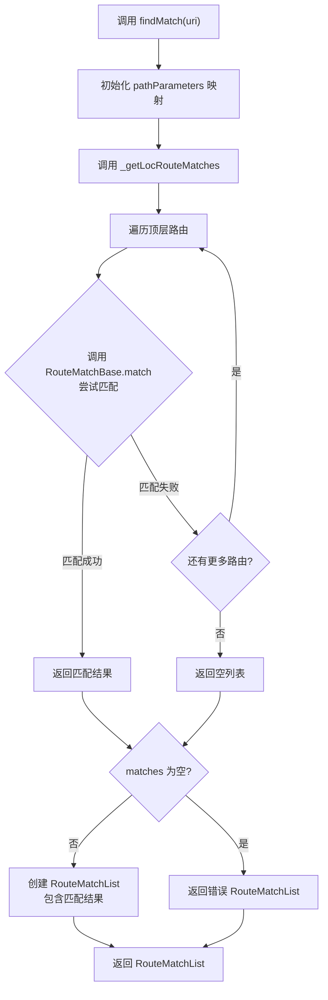

# RouteConfiguration 路由匹配方法

## 概述

`RouteConfiguration` 类提供了路由匹配的核心功能，能够根据给定的 URI 找到对应的路由配置。路由匹配是 go_router 的基础功能，所有的导航操作最终都需要通过路由匹配来确定应该显示哪些页面。

本文档介绍 `RouteConfiguration` 中与路由匹配相关的三个方法：`findMatch`、`reparse` 和 `_getLocRouteMatches`。

## 路由匹配：findMatch

```dart 344:365:lib/src/configuration.dart
/// Finds the routes that matched the given URL.
RouteMatchList findMatch(Uri uri, {Object? extra}) {
  final pathParameters = <String, String>{};
  final List<RouteMatchBase> matches = _getLocRouteMatches(
    uri,
    pathParameters,
  );

  if (matches.isEmpty) {
    return _errorRouteMatchList(
      uri,
      GoException('no routes for location: $uri'),
      extra: extra,
    );
  }
  return RouteMatchList(
    matches: matches,
    uri: uri,
    pathParameters: pathParameters,
    extra: extra,
  );
}
```

`findMatch` 是 `RouteConfiguration` 的公共方法，用于根据给定的 URI 查找匹配的路由。

### 功能说明

该方法执行以下操作：

1. **初始化路径参数映射**：创建一个空的 `Map<String, String>` 用于存储从 URI 中提取的路径参数（如 `/users/:id` 中的 `id`）。

2. **执行路由匹配**：调用 `_getLocRouteMatches` 方法，传入 URI 和路径参数映射，获取匹配的路由列表。路径参数映射会被 `_getLocRouteMatches` 填充。

3. **处理匹配失败**：如果没有找到匹配的路由（`matches.isEmpty`），返回一个错误状态的 `RouteMatchList`，包含错误信息和原始 URI。

4. **构建匹配结果**：如果找到了匹配的路由，创建一个 `RouteMatchList` 对象，包含：
   - `matches`：匹配的路由列表
   - `uri`：原始的 URI
   - `pathParameters`：提取的路径参数映射
   - `extra`：传递的额外数据

### 参数说明

- **`uri`**：`Uri` 类型，要匹配的 URI 对象。包含路径、查询参数、片段等信息。
- **`extra`**：`Object?` 类型，可选参数。额外的数据对象，会包含在返回的 `RouteMatchList` 中，可以在路由构建时访问。

### 返回值

返回一个 `RouteMatchList` 对象，表示路由匹配的结果：

- **成功匹配**：包含匹配的路由列表和相关信息
- **匹配失败**：包含错误信息，`isError` 为 `true`

### 使用场景

`findMatch` 方法在以下场景中被调用：

- 导航到新路由时，需要查找匹配的路由配置
- 处理重定向时，需要匹配重定向目标的路由
- 验证路由配置时，检查某个位置是否有效
- 重新解析路由时（如配置变更后）

## 重新解析：reparse

```dart 367:384:lib/src/configuration.dart
/// Reparse the input RouteMatchList
RouteMatchList reparse(RouteMatchList matchList) {
  RouteMatchList result = findMatch(matchList.uri, extra: matchList.extra);

  for (final ImperativeRouteMatch imperativeMatch
      in matchList.matches.whereType<ImperativeRouteMatch>()) {
    final match = ImperativeRouteMatch(
      pageKey: imperativeMatch.pageKey,
      matches: findMatch(
        imperativeMatch.matches.uri,
        extra: imperativeMatch.matches.extra,
      ),
      completer: imperativeMatch.completer,
    );
    result = result.push(match);
  }
  return result;
}
```

`reparse` 方法用于重新解析一个现有的 `RouteMatchList`，通常用于路由配置变更后更新匹配结果。

### 功能说明

该方法执行以下操作：

1. **重新匹配主要路由**：使用 `findMatch` 方法根据原始 URI 重新查找匹配的路由，获取最新的匹配结果。这确保了主路由链反映最新的路由配置。

2. **处理命令式路由匹配**：遍历原始 `RouteMatchList` 中的所有 `ImperativeRouteMatch`（通过 `whereType` 过滤）。

3. **重新匹配命令式路由**：对于每个 `ImperativeRouteMatch`：
   - 保持原有的 `pageKey`（页面的唯一标识）
   - 保持原有的 `completer`（用于处理路由返回结果）
   - 使用 `findMatch` 重新匹配其 URI，获取新的匹配结果

4. **重建匹配列表**：将重新匹配的命令式路由通过 `push` 方法添加到结果列表中。

5. **返回新的匹配列表**：返回包含所有重新匹配结果的 `RouteMatchList`。

### 参数说明

- **`matchList`**：`RouteMatchList` 类型，要重新解析的原始匹配列表。

### 返回值

返回一个新的 `RouteMatchList` 对象，包含根据当前路由配置重新匹配的结果。

### 使用场景

`reparse` 方法主要用于以下场景：

- **动态路由配置变更**：当使用 `ValueNotifier<RoutingConfig>` 动态更新路由配置时，需要重新解析当前的路由匹配列表，使其反映新的配置。

- **路由配置验证**：在某些验证场景中，需要重新解析路由以确认配置的正确性。

### 设计考虑

这个方法的设计考虑了以下因素：

1. **保留命令式路由**：命令式路由（通过 `GoRouter.push` 推送）需要在重新解析时保留，因为它们代表用户主动推送的页面，不应该因为配置变更而丢失。

2. **保留页面状态**：通过保留 `pageKey` 和 `completer`，确保了页面的唯一标识和异步操作的正确处理。

3. **递归重新匹配**：对于嵌套的命令式路由，也会递归地重新匹配，确保整个路由栈都反映最新的配置。

## 内部匹配方法：_getLocRouteMatches

```dart 386:402:lib/src/configuration.dart
List<RouteMatchBase> _getLocRouteMatches(
  Uri uri,
  Map<String, String> pathParameters,
) {
  for (final RouteBase route in _routingConfig.value.routes) {
    final List<RouteMatchBase> result = RouteMatchBase.match(
      rootNavigatorKey: navigatorKey,
      route: route,
      uri: uri,
      pathParameters: pathParameters,
    );
    if (result.isNotEmpty) {
      return result;
    }
  }
  return const <RouteMatchBase>[];
}
```

`_getLocRouteMatches` 是一个私有的内部方法，用于实际执行路由匹配逻辑。

### 功能说明

该方法执行以下操作：

1. **遍历顶层路由**：遍历 `_routingConfig.value.routes` 中的所有顶层路由。

2. **尝试匹配每个路由**：对于每个路由，调用 `RouteMatchBase.match` 静态方法尝试匹配 URI。这个方法会：
   - 检查路由路径是否匹配 URI 的路径部分
   - 提取路径参数（如 `/users/:id` 中的 `id` 值）
   - 处理子路由的递归匹配
   - 返回匹配结果的列表（可能为空）

3. **返回第一个匹配**：如果某个路由匹配成功（`result.isNotEmpty`），立即返回该匹配结果。这意味着路由匹配使用"首次匹配"策略，按照路由在列表中的顺序查找。

4. **返回空列表**：如果所有路由都不匹配，返回空的列表。

### 参数说明

- **`uri`**：`Uri` 类型，要匹配的 URI。
- **`pathParameters`**：`Map<String, String>` 类型，用于输出路径参数的映射。该方法会填充这个映射，将提取的路径参数添加到其中。

### 返回值

返回 `List<RouteMatchBase>`，表示匹配的路由列表：

- **匹配成功**：返回包含匹配路由的列表（通常是一个路由链，从顶层路由到最具体的子路由）
- **匹配失败**：返回空列表

### 设计考虑

1. **首次匹配策略**：使用首次匹配策略意味着路由的顺序很重要。如果一个 URI 可以匹配多个路由，只会返回第一个匹配的路由。因此，更具体的路由应该放在更通用的路由之前。

2. **路径参数共享**：通过引用传递 `pathParameters` 映射，使得在递归匹配过程中提取的所有路径参数都保存在同一个映射中，便于后续使用。

3. **委托给 RouteMatchBase.match**：实际的匹配逻辑由 `RouteMatchBase.match` 静态方法实现，这个方法会处理各种类型的路由（`GoRoute`、`ShellRoute` 等）的匹配逻辑。

## 路由匹配流程

路由匹配的完整流程如下：



## 匹配策略说明

### 路由顺序的重要性

由于使用首次匹配策略，路由的顺序至关重要：

```dart
// 错误顺序：通用路由在前
routes: [
  GoRoute(path: '/:page'),  // 这个会匹配所有路径
  GoRoute(path: '/users'),
]

// 正确顺序：具体路由在前
routes: [
  GoRoute(path: '/users'),  // 先匹配具体路由
  GoRoute(path: '/:page'),  // 再匹配通用路由
]
```

### 路径参数提取

路径参数会在匹配过程中自动提取：

```dart
// 路由配置
GoRoute(
  path: '/users/:id',
  routes: [
    GoRoute(path: '/posts/:postId'),
  ],
)

// URI: /users/123/posts/456
// pathParameters 将包含：
// {
//   'id': '123',
//   'postId': '456',
// }
```

## 总结

路由匹配是 go_router 的核心功能之一，`RouteConfiguration` 提供了以下匹配相关的方法：

- **`findMatch`**：公共接口，根据 URI 查找匹配的路由，处理错误情况
- **`reparse`**：重新解析现有的匹配列表，用于配置变更后的更新
- **`_getLocRouteMatches`**：内部实现，实际执行路由匹配逻辑

这些方法共同实现了 go_router 的路由匹配功能，支持静态路由、动态路由、嵌套路由等多种场景。理解这些方法有助于深入理解 go_router 的工作原理。
