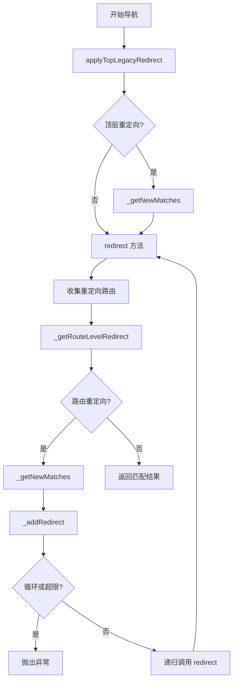

# RouteConfiguration 重定向处理方法

## 概述

重定向是 go_router 中的重要功能，允许在路由处理过程中动态地改变导航目标。`RouteConfiguration` 类提供了完整的重定向处理机制，包括路由级重定向和顶层遗留重定向两种类型。

本文档介绍 `RouteConfiguration` 中与重定向相关的所有方法，包括重定向执行、循环检测、历史记录管理等功能。

## 重定向类型

go_router 支持两种类型的重定向：

1. **顶层遗留重定向（Top-level Legacy Redirect）**：通过 `GoRouter.redirect` 配置，在每次导航时最多执行一次，在路由级重定向之前运行。

2. **路由级重定向（Route-level Redirect）**：通过 `GoRoute.redirect` 配置，可以在路由树的任何层级定义重定向逻辑。

## 路由级重定向：redirect

```dart 404:478:lib/src/configuration.dart
/// Processes route-level redirects by returning a new [RouteMatchList] representing the new location.
///
/// This method now handles ONLY route-level redirects.
/// Top-level redirects are handled by applyTopLegacyRedirect.
FutureOr<RouteMatchList> redirect(
  BuildContext context,
  FutureOr<RouteMatchList> prevMatchListFuture, {
  required List<RouteMatchList> redirectHistory,
}) {
  FutureOr<RouteMatchList> processRedirect(RouteMatchList prevMatchList) {
    final prevLocation = prevMatchList.uri.toString();

    FutureOr<RouteMatchList> processRouteLevelRedirect(
      String? routeRedirectLocation,
    ) {
      if (routeRedirectLocation != null &&
          routeRedirectLocation != prevLocation) {
        final RouteMatchList newMatch = _getNewMatches(
          routeRedirectLocation,
          prevMatchList.uri,
          redirectHistory,
        );

        if (newMatch.isError) {
          return newMatch;
        }
        return redirect(context, newMatch, redirectHistory: redirectHistory);
      }
      return prevMatchList;
    }

    final routeMatches = <RouteMatchBase>[];
    prevMatchList.visitRouteMatches((RouteMatchBase match) {
      if (match.route.redirect != null) {
        routeMatches.add(match);
      }
      return true;
    });

    try {
      final FutureOr<String?> routeLevelRedirectResult =
          _getRouteLevelRedirect(context, prevMatchList, routeMatches, 0);

      if (routeLevelRedirectResult is String?) {
        return processRouteLevelRedirect(routeLevelRedirectResult);
      }
      return routeLevelRedirectResult
          .then<RouteMatchList>(processRouteLevelRedirect)
          .catchError((Object error) {
            final GoException goException = error is GoException
                ? error
                : GoException('Exception during route redirect: $error');
            return _errorRouteMatchList(
              prevMatchList.uri,
              goException,
              extra: prevMatchList.extra,
            );
          });
    } catch (exception) {
      final GoException goException = exception is GoException
          ? exception
          : GoException('Exception during route redirect: $exception');
      return _errorRouteMatchList(
        prevMatchList.uri,
        goException,
        extra: prevMatchList.extra,
      );
    }
  }

  if (prevMatchListFuture is RouteMatchList) {
    return processRedirect(prevMatchListFuture);
  }
  return prevMatchListFuture.then<RouteMatchList>(processRedirect);
}
```

`redirect` 方法处理路由级重定向，支持同步和异步重定向回调。

### 功能说明

该方法执行以下步骤：

1. **处理异步输入**：如果 `prevMatchListFuture` 是 `Future`，等待其完成后再处理。

2. **收集重定向路由**：使用 `visitRouteMatches` 遍历匹配列表中的所有路由，收集定义了 `redirect` 回调的路由。

3. **执行重定向检查**：调用 `_getRouteLevelRedirect` 方法，按照路由层级顺序检查每个路由的重定向回调，返回第一个非 null 的重定向位置。

4. **处理重定向结果**：
   - 如果返回 null，表示没有重定向，返回原始的匹配列表
   - 如果返回非 null 的位置且与当前位置不同，调用 `_getNewMatches` 获取新的匹配结果，然后递归调用 `redirect` 方法继续处理（支持链式重定向）

5. **错误处理**：捕获所有异常，转换为 `GoException` 并返回错误状态的 `RouteMatchList`。

### 参数说明

- **`context`**：`BuildContext` 类型，构建上下文，传递给重定向回调。
- **`prevMatchListFuture`**：`FutureOr<RouteMatchList>` 类型，之前的匹配列表（可能是 Future）。
- **`redirectHistory`**：`List<RouteMatchList>` 类型，重定向历史记录，用于检测循环和限制重定向次数。

### 设计特点

- **递归处理**：如果重定向到的新位置也有重定向，会递归处理，形成重定向链。
- **循环检测**：通过 `redirectHistory` 跟踪重定向历史，在 `_addRedirect` 中检测循环。
- **异步支持**：完整支持异步重定向回调。
- **错误安全**：所有异常都被捕获并转换为可处理的错误状态。

## 顶层遗留重定向：applyTopLegacyRedirect

```dart 480:538:lib/src/configuration.dart
/// Applies the legacy top-level redirect to [prevMatchList] and returns the
/// resulting matches.
///
/// Returns [prevMatchList] when no redirect happens.
///
/// Shares [redirectHistory] with later route-level redirects for proper loop detection.
///
/// Note: Legacy top-level redirect is executed at most once per navigation,
/// before route-level redirects. It does not re-evaluate if it redirects to
/// a location that would itself trigger another top-level redirect.
FutureOr<RouteMatchList> applyTopLegacyRedirect(
  BuildContext context,
  RouteMatchList prevMatchList, {
  required List<RouteMatchList> redirectHistory,
}) {
  final prevLocation = prevMatchList.uri.toString();
  FutureOr<RouteMatchList> done(String? topLocation) {
    if (topLocation != null && topLocation != prevLocation) {
      final RouteMatchList newMatch = _getNewMatches(
        topLocation,
        prevMatchList.uri,
        redirectHistory,
      );
      return newMatch;
    }
    return prevMatchList;
  }

  try {
    final FutureOr<String?> res = _runInRouterZone(() {
      return _routingConfig.value.redirect(
        context,
        buildTopLevelGoRouterState(prevMatchList),
      );
    });
    if (res is String?) {
      return done(res);
    }
    return res.then<RouteMatchList>(done).catchError((Object error) {
      final GoException goException = error is GoException
          ? error
          : GoException('Exception during redirect: $error');
      return _errorRouteMatchList(
        prevMatchList.uri,
        goException,
        extra: prevMatchList.extra,
      );
    });
  } catch (exception) {
    final GoException goException = exception is GoException
        ? exception
        : GoException('Exception during redirect: $exception');
    return _errorRouteMatchList(
      prevMatchList.uri,
      goException,
      extra: prevMatchList.extra,
    );
  }
}
```

`applyTopLegacyRedirect` 方法处理顶层遗留重定向，这是旧版本 go_router 的重定向机制。

### 功能说明

该方法执行以下操作：

1. **调用顶层重定向回调**：通过 `_runInRouterZone` 调用 `_routingConfig.value.redirect` 回调，传入构建的顶层 `GoRouterState`。

2. **处理重定向结果**：
   - 如果返回 null 或与当前位置相同，返回原始匹配列表
   - 如果返回新的位置，调用 `_getNewMatches` 获取新的匹配结果并返回

3. **错误处理**：捕获所有异常并转换为错误状态的 `RouteMatchList`。

### 重要特性

- **只执行一次**：每次导航时最多执行一次，不会因为重定向到新位置而重新执行。
- **执行时机**：在路由级重定向之前执行。
- **共享历史记录**：与路由级重定向共享 `redirectHistory`，确保循环检测和限制正确工作。
- **不递归**：如果重定向到的新位置会触发另一个顶层重定向，不会重新执行。

### 使用场景

顶层重定向主要用于全局的路由控制，例如：

- 根据认证状态重定向到登录页
- 根据应用状态重定向到不同的首页
- 维护 URL 结构的兼容性

## 获取路由级重定向：_getRouteLevelRedirect

```dart 540:584:lib/src/configuration.dart
FutureOr<String?> _getRouteLevelRedirect(
  BuildContext context,
  RouteMatchList matchList,
  List<RouteMatchBase> routeMatches,
  int currentCheckIndex,
) {
  if (currentCheckIndex >= routeMatches.length) {
    return null;
  }
  final RouteMatchBase match = routeMatches[currentCheckIndex];
  FutureOr<String?> processRouteRedirect(String? newLocation) =>
      newLocation ??
      _getRouteLevelRedirect(
        context,
        matchList,
        routeMatches,
        currentCheckIndex + 1,
      );
  final RouteBase route = match.route;
  try {
    final FutureOr<String?> routeRedirectResult = _runInRouterZone(() {
      return route.redirect!.call(context, match.buildState(this, matchList));
    });
    if (routeRedirectResult is String?) {
      return processRouteRedirect(routeRedirectResult);
    }
    return routeRedirectResult.then<String?>(processRouteRedirect).catchError(
      (Object error) {
        // Convert any exception during async route redirect to a GoException
        final GoException goException = error is GoException
            ? error
            : GoException('Exception during route redirect: $error');
        // Throw the GoException to be caught by the redirect handling chain
        throw goException;
      },
    );
  } catch (exception) {
    // Convert any exception during route redirect to a GoException
    final GoException goException = exception is GoException
        ? exception
        : GoException('Exception during route redirect: $exception');
    // Throw the GoException to be caught by the redirect handling chain
    throw goException;
  }
}
```

`_getRouteLevelRedirect` 是一个私有递归方法，用于按顺序检查路由列表中的重定向回调。

### 功能说明

该方法使用递归方式遍历路由列表：

1. **边界检查**：如果索引超出范围，返回 null（表示没有重定向）。

2. **获取当前路由**：从列表中获取当前索引的路由。

3. **定义处理函数**：`processRouteRedirect` 函数处理重定向结果：
   - 如果返回非 null 的位置，直接返回（找到重定向）
   - 如果返回 null，递归检查下一个路由

4. **执行重定向回调**：通过 `_runInRouterZone` 调用路由的 `redirect` 回调，传入构建的 `GoRouterState`。

5. **处理异步结果**：支持同步和异步重定向回调，异步回调通过 `.then` 链式调用处理。

6. **错误处理**：所有异常都转换为 `GoException` 并向上抛出。

### 检查顺序

重定向检查按照路由在匹配列表中的顺序进行，从最外层（父路由）到最内层（子路由）。这意味着：

- 父路由的重定向优先于子路由
- 如果父路由重定向，子路由的重定向不会被检查

### 设计考虑

- **首次匹配策略**：一旦找到非 null 的重定向，立即返回，不再检查后续路由。
- **递归设计**：使用递归使得代码更简洁，易于理解。
- **异步支持**：完整支持异步重定向回调。

## 获取新匹配：_getNewMatches

```dart 586:608:lib/src/configuration.dart
RouteMatchList _getNewMatches(
  String newLocation,
  Uri previousLocation,
  List<RouteMatchList> redirectHistory,
) {
  try {
    // Normalize the URI to avoid trailing slash inconsistencies
    final Uri uri = normalizeUri(Uri.parse(newLocation));

    final RouteMatchList newMatch = findMatch(uri);
    // Only add successful matches to redirect history
    if (!newMatch.isError) {
      _addRedirect(redirectHistory, newMatch);
    }
    return newMatch;
  } catch (exception) {
    final GoException goException = exception is GoException
        ? exception
        : GoException('Exception during redirect: $exception');
    log('Redirection exception: ${goException.message}');
    return _errorRouteMatchList(previousLocation, goException);
  }
}
```

`_getNewMatches` 是一个私有辅助方法，用于获取重定向目标位置的匹配结果。

### 功能说明

该方法执行以下操作：

1. **URI 规范化**：使用 `normalizeUri` 规范化重定向目标 URI，确保路径格式一致（移除尾随斜杠等）。

2. **路由匹配**：调用 `findMatch` 查找新位置的路由匹配。

3. **更新历史记录**：如果匹配成功（不是错误状态），调用 `_addRedirect` 将新匹配添加到重定向历史中。这确保了：
   - 循环检测能够工作
   - 重定向次数限制能够正确计算

4. **错误处理**：如果解析 URI 或匹配过程中发生异常，创建错误状态的 `RouteMatchList` 并返回。

### 设计考虑

- **只记录成功匹配**：只有成功匹配的路由才会被添加到历史记录，失败的匹配不会影响循环检测和限制。
- **URI 规范化**：确保路径格式一致性，避免因格式差异导致的问题。

## 添加重定向记录：_addRedirect

```dart 610:629:lib/src/configuration.dart
/// Adds the redirect to [redirects] if it is valid.
///
/// Throws if a loop is detected or the redirection limit is reached.
void _addRedirect(List<RouteMatchList> redirects, RouteMatchList newMatch) {
  if (redirects.contains(newMatch)) {
    throw GoException(
      'redirect loop detected ${_formatRedirectionHistory(<RouteMatchList>[...redirects, newMatch])}',
    );
  }
  // Check limit before adding (redirects should only contain actual redirects, not the initial location)
  if (redirects.length >= _routingConfig.value.redirectLimit) {
    throw GoException(
      'too many redirects ${_formatRedirectionHistory(<RouteMatchList>[...redirects, newMatch])}',
    );
  }

  redirects.add(newMatch);

  log('redirecting to $newMatch');
}
```

`_addRedirect` 方法用于将重定向添加到历史记录中，同时执行安全检查。

### 功能说明

该方法执行以下验证：

1. **循环检测**：检查新匹配是否已存在于历史记录中。如果存在，说明发生了重定向循环，抛出 `GoException`。

2. **重定向限制检查**：检查重定向次数是否已达到限制（通过 `redirectLimit` 配置）。如果达到限制，抛出 `GoException`。

3. **添加记录**：通过验证后，将新匹配添加到历史记录中。

4. **日志记录**：记录重定向操作到日志（仅在启用调试日志时输出）。

### 安全机制

这两个检查防止了以下问题：

- **重定向循环**：如 `/a` → `/b` → `/a` 这样的无限循环
- **重定向链过长**：防止意外的长重定向链导致性能问题

默认的重定向限制是 5 次，可以通过 `RoutingConfig.redirectLimit` 配置。

## 格式化重定向历史：_formatRedirectionHistory

```dart 631:637:lib/src/configuration.dart
String _formatRedirectionHistory(List<RouteMatchList> redirections) {
  return redirections
      .map<String>(
        (RouteMatchList routeMatches) => routeMatches.uri.toString(),
      )
      .join(' => ');
}
```

`_formatRedirectionHistory` 是一个私有辅助方法，用于将重定向历史格式化为可读的字符串。

### 功能说明

该方法将 `RouteMatchList` 列表转换为字符串，格式为：`uri1 => uri2 => uri3`，用于错误消息中展示重定向链。

## 在路由器 Zone 中运行：_runInRouterZone

```dart 639:669:lib/src/configuration.dart
/// Runs the given function in a Zone with the router context for redirects.
T _runInRouterZone<T>(T Function() callback) {
  if (router == null) {
    return callback();
  }

  T? result;
  var errorOccurred = false;

  runZonedGuarded<void>(
    () {
      result = callback();
    },
    (Object error, StackTrace stack) {
      errorOccurred = true;
      // Convert any exception during redirect to a GoException and rethrow
      final GoException goException = error is GoException
          ? error
          : GoException('Exception during redirect: $error');
      throw goException;
    },
    zoneValues: <Object?, Object?>{currentRouterKey: router},
  );

  if (errorOccurred) {
    // This should not be reached since we rethrow in the error handler
    throw GoException('Unexpected error in router zone');
  }

  return result as T;
}
```

`_runInRouterZone` 方法在 Dart Zone 中执行回调函数，提供路由器上下文。

### 功能说明

该方法执行以下操作：

1. **快速路径**：如果 `router` 为 null，直接执行回调（无需 Zone）。

2. **Zone 执行**：使用 `runZonedGuarded` 在 Zone 中执行回调：
   - **Zone 值**：将 `router` 设置为 Zone 值，键为 `currentRouterKey`，使得在重定向回调中可以通过 `GoRouter.of(context)` 访问路由器
   - **错误处理**：捕获所有异常，转换为 `GoException` 并重新抛出

3. **返回结果**：返回回调的执行结果。

### Zone 的作用

Dart Zone 提供了一种在代码执行过程中传递上下文信息的机制。在这里，Zone 用于：

- 使 `GoRouter.of(context)` 能够在重定向回调中工作
- 提供错误边界，统一错误处理

## 重定向执行流程

完整的重定向执行流程如下：



## 总结

`RouteConfiguration` 提供了完整的重定向处理机制：

- **两种重定向类型**：顶层遗留重定向和路由级重定向
- **递归处理**：支持链式重定向
- **安全机制**：循环检测和重定向次数限制
- **异步支持**：完整支持异步重定向回调
- **错误处理**：统一的异常处理和错误状态管理
- **上下文支持**：通过 Zone 提供路由器上下文访问

这些功能共同确保了 go_router 的重定向机制既灵活又安全可靠。
