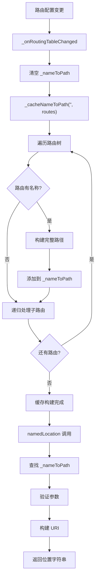

# RouteConfiguration 命名路由方法

## 概述

命名路由是 go_router 中的一个重要特性，允许开发者通过名称而非路径字符串来导航。`RouteConfiguration` 类提供了命名路由的完整支持，包括名称到路径的映射缓存、参数验证、路径构建等功能。

本文档介绍 `RouteConfiguration` 中与命名路由相关的两个方法：`namedLocation` 和 `_cacheNameToPath`。

## 命名路径类型定义

在了解命名路由方法之前，首先需要了解 `_NamedPath` 类型：

```dart 24:24:lib/src/configuration.dart
typedef _NamedPath = ({String path, bool caseSensitive});
```

`_NamedPath` 是一个记录类型（record type），包含两个字段：

- **`path`**：完整的路径模式（如 `/users/:id`）
- **`caseSensitive`**：布尔值，表示路径匹配是否大小写敏感

这个类型用于在 `_nameToPath` 映射中存储路由名称到路径的映射关系。

## 根据名称查找位置：namedLocation

```dart 296:342:lib/src/configuration.dart
/// Looks up the url location by a [GoRoute]'s name.
String namedLocation(
  String name, {
  Map<String, String> pathParameters = const <String, String>{},
  Map<String, dynamic> queryParameters = const <String, dynamic>{},
  String? fragment,
}) {
  assert(() {
    log(
      'getting location for name: '
      '"$name"'
      '${pathParameters.isEmpty ? '' : ', pathParameters: $pathParameters'}'
      '${queryParameters.isEmpty ? '' : ', queryParameters: $queryParameters'}'
      '${fragment != null ? ', fragment: $fragment' : ''}',
    );
    return true;
  }());
  assert(_nameToPath.containsKey(name), 'unknown route name: $name');
  final _NamedPath path = _nameToPath[name]!;
  assert(() {
    // Check that all required params are present
    final paramNames = <String>[];
    patternToRegExp(path.path, paramNames, caseSensitive: path.caseSensitive);
    for (final paramName in paramNames) {
      assert(
        pathParameters.containsKey(paramName),
        'missing param "$paramName" for $path',
      );
    }

    // Check that there are no extra params
    for (final String key in pathParameters.keys) {
      assert(paramNames.contains(key), 'unknown param "$key" for $path');
    }
    return true;
  }());
  final encodedParams = <String, String>{
    for (final MapEntry<String, String> param in pathParameters.entries)
      param.key: Uri.encodeComponent(param.value),
  };
  final String location = patternToPath(path.path, encodedParams);
  return Uri(
    path: location,
    queryParameters: queryParameters.isEmpty ? null : queryParameters,
    fragment: fragment,
  ).toString();
}
```

`namedLocation` 是 `RouteConfiguration` 的公共方法，用于根据路由名称和参数构建完整的 URL 位置字符串。

### 功能说明

该方法执行以下步骤：

1. **调试日志**（仅在 debug 模式）：记录查找操作的详细信息，包括名称、路径参数、查询参数和片段。

2. **验证路由名称**：检查 `_nameToPath` 映射中是否包含给定的路由名称。如果不存在，触发断言错误。

3. **获取路径信息**：从 `_nameToPath` 映射中获取对应的 `_NamedPath` 记录。

4. **参数验证**（仅在 debug 模式）：
   - **检查必需参数**：使用 `patternToRegExp` 解析路径模式，提取所有路径参数名称。验证所有必需的参数都已提供。
   - **检查多余参数**：验证提供的参数中不包含路径模式中不存在的参数。

5. **编码路径参数**：对路径参数值进行 URI 编码，确保特殊字符正确处理。

6. **构建路径**：使用 `patternToPath` 函数，根据路径模式和编码后的参数构建完整的路径字符串。

7. **构建完整 URI**：创建 `Uri` 对象，包含：
   - `path`：构建的路径
   - `queryParameters`：查询参数（如果提供且非空）
   - `fragment`：片段（如果提供）

8. **返回字符串**：将 URI 转换为字符串并返回。

### 参数说明

- **`name`**：`String` 类型，路由名称。必须在路由配置中定义。
- **`pathParameters`**：`Map<String, String>` 类型，路径参数映射（如 `/users/:id` 中的 `id`）。默认为空映射。
- **`queryParameters`**：`Map<String, dynamic>` 类型，查询参数映射（如 `?page=1&sort=asc`）。默认为空映射。
- **`fragment`**：`String?` 类型，URI 片段（如 `#section1`）。默认为 null。

### 返回值

返回一个 `String` 类型的完整 URL 位置，例如：`/users/123?page=1#profile`。

### 使用示例

```dart
// 路由配置
GoRoute(
  name: 'userDetail',
  path: '/users/:id',
  ...
)

// 使用命名路由
final location = configuration.namedLocation(
  'userDetail',
  pathParameters: {'id': '123'},
  queryParameters: {'page': '1'},
  fragment: 'profile',
);
// 结果: '/users/123?page=1#profile'
```

### 错误处理

该方法在以下情况会触发断言错误（仅在 debug 模式）：

- 路由名称不存在
- 缺少必需的路径参数
- 提供了路径模式中不存在的参数

在生产模式下，如果路由名称不存在，仍然会抛出错误（因为使用了 `!` 运算符访问映射）。

## 缓存名称到路径映射：_cacheNameToPath

```dart 771:798:lib/src/configuration.dart
void _cacheNameToPath(String parentFullPath, List<RouteBase> childRoutes) {
  for (final route in childRoutes) {
    if (route is GoRoute) {
      final String fullPath = concatenatePaths(parentFullPath, route.path);

      if (route.name != null) {
        final String name = route.name!;
        assert(
          !_nameToPath.containsKey(name),
          'duplication fullpaths for name '
          '"$name":${_nameToPath[name]!.path}, $fullPath',
        );
        _nameToPath[name] = (
          path: fullPath,
          caseSensitive: route.caseSensitive,
        );
      }

      if (route.routes.isNotEmpty) {
        _cacheNameToPath(fullPath, route.routes);
      }
    } else if (route is ShellRouteBase) {
      if (route.routes.isNotEmpty) {
        _cacheNameToPath(parentFullPath, route.routes);
      }
    }
  }
}
```

`_cacheNameToPath` 是一个私有的递归方法，用于构建和缓存路由名称到路径的映射关系。

### 功能说明

该方法递归遍历路由树，为每个定义了名称的 `GoRoute` 创建映射条目：

1. **遍历路由列表**：遍历 `childRoutes` 中的每个路由。

2. **处理 GoRoute**：
   - **构建完整路径**：使用 `concatenatePaths` 将父路径和当前路由路径拼接，得到完整路径（如父路径 `/users` + 子路径 `/:id` = `/users/:id`）。
   - **处理命名路由**：如果路由定义了 `name`：
     - 验证名称唯一性：检查 `_nameToPath` 中是否已存在该名称。如果存在，触发断言错误（防止重复的路由名称）。
     - 创建映射条目：将路由名称映射到 `_NamedPath` 记录，包含完整路径和大小写敏感标志。
   - **递归处理子路由**：如果路由有子路由，递归调用 `_cacheNameToPath`，传入当前路由的完整路径作为父路径。

3. **处理 ShellRouteBase**：
   - Shell 路由不参与路径构建（它们只是容器），但需要递归处理其子路由。
   - 递归调用 `_cacheNameToPath`，但保持使用当前的 `parentFullPath`（因为 Shell 路由不会改变路径）。

### 参数说明

- **`parentFullPath`**：`String` 类型，父路由的完整路径。对于顶层路由，这通常是空字符串 `''`。
- **`childRoutes`**：`List<RouteBase>` 类型，要处理的路由列表。

### 调用时机

`_cacheNameToPath` 在以下时机被调用：

1. **路由配置变更时**：在 `_onRoutingTableChanged` 方法中，当路由配置发生变化时，会清空 `_nameToPath` 映射并重新构建缓存。

2. **初始化时**：在 `RouteConfiguration` 构造函数中，通过 `_onRoutingTableChanged` 间接调用。

### 路径构建规则

路径构建遵循以下规则：

1. **路径拼接**：使用 `concatenatePaths` 函数拼接路径，自动处理斜杠和空段。

2. **Shell 路由处理**：Shell 路由（`ShellRoute`、`StatefulShellRoute`）不改变路径，它们的子路由继续使用父路径。

3. **完整路径**：最终存储的是从根路径到当前路由的完整路径，例如：

   ```dart
   GoRoute(
     path: '/users',
     routes: [
       GoRoute(
         path: '/:id',
         name: 'userDetail',
         // 完整路径: /users/:id
       ),
     ],
   )
   ```

### 名称唯一性验证

方法会在 debug 模式下验证路由名称的唯一性：

```dart
assert(
  !_nameToPath.containsKey(name),
  'duplication fullpaths for name '
  '"$name":${_nameToPath[name]!.path}, $fullPath',
);
```

如果发现重复的名称，会触发断言错误，指出两个使用相同名称的路径。这确保了每个路由名称都唯一对应一个路径。

### 缓存更新机制

缓存更新的完整流程：

1. **清空缓存**：在 `_onRoutingTableChanged` 中调用 `_nameToPath.clear()` 清空现有缓存。

2. **重新构建**：调用 `_cacheNameToPath('', routingTable.routes)`，从根路径开始重新构建所有映射。

3. **验证和日志**：构建完成后，调用 `debugKnownRoutes()` 记录已知路由信息（仅在启用调试日志时）。

这种机制确保了缓存始终反映当前的路由配置，支持动态路由配置更新。

## 命名路由的使用流程

完整的命名路由使用流程如下：



## 性能考虑

命名路由的缓存机制带来了以下性能优势：

1. **O(1) 查找**：通过 `Map` 数据结构，路由名称查找是常数时间复杂度。

2. **避免重复计算**：路径只在配置变更时构建一次，后续的 `namedLocation` 调用直接使用缓存。

3. **支持动态更新**：通过监听路由配置变更，缓存可以及时更新，同时保持高性能。

## 总结

`RouteConfiguration` 提供了完整的命名路由支持：

- **名称到路径映射**：通过 `_nameToPath` 映射缓存路由名称和路径的关系
- **参数验证**：在 debug 模式下验证路径参数的完整性和正确性
- **路径构建**：根据路径模式和参数构建完整的 URL
- **动态更新**：支持路由配置变更时自动更新缓存
- **唯一性保证**：确保每个路由名称都唯一对应一个路径

这些功能使得命名路由成为 go_router 中一个强大且易用的特性，提高了代码的可维护性和类型安全性。
