# all_extension_types.dart 概述与架构

## 文件概述

`all_extension_types.dart` 是一个全面的示例文件，展示了 `go_router_builder` 包如何使用 **Extension Types**（扩展类型）作为路由参数类型。该文件演示了如何通过 Extension Types 为路由参数提供更强的类型安全性和语义化封装。

## 文件目的

这个文件的主要目的是：

1. **演示 Extension Types 支持**：展示 `go_router_builder` 如何使用 Extension Types 作为路由参数类型
2. **提供类型封装示例**：展示如何通过 Extension Types 封装基础类型，提供更清晰的语义
3. **对比直接类型路由**：与 `all_types.dart` 形成对比，展示 Extension Types 路由的优势

## Extension Types 概念

### 什么是 Extension Types

Extension Types 是 Dart 3.0 引入的特性，允许为现有类型创建零成本的类型包装器。它们提供了：

- **零运行时开销**：Extension Types 在编译时被擦除，不会产生运行时性能损失
- **类型安全**：提供编译时类型检查，防止类型混淆
- **语义化封装**：为底层类型提供更清晰的语义表达

### 为什么在路由中使用 Extension Types

在路由系统中使用 Extension Types 的优势：

1. **类型区分**：即使底层类型相同，Extension Types 也能提供不同的类型标识
2. **API 清晰**：通过类型名称表达参数的语义，提高代码可读性
3. **防止误用**：编译时检查确保不会将错误的类型传递给路由参数
4. **零成本抽象**：不增加运行时开销，保持性能

### Extension Types vs 直接类型

与 `all_types.dart` 中使用直接类型相比：

| 特性 | 直接类型路由 | Extension Types 路由 |
| --- | --- | --- |
| **参数类型** | `BigInt requiredBigIntField` | `BigIntExtension requiredBigIntField` |
| **值访问** | 直接使用 | 通过 `.value` 访问 |
| **类型语义** | 基础类型 | 封装类型，语义更清晰 |
| **运行时开销** | 无 | 无（编译时擦除） |
| **类型安全** | 基础类型检查 | 更强的类型区分 |

## 代码结构

### 路由层次结构

文件使用嵌套路由结构，根路由 `AllTypesBaseRoute` 包含了所有子路由：

```dart 14:40:example/lib/all_extension_types.dart
@TypedGoRoute<AllTypesBaseRoute>(
  path: '/',
  routes: <TypedGoRoute<GoRouteData>>[
    TypedGoRoute<BigIntExtensionRoute>(
      path: 'big-int-route/:requiredBigIntField',
    ),
    TypedGoRoute<BoolExtensionRoute>(path: 'bool-route/:requiredBoolField'),
    TypedGoRoute<DateTimeExtensionRoute>(
      path: 'date-time-route/:requiredDateTimeField',
    ),
    TypedGoRoute<DoubleExtensionRoute>(
      path: 'double-route/:requiredDoubleField',
    ),
    TypedGoRoute<IntExtensionRoute>(path: 'int-route/:requiredIntField'),
    TypedGoRoute<NumExtensionRoute>(path: 'num-route/:requiredNumField'),
    TypedGoRoute<DoubleExtensionRoute>(
      path: 'double-route/:requiredDoubleField',
    ),
    TypedGoRoute<EnumExtensionRoute>(path: 'enum-route/:requiredEnumField'),
    TypedGoRoute<EnhancedEnumExtensionRoute>(
      path: 'enhanced-enum-route/:requiredEnumField',
    ),
    TypedGoRoute<StringExtensionRoute>(
      path: 'string-route/:requiredStringField',
    ),
    TypedGoRoute<UriExtensionRoute>(path: 'uri-route/:requiredUriField'),
  ],
)
```

### 路由树可视化

```mermaid
flowchart TD
    Root["AllTypesBaseRoute<br/>path: /"] --> BigInt["BigIntExtensionRoute<br/>/big-int-route/:requiredBigIntField"]
    Root --> Bool["BoolExtensionRoute<br/>/bool-route/:requiredBoolField"]
    Root --> DateTime["DateTimeExtensionRoute<br/>/date-time-route/:requiredDateTimeField"]
    Root --> Double["DoubleExtensionRoute<br/>/double-route/:requiredDoubleField"]
    Root --> Int["IntExtensionRoute<br/>/int-route/:requiredIntField"]
    Root --> Num["NumExtensionRoute<br/>/num-route/:requiredNumField"]
    Root --> Enum["EnumExtensionRoute<br/>/enum-route/:requiredEnumField"]
    Root --> EnhancedEnum["EnhancedEnumExtensionRoute<br/>/enhanced-enum-route/:requiredEnumField"]
    Root --> StringRoute["StringExtensionRoute<br/>/string-route/:requiredStringField"]
    Root --> Uri["UriExtensionRoute<br/>/uri-route/:requiredUriField"]
```



## Extension Types 定义

文件中定义了以下 Extension Types：

```dart 51:60:example/lib/all_extension_types.dart
extension type const BigIntExtension(BigInt value) {}
extension type const BoolExtension(bool value) {}
extension type const DateTimeExtension(DateTime value) {}
extension type const DoubleExtension(double value) {}
extension type const IntExtension(int value) {}
extension type const NumExtension(num value) {}
extension type const StringExtension(String value) {}
extension type const UriExtension(Uri value) {}
extension type const PersonDetailsExtension(PersonDetails value) {}
extension type const SportDetailsExtension(SportDetails value) {}
```

### Extension Types 特点

1. **const 构造函数**：所有 Extension Types 都使用 `const` 构造函数，支持编译时常量
2. **单一字段**：每个 Extension Type 包装一个底层值（`value`）
3. **零成本**：编译时擦除，运行时直接使用底层类型
4. **类型区分**：即使底层类型相同，Extension Types 也是不同的类型

## 路由分类

文件中的路由按照 Extension Types 的底层类型可以分为以下几类：

### 1. 基础数据类型 Extension Types 路由

包括以下路由类：

- **BigIntExtensionRoute**：处理 `BigIntExtension` 类型
- **BoolExtensionRoute**：处理 `BoolExtension` 类型
- **DateTimeExtensionRoute**：处理 `DateTimeExtension` 类型
- **DoubleExtensionRoute**：处理 `DoubleExtension` 类型
- **IntExtensionRoute**：处理 `IntExtension` 类型
- **NumExtensionRoute**：处理 `NumExtension` 类型
- **StringExtensionRoute**：处理 `StringExtension` 类型
- **UriExtensionRoute**：处理 `UriExtension` 类型

详细说明请参考：[Extension Types 路由详解](./all_extension_types.dart_2_ExtensionTypes路由详解.md)

### 2. 枚举类型 Extension Types 路由

- **EnumExtensionRoute**：处理 `PersonDetailsExtension` 类型（普通枚举）
- **EnhancedEnumExtensionRoute**：处理 `SportDetailsExtension` 类型（增强枚举）

详细说明请参考：[Extension Types 路由详解](./all_extension_types.dart_2_ExtensionTypes路由详解.md)

### 3. UI 组件与应用入口

- **BasePage**：通用页面模板组件
- **AllExtensionTypesApp**：应用入口和路由配置
- **main**：应用启动函数

详细说明请参考：[UI 组件与应用入口](./all_extension_types.dart_3_UI组件与应用入口.md)

## 依赖关系

### 外部依赖

文件导入了以下包：

```dart 7:10:example/lib/all_extension_types.dart
import 'package:flutter/material.dart';
import 'package:go_router/go_router.dart';

import 'shared/data.dart';
```

- **flutter/material.dart**：提供 Material Design UI 组件
- **go_router/go_router.dart**：提供路由功能
- **shared/data.dart**：包含枚举类型定义（`PersonDetails`、`SportDetails`）

### 枚举类型定义

文件使用了 `shared/data.dart` 中定义的枚举类型：

- **PersonDetails**：普通枚举，包含 `hobbies`、`favoriteFood`、`favoriteSport`
- **SportDetails**：增强枚举（Enhanced Enum），包含 `volleyball`、`football`、`tennis`、`hockey`

### 生成的代码

文件使用了代码生成：

```dart 12:12:example/lib/all_extension_types.dart
part 'all_extension_types.g.dart';
```

代码生成器会创建 `all_extension_types.g.dart` 文件，包含：

- `$appRoutes`：所有路由的列表
- 每个路由类的 mixin（如 `$BigIntExtensionRoute`、`$BoolExtensionRoute` 等）
- Extension Types 的参数解析和 URL 构建方法

## 通用模式

### Extension Types 路由类结构

所有 Extension Types 路由类都遵循相同的结构模式：

1. **继承 `GoRouteData`**：所有路由类都继承 `GoRouteData`
2. **混入生成的 mixin**：使用 `with $XxxExtensionRoute` 混入代码生成器创建的 mixin
3. **定义 Extension Types 字段**：路由参数作为 Extension Types 类型的 final 字段
4. **实现 build 方法**：返回对应的 Widget，通过 `.value` 访问底层值
5. **drawerTile 方法**（可选）：为导航抽屉提供列表项

### Extension Types 参数处理

路由参数分为两种：

1. **路径参数（Path Parameters）**：定义在 URL 路径中，使用 `:paramName` 语法，对应类的 `required` 字段
2. **查询参数（Query Parameters）**：定义在 URL 查询字符串中，对应类的可选字段（可空类型或带默认值）

### Extension Types 值访问

在路由类中，通过 `.value` 访问 Extension Types 的底层值：

```dart 72:76:example/lib/all_extension_types.dart
  @override
  Widget build(BuildContext context, GoRouterState state) => BasePage<BigInt>(
    dataTitle: 'BigIntExtensionRoute',
    param: requiredBigIntField.value,
    queryParam: bigIntField?.value,
  );
```

### Extension Types 创建

创建 Extension Types 实例时，传入底层类型的值：

```dart 337:340:example/lib/all_extension_types.dart
          BigIntExtensionRoute(
            requiredBigIntField: BigIntExtension(BigInt.two),
            bigIntField: BigIntExtension(BigInt.zero),
          ).drawerTile(context),
```

## 与 all_types.dart 的对比

### 参数类型对比

**all_types.dart**（直接类型）：

```dart
class BigIntRoute extends GoRouteData {
  final BigInt requiredBigIntField;
  final BigInt? bigIntField;
}
```

**all_extension_types.dart**（Extension Types）：

```dart
class BigIntExtensionRoute extends GoRouteData {
  final BigIntExtension requiredBigIntField;
  final BigIntExtension? bigIntField;
}
```

### 值使用对比

**all_types.dart**（直接使用）：

```dart
param: requiredBigIntField,
```

**all_extension_types.dart**（通过 `.value` 访问）：

```dart
param: requiredBigIntField.value,
```

### 创建实例对比

**all_types.dart**（直接传入值）：

```dart
BigIntRoute(
  requiredBigIntField: BigInt.two,
  bigIntField: BigInt.zero,
)
```

**all_extension_types.dart**（包装为 Extension Type）：

```dart
BigIntExtensionRoute(
  requiredBigIntField: BigIntExtension(BigInt.two),
  bigIntField: BigIntExtension(BigInt.zero),
)
```

## 文档导航

本文件代码的详细讲解分为以下几个文档：

1. **[概述与架构](./all_extension_types.dart_1_概述与架构.md)**（当前文档）：文件整体结构、Extension Types 概念、路由层次、依赖关系
2. **[Extension Types 路由详解](./all_extension_types.dart_2_ExtensionTypes路由详解.md)**：各种 Extension Types 路由的详细实现和使用方式
3. **[UI 组件与应用入口](./all_extension_types.dart_3_UI组件与应用入口.md)**：BasePage、AllExtensionTypesApp 等组件和应用的启动配置

## 使用示例

要使用这些路由，首先需要运行代码生成：

```bash
flutter pub run build_runner build
```

然后在应用中使用：

```dart 401:415:example/lib/all_extension_types.dart
void main() => runApp(AllExtensionTypesApp());

class AllExtensionTypesApp extends StatelessWidget {
  AllExtensionTypesApp({super.key});

  @override
  Widget build(BuildContext context) =>
      MaterialApp.router(routerConfig: _router);

  late final GoRouter _router = GoRouter(
    debugLogDiagnostics: true,
    routes: $appRoutes,
    initialLocation: const AllTypesBaseRoute().location,
  );
}
```

## 总结

`all_extension_types.dart` 文件展示了 `go_router_builder` 对 Extension Types 的完整支持。通过这个文件，开发者可以了解：

- 如何使用 Extension Types 作为路由参数类型
- Extension Types 如何提供更强的类型安全性和语义化封装
- 如何通过 `.value` 访问 Extension Types 的底层值
- Extension Types 路由与直接类型路由的区别和优势
- UI 组件与 Extension Types 路由的集成方式

Extension Types 为路由系统提供了零成本的类型抽象，在保持性能的同时提供了更好的类型安全性和代码可读性。
