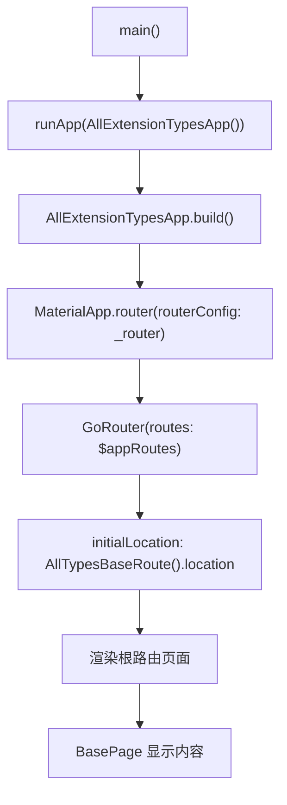
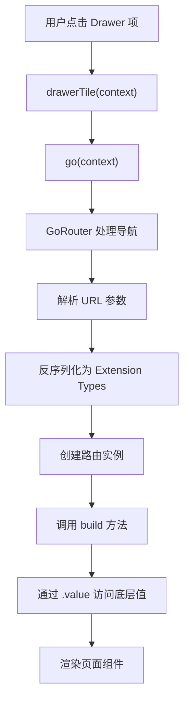

# all_extension_types.dart - UI 组件与应用入口

本文档详细讲解 `all_extension_types.dart` 文件中的 UI 组件（`BasePage`）和应用入口（`AllExtensionTypesApp`、`main` 函数）的实现，以及 Extension Types 在 UI 中的使用方式。

## 概述

UI 组件和应用入口部分展示了如何将 Extension Types 路由与 Flutter UI 集成，以及如何配置 GoRouter 使用生成的 Extension Types 路由代码。与直接类型路由的主要区别在于 Extension Types 需要通过 `.value` 访问底层值。

## BasePage 组件

`BasePage` 是一个通用的页面模板组件，用于显示路由参数信息。它接收 Extension Types 的底层值作为参数。

```dart 317:399:example/lib/all_extension_types.dart
class BasePage<T> extends StatelessWidget {
  const BasePage({
    required this.dataTitle,
    this.param,
    this.queryParam,
    this.queryParamWithDefaultValue,
    super.key,
  });

  final String dataTitle;
  final T? param;
  final T? queryParam;
  final T? queryParamWithDefaultValue;

  @override
  Widget build(BuildContext context) => Scaffold(
    appBar: AppBar(title: const Text('Go router extension types')),
    drawer: Drawer(
      child: ListView(
        children: <Widget>[
          BigIntExtensionRoute(
            requiredBigIntField: BigIntExtension(BigInt.two),
            bigIntField: BigIntExtension(BigInt.zero),
          ).drawerTile(context),
          const BoolExtensionRoute(
            requiredBoolField: BoolExtension(true),
            boolField: BoolExtension(false),
          ).drawerTile(context),
          DateTimeExtensionRoute(
            requiredDateTimeField: DateTimeExtension(DateTime(1970)),
            dateTimeField: DateTimeExtension(DateTime(0)),
          ).drawerTile(context),
          const DoubleExtensionRoute(
            requiredDoubleField: DoubleExtension(3.14),
            doubleField: DoubleExtension(-3.14),
          ).drawerTile(context),
          const IntExtensionRoute(
            requiredIntField: IntExtension(42),
            intField: IntExtension(-42),
          ).drawerTile(context),
          const NumExtensionRoute(
            requiredNumField: NumExtension(2.71828),
            numField: NumExtension(-2.71828),
          ).drawerTile(context),
          const StringExtensionRoute(
            requiredStringField: StringExtension(r'$!/#bob%%20'),
            stringField: StringExtension(r'$!/#bob%%20'),
          ).drawerTile(context),
          const EnumExtensionRoute(
            requiredEnumField: PersonDetailsExtension(
              PersonDetails.favoriteSport,
            ),
            enumField: PersonDetailsExtension(PersonDetails.favoriteFood),
          ).drawerTile(context),
          const EnhancedEnumExtensionRoute(
            requiredEnumField: SportDetailsExtension(SportDetails.football),
            enumField: SportDetailsExtension(SportDetails.volleyball),
          ).drawerTile(context),
          UriExtensionRoute(
            requiredUriField: UriExtension(Uri.parse('https://dart.dev')),
            uriField: UriExtension(Uri.parse('https://dart.dev')),
          ).drawerTile(context),
        ],
      ),
    ),
    body: Center(
      child: Column(
        mainAxisSize: MainAxisSize.min,
        children: <Widget>[
          const Text('Built with Extension Types!'),
          Text(dataTitle),
          Text('Param: $param'),
          Text('Query param: $queryParam'),
          Text('Query param with default value: $queryParamWithDefaultValue'),
          SelectableText(GoRouterState.of(context).uri.path),
          SelectableText(
            GoRouterState.of(context).uri.queryParameters.toString(),
          ),
        ],
      ),
      ),
    ),
  );
}
```

### 组件特点

#### 泛型设计

`BasePage<T>` 是一个泛型组件，可以处理任意类型的数据：

- **类型参数 `T`**：表示路由参数的类型（如 `BigInt`、`bool`、`PersonDetails` 等）
- **类型安全**：确保传入的参数类型与路由类型匹配
- **注意**：`BasePage` 接收的是底层类型的值，而不是 Extension Types 本身

#### 参数说明

- **`dataTitle`**：页面标题，显示当前路由的名称（必需参数）
- **`param`**：路径参数的值（可空类型 `T?`），来自 Extension Types 的 `.value`
- **`queryParam`**：查询参数的值（可空类型 `T?`），来自 Extension Types 的 `.value`
- **`queryParamWithDefaultValue`**：带默认值的查询参数（可空类型 `T?`），来自 Extension Types 的 `.value`

#### UI 结构

`BasePage` 的 UI 结构包括：

1. **AppBar**：显示固定的标题 "Go router extension types"
2. **Drawer**：侧边栏导航，包含所有 Extension Types 路由的导航项
3. **Body**：主要内容区域，显示：
   - "Built with Extension Types!" 文本
   - 路由标题（`dataTitle`）
   - 路径参数值（`param`）
   - 查询参数值（`queryParam`）
   - 带默认值的查询参数值（`queryParamWithDefaultValue`）
   - 当前 URI 路径（可选择的文本，方便复制）
   - 查询参数字符串（可选择的文本）

#### Drawer 导航中的 Extension Types

Drawer 中包含了所有 Extension Types 路由的导航项，每个路由都使用 Extension Types 创建实例：

```dart 337:378:example/lib/all_extension_types.dart
          BigIntExtensionRoute(
            requiredBigIntField: BigIntExtension(BigInt.two),
            bigIntField: BigIntExtension(BigInt.zero),
          ).drawerTile(context),
          const BoolExtensionRoute(
            requiredBoolField: BoolExtension(true),
            boolField: BoolExtension(false),
          ).drawerTile(context),
          DateTimeExtensionRoute(
            requiredDateTimeField: DateTimeExtension(DateTime(1970)),
            dateTimeField: DateTimeExtension(DateTime(0)),
          ).drawerTile(context),
          const DoubleExtensionRoute(
            requiredDoubleField: DoubleExtension(3.14),
            doubleField: DoubleExtension(-3.14),
          ).drawerTile(context),
          const IntExtensionRoute(
            requiredIntField: IntExtension(42),
            intField: IntExtension(-42),
          ).drawerTile(context),
          const NumExtensionRoute(
            requiredNumField: NumExtension(2.71828),
            numField: NumExtension(-2.71828),
          ).drawerTile(context),
          const StringExtensionRoute(
            requiredStringField: StringExtension(r'$!/#bob%%20'),
            stringField: StringExtension(r'$!/#bob%%20'),
          ).drawerTile(context),
          const EnumExtensionRoute(
            requiredEnumField: PersonDetailsExtension(
              PersonDetails.favoriteSport,
            ),
            enumField: PersonDetailsExtension(PersonDetails.favoriteFood),
          ).drawerTile(context),
          const EnhancedEnumExtensionRoute(
            requiredEnumField: SportDetailsExtension(SportDetails.football),
            enumField: SportDetailsExtension(SportDetails.volleyball),
          ).drawerTile(context),
          UriExtensionRoute(
            requiredUriField: UriExtension(Uri.parse('https://dart.dev')),
            uriField: UriExtension(Uri.parse('https://dart.dev')),
          ).drawerTile(context),
```

**Extension Types 创建模式**：

- **基础类型**：`BigIntExtension(BigInt.two)`、`BoolExtension(true)`、`IntExtension(42)` 等
- **枚举类型**：`PersonDetailsExtension(PersonDetails.favoriteSport)`、`SportDetailsExtension(SportDetails.football)` 等
- **const 构造函数**：大多数路由使用 `const` 关键字，因为 Extension Types 支持 `const` 构造函数

#### 路由中的值传递

在路由类的 `build` 方法中，Extension Types 的值通过 `.value` 传递给 `BasePage`：

```dart 72:76:example/lib/all_extension_types.dart
  @override
  Widget build(BuildContext context, GoRouterState state) => BasePage<BigInt>(
    dataTitle: 'BigIntExtensionRoute',
    param: requiredBigIntField.value,
    queryParam: bigIntField?.value,
  );
```

**关键点**：

- `requiredBigIntField.value`：访问 `BigIntExtension` 的底层 `BigInt` 值
- `bigIntField?.value`：如果 `bigIntField` 不为 null，则访问其底层值
- `BasePage<BigInt>`：泛型类型参数是底层类型，而不是 Extension Type

#### URI 显示

页面底部显示当前的路由信息：

```dart 391:394:example/lib/all_extension_types.dart
          SelectableText(GoRouterState.of(context).uri.path),
          SelectableText(
            GoRouterState.of(context).uri.queryParameters.toString(),
          ),
```

- 使用 `SelectableText` 允许用户选择和复制 URL
- 显示完整路径和查询参数，便于调试和理解路由行为
- URL 中存储的是底层类型的序列化值，而不是 Extension Types 本身

## AllExtensionTypesApp 应用类

`AllExtensionTypesApp` 是应用的主入口类，负责配置和初始化路由。

```dart 403:415:example/lib/all_extension_types.dart
class AllExtensionTypesApp extends StatelessWidget {
  AllExtensionTypesApp({super.key});

  @override
  Widget build(BuildContext context) =>
      MaterialApp.router(routerConfig: _router);

  late final GoRouter _router = GoRouter(
    debugLogDiagnostics: true,
    routes: $appRoutes,
    initialLocation: const AllTypesBaseRoute().location,
  );
}
```

### 应用配置

#### MaterialApp.router

使用 `MaterialApp.router` 构造函数配置路由：

- **`routerConfig`**：传入 `GoRouter` 实例
- 自动处理路由导航和页面构建
- Extension Types 路由与直接类型路由的配置方式完全相同

#### GoRouter 配置

`GoRouter` 的配置参数：

1. **`debugLogDiagnostics: true`**：
   - 启用调试日志
   - 在开发时输出路由诊断信息
   - 帮助调试 Extension Types 路由问题

2. **`routes: $appRoutes`**：
   - 使用代码生成器生成的 `$appRoutes` 列表
   - 包含所有通过 `@TypedGoRoute` 注解定义的 Extension Types 路由
   - 代码生成器会自动处理 Extension Types 的序列化和反序列化

3. **`initialLocation`**：
   - 设置应用的初始路由位置
   - 使用 `const AllTypesBaseRoute().location` 获取根路由的位置
   - 应用启动时显示根路由页面

#### late final 使用

`_router` 使用 `late final` 关键字：

- **`late`**：允许延迟初始化（在声明时不需要立即赋值）
- **`final`**：确保 `_router` 只能赋值一次
- 这样可以先声明，然后在初始化列表中赋值

## main 函数

`main` 函数是应用的入口点。

```dart 401:401:example/lib/all_extension_types.dart
void main() => runApp(AllExtensionTypesApp());
```

### 函数说明

- **简洁写法**：使用箭头函数 `=>` 简化单表达式函数
- **应用启动**：调用 `runApp` 启动 Flutter 应用
- **根组件**：传入 `AllExtensionTypesApp()` 作为应用的根组件

## 应用启动流程

完整的应用启动流程：



1. **main 函数**：应用入口
2. **runApp**：启动 Flutter 应用
3. **AllExtensionTypesApp.build**：构建应用根组件
4. **MaterialApp.router**：配置 Material Design 路由
5. **GoRouter**：初始化路由系统
6. **$appRoutes**：加载所有生成的 Extension Types 路由
7. **initialLocation**：导航到初始路由（根路由）
8. **BasePage**：渲染初始页面内容

## 导航流程

用户点击 Drawer 中的导航项时的流程：



1. **用户点击**：在 Drawer 中点击某个 Extension Types 路由项
2. **drawerTile**：调用路由实例的 `drawerTile` 方法
3. **go 方法**：调用 `go(context)` 进行导航
4. **URL 构建**：生成对应的 URL（包含路径和查询参数，存储的是底层类型的值）
5. **路由解析**：GoRouter 解析 URL，提取参数
6. **反序列化**：代码生成器将 URL 中的值反序列化为 Extension Types
7. **实例创建**：创建对应的路由类实例（包含 Extension Types 字段）
8. **build 调用**：调用路由的 `build` 方法
9. **值访问**：通过 `.value` 访问 Extension Types 的底层值
10. **页面渲染**：渲染返回的 Widget

### Extension Types 在导航中的处理

Extension Types 在导航过程中的特殊处理：

1. **URL 序列化**：
   - Extension Types 的底层值被序列化到 URL 中
   - URL 中不包含 Extension Types 的类型信息，只包含底层值

2. **URL 反序列化**：
   - 代码生成器从 URL 中读取底层值
   - 将底层值包装为对应的 Extension Types
   - 创建包含 Extension Types 字段的路由实例

3. **值访问**：
   - 在 `build` 方法中，通过 `.value` 访问 Extension Types 的底层值
   - 将底层值传递给 `BasePage` 组件

## 代码生成依赖

应用依赖于代码生成器生成的代码：

### 生成的文件

`all_extension_types.g.dart` 文件包含：

1. **`$appRoutes`**：所有 Extension Types 路由的列表
2. **Mixin 类**：每个路由类对应的 mixin（如 `$BigIntExtensionRoute`、`$BoolExtensionRoute` 等）
3. **Extension Types 参数解析**：从 `GoRouterState` 中提取参数并包装为 Extension Types 的静态方法
4. **URL 构建**：生成路由 URL 的方法（从 Extension Types 中提取底层值）
5. **导航方法**：`go`、`push`、`pushReplacement`、`replace` 等

### Extension Types 的特殊处理

代码生成器需要特殊处理 Extension Types：

1. **序列化**：
   - 从 Extension Types 中提取底层值（通过 `.value`）
   - 将底层值序列化为 URL 字符串

2. **反序列化**：
   - 从 URL 字符串中解析底层值
   - 将底层值包装为 Extension Types（如 `BigIntExtension(value)`）

3. **类型映射**：
   - 维护 Extension Types 与底层类型的映射关系
   - 确保正确的类型转换

### 代码生成命令

在运行应用前，需要先生成代码：

```bash
flutter pub run build_runner build
```

或者使用监听模式（开发时推荐）：

```bash
flutter pub run build_runner watch
```

## Extension Types 在 UI 中的优势

### 类型语义化

Extension Types 在 UI 中提供了更清晰的类型语义：

```dart
// 直接类型：语义不够清晰
final BigInt userId;

// Extension Types：语义更清晰
final UserIdExtension userId;
```

### 防止类型混淆

Extension Types 可以防止相同底层类型的参数被混淆：

```dart
// 即使底层类型相同，Extension Types 也是不同的类型
final UserIdExtension userId;
final OrderIdExtension orderId;

// 编译时错误：不能将 UserIdExtension 赋值给 OrderIdExtension
// orderId = userId; // 错误！
```

### 零成本抽象

Extension Types 在编译时被擦除，不产生运行时开销：

- UI 渲染性能与直接类型相同
- 不增加内存占用
- 不增加方法调用开销

## 总结

UI 组件和应用入口部分展示了完整的应用架构：

1. **BasePage**：通用页面模板，展示路由参数信息，包含导航抽屉，接收 Extension Types 的底层值
2. **AllExtensionTypesApp**：应用主类，配置 GoRouter 和 MaterialApp
3. **main**：应用入口，启动 Flutter 应用
4. **导航系统**：通过 drawerTile 和 go 方法实现类型安全的导航，自动处理 Extension Types 的序列化和反序列化
5. **代码生成**：依赖生成的路由代码实现 Extension Types 的类型安全

这个架构展示了如何将 `go_router_builder` 的 Extension Types 路由系统与 Flutter UI 完美集成，提供了清晰的代码结构、更强的类型安全性和良好的开发体验。Extension Types 为零成本的类型抽象提供了完美的解决方案，在保持性能的同时提供了更好的代码可读性和类型安全性。
