# all_types.dart 概述与架构

## 文件概述

`all_types.dart` 是一个全面的示例文件，展示了 `go_router_builder` 包支持的各种数据类型的路由实现。该文件包含了从基础数据类型（如 `int`、`String`）到复杂集合类型（如 `List`、`Set`、`Iterable`）的完整路由示例。

## 文件目的

这个文件的主要目的是：

1. **演示类型支持**：展示 `go_router_builder` 能够处理的所有数据类型
2. **提供参考实现**：作为开发者实现不同类型路由的参考模板
3. **测试覆盖**：确保各种数据类型在路由系统中的正确工作

## 代码结构

### 路由层次结构

文件使用嵌套路由结构，根路由 `AllTypesBaseRoute` 包含了所有子路由：

```dart 14:35:example/lib/all_types.dart
@TypedGoRoute<AllTypesBaseRoute>(
  path: '/',
  routes: <TypedGoRoute<GoRouteData>>[
    TypedGoRoute<BigIntRoute>(path: 'big-int-route/:requiredBigIntField'),
    TypedGoRoute<BoolRoute>(path: 'bool-route/:requiredBoolField'),
    TypedGoRoute<DateTimeRoute>(path: 'date-time-route/:requiredDateTimeField'),
    TypedGoRoute<DoubleRoute>(path: 'double-route/:requiredDoubleField'),
    TypedGoRoute<IntRoute>(path: 'int-route/:requiredIntField'),
    TypedGoRoute<NumRoute>(path: 'num-route/:requiredNumField'),
    TypedGoRoute<DoubleRoute>(path: 'double-route/:requiredDoubleField'),
    TypedGoRoute<EnumRoute>(path: 'enum-route/:requiredEnumField'),
    TypedGoRoute<EnhancedEnumRoute>(
      path: 'enhanced-enum-route/:requiredEnumField',
    ),
    TypedGoRoute<StringRoute>(path: 'string-route/:requiredStringField'),
    TypedGoRoute<UriRoute>(path: 'uri-route/:requiredUriField'),
    TypedGoRoute<IterableRoute>(path: 'iterable-route'),
    TypedGoRoute<IterableRouteWithDefaultValues>(
      path: 'iterable-route-with-default-values',
    ),
  ],
)
```

### 路由树可视化

```mermaid
flowchart TD
    Root["AllTypesBaseRoute<br/>path: /"] --> BigInt["BigIntRoute<br/>/big-int-route/:requiredBigIntField"]
    Root --> Bool["BoolRoute<br/>/bool-route/:requiredBoolField"]
    Root --> DateTime["DateTimeRoute<br/>/date-time-route/:requiredDateTimeField"]
    Root --> Double["DoubleRoute<br/>/double-route/:requiredDoubleField"]
    Root --> Int["IntRoute<br/>/int-route/:requiredIntField"]
    Root --> Num["NumRoute<br/>/num-route/:requiredNumField"]
    Root --> Enum["EnumRoute<br/>/enum-route/:requiredEnumField"]
    Root --> EnhancedEnum["EnhancedEnumRoute<br/>/enhanced-enum-route/:requiredEnumField"]
    Root --> StringRoute["StringRoute<br/>/string-route/:requiredStringField"]
    Root --> Uri["UriRoute<br/>/uri-route/:requiredUriField"]
    Root --> Iterable["IterableRoute<br/>/iterable-route"]
    Root --> IterableDefault["IterableRouteWithDefaultValues<br/>/iterable-route-with-default-values"]
```



## 路由分类

文件中的路由按照数据类型可以分为以下几类：

### 1. 基础数据类型路由

包括以下路由类：

- **BigIntRoute**：处理 `BigInt` 类型
- **BoolRoute**：处理 `bool` 类型
- **DateTimeRoute**：处理 `DateTime` 类型
- **DoubleRoute**：处理 `double` 类型
- **IntRoute**：处理 `int` 类型
- **NumRoute**：处理 `num` 类型（`int` 和 `double` 的父类）
- **StringRoute**：处理 `String` 类型
- **UriRoute**：处理 `Uri` 类型

详细说明请参考：[基础数据类型路由](./all_types.dart_02_基础数据类型路由.md)

### 2. 枚举类型路由

- **EnumRoute**：处理普通枚举类型（`PersonDetails`）
- **EnhancedEnumRoute**：处理增强枚举类型（`SportDetails`）

详细说明请参考：[枚举类型路由](./all_types.dart_03_枚举类型路由.md)

### 3. 集合类型路由

- **IterableRoute**：处理各种集合类型（`Iterable`、`List`、`Set`）
- **IterableRouteWithDefaultValues**：展示带默认值的集合类型参数

详细说明请参考：[集合类型路由](./all_types.dart_04_集合类型路由.md)

### 4. UI 组件与应用入口

- **BasePage**：通用页面模板组件
- **IterablePage**：集合类型的专用页面组件
- **AllTypesApp**：应用入口和路由配置
- **main**：应用启动函数

详细说明请参考：[UI 组件与应用入口](./all_types.dart_05_UI组件与应用入口.md)

## 依赖关系

### 外部依赖

文件导入了以下包：

```dart 7:10:example/lib/all_types.dart
import 'package:flutter/material.dart';
import 'package:go_router/go_router.dart';

import 'shared/data.dart';
```

- **flutter/material.dart**：提供 Material Design UI 组件
- **go_router/go_router.dart**：提供路由功能
- **shared/data.dart**：包含枚举类型定义（`PersonDetails`、`SportDetails`、`CookingRecipe`）

### 枚举类型定义

文件使用了 `shared/data.dart` 中定义的枚举类型：

- **PersonDetails**：普通枚举，包含 `hobbies`、`favoriteFood`、`favoriteSport`
- **SportDetails**：增强枚举（Enhanced Enum），包含 `volleyball`、`football`、`tennis`、`hockey`，每个枚举值都有额外的属性（如 `imageUrl`、`playerPerTeam` 等）
- **CookingRecipe**：普通枚举，包含 `burger`、`pizza`、`tacos`

### 生成的代码

文件使用了代码生成：

```dart 12:12:example/lib/all_types.dart
part 'all_types.g.dart';
```

代码生成器会创建 `all_types.g.dart` 文件，包含：

- `$appRoutes`：所有路由的列表
- 每个路由类的 mixin（如 `$BigIntRoute`、`$BoolRoute` 等）
- 路由参数解析和 URL 构建方法

## 通用模式

### 路由类结构

所有路由类都遵循相同的结构模式：

1. **继承 `GoRouteData`**：所有路由类都继承 `GoRouteData`
2. **混入生成的 mixin**：使用 `with $XxxRoute` 混入代码生成器创建的 mixin
3. **定义字段**：路由参数作为类的 final 字段
4. **实现 build 方法**：返回对应的 Widget
5. **drawerTile 方法**（可选）：为导航抽屉提供列表项

### 参数类型

路由参数分为两种：

1. **路径参数（Path Parameters）**：定义在 URL 路径中，使用 `:paramName` 语法，对应类的 `required` 字段
2. **查询参数（Query Parameters）**：定义在 URL 查询字符串中，对应类的可选字段（可空类型或带默认值）

### 参数处理

- **必需参数**：使用 `required` 关键字，必须从路径参数中提取
- **可选参数**：使用可空类型（`T?`），从查询参数中提取
- **默认值参数**：使用非空类型 + 默认值，如果查询参数不存在则使用默认值

## 文档导航

本文件代码的详细讲解分为以下几个文档：

1. **[概述与架构](./all_types.dart_01_概述与架构.md)**（当前文档）：文件整体结构、路由层次、依赖关系
2. **[基础数据类型路由](./all_types.dart_02_基础数据类型路由.md)**：BigInt、Bool、DateTime、Double、Int、Num、String、Uri 类型的路由实现
3. **[枚举类型路由](./all_types.dart_03_枚举类型路由.md)**：普通枚举和增强枚举的路由处理
4. **[集合类型路由](./all_types.dart_04_集合类型路由.md)**：Iterable、List、Set 等集合类型的路由处理
5. **[UI 组件与应用入口](./all_types.dart_05_UI组件与应用入口.md)**：BasePage、IterablePage、AllTypesApp 等组件和应用的启动配置

## 使用示例

要使用这些路由，首先需要运行代码生成：

```bash
flutter pub run build_runner build
```

然后在应用中使用：

```dart 538:552:example/lib/all_types.dart
void main() => runApp(AllTypesApp());

class AllTypesApp extends StatelessWidget {
  AllTypesApp({super.key});

  @override
  Widget build(BuildContext context) =>
      MaterialApp.router(routerConfig: _router);

  late final GoRouter _router = GoRouter(
    debugLogDiagnostics: true,
    routes: $appRoutes,
    initialLocation: const AllTypesBaseRoute().location,
  );
}
```

## 总结

`all_types.dart` 文件是一个全面的示例，展示了 `go_router_builder` 在处理各种数据类型时的能力。通过这个文件，开发者可以了解：

- 如何为不同类型的数据创建类型安全的路由
- 路径参数和查询参数的使用方式
- 可选参数和默认值的处理
- 枚举和集合类型的特殊处理方式
- UI 组件与路由的集成方式

建议按照文档导航顺序阅读各个部分的详细说明，以获得完整的理解。
