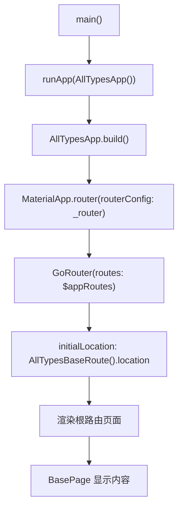
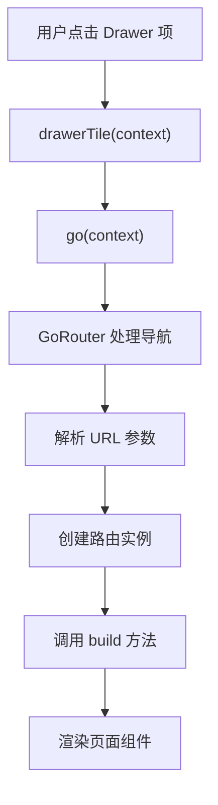

# all_types.dart - UI 组件与应用入口

本文档详细讲解 `all_types.dart` 文件中的 UI 组件（`BasePage`、`IterablePage`）和应用入口（`AllTypesApp`、`main` 函数）的实现。

## 概述

UI 组件和应用入口部分展示了如何将类型安全的路由与 Flutter UI 集成，以及如何配置 GoRouter 使用生成的路由代码。

## BasePage 组件

`BasePage` 是一个通用的页面模板组件，用于显示路由参数信息。

```dart 432:536:example/lib/all_types.dart
class BasePage<T> extends StatelessWidget {
  const BasePage({
    required this.dataTitle,
    this.param,
    this.queryParam,
    this.queryParamWithDefaultValue,
    super.key,
  });

  final String dataTitle;
  final T? param;
  final T? queryParam;
  final T? queryParamWithDefaultValue;

  @override
  Widget build(BuildContext context) => Scaffold(
    appBar: AppBar(title: const Text('Go router typed routes')),
    drawer: Drawer(
      child: ListView(
        children: <Widget>[
          BigIntRoute(
            requiredBigIntField: BigInt.two,
            bigIntField: BigInt.zero,
          ).drawerTile(context),
          BoolRoute(
            requiredBoolField: true,
            boolField: false,
          ).drawerTile(context),
          DateTimeRoute(
            requiredDateTimeField: DateTime(1970),
            dateTimeField: DateTime(0),
          ).drawerTile(context),
          DoubleRoute(
            requiredDoubleField: 3.14,
            doubleField: -3.14,
          ).drawerTile(context),
          IntRoute(requiredIntField: 42, intField: -42).drawerTile(context),
          NumRoute(
            requiredNumField: 2.71828,
            numField: -2.71828,
          ).drawerTile(context),
          StringRoute(
            requiredStringField: r'$!/#bob%%20',
            stringField: r'$!/#bob%%20',
          ).drawerTile(context),
          EnumRoute(
            requiredEnumField: PersonDetails.favoriteSport,
            enumField: PersonDetails.favoriteFood,
          ).drawerTile(context),
          EnhancedEnumRoute(
            requiredEnumField: SportDetails.football,
            enumField: SportDetails.volleyball,
          ).drawerTile(context),
          UriRoute(
            requiredUriField: Uri.parse('https://dart.dev'),
            uriField: Uri.parse('https://dart.dev'),
          ).drawerTile(context),
          IterableRoute(
            intIterableField: <int>[1, 2, 3],
            doubleIterableField: <double>[.3, .4, .5],
            stringIterableField: <String>['quo usque tandem'],
            boolIterableField: <bool>[true, false, false],
            enumIterableField: <SportDetails>[
              SportDetails.football,
              SportDetails.hockey,
            ],
            intListField: <int>[1, 2, 3],
            doubleListField: <double>[.3, .4, .5],
            stringListField: <String>['quo usque tandem'],
            boolListField: <bool>[true, false, false],
            enumListField: <SportDetails>[
              SportDetails.football,
              SportDetails.hockey,
            ],
            intSetField: <int>{1, 2, 3},
            doubleSetField: <double>{.3, .4, .5},
            stringSetField: <String>{'quo usque tandem'},
            boolSetField: <bool>{true, false},
            enumSetField: <SportDetails>{
              SportDetails.football,
              SportDetails.hockey,
            },
          ).drawerTile(context),
          const IterableRouteWithDefaultValues().drawerTile(context),
        ],
      ),
    ),
    body: Center(
      child: Column(
        mainAxisSize: MainAxisSize.min,
        children: <Widget>[
          const Text('Built!'),
          Text(dataTitle),
          Text('Param: $param'),
          Text('Query param: $queryParam'),
          Text('Query param with default value: $queryParamWithDefaultValue'),
          SelectableText(GoRouterState.of(context).uri.path),
          SelectableText(
            GoRouterState.of(context).uri.queryParameters.toString(),
          ),
        ],
      ),
    ),
  );
}
```

### 组件特点

#### 泛型设计

`BasePage<T>` 是一个泛型组件，可以处理任意类型的数据：

- **类型参数 `T`**：表示路由参数的类型（如 `int`、`String`、`PersonDetails` 等）
- **类型安全**：确保传入的参数类型与路由类型匹配

#### 参数说明

- **`dataTitle`**：页面标题，显示当前路由的名称（必需参数）
- **`param`**：路径参数的值（可空类型 `T?`）
- **`queryParam`**：查询参数的值（可空类型 `T?`）
- **`queryParamWithDefaultValue`**：带默认值的查询参数（可空类型 `T?`）

#### UI 结构

`BasePage` 的 UI 结构包括：

1. **AppBar**：显示固定的标题 "Go router typed routes"
2. **Drawer**：侧边栏导航，包含所有路由的导航项
3. **Body**：主要内容区域，显示：
   - "Built!" 文本
   - 路由标题（`dataTitle`）
   - 路径参数值（`param`）
   - 查询参数值（`queryParam`）
   - 带默认值的查询参数值（`queryParamWithDefaultValue`）
   - 当前 URI 路径（可选择的文本，方便复制）
   - 查询参数字符串（可选择的文本）

#### Drawer 导航

Drawer 中包含了所有路由的导航项，每个路由都调用 `drawerTile` 方法：

```dart 452:515:example/lib/all_types.dart
          BigIntRoute(
            requiredBigIntField: BigInt.two,
            bigIntField: BigInt.zero,
          ).drawerTile(context),
          BoolRoute(
            requiredBoolField: true,
            boolField: false,
          ).drawerTile(context),
          // ... 更多路由
```

每个路由实例都使用示例值创建，然后调用 `drawerTile` 方法生成导航项。

#### URI 显示

页面底部显示当前的路由信息：

```dart 528:531:example/lib/all_types.dart
          SelectableText(GoRouterState.of(context).uri.path),
          SelectableText(
            GoRouterState.of(context).uri.queryParameters.toString(),
          ),
```

- 使用 `SelectableText` 允许用户选择和复制 URL
- 显示完整路径和查询参数，便于调试和理解路由行为

## IterablePage 组件

`IterablePage` 是专门用于显示集合类型路由的页面组件。

```dart 554:620:example/lib/all_types.dart
class IterablePage extends StatelessWidget {
  const IterablePage({
    required this.dataTitle,
    this.intIterableField,
    this.doubleIterableField,
    this.stringIterableField,
    this.boolIterableField,
    this.enumIterableField,
    this.intListField,
    this.doubleListField,
    this.stringListField,
    this.boolListField,
    this.enumListField,
    this.intSetField,
    this.doubleSetField,
    this.stringSetField,
    this.boolSetField,
    this.enumSetField,
    super.key,
  });

  final String dataTitle;

  final Iterable<int>? intIterableField;
  final List<int>? intListField;
  final Set<int>? intSetField;

  final Iterable<double>? doubleIterableField;
  final List<double>? doubleListField;
  final Set<double>? doubleSetField;

  final Iterable<String>? stringIterableField;
  final List<String>? stringListField;
  final Set<String>? stringSetField;

  final Iterable<bool>? boolIterableField;
  final List<bool>? boolListField;
  final Set<bool>? boolSetField;

  final Iterable<SportDetails>? enumIterableField;
  final List<SportDetails>? enumListField;
  final Set<SportDetails>? enumSetField;

  @override
  Widget build(BuildContext context) {
    return BasePage<String>(
      dataTitle: dataTitle,
      queryParamWithDefaultValue: <String, Iterable<dynamic>?>{
        'intIterableField': intIterableField,
        'intListField': intListField,
        'intSetField': intSetField,
        'doubleIterableField': doubleIterableField,
        'doubleListField': doubleListField,
        'doubleSetField': doubleSetField,
        'stringIterableField': stringIterableField,
        'stringListField': stringListField,
        'stringSetField': stringSetField,
        'boolIterableField': boolIterableField,
        'boolListField': boolListField,
        'boolSetField': boolSetField,
        'enumIterableField': enumIterableField,
        'enumListField': enumListField,
        'enumSetField': enumSetField,
      }.toString(),
    );
  }
}
```

### 组件特点

#### 专用组件

`IterablePage` 专门用于集合类型路由，因为集合类型有多个字段，无法直接使用 `BasePage<T>` 的简单参数模式。

#### 参数接收

`IterablePage` 接收所有集合类型字段：

- **Iterable 类型**：`intIterableField`、`doubleIterableField`、`stringIterableField`、`boolIterableField`、`enumIterableField`
- **List 类型**：`intListField`、`doubleListField`、`stringListField`、`boolListField`、`enumListField`
- **Set 类型**：`intSetField`、`doubleSetField`、`stringSetField`、`boolSetField`、`enumSetField`

#### BasePage 复用

`IterablePage` 内部复用 `BasePage<String>` 组件：

```dart 599:617:example/lib/all_types.dart
    return BasePage<String>(
      dataTitle: dataTitle,
      queryParamWithDefaultValue: <String, Iterable<dynamic>?>{
        'intIterableField': intIterableField,
        'intListField': intListField,
        // ... 更多字段
      }.toString(),
    );
```

- 将所有集合字段组织成一个 Map
- 使用 `toString()` 方法将 Map 转换为字符串
- 通过 `queryParamWithDefaultValue` 参数传递给 `BasePage`
- 这样可以在页面上显示所有集合字段的信息

## AllTypesApp 应用类

`AllTypesApp` 是应用的主入口类，负责配置和初始化路由。

```dart 540:552:example/lib/all_types.dart
class AllTypesApp extends StatelessWidget {
  AllTypesApp({super.key});

  @override
  Widget build(BuildContext context) =>
      MaterialApp.router(routerConfig: _router);

  late final GoRouter _router = GoRouter(
    debugLogDiagnostics: true,
    routes: $appRoutes,
    initialLocation: const AllTypesBaseRoute().location,
  );
}
```

### 应用配置

#### MaterialApp.router

使用 `MaterialApp.router` 构造函数配置路由：

- **`routerConfig`**：传入 `GoRouter` 实例
- 自动处理路由导航和页面构建

#### GoRouter 配置

`GoRouter` 的配置参数：

1. **`debugLogDiagnostics: true`**：
   - 启用调试日志
   - 在开发时输出路由诊断信息
   - 帮助调试路由问题

2. **`routes: $appRoutes`**：
   - 使用代码生成器生成的 `$appRoutes` 列表
   - 包含所有通过 `@TypedGoRoute` 注解定义的路由

3. **`initialLocation`**：
   - 设置应用的初始路由位置
   - 使用 `const AllTypesBaseRoute().location` 获取根路由的位置
   - 应用启动时显示根路由页面

#### late final 使用

`_router` 使用 `late final` 关键字：

- **`late`**：允许延迟初始化（在声明时不需要立即赋值）
- **`final`**：确保 `_router` 只能赋值一次
- 这样可以先声明，然后在初始化列表中赋值

## main 函数

`main` 函数是应用的入口点。

```dart 538:538:example/lib/all_types.dart
void main() => runApp(AllTypesApp());
```

### 函数说明

- **简洁写法**：使用箭头函数 `=>` 简化单表达式函数
- **应用启动**：调用 `runApp` 启动 Flutter 应用
- **根组件**：传入 `AllTypesApp()` 作为应用的根组件

## 应用启动流程

完整的应用启动流程：



1. **main 函数**：应用入口
2. **runApp**：启动 Flutter 应用
3. **AllTypesApp.build**：构建应用根组件
4. **MaterialApp.router**：配置 Material Design 路由
5. **GoRouter**：初始化路由系统
6. **$appRoutes**：加载所有生成的路由
7. **initialLocation**：导航到初始路由（根路由）
8. **BasePage**：渲染初始页面内容

## 导航流程

用户点击 Drawer 中的导航项时的流程：



1. **用户点击**：在 Drawer 中点击某个路由项
2. **drawerTile**：调用路由实例的 `drawerTile` 方法
3. **go 方法**：调用 `go(context)` 进行导航
4. **URL 构建**：生成对应的 URL（包含路径和查询参数）
5. **路由解析**：GoRouter 解析 URL，提取参数
6. **实例创建**：创建对应的路由类实例
7. **build 调用**：调用路由的 `build` 方法
8. **页面渲染**：渲染返回的 Widget

## 代码生成依赖

应用依赖于代码生成器生成的代码：

### 生成的文件

`all_types.g.dart` 文件包含：

1. **`$appRoutes`**：所有路由的列表
2. **Mixin 类**：每个路由类对应的 mixin（如 `$BigIntRoute`、`$BoolRoute` 等）
3. **参数解析**：从 `GoRouterState` 中提取参数的静态方法
4. **URL 构建**：生成路由 URL 的方法
5. **导航方法**：`go`、`push`、`pushReplacement`、`replace` 等

### 代码生成命令

在运行应用前，需要先生成代码：

```bash
flutter pub run build_runner build
```

或者使用监听模式（开发时推荐）：

```bash
flutter pub run build_runner watch
```

## 总结

UI 组件和应用入口部分展示了完整的应用架构：

1. **BasePage**：通用页面模板，展示路由参数信息，包含导航抽屉
2. **IterablePage**：专用页面组件，处理集合类型的复杂参数
3. **AllTypesApp**：应用主类，配置 GoRouter 和 MaterialApp
4. **main**：应用入口，启动 Flutter 应用
5. **导航系统**：通过 drawerTile 和 go 方法实现类型安全的导航
6. **代码生成**：依赖生成的路由代码实现类型安全

这个架构展示了如何将 `go_router_builder` 的类型安全路由系统与 Flutter UI 完美集成，提供了清晰的代码结构和良好的开发体验。
