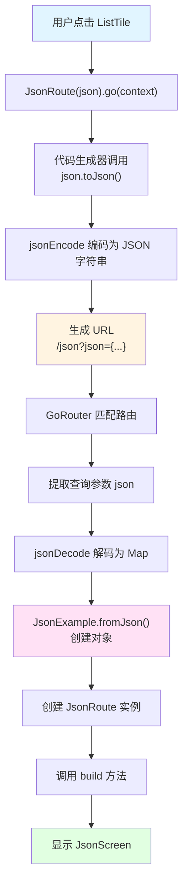

# json_example.dart 代码详解

## 概述

`json_example.dart` 是 `go_router_builder` 包的一个示例文件，展示了如何将自定义类对象作为路由参数传递。该示例通过 JSON 序列化机制实现了复杂对象在 URL 中的编码和解码，是处理复杂路由参数的重要参考。

## 文件结构

该文件主要包含以下组件：

1. **应用入口**：`App` 类负责配置 GoRouter
2. **路由定义**：`HomeRoute` 和 `JsonRoute` 两个路由类
3. **UI 组件**：`HomeScreen` 和 `JsonScreen` 两个屏幕组件
4. **代码生成**：使用 `part` 指令引入生成的代码

## 核心组件详解

### 1. 应用入口与路由配置

```dart 18:26:example/lib/json_example.dart
class App extends StatelessWidget {
  App({super.key});

  @override
  Widget build(BuildContext context) =>
      MaterialApp.router(routerConfig: _router, title: _appTitle);

  final GoRouter _router = GoRouter(routes: $appRoutes);
}
```

**功能说明**：

- `App` 类使用 `MaterialApp.router` 配置路由
- `_router` 使用生成的 `$appRoutes` 创建 GoRouter 实例
- `$appRoutes` 由代码生成器根据 `@TypedGoRoute` 注解自动生成

**关键点**：

- `$appRoutes` 是一个包含所有路由定义的列表，由 `json_example.g.dart` 生成
- 使用 `MaterialApp.router` 而非 `MaterialApp`，以支持声明式路由

### 2. HomeRoute - 首页路由

```dart 28:38:example/lib/json_example.dart
@TypedGoRoute<HomeRoute>(
  path: '/',
  name: 'Home',
  routes: <TypedGoRoute<GoRouteData>>[TypedGoRoute<JsonRoute>(path: 'json')],
)
class HomeRoute extends GoRouteData with $HomeRoute {
  const HomeRoute();

  @override
  Widget build(BuildContext context, GoRouterState state) => const HomeScreen();
}
```

**功能说明**：

- `HomeRoute` 是应用的根路由，对应路径 `/`
- 使用 `@TypedGoRoute` 注解定义路由配置
- `routes` 参数定义了子路由 `JsonRoute`，路径为 `json`

**路由结构**：

- 父路由：`/` → `HomeRoute` → `HomeScreen`
- 子路由：`/json` → `JsonRoute` → `JsonScreen`

**注解参数详解**：

- `path: '/'`：路由的 URL 路径
- `name: 'Home'`：路由名称，可用于命名导航
- `routes: [...]`：子路由列表，支持嵌套路由结构

### 3. JsonRoute - JSON 参数路由

```dart 40:48:example/lib/json_example.dart
class JsonRoute extends GoRouteData with $JsonRoute {
  const JsonRoute(this.json);

  final JsonExample json;

  @override
  Widget build(BuildContext context, GoRouterState state) =>
      JsonScreen(json: json);
}
```

**功能说明**：

- `JsonRoute` 接收一个 `JsonExample` 对象作为参数
- `JsonExample` 是一个自定义类，定义在 `shared/json_example.dart` 中
- 参数通过构造函数传入，并在 `build` 方法中传递给 `JsonScreen`

**JSON 序列化机制**：

代码生成器会自动识别 `JsonExample` 类具有 `fromJson` 和 `toJson` 方法，并生成相应的序列化代码：

```dart 40:43:example/lib/json_example.g.dart
mixin $JsonRoute on GoRouteData {
  static JsonRoute _fromState(GoRouterState state) => JsonRoute((String json0) {
    return JsonExample.fromJson(jsonDecode(json0) as Map<String, dynamic>);
  }(state.uri.queryParameters['json']!));
```

**工作流程**：

1. **编码阶段**（导航时）：
   - 调用 `JsonRoute(json).go(context)`
   - 代码生成器调用 `json.toJson()` 将对象转换为 `Map<String, dynamic>`
   - 使用 `jsonEncode` 将 Map 编码为 JSON 字符串
   - 将 JSON 字符串作为查询参数添加到 URL：`/json?json={"id":"1","name":"people"}`

2. **解码阶段**（路由匹配时）：
   - GoRouter 解析 URL，提取查询参数 `json`
   - 代码生成器使用 `jsonDecode` 将 JSON 字符串解码为 `Map<String, dynamic>`
   - 调用 `JsonExample.fromJson()` 将 Map 转换为 `JsonExample` 对象
   - 使用转换后的对象创建 `JsonRoute` 实例

### 4. JsonExample 类定义

虽然 `JsonExample` 定义在 `shared/json_example.dart` 中，但它是理解该示例的关键：

```dart 6:25:example/lib/shared/json_example.dart
class JsonExample {
  /// json example
  const JsonExample({required this.id, required this.name});

  /// fromJson decoder
  factory JsonExample.fromJson(Map<String, dynamic> json) {
    return JsonExample(id: json['id'] as String, name: json['name'] as String);
  }

  /// toJson encoder
  Map<String, dynamic> toJson() {
    return <String, dynamic>{'id': id, 'name': name};
  }

  /// id
  final String id;

  /// name
  final String name;
}
```

**必需方法**：

要让代码生成器识别并处理自定义类，该类必须实现：

1. **`fromJson` 工厂构造函数**：
   - 接受 `Map<String, dynamic>` 参数
   - 返回类的实例
   - 用于从 URL 参数反序列化对象

2. **`toJson` 实例方法**：
   - 返回 `Map<String, dynamic>`
   - 用于将对象序列化到 URL 参数

### 5. HomeScreen - 首页 UI

```dart 50:66:example/lib/json_example.dart
class HomeScreen extends StatelessWidget {
  const HomeScreen({super.key});

  @override
  Widget build(BuildContext context) => Scaffold(
    appBar: AppBar(title: const Text(_appTitle)),
    body: ListView(
      children: <Widget>[
        for (final JsonExample json in jsonData)
          ListTile(
            title: Text(json.name),
            onTap: () => JsonRoute(json).go(context),
          ),
      ],
    ),
  );
}
```

**功能说明**：

- 显示一个列表，包含所有 `jsonData` 中的 `JsonExample` 对象
- 每个列表项点击时，使用类型安全的方式导航到 `JsonRoute`
- `jsonData` 定义在 `shared/json_example.dart` 中，包含示例数据

**导航方式**：

```dart 61:61:example/lib/json_example.dart
onTap: () => JsonRoute(json).go(context),
```

这是 `go_router_builder` 推荐的类型安全导航方式：

- 直接使用路由类构造函数创建实例
- 调用 `.go(context)` 方法进行导航
- 无需手动构建 URL 字符串，避免拼写错误

### 6. JsonScreen - JSON 详情页 UI

```dart 68:80:example/lib/json_example.dart
class JsonScreen extends StatelessWidget {
  const JsonScreen({required this.json, super.key});
  final JsonExample json;

  @override
  Widget build(BuildContext context) => Scaffold(
    appBar: AppBar(title: Text(json.name)),
    body: ListView(
      key: ValueKey<String>(json.id),
      children: <Widget>[Text(json.id), Text(json.name)],
    ),
  );
}
```

**功能说明**：

- 接收 `JsonExample` 对象并显示其内容
- 使用 `ValueKey` 确保当 JSON 对象变化时，Widget 能够正确重建
- 显示对象的 `id` 和 `name` 属性

**ValueKey 的作用**：

```dart 76:76:example/lib/json_example.dart
key: ValueKey<String>(json.id),
```

- 当同一个路由接收到不同的 JSON 对象时，Flutter 需要通过 `key` 来区分不同的 Widget 实例
- 使用 `json.id` 作为 key，确保每个不同的 JSON 对象都有唯一的标识

## 代码生成机制

### 生成的代码文件

该文件使用 `part` 指令引入生成的代码：

```dart 14:14:example/lib/json_example.dart
part 'json_example.g.dart';
```

生成的代码文件 `json_example.g.dart` 包含：

1. **`$appRoutes`**：所有路由的列表
2. **`$HomeRoute` mixin**：为 `HomeRoute` 提供导航方法
3. **`$JsonRoute` mixin**：为 `JsonRoute` 提供导航方法和 JSON 序列化逻辑

### 生成的关键代码

**路由列表生成**：

```dart 11:18:example/lib/json_example.g.dart
List<RouteBase> get $appRoutes => [$homeRoute];

RouteBase get $homeRoute => GoRouteData.$route(
  path: '/',
  name: 'Home',
  factory: $HomeRoute._fromState,
  routes: [GoRouteData.$route(path: 'json', factory: $JsonRoute._fromState)],
);
```

**JSON 参数处理**：

```dart 47:51:example/lib/json_example.g.dart
String get location => GoRouteData.$location(
  '/json',
  queryParams: {'json': jsonEncode(_self.json.toJson())},
);
```

- `location` getter 生成包含 JSON 编码参数的完整 URL
- 使用 `jsonEncode` 和 `toJson()` 进行序列化

## 使用场景

### 适用场景

1. **复杂对象传递**：需要传递包含多个字段的对象时
2. **类型安全**：希望保持类型安全，避免手动解析 URL 参数
3. **嵌套路由**：需要在子路由中传递复杂参数时

### 限制与注意事项

1. **URL 长度限制**：JSON 字符串会作为查询参数添加到 URL，受浏览器 URL 长度限制（通常约 2000 字符）
2. **URL 可读性**：JSON 编码后的 URL 不够友好，不适合直接分享
3. **性能考虑**：序列化和反序列化有轻微性能开销，但对于大多数场景可以忽略

### 替代方案

如果对象过于复杂或 URL 长度受限，可以考虑：

1. **使用额外参数（$extra）**：通过 `$extra` 传递对象，不包含在 URL 中
2. **使用路径参数 + 查询参数**：将对象的各个字段分别作为路径或查询参数
3. **使用 ID + 数据存储**：在 URL 中只传递 ID，从本地存储或状态管理获取完整对象

## 完整工作流程

### 用户操作流程

1. **应用启动**：
   - `main()` 函数运行，创建 `App` Widget
   - `App` 创建 `GoRouter`，配置路由表

2. **显示首页**：
   - 初始路由为 `/`，显示 `HomeScreen`
   - `HomeScreen` 从 `jsonData` 读取数据，显示列表

3. **点击列表项**：
   - 用户点击某个 `ListTile`
   - 执行 `JsonRoute(json).go(context)`
   - 代码生成器将 `JsonExample` 对象序列化为 JSON 字符串
   - 生成 URL：`/json?json={"id":"1","name":"people"}`

4. **导航到详情页**：
   - GoRouter 匹配 `/json` 路由
   - 提取查询参数 `json`
   - 代码生成器使用 `JsonExample.fromJson()` 反序列化
   - 创建 `JsonRoute` 实例，显示 `JsonScreen`

### 代码执行流程



## 最佳实践

### 1. JSON 类设计

- 确保 `fromJson` 和 `toJson` 方法正确处理所有字段
- 使用类型断言（`as String`）确保类型安全
- 考虑字段的默认值和可空性

### 2. 错误处理

虽然示例中没有显示，但在实际使用中应该考虑：

- JSON 解析失败的情况
- URL 参数缺失的情况
- 类型转换失败的情况

### 3. 性能优化

- 对于简单的对象，考虑使用多个查询参数而非 JSON
- 对于复杂对象，考虑使用 `$extra` 参数
- 缓存序列化结果如果对象不会频繁变化

## 相关示例

- **json_nested_example.dart**：展示了如何处理嵌套的泛型对象
- **all_types.dart**：展示了基本类型作为路由参数的使用
- **extra_example.dart**：展示了使用 `$extra` 传递复杂对象的替代方案

## 总结

`json_example.dart` 展示了 `go_router_builder` 处理复杂对象参数的能力。通过 JSON 序列化机制，可以将自定义类对象作为路由参数传递，同时保持类型安全。虽然这种方式有一些限制（如 URL 长度），但在许多场景下仍然是一个有效的解决方案。
