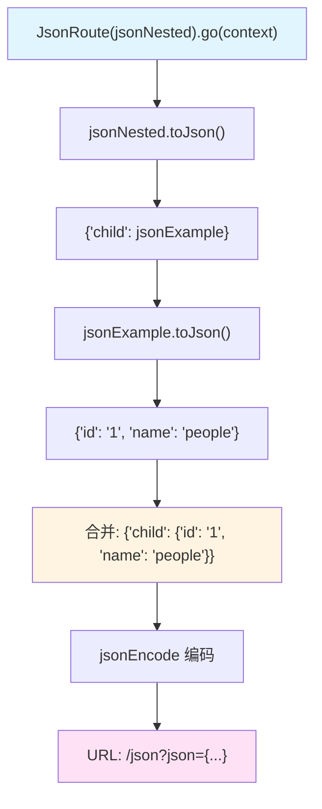
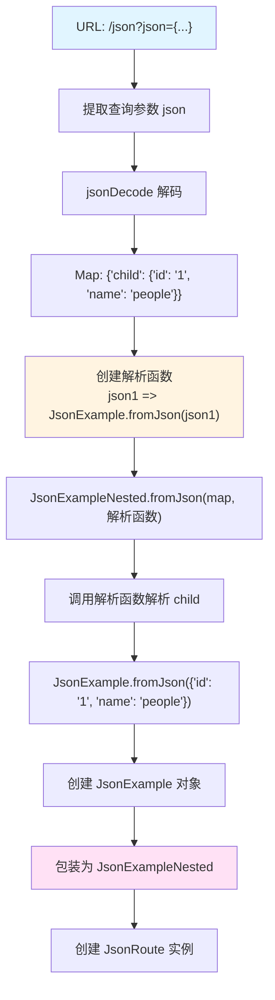

# json_nested_example.dart 代码详解

## 概述

`json_nested_example.dart` 是 `go_router_builder` 包的一个高级示例文件，展示了如何将**泛型嵌套对象**作为路由参数传递。该示例是 `json_example.dart` 的进阶版本，演示了如何处理包含泛型类型的复杂数据结构。通过特殊的 `fromJson` 签名，代码生成器能够自动处理嵌套的泛型对象序列化和反序列化。

## 与 json_example.dart 的区别

虽然两个示例的整体结构相似，但 `json_nested_example.dart` 的核心区别在于：

1. **使用泛型类**：路由参数类型为 `JsonExampleNested<JsonExample>` 而非简单的 `JsonExample`
2. **嵌套结构**：对象内部包含另一个对象（`child` 字段）
3. **特殊的 fromJson 签名**：泛型类的 `fromJson` 需要接受额外的函数参数来解析泛型类型参数

## 文件结构

该文件主要包含以下组件：

1. **应用入口**：`App` 类负责配置 GoRouter
2. **路由定义**：`HomeRoute` 和 `JsonRoute` 两个路由类
3. **UI 组件**：`HomeScreen` 和 `JsonScreen` 两个屏幕组件
4. **代码生成**：使用 `part` 指令引入生成的代码

## 核心组件详解

### 1. 应用入口与路由配置

```dart 18:26:example/lib/json_nested_example.dart
class App extends StatelessWidget {
  App({super.key});

  @override
  Widget build(BuildContext context) =>
      MaterialApp.router(routerConfig: _router, title: _appTitle);

  final GoRouter _router = GoRouter(routes: $appRoutes);
}
```

**功能说明**：

- `App` 类使用 `MaterialApp.router` 配置路由
- `_router` 使用生成的 `$appRoutes` 创建 GoRouter 实例
- 这部分与 `json_example.dart` 完全相同

### 2. HomeRoute - 首页路由

```dart 28:38:example/lib/json_nested_example.dart
@TypedGoRoute<HomeRoute>(
  path: '/',
  name: 'Home',
  routes: <TypedGoRoute<GoRouteData>>[TypedGoRoute<JsonRoute>(path: 'json')],
)
class HomeRoute extends GoRouteData with $HomeRoute {
  const HomeRoute();

  @override
  Widget build(BuildContext context, GoRouterState state) => const HomeScreen();
}
```

**功能说明**：

- `HomeRoute` 是应用的根路由，对应路径 `/`
- 定义了子路由 `JsonRoute`，路径为 `json`
- 与 `json_example.dart` 的结构相同

### 3. JsonRoute - 泛型嵌套对象路由

这是该示例的核心部分，展示了如何处理泛型嵌套对象：

```dart 40:48:example/lib/json_nested_example.dart
class JsonRoute extends GoRouteData with $JsonRoute {
  const JsonRoute(this.json);

  final JsonExampleNested<JsonExample> json;

  @override
  Widget build(BuildContext context, GoRouterState state) =>
      JsonScreen(json: json.child);
}
```

**关键差异**：

- 参数类型为 `JsonExampleNested<JsonExample>` 而非 `JsonExample`
- 在 `build` 方法中，通过 `json.child` 访问嵌套的对象
- 传递给 `JsonScreen` 的是内部的 `JsonExample` 对象

**类型结构**：

```text
JsonRoute
  └── json: JsonExampleNested<JsonExample>
          └── child: JsonExample
                    ├── id: String
                    └── name: String
```

### 4. JsonExampleNested 泛型类

理解泛型嵌套对象的关键在于 `JsonExampleNested<T>` 类的定义：

```dart 34:53:example/lib/shared/json_example.dart
class JsonExampleNested<T> {
  /// Json Nested Example
  const JsonExampleNested({required this.child});

  /// toJson decoder
  factory JsonExampleNested.fromJson(
    Map<String, dynamic> json,
    T Function(Object? json) fromJsonT,
  ) {
    return JsonExampleNested<T>(child: fromJsonT(json['child']));
  }

  /// toJson encoder
  Map<String, dynamic> toJson() {
    return <String, dynamic>{'child': child};
  }

  /// child
  final T child;
}
```

**关键特性**：

1. **泛型类型参数**：`<T>` 表示可以包装任意类型
2. **特殊的 fromJson 签名**：
   - 第一个参数：`Map<String, dynamic> json`（标准 JSON Map）
   - 第二个参数：`T Function(Object? json) fromJsonT`（用于解析泛型类型 `T` 的函数）
3. **嵌套解析**：使用 `fromJsonT` 函数来解析 `child` 字段

**为什么需要第二个参数？**

由于 Dart 的泛型擦除（类型擦除），在运行时无法直接知道泛型类型 `T` 的具体类型。因此，需要通过函数参数显式提供如何解析 `T` 类型的逻辑。

### 5. 代码生成器如何处理泛型嵌套对象

代码生成器会自动识别这种模式并生成相应的序列化代码：

```dart 40:48:example/lib/json_nested_example.g.dart
mixin $JsonRoute on GoRouteData {
  static JsonRoute _fromState(GoRouterState state) => JsonRoute((String json0) {
    return JsonExampleNested.fromJson(
      jsonDecode(json0) as Map<String, dynamic>,
      (Object? json1) {
        return JsonExample.fromJson(json1 as Map<String, dynamic>);
      },
    );
  }(state.uri.queryParameters['json']!));
```

**生成的代码解析**：

1. **外层解析**：使用 `jsonDecode` 将查询参数解码为 `Map<String, dynamic>`
2. **内层解析函数**：创建一个匿名函数 `(Object? json1) => JsonExample.fromJson(json1 as Map<String, dynamic>)`
3. **嵌套调用**：将解析函数作为第二个参数传递给 `JsonExampleNested.fromJson`
4. **递归解析**：`JsonExampleNested.fromJson` 内部会使用这个函数来解析 `child` 字段

**序列化过程**：

```dart 52:56:example/lib/json_nested_example.g.dart
String get location => GoRouteData.$location(
  '/json',
  queryParams: {'json': jsonEncode(_self.json.toJson())},
);
```

序列化时，`toJson()` 方法会递归调用：

1. `JsonExampleNested.toJson()` 返回 `{'child': child}`
2. `child` 是 `JsonExample` 类型，调用 `JsonExample.toJson()` 返回 `{'id': id, 'name': name}`
3. 最终 JSON：`{"child":{"id":"1","name":"people"}}`

### 6. HomeScreen - 首页 UI

```dart 50:68:example/lib/json_nested_example.dart
class HomeScreen extends StatelessWidget {
  const HomeScreen({super.key});

  @override
  Widget build(BuildContext context) => Scaffold(
    appBar: AppBar(title: const Text(_appTitle)),
    body: ListView(
      children: <Widget>[
        for (final JsonExample json in jsonData)
          ListTile(
            title: Text(json.name),
            onTap: () => JsonRoute(
              JsonExampleNested<JsonExample>(child: json),
            ).go(context),
          ),
      ],
    ),
  );
}
```

**关键点**：

```dart 61:63:example/lib/json_nested_example.dart
onTap: () => JsonRoute(
  JsonExampleNested<JsonExample>(child: json),
).go(context),
```

- 需要手动包装 `JsonExample` 对象到 `JsonExampleNested<JsonExample>` 中
- 明确指定泛型类型参数 `<JsonExample>`
- 将原始的 `json` 对象作为 `child` 参数传入

**导航流程**：

1. 用户点击列表项
2. 将 `JsonExample` 包装为 `JsonExampleNested<JsonExample>`
3. 创建 `JsonRoute` 实例并调用 `go(context)`
4. 代码生成器序列化嵌套对象到 URL

### 7. JsonScreen - JSON 详情页 UI

```dart 70:82:example/lib/json_nested_example.dart
class JsonScreen extends StatelessWidget {
  const JsonScreen({required this.json, super.key});
  final JsonExample json;

  @override
  Widget build(BuildContext context) => Scaffold(
    appBar: AppBar(title: Text(json.name)),
    body: ListView(
      key: ValueKey<String>(json.id),
      children: <Widget>[Text(json.id), Text(json.name)],
    ),
  );
}
```

**注意**：

- `JsonScreen` 接收的是 `JsonExample` 对象（非 `JsonExampleNested`）
- 在 `JsonRoute.build` 方法中，通过 `json.child` 提取内部对象

## 完整的序列化/反序列化流程

### 导航时（序列化）



**实际生成的 URL**：

```text
/json?json={"child":{"id":"1","name":"people"}}
```

### 路由匹配时（反序列化）



**反序列化步骤详解**：

1. **提取参数**：从 URL 查询参数中提取 `json` 字符串
2. **解码 JSON**：使用 `jsonDecode` 转换为 `Map<String, dynamic>`
3. **创建解析函数**：生成一个函数，用于解析泛型类型 `T`（这里是 `JsonExample`）
4. **外层解析**：调用 `JsonExampleNested.fromJson(map, 解析函数)`
5. **内层解析**：`JsonExampleNested.fromJson` 内部调用解析函数处理 `child` 字段
6. **递归完成**：最终得到完整的嵌套对象结构

## 代码生成器的识别逻辑

代码生成器通过以下特征识别泛型嵌套对象：

1. **检查 fromJson 签名**：
   - 必须接受两个参数
   - 第一个参数：`Map<String, dynamic>`
   - 第二个参数：`T Function(Object? json)` 类型的函数

2. **检查泛型参数**：
   - 类必须是泛型类，且只有一个类型参数
   - 类型参数必须是 `child` 字段的类型

3. **递归检查**：
   - 检查泛型类型参数 `T` 是否也是支持 JSON 序列化的类型
   - 如果是，继续生成嵌套的解析代码

**代码生成器源代码中的关键逻辑**：

```dart
bool _isNestedTemplate(InterfaceType type) {
  // 检查 fromJson 构造函数的参数
  if (parameters.length != 2) {
    return false;
  }
  
  // 第二个参数必须是函数类型
  // T Function(Object? json)
  if (functionType.formalParameters.length != 1 ||
      functionType.returnType.getDisplayString() !=
          type.element.typeParameters.first.displayName ||
      functionType.formalParameters[0].type.getDisplayString() != 'Object?') {
    return false;
  }
  
  return true;
}
```

## 使用场景

### 适用场景

1. **嵌套数据结构**：需要传递包含嵌套对象的复杂数据结构
2. **通用容器类型**：使用泛型类作为数据的通用包装器
3. **类型安全的嵌套**：希望保持类型安全，避免使用 `Map` 或 `dynamic`

### 实际应用示例

#### 场景 1：分页结果

```dart
class PaginatedResult<T> {
  final List<T> items;
  final int total;
  final int page;
  
  PaginatedResult.fromJson(
    Map<String, dynamic> json,
    T Function(Object? json) fromJsonT,
  ) : items = (json['items'] as List).map(fromJsonT).toList(),
       total = json['total'] as int,
       page = json['page'] as int;
       
  Map<String, dynamic> toJson() => {
    'items': items.map((e) => (e as dynamic).toJson()).toList(),
    'total': total,
    'page': page,
  };
}

@TypedGoRoute<UserListRoute>(path: '/users')
class UserListRoute extends GoRouteData with $UserListRoute {
  final PaginatedResult<User> users;
  // ...
}
```

#### 场景 2：API 响应包装

```dart
class ApiResponse<T> {
  final T data;
  final String? error;
  
  ApiResponse.fromJson(
    Map<String, dynamic> json,
    T Function(Object? json) fromJsonT,
  ) : data = fromJsonT(json['data']),
       error = json['error'] as String?;
}
```

### 限制与注意事项

1. **URL 长度限制**：嵌套对象会导致 JSON 字符串更长，更容易超出 URL 长度限制
2. **性能开销**：多层嵌套会增加序列化/反序列化的开销
3. **可读性**：URL 中的嵌套 JSON 结构不够友好

### 替代方案

如果嵌套结构过于复杂，可以考虑：

1. **扁平化**：将嵌套对象展开为多个查询参数
2. **使用 $extra**：通过 `$extra` 参数传递，不包含在 URL 中
3. **使用 ID**：只传递顶层 ID，通过状态管理或存储获取完整数据

## 与 json_example.dart 的对比

| 特性 | json_example.dart | json_nested_example.dart |
| --- | --- | --- |
| 参数类型 | `JsonExample` | `JsonExampleNested<JsonExample>` |
| 结构复杂度 | 简单对象 | 嵌套对象 |
| fromJson 参数 | 1 个（Map） | 2 个（Map + 函数） |
| 适用场景 | 简单数据结构 | 嵌套/泛型数据结构 |
| URL 复杂度 | 较低 | 较高 |

## 最佳实践

### 1. 泛型类设计

- **明确的 fromJson 签名**：确保第二个参数的类型正确
- **类型安全**：使用类型断言确保类型安全
- **文档说明**：为泛型类型参数添加文档注释

### 2. 嵌套深度控制

- **避免过深嵌套**：建议嵌套深度不超过 3 层
- **考虑性能**：深层嵌套会影响序列化性能
- **评估 URL 长度**：确保生成的 URL 不会过长

### 3. 错误处理

虽然示例中没有显示，但在实际使用中应该考虑：

- JSON 解析失败的情况
- 泛型类型不匹配的情况
- 嵌套对象字段缺失的情况

## 相关示例

- **json_example.dart**：展示了简单对象的 JSON 序列化
- **all_types.dart**：展示了基本类型作为路由参数的使用
- **extra_example.dart**：展示了使用 `$extra` 传递复杂对象的替代方案

## 总结

`json_nested_example.dart` 展示了 `go_router_builder` 处理泛型嵌套对象的高级能力。通过特殊的 `fromJson` 签名（接受解析函数作为参数），代码生成器能够自动处理任意深度的嵌套结构，同时保持类型安全。这种方式适合需要传递复杂嵌套数据结构的场景，但需要注意 URL 长度和性能影响。
