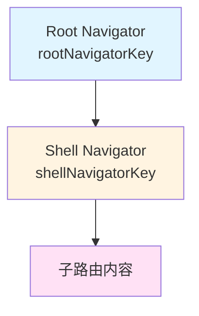
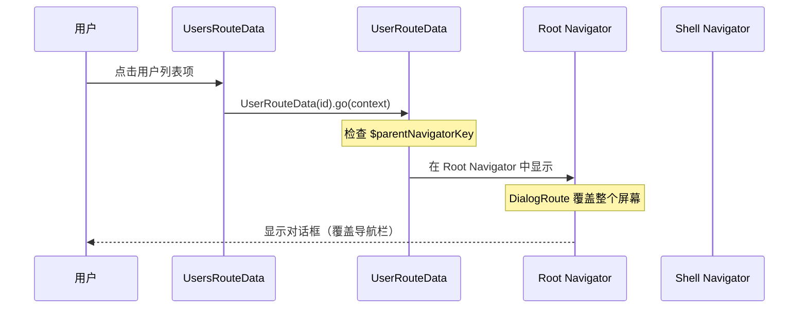

# Shell Route with Keys 示例解析

本文档详细解析 `shell_route_with_keys_example.dart` 文件，该示例展示了如何在 ShellRoute 中使用导航器键（Navigator Keys）来控制路由在不同导航器中的显示位置。

## 概述

这个示例演示了一个关键场景：**如何让子路由（如对话框）显示在不同的导航器层级中**。具体来说，当应用使用 ShellRoute 创建了一个带有 NavigationRail 的布局时，如何让对话框覆盖整个屏幕（包括导航栏），而不仅仅是在 ShellRoute 的 Navigator 中显示。

## 核心概念：导航器键（Navigator Keys）

### 导航器层级结构

在 Flutter 中使用 GoRouter 时，可以创建多个 Navigator 层级：



- **Root Navigator**：最顶层的导航器，由 `MaterialApp.router` 的 `navigatorKey` 指定
- **Shell Navigator**：ShellRoute 内部创建的导航器，用于管理子路由
- **子路由**：实际显示的内容页面

### 为什么需要导航器键？

默认情况下，ShellRoute 的子路由会显示在 Shell Navigator 中。但在某些场景下（如显示全屏对话框），我们需要让路由显示在 Root Navigator 中，这样才能覆盖整个屏幕，包括 ShellRoute 创建的导航栏等 UI 元素。

## 代码结构解析

### 1. 导航器键定义

```dart 14:15:example/lib/shell_route_with_keys_example.dart
final GlobalKey<NavigatorState> rootNavigatorKey = GlobalKey<NavigatorState>();
final GlobalKey<NavigatorState> shellNavigatorKey = GlobalKey<NavigatorState>();
```

定义了两个全局导航器键：

- `rootNavigatorKey`：根导航器的键，用于控制整个应用的导航层级
- `shellNavigatorKey`：Shell 导航器的键，用于控制 ShellRoute 内部的导航

### 2. 应用配置

```dart 17:29:example/lib/shell_route_with_keys_example.dart
class App extends StatelessWidget {
  App({super.key});

  @override
  Widget build(BuildContext context) =>
      MaterialApp.router(routerConfig: _router);

  final GoRouter _router = GoRouter(
    routes: $appRoutes,
    initialLocation: '/home',
    navigatorKey: rootNavigatorKey,
  );
}
```

在 `GoRouter` 配置中，将 `rootNavigatorKey` 赋值给 `navigatorKey` 参数，这样整个应用的路由就会使用这个根导航器。

### 3. ShellRoute 配置

```dart 31:51:example/lib/shell_route_with_keys_example.dart
@TypedShellRoute<MyShellRouteData>(
  routes: <TypedRoute<RouteData>>[
    TypedGoRoute<HomeRouteData>(path: '/home'),
    TypedGoRoute<UsersRouteData>(
      path: '/users',
      routes: <TypedGoRoute<UserRouteData>>[
        TypedGoRoute<UserRouteData>(path: ':id'),
      ],
    ),
  ],
)
class MyShellRouteData extends ShellRouteData {
  const MyShellRouteData();

  static final GlobalKey<NavigatorState> $navigatorKey = shellNavigatorKey;

  @override
  Widget builder(BuildContext context, GoRouterState state, Widget navigator) {
    return MyShellRouteScreen(child: navigator);
  }
}
```

关键点：

1. **`@TypedShellRoute` 注解**：定义了一个 ShellRoute，包含多个子路由
   - `/home`：首页路由
   - `/users`：用户列表路由
   - `/users/:id`：用户详情路由（嵌套路由）

2. **`$navigatorKey`**：这是 `go_router_builder` 提供的特殊静态字段，用于指定 ShellRoute 使用的导航器键。通过设置 `$navigatorKey = shellNavigatorKey`，我们告诉代码生成器，这个 ShellRoute 应该使用 `shellNavigatorKey` 作为其内部导航器的键。

3. **`builder` 方法**：构建 ShellRoute 的 UI，接收 `navigator` 参数（这是子路由内容的容器），并将其包装在 `MyShellRouteScreen` 中。

### 4. Shell UI 组件

```dart 53:100:example/lib/shell_route_with_keys_example.dart
class MyShellRouteScreen extends StatelessWidget {
  const MyShellRouteScreen({required this.child, super.key});

  final Widget child;

  int getCurrentIndex(BuildContext context) {
    final String location = GoRouterState.of(context).uri.path;
    if (location.startsWith('/users')) {
      return 1;
    }
    return 0;
  }

  @override
  Widget build(BuildContext context) {
    final int selectedIndex = getCurrentIndex(context);

    return Scaffold(
      body: Row(
        children: <Widget>[
          NavigationRail(
            destinations: const <NavigationRailDestination>[
              NavigationRailDestination(
                icon: Icon(Icons.home),
                label: Text('Home'),
              ),
              NavigationRailDestination(
                icon: Icon(Icons.group),
                label: Text('Users'),
              ),
            ],
            selectedIndex: selectedIndex,
            onDestinationSelected: (int index) {
              switch (index) {
                case 0:
                  const HomeRouteData().go(context);
                case 1:
                  const UsersRouteData().go(context);
              }
            },
          ),
          const VerticalDivider(thickness: 1, width: 1),
          Expanded(child: child),
        ],
      ),
    );
  }
}
```

这个组件创建了一个带有导航栏的布局：

- **`NavigationRail`**：左侧导航栏，包含两个目的地（Home 和 Users）
- **`getCurrentIndex` 方法**：根据当前路由路径确定选中的导航项
- **`child`**：这是从 `builder` 方法传入的 `navigator`，包含了当前子路由的内容
- **布局结构**：使用 `Row` 将导航栏、分隔线和子路由内容水平排列

### 5. 子路由实现

#### HomeRouteData

```dart 102:109:example/lib/shell_route_with_keys_example.dart
class HomeRouteData extends GoRouteData with $HomeRouteData {
  const HomeRouteData();

  @override
  Widget build(BuildContext context, GoRouterState state) {
    return const Center(child: Text('The home page'));
  }
}
```

简单的首页路由，显示居中文本。

#### UsersRouteData

```dart 111:126:example/lib/shell_route_with_keys_example.dart
class UsersRouteData extends GoRouteData with $UsersRouteData {
  const UsersRouteData();

  @override
  Widget build(BuildContext context, GoRouterState state) {
    return ListView(
      children: <Widget>[
        for (int userID = 1; userID <= 3; userID++)
          ListTile(
            title: Text('User $userID'),
            onTap: () => UserRouteData(id: userID).go(context),
          ),
      ],
    );
  }
}
```

用户列表路由，显示三个用户项。点击任意用户项会导航到 `UserRouteData`（用户详情路由）。

### 6. 对话框页面封装

```dart 128:143:example/lib/shell_route_with_keys_example.dart
class DialogPage extends Page<void> {
  /// A page to display a dialog.
  const DialogPage({required this.child, super.key});

  /// The widget to be displayed which is usually a [Dialog] widget.
  final Widget child;

  @override
  Route<void> createRoute(BuildContext context) {
    return DialogRoute<void>(
      context: context,
      settings: this,
      builder: (BuildContext context) => child,
    );
  }
}
```

`DialogPage` 是一个自定义的 `Page` 类，用于将普通 Widget 转换为对话框路由：

- **继承 `Page<void>`**：这是 Flutter 导航系统中的页面抽象类
- **`createRoute` 方法**：返回 `DialogRoute`，这是 Flutter 提供的对话框路由类型
- **用途**：通过这种方式，我们可以将对话框集成到路由系统中，而不是使用 `showDialog`

### 7. 用户详情路由（关键部分）

```dart 145:166:example/lib/shell_route_with_keys_example.dart
class UserRouteData extends GoRouteData with $UserRouteData {
  const UserRouteData({required this.id});

  // Without this static key, the dialog will not cover the navigation rail.
  static final GlobalKey<NavigatorState> $parentNavigatorKey = rootNavigatorKey;

  final int id;

  @override
  Page<void> buildPage(BuildContext context, GoRouterState state) {
    return DialogPage(
      key: state.pageKey,
      child: Center(
        child: SizedBox(
          width: 300,
          height: 300,
          child: Card(child: Center(child: Text('User $id'))),
        ),
      ),
    );
  }
}
```

这是整个示例的核心部分：

1. **`$parentNavigatorKey`**：这是 `go_router_builder` 提供的特殊静态字段。通过设置 `$parentNavigatorKey = rootNavigatorKey`，我们告诉代码生成器，这个路由应该显示在根导航器中，而不是默认的 Shell Navigator 中。

2. **注释说明**：代码中的注释明确指出，如果没有这个键，对话框将无法覆盖导航栏。这是因为默认情况下，`UserRouteData` 会显示在 Shell Navigator 中，而 Shell Navigator 只包含导航栏右侧的内容区域。

3. **`buildPage` 方法**：使用 `buildPage` 而不是 `build`，因为我们返回的是一个 `Page` 对象而不是 `Widget`。这是显示对话框路由的标准方式。

4. **`state.pageKey`**：将 `state.pageKey` 作为 `DialogPage` 的 key，确保路由系统能够正确管理页面的生命周期。

## 工作流程

### 导航流程



### 视觉效果对比

**没有 `$parentNavigatorKey` 的情况**：

```text
┌─────────────────────────────┐
│ [Home] [Users] │  内容区域  │
│                │            │
│                │  ┌──────┐  │
│                │  │对话框│  │
│                │  └──────┘  │
└─────────────────────────────┘
```

对话框只在内容区域显示，无法覆盖导航栏。

**有 `$parentNavigatorKey` 的情况**：

```text
┌─────────────────────────────┐
│ ┌─────────────────────────┐ │
│ │                         │ │
│ │       对话框             │ │
│ │   （覆盖整个屏幕）        │ │
│ │                         │ │
│ └─────────────────────────┘ │
└─────────────────────────────┘
```

对话框覆盖整个屏幕，包括导航栏。

## 技术细节

### 导航器键的作用机制

1. **`$navigatorKey`（ShellRoute）**：
   - 告诉代码生成器 ShellRoute 应该使用哪个导航器键
   - 生成的代码会将这个键传递给 `ShellRoute` 构造函数的 `navigatorKey` 参数

2. **`$parentNavigatorKey`（GoRoute）**：
   - 告诉代码生成器 GoRoute 应该显示在哪个父导航器中
   - 生成的代码会将这个键传递给 `GoRoute` 构造函数的 `parentNavigatorKey` 参数

### 为什么需要两个不同的键？

- **`rootNavigatorKey`**：控制整个应用的顶层导航，适合显示全屏对话框、底部表单等需要覆盖所有 UI 的场景
- **`shellNavigatorKey`**：控制 ShellRoute 内部的导航，适合在 Shell 布局内进行页面切换

### DialogRoute vs showDialog

使用 `DialogRoute` 作为路由的优势：

1. **可路由**：对话框成为路由系统的一部分，支持浏览器前进/后退
2. **可测试**：可以通过路由系统进行测试
3. **状态管理**：对话框的状态由路由系统管理
4. **深度链接**：可以通过 URL 直接打开对话框

## 使用场景

这个模式适用于以下场景：

1. **全屏对话框**：需要覆盖整个应用 UI 的对话框
2. **底部表单**：需要覆盖导航栏的底部表单（Bottom Sheet）
3. **模态页面**：需要阻塞整个应用的模态页面
4. **多导航器架构**：应用需要多个导航器层级的情况

## 最佳实践

1. **明确导航器层级**：在设计路由结构时，明确哪些路由应该显示在哪个导航器中

2. **使用有意义的键名**：使用清晰的变量名，如 `rootNavigatorKey` 和 `shellNavigatorKey`，而不是 `key1` 和 `key2`

3. **注释说明**：在关键的路由类中添加注释，说明为什么需要 `$parentNavigatorKey`

4. **测试覆盖**：确保在测试中验证对话框是否正确显示在预期的导航器中

## 总结

`shell_route_with_keys_example.dart` 展示了如何使用导航器键来控制路由在不同导航器层级中的显示位置。通过合理使用 `$navigatorKey` 和 `$parentNavigatorKey`，我们可以实现复杂的导航需求，如让对话框覆盖整个屏幕。这是构建高级导航结构的重要技术。
