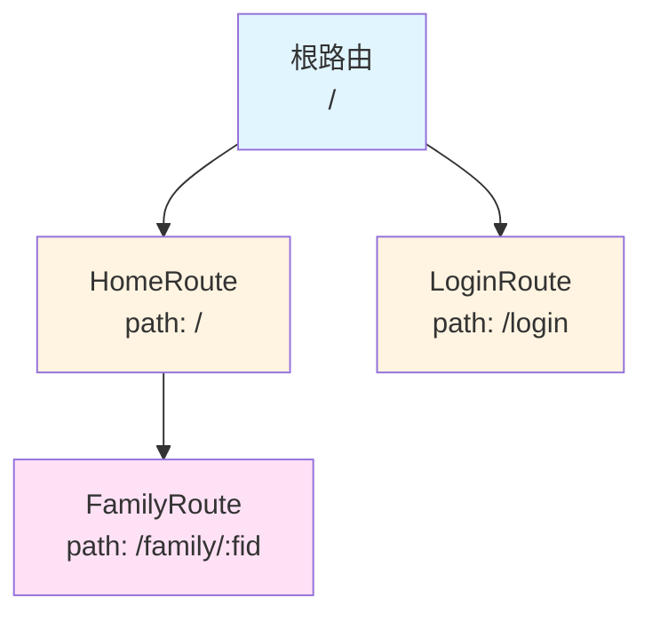
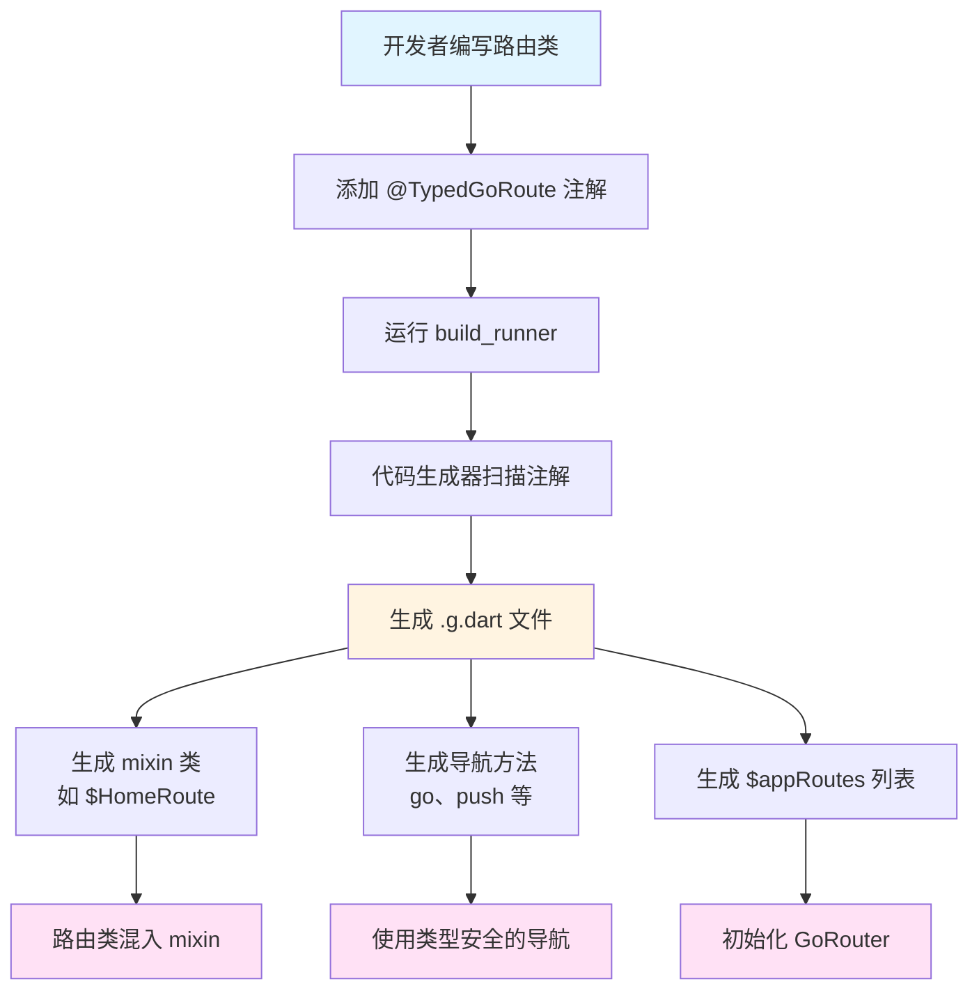

# 基础入门与概述

## 概述

`go_router_builder` 是一个为 Flutter 的 `go_router` 包提供类型安全路由的代码生成工具。它通过代码生成技术，将传统的字符串路由转换为类型安全的路由系统，让开发者在编译时就能发现路由错误，而不是等到运行时才发现问题。

### 核心价值

`go_router_builder` 解决了传统 `go_router` 使用中的几个关键问题：

1. **类型安全**：编译时检查路由参数类型，避免运行时错误
2. **代码生成**：自动生成路由导航代码，减少样板代码
3. **开发体验**：IDE 自动补全和类型检查，提升开发效率

## 为什么需要类型安全路由？

### 传统 go_router 的问题

在传统的 `go_router` 使用中，路由参数都是字符串类型，需要手动解析和类型转换：

```dart
GoRoute(
  path: ':familyId',
  builder: (BuildContext context, GoRouterState state) {
    // 需要手动解析字符串为整数
    final int familyId = int.parse(state.pathParameters['familyId']!);
    return FamilyScreen(familyId);
  },
);
```

这种方式存在以下问题：

1. **运行时错误**：如果传入的 `familyId` 不是数字（如 `'a42'`），程序会在运行时崩溃
2. **类型不安全**：编译器无法检查参数类型是否正确
3. **容易出错**：参数名称拼写错误、缺少必需参数等问题只能在运行时发现

### 类型安全路由的优势

使用 `go_router_builder` 后，路由参数在编译时就能得到类型检查：

```dart
// 编译时就会报错：缺少必需参数 'fid'
void errorTap() => const FamilyRoute().go(context);
```

这种方式的优势：

1. **编译时检查**：错误在编译阶段就能发现
2. **类型安全**：参数类型由 Dart 类型系统保证
3. **IDE 支持**：自动补全和类型提示
4. **减少样板代码**：自动生成导航方法

## 安装配置

### 添加依赖

在 `pubspec.yaml` 中添加以下依赖：

```yaml
dependencies:
  # ...along with your other dependencies
  go_router: ^16.2.0

dev_dependencies:
  # ...along with your other dev-dependencies
  build_runner: ^2.6.0
  go_router_builder: ^4.0.1
```

**依赖说明**：

- `go_router`：Flutter 的路由库，作为运行时依赖
- `build_runner`：代码生成工具，用于运行代码生成器
- `go_router_builder`：代码生成器，作为开发时依赖

### 源代码配置

在使用 `go_router_builder` 的文件中，需要：

1. 导入 `go_router` 包
2. 添加 `part"../readme-guide"` 指令引用生成的代码文件

```dart
import 'package:go_router/go_router.dart';

part '../readme-guide/readme_excerpts.g.dart';
```

**重要提示**：

- 生成的代码文件命名规则：`[源文件名].g.dart`
- 例如：`readme_excerpts.dart` 会生成 `readme_excerpts.g.dart`
- `part"../readme-guide"` 指令必须放在文件顶部，在导入语句之后

### 运行代码生成

使用 `build_runner` 生成代码：

```console
dart run build_runner build
```

**命令说明**：

- `build`：执行一次性构建
- 如果需要监听文件变化并自动重新生成，可以使用 `watch` 模式：

  ```console
  dart run build_runner watch
  ```

**生成的文件**：

代码生成器会创建 `.g.dart` 文件，包含：

- 路由的 mixin 类（如 `$HomeRoute`）
- 导航方法（`go`、`push` 等）
- 路由列表（`$appRoutes`）

## 基本路由定义

### GoRouteData 基类

所有路由类都必须继承 `GoRouteData` 并混入生成的 mixin：

```dart
class HomeRoute extends GoRouteData with $HomeRoute {
  const HomeRoute();

  @override
  Widget build(BuildContext context, GoRouterState state) => const HomeScreen();
}
```

**关键组件**：

1. **继承 `GoRouteData`**：提供路由的基础功能
2. **混入生成的 mixin**：`$HomeRoute` 是代码生成器创建的 mixin，提供类型安全的导航方法
3. **实现 `build` 方法**：返回该路由对应的 Widget

### build 方法

`build` 方法是路由的核心，它接收两个参数：

- `BuildContext context`：构建上下文
- `GoRouterState state`：路由状态，包含路径参数、查询参数等信息

```dart
@override
Widget build(BuildContext context, GoRouterState state) {
  // 可以访问 state.pathParameters 和 state.queryParameters
  return HomeScreen();
}
```

### 路由注解

使用 `@TypedGoRoute` 注解定义路由的路径和子路由：

```dart
@TypedGoRoute<HomeRoute>(
  path: '/',
  routes: <TypedGoRoute<GoRouteData>>[
    TypedGoRoute<FamilyRoute>(path: 'family/:fid'),
  ],
)
class HomeRoute extends GoRouteData with $HomeRoute {
  const HomeRoute();

  @override
  Widget build(BuildContext context, GoRouterState state) => const HomeScreen();
}
```

**注解参数说明**：

- `path`：路由路径，支持路径参数（如 `:fid`）
- `routes`：子路由列表，定义嵌套路由结构

## 路由树结构

### 路由树的概念

路由树是 Flutter 应用中所有路由的层次结构。`go_router_builder` 通过 `@TypedGoRoute` 注解的 `routes` 参数来定义路由树：



### 定义路由树

路由树通过在每个顶级路由的 `@TypedGoRoute` 注解中定义 `routes` 参数来构建：

```dart
@TypedGoRoute<HomeRoute>(
  path: '/',
  routes: <TypedGoRoute<GoRouteData>>[
    TypedGoRoute<FamilyRoute>(path: 'family/:fid'),
  ],
)
class HomeRoute extends GoRouteData with $HomeRoute {
  const HomeRoute();

  @override
  Widget build(BuildContext context, GoRouterState state) => const HomeScreen();
}

@TypedGoRoute<LoginRoute>(path: '/login')
class LoginRoute extends GoRouteData with $LoginRoute {
  LoginRoute({this.from});
  final String? from;

  @override
  Widget build(BuildContext context, GoRouterState state) {
    return LoginScreen(from: from);
  }
}
```

**路由树结构说明**：

- `HomeRoute` 是根路由（`path: '/'`）
- `FamilyRoute` 是 `HomeRoute` 的子路由（`path: 'family/:fid'`）
- 完整路径为：`/family/:fid`
- `LoginRoute` 是独立的顶级路由（`path: '/login'`）

### 路径参数

在路径中使用 `:参数名` 定义路径参数：

```dart
TypedGoRoute<FamilyRoute>(path: 'family/:fid')
```

这表示 `FamilyRoute` 需要一个名为 `fid` 的路径参数。

## GoRouter 初始化

### $appRoutes 列表

代码生成器会自动收集所有使用 `@TypedGoRoute` 注解的顶级路由，生成一个名为 `$appRoutes` 的列表：

```dart
final router = GoRouter(routes: $appRoutes);
```

**工作原理**：

1. 代码生成器扫描所有使用 `@TypedGoRoute` 注解的类
2. 将这些路由转换为 `GoRoute` 实例
3. 生成 `$appRoutes` 列表，包含所有路由配置

### 初始化 GoRouter

使用生成的 `$appRoutes` 初始化 `GoRouter`：

```dart
final router = GoRouter(routes: $appRoutes);
```

**完整示例**：

```dart
class App extends StatelessWidget {
  App({super.key});

  @override
  Widget build(BuildContext context) =>
      MaterialApp.router(routerConfig: _router, title: 'My App');

  final GoRouter _router = GoRouter(routes: $appRoutes);
}
```

## go_router_builder 工作流程

以下流程图展示了 `go_router_builder` 的完整工作流程：



## 实际应用场景

### 场景 1：简单的应用路由

对于简单的应用，只需要定义几个基本路由：

```dart
@TypedGoRoute<HomeRoute>(path: '/')
class HomeRoute extends GoRouteData with $HomeRoute {
  const HomeRoute();
  @override
  Widget build(BuildContext context, GoRouterState state) => const HomeScreen();
}

@TypedGoRoute<AboutRoute>(path: '/about')
class AboutRoute extends GoRouteData with $AboutRoute {
  const AboutRoute();
  @override
  Widget build(BuildContext context, GoRouterState state) => const AboutScreen();
}
```

### 场景 2：带参数的路由

如果需要传递参数，可以定义路径参数：

```dart
@TypedGoRoute<UserRoute>(path: '/user/:userId')
class UserRoute extends GoRouteData with $UserRoute {
  const UserRoute({required this.userId});
  final String userId;

  @override
  Widget build(BuildContext context, GoRouterState state) {
    return UserScreen(userId: userId);
  }
}
```

### 场景 3：嵌套路由

对于复杂的应用，可以使用嵌套路由：

```dart
@TypedGoRoute<ShopRoute>(
  path: '/shop',
  routes: <TypedGoRoute<GoRouteData>>[
    TypedGoRoute<ProductRoute>(path: 'product/:productId'),
    TypedGoRoute<CartRoute>(path: 'cart'),
  ],
)
class ShopRoute extends GoRouteData with $ShopRoute {
  const ShopRoute();
  @override
  Widget build(BuildContext context, GoRouterState state) => const ShopScreen();
}
```

## 常见问题

### Q1：为什么需要混入生成的 mixin？

**A**：生成的 mixin（如 `$HomeRoute`）包含了类型安全的导航方法和路由配置。混入这个 mixin 后，路由类才能使用 `go`、`push` 等方法，并且这些方法都是类型安全的。

### Q2：生成的 .g.dart 文件可以手动编辑吗？

**A**：不可以。`.g.dart` 文件是自动生成的，任何手动修改都会在下次代码生成时被覆盖。如果需要自定义行为，应该在路由类中实现，而不是修改生成的文件。

### Q3：如何查看生成的路由配置？

**A**：生成代码后，可以在 `.g.dart` 文件中查看 `$appRoutes` 的定义。这个列表包含了所有路由的配置信息。

### Q4：路由路径中的参数如何命名？

**A**：路径参数使用 `:参数名` 的格式，参数名应该与路由类构造函数中的参数名一致。例如，路径 `'family/:fid'` 对应构造函数参数 `fid`。

### Q5：可以同时使用传统 go_router 和 go_router_builder 吗？

**A**：可以，但不推荐。混合使用会导致代码不一致，增加维护难度。建议统一使用 `go_router_builder` 的类型安全路由。

## 延伸阅读

- [go_router 官方文档](https://pub.dev/packages/go_router)
- [build_runner 文档](https://pub.dev/packages/build_runner)
- [代码生成最佳实践](https://dart.dev/tools/build_runner)
- [迁移到 4.0.0 指南](https://flutter.dev/go/go-router-builder-v4-breaking-changes)
