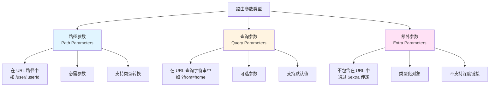
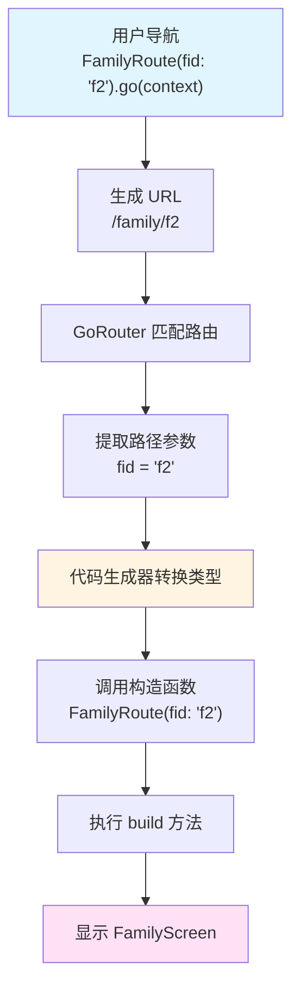
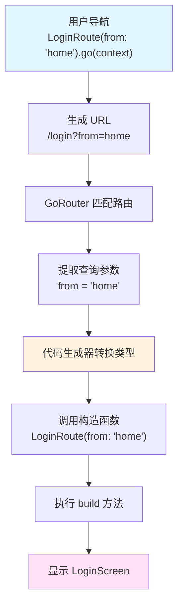
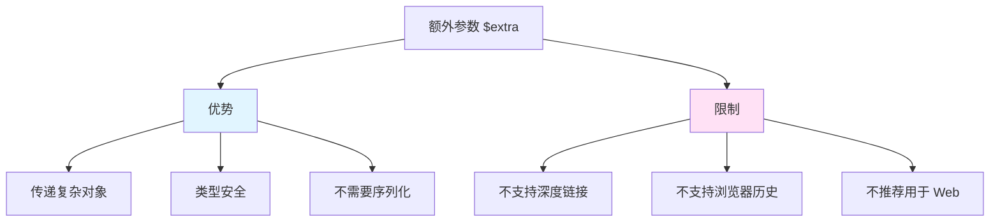
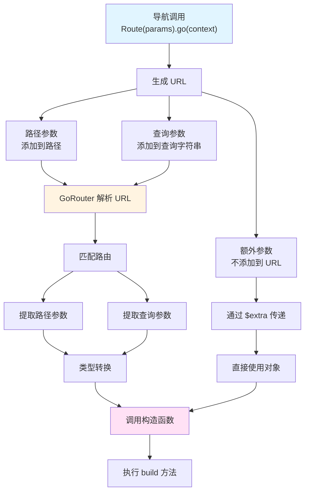

# 路由参数详解

## 概述

在 `go_router_builder` 中，路由参数是传递数据给路由页面的核心机制。根据参数在 URL 中的位置和传递方式，可以分为三种类型：**路径参数**（Path Parameters）、**查询参数**（Query Parameters）和**额外参数**（Extra Parameters）。理解这三种参数的区别和使用场景，是掌握 `go_router_builder` 的关键。

## 参数类型对比

### 三种参数类型



### 参数对比表

| 特性 | 路径参数 | 查询参数 | 额外参数 |
| --- | --- | --- | --- |
| URL 位置 | 路径中 | 查询字符串 | 不包含在 URL |
| 必需性 | 必需 | 可选 | 可选 |
| 类型转换 | 支持 | 支持 | 原生类型 |
| 默认值 | 不支持 | 支持 | 不支持 |
| 深度链接 | 支持 | 支持 | 不支持 |
| 浏览器历史 | 支持 | 支持 | 不支持 |

## 路径参数（Path Parameters）

### 基本概念

路径参数是 URL 路径的一部分，使用 `:参数名` 的格式定义。路径参数是**必需的**，必须在导航时提供。

### 定义路径参数

在 `@TypedGoRoute` 注解的 `path` 中使用 `:参数名` 定义路径参数：

```dart
@TypedGoRoute<FamilyRoute>(path: 'family/:fid')
class FamilyRoute extends GoRouteData with $FamilyRoute {
  const FamilyRoute({required this.fid});
  final String fid;

  @override
  Widget build(BuildContext context, GoRouterState state) {
    return FamilyScreen(familyId: fid);
  }
}
```

**关键点**：

1. 路径中使用 `:fid` 定义参数
2. 构造函数中必须有对应的 `fid` 参数
3. 参数类型可以是 `String`、`int`、`bool`、`enum` 等（需要类型转换支持）

### 多个路径参数

可以定义多个路径参数：

```dart
@TypedGoRoute<UserPostRoute>(path: '/user/:userId/post/:postId')
class UserPostRoute extends GoRouteData with $UserPostRoute {
  const UserPostRoute({
    required this.userId,
    required this.postId,
  });
  final String userId;
  final String postId;

  @override
  Widget build(BuildContext context, GoRouterState state) {
    return UserPostScreen(userId: userId, postId: postId);
  }
}
```

### 路径参数解析流程



### 实际应用示例

```dart
// 定义路由
@TypedGoRoute<ProductRoute>(path: '/product/:productId')
class ProductRoute extends GoRouteData with $ProductRoute {
  const ProductRoute({required this.productId});
  final String productId;

  @override
  Widget build(BuildContext context, GoRouterState state) {
    return ProductScreen(productId: productId);
  }
}

// 导航使用
void navigateToProduct() {
  const ProductRoute(productId: '123').go(context);
  // 生成的 URL: /product/123
}
```

## 查询参数（Query Parameters）

### 基本概念

查询参数是 URL 查询字符串中的参数，使用 `?key=value&key2=value2` 的格式。查询参数是**可选的**，可以设置默认值。

### 定义查询参数

查询参数通过路由类构造函数中**不在路径中定义**的参数来表示：

```dart
@TypedGoRoute<LoginRoute>(path: '/login')
class LoginRoute extends GoRouteData with $LoginRoute {
  LoginRoute({this.from});
  final String? from;

  @override
  Widget build(BuildContext context, GoRouterState state) {
    return LoginScreen(from: from);
  }
}
```

**关键点**：

1. `path` 中不包含 `from` 参数
2. 构造函数中有 `from` 参数（可选）
3. 自动识别为查询参数

### 查询参数默认值

对于**非空类型**的查询参数，可以设置默认值：

```dart
@TypedGoRoute<MyRoute>(path: '/my-route')
class MyRoute extends GoRouteData with $MyRoute {
  MyRoute({this.queryParameter = 'defaultValue'});
  final String queryParameter;

  @override
  Widget build(BuildContext context, GoRouterState state) {
    return MyScreen(queryParameter: queryParameter);
  }
}
```

**默认值行为**：

- 如果查询参数等于默认值，**不会包含在 URL 中**
- 例如：`MyRoute()` 生成的 URL 是 `/my-route`，而不是 `/my-route?queryParameter=defaultValue`

### 多个查询参数

可以定义多个查询参数：

```dart
@TypedGoRoute<SearchRoute>(path: '/search')
class SearchRoute extends GoRouteData with $SearchRoute {
  const SearchRoute({
    this.keyword,
    this.category,
    this.sortBy = 'relevance',
  });
  final String? keyword;
  final String? category;
  final String sortBy; // 有默认值

  @override
  Widget build(BuildContext context, GoRouterState state) {
    return SearchScreen(
      keyword: keyword,
      category: category,
      sortBy: sortBy,
    );
  }
}
```

### 查询参数解析流程



### 实际应用示例

```dart
// 定义路由
@TypedGoRoute<FilterRoute>(path: '/products')
class FilterRoute extends GoRouteData with $FilterRoute {
  const FilterRoute({
    this.category,
    this.minPrice,
    this.maxPrice,
    this.sortBy = 'price',
  });
  final String? category;
  final int? minPrice;
  final int? maxPrice;
  final String sortBy;

  @override
  Widget build(BuildContext context, GoRouterState state) {
    return FilterScreen(
      category: category,
      minPrice: minPrice,
      maxPrice: maxPrice,
      sortBy: sortBy,
    );
  }
}

// 导航使用
void navigateWithFilters() {
  const FilterRoute(
    category: 'electronics',
    minPrice: 100,
    sortBy: 'rating',
  ).go(context);
  // 生成的 URL: /products?category=electronics&minPrice=100&sortBy=rating
  // 注意：maxPrice 为 null，不包含在 URL 中
}
```

## 额外参数（Extra Parameters）

### 基本概念

额外参数使用特殊的 `$extra` 参数名，可以传递任意类型的对象。额外参数**不包含在 URL 中**，因此不支持深度链接和浏览器历史记录。

### 定义额外参数

使用 `$extra` 作为参数名定义额外参数：

```dart
@TypedGoRoute<PersonRouteWithExtra>(path: '/person')
class PersonRouteWithExtra extends GoRouteData with $PersonRouteWithExtra {
  PersonRouteWithExtra(this.$extra);
  final Person? $extra;

  @override
  Widget build(BuildContext context, GoRouterState state) {
    return PersonScreen(person: $extra);
  }
}
```

**关键点**：

1. 参数名必须是 `$extra`
2. 可以是任意类型（包括自定义类）
3. 可以是可空类型

### 传递额外参数

传递类型化的对象：

```dart
void tapWithExtra() {
  PersonRouteWithExtra(
    Person(id: 1, name: 'Marvin', age: 42),
  ).go(context);
}
```

### 额外参数的限制



**重要提示**：

- 额外参数不包含在 URL 中，因此：
  - 不支持深度链接（无法通过 URL 直接访问）
  - 不支持浏览器后退按钮恢复状态
  - **不推荐在 Flutter Web 应用中使用**

### 实际应用示例

```dart
// 定义数据模型
class Product {
  final String id;
  final String name;
  final double price;
  final String description;

  Product({
    required this.id,
    required this.name,
    required this.price,
    required this.description,
  });
}

// 定义路由
@TypedGoRoute<ProductDetailRoute>(path: '/product-detail')
class ProductDetailRoute extends GoRouteData with $ProductDetailRoute {
  ProductDetailRoute(this.$extra);
  final Product? $extra;

  @override
  Widget build(BuildContext context, GoRouterState state) {
    if ($extra == null) {
      return const ErrorScreen(message: 'Product not found');
    }
    return ProductDetailScreen(product: $extra!);
  }
}

// 导航使用
void navigateToProductDetail(Product product) {
  ProductDetailRoute(product).go(context);
  // URL 只是 /product-detail，不包含产品信息
}
```

## 混合参数使用

### 组合使用三种参数

可以在同一个路由中组合使用路径参数、查询参数和额外参数：

```dart
@TypedGoRoute<HotdogRouteWithEverything>(path: '/:ketchup')
class HotdogRouteWithEverything extends GoRouteData
    with $HotdogRouteWithEverything {
  HotdogRouteWithEverything(this.ketchup, this.mustard, this.$extra);
  final bool ketchup; // 路径参数
  final String? mustard; // 查询参数
  final Sauce $extra; // 额外参数

  @override
  Widget build(BuildContext context, GoRouterState state) {
    return HotdogScreen(ketchup, mustard, $extra);
  }
}
```

### 参数识别规则

代码生成器按照以下规则识别参数类型：

1. **路径参数**：在 `path` 中使用 `:参数名` 定义的参数
2. **查询参数**：构造函数中存在但不在 `path` 中定义的参数（且不是 `$extra`）
3. **额外参数**：参数名为 `$extra` 的参数

### 混合参数示例

```dart
@TypedGoRoute<ArticleRoute>(path: '/article/:articleId')
class ArticleRoute extends GoRouteData with $ArticleRoute {
  ArticleRoute({
    required this.articleId, // 路径参数
    this.highlight, // 查询参数
    this.$extra, // 额外参数
  });
  final String articleId;
  final String? highlight;
  final ArticleMetadata? $extra;

  @override
  Widget build(BuildContext context, GoRouterState state) {
    return ArticleScreen(
      articleId: articleId,
      highlight: highlight,
      metadata: $extra,
    );
  }
}

// 使用示例
void navigateToArticle() {
  ArticleRoute(
    articleId: '123',
    highlight: 'keyword',
    $extra: ArticleMetadata(author: 'John', publishDate: DateTime.now()),
  ).go(context);
  // URL: /article/123?highlight=keyword
  // $extra 不包含在 URL 中
}
```

## URL 参数解析流程

完整的 URL 参数解析流程如下：



## 参数类型转换

### 支持的类型

`go_router_builder` 支持以下类型的自动转换：

1. **基本类型**：`String`、`int`、`bool`
2. **枚举类型**：`enum`
3. **扩展类型**：`extension type`

### 类型转换示例

```dart
enum BookKind { all, popular, recent }

@TypedGoRoute<BooksRoute>(path: '/books')
class BooksRoute extends GoRouteData with $BooksRoute {
  BooksRoute({this.kind = BookKind.popular});
  final BookKind kind; // 枚举类型，自动转换

  @override
  Widget build(BuildContext context, GoRouterState state) {
    return BooksScreen(kind: kind);
  }
}

// 使用
void navigateToBooks() {
  const BooksRoute(kind: BookKind.recent).go(context);
  // URL: /books?kind=recent
}
```

关于类型转换的详细内容，请参考 [04-高级特性.md](04-高级特性.md)。

## 实际应用场景

### 场景 1：电商产品页面

```dart
@TypedGoRoute<ProductRoute>(path: '/product/:productId')
class ProductRoute extends GoRouteData with $ProductRoute {
  const ProductRoute({
    required this.productId, // 路径参数：产品 ID
    this.variant, // 查询参数：产品变体
    this.referrer, // 查询参数：来源
  });
  final String productId;
  final String? variant;
  final String? referrer;

  @override
  Widget build(BuildContext context, GoRouterState state) {
    return ProductScreen(
      productId: productId,
      variant: variant,
      referrer: referrer,
    );
  }
}
```

### 场景 2：搜索结果页面

```dart
@TypedGoRoute<SearchRoute>(path: '/search')
class SearchRoute extends GoRouteData with $SearchRoute {
  const SearchRoute({
    this.query, // 查询参数：搜索关键词
    this.category, // 查询参数：分类
    this.page = 1, // 查询参数：页码（有默认值）
    this.sortBy = 'relevance', // 查询参数：排序方式（有默认值）
  });
  final String? query;
  final String? category;
  final int page;
  final String sortBy;

  @override
  Widget build(BuildContext context, GoRouterState state) {
    return SearchScreen(
      query: query,
      category: category,
      page: page,
      sortBy: sortBy,
    );
  }
}
```

### 场景 3：表单编辑页面

```dart
@TypedGoRoute<EditFormRoute>(path: '/form/:formId')
class EditFormRoute extends GoRouteData with $EditFormRoute {
  EditFormRoute({
    required this.formId, // 路径参数：表单 ID
    this.mode = 'edit', // 查询参数：编辑模式
    this.$extra, // 额外参数：预填充数据
  });
  final String formId;
  final String mode;
  final FormData? $extra; // 复杂对象，使用额外参数

  @override
  Widget build(BuildContext context, GoRouterState state) {
    return EditFormScreen(
      formId: formId,
      mode: mode,
      initialData: $extra,
    );
  }
}
```

## 常见问题

### Q1：路径参数和查询参数有什么区别？

**A**：主要区别在于：

1. **位置**：路径参数在 URL 路径中（如 `/user/:userId`），查询参数在查询字符串中（如 `?from=home`）
2. **必需性**：路径参数是必需的，查询参数是可选的
3. **语义**：路径参数通常表示资源标识（如用户 ID），查询参数通常表示过滤或配置（如排序方式）

### Q2：什么时候使用额外参数？

**A**：额外参数适用于以下场景：

1. 传递复杂对象，不需要深度链接
2. 传递临时数据，不需要浏览器历史记录
3. 移动应用中的页面间数据传递

**注意**：在 Flutter Web 应用中，应避免使用额外参数，优先使用路径参数或查询参数。

### Q3：查询参数的默认值什么时候会省略？

**A**：当查询参数的值等于其默认值时，不会包含在生成的 URL 中。例如：

```dart
MyRoute(queryParameter: 'defaultValue') // URL: /my-route
MyRoute(queryParameter: 'otherValue')   // URL: /my-route?queryParameter=otherValue
```

### Q4：可以同时使用多个相同类型的参数吗？

**A**：可以。例如，可以定义多个查询参数：

```dart
SearchRoute(
  keyword: 'flutter',
  category: 'mobile',
  sortBy: 'date',
)
```

### Q5：路径参数可以是可选的吗？

**A**：不可以。路径参数必须是必需的，因为它们是 URL 路径的一部分。如果需要可选参数，应该使用查询参数。

## 延伸阅读

- [go_router 路径参数文档](https://pub.dev/documentation/go_router/latest/go_router/GoRouteData-class.html)
- [URL 参数最佳实践](https://restfulapi.net/resource-naming/)
- [类型转换详解](04-高级特性.md#类型转换)
