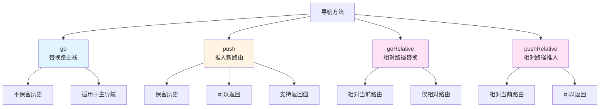
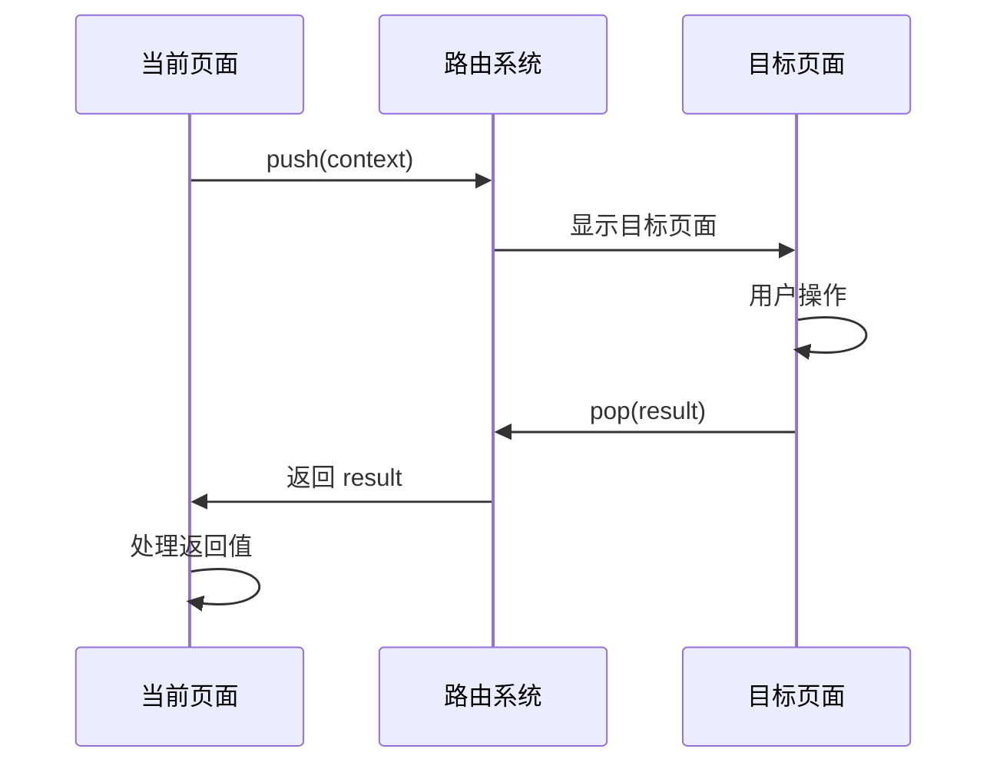
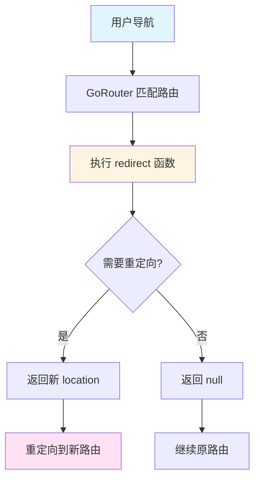
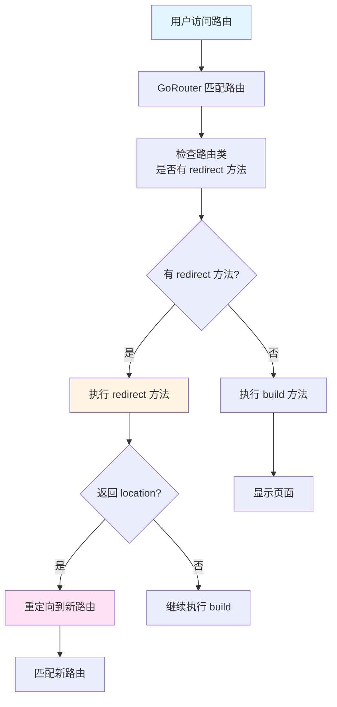
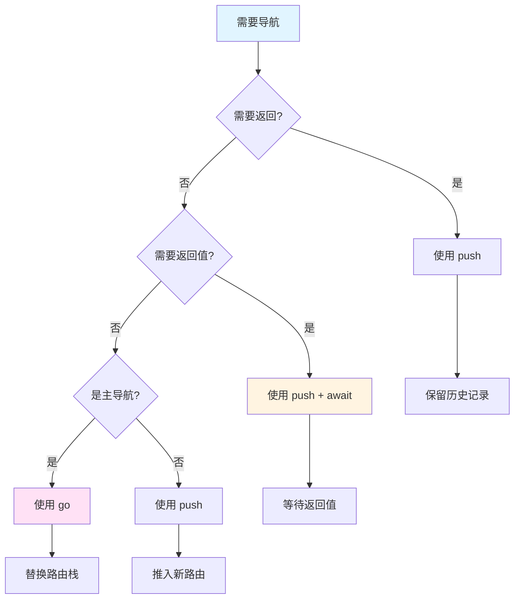

# 导航与重定向

## 概述

导航和重定向是路由系统的核心功能。`go_router_builder` 提供了类型安全的导航方法，让开发者可以在编译时检查导航参数的正确性。同时，它还支持路由返回值、全局重定向和路由级重定向等高级功能。

## 导航方法

### 基本导航方法

`go_router_builder` 为每个路由类自动生成以下导航方法：

1. **`go(context)`**：替换当前路由栈
2. **`push(context)`**：推入新路由到栈顶
3. **`goRelative(context)`**：相对路径导航（仅相对路由）
4. **`pushRelative(context)`**：相对路径推入（仅相对路由）

### go 方法

`go` 方法会**替换**当前路由栈，适用于不需要返回的场景：

```dart
void onTap() => const FamilyRoute(fid: 'f2').go(context);
```

**特点**：

- 替换整个路由栈
- 不保留历史记录
- 适用于主导航（如底部导航栏切换）

### push 方法

`push` 方法会**推入**新路由到栈顶，保留当前路由：

```dart
void onTap() => const FamilyRoute(fid: 'f2').push(context);
```

**特点**：

- 推入新路由到栈顶
- 保留历史记录
- 可以通过 `pop` 返回
- 适用于详情页、表单页等需要返回的场景

### 导航方法对比



### 类型安全的导航

`go_router_builder` 的核心优势是**类型安全**。如果导航时缺少必需参数或参数类型错误，编译器会立即报错：

```dart
// ✅ 正确：提供了必需的 fid 参数
void correctNavigation() {
  const FamilyRoute(fid: 'f2').go(context);
}

// ❌ 错误：缺少必需的 fid 参数
void errorNavigation() {
  const FamilyRoute().go(context); // 编译错误！
}
```

**编译时错误示例**：

```dart
// 编译错误：missing required parameter 'fid'
void errorTap() => const FamilyRoute().go(context);
```

这种类型检查在编译时就能发现错误，避免了运行时的崩溃。

## 返回值处理

### 基本概念

从 `go_router` 6.5.0 开始，`push` 方法支持返回值。当被推入的路由通过 `pop` 返回时，可以传递一个返回值给调用者。

### 使用 await push

使用 `await` 等待 `push` 方法返回结果：

```dart
final bool? result = await const FamilyRoute(
  fid: 'John',
).push<bool>(context);
```

**关键点**：

1. 使用 `await` 等待返回值
2. 指定返回类型（如 `<bool>`）
3. 返回值可能是 `null`（如果用户直接关闭页面）

### 返回值流程



### 实际应用示例

```dart
class HomeScreen extends StatelessWidget {
  const HomeScreen({super.key});

  @override
  Widget build(BuildContext context) {
    return Scaffold(
      appBar: AppBar(title: const Text('Home')),
      body: TextButton(
        onPressed: () async {
          // 推入编辑页面并等待结果
          final bool? saved = await const EditFormRoute(formId: '123')
              .push<bool>(context);
          
          if (saved == true) {
            // 用户保存了表单，刷新数据
            _refreshData();
          } else if (saved == false) {
            // 用户取消了编辑
            _showCancelMessage();
          }
          // saved == null 表示用户直接关闭了页面
        },
        child: const Text('Edit Form'),
      ),
    );
  }
}

class EditFormScreen extends StatelessWidget {
  const EditFormScreen({super.key});

  @override
  Widget build(BuildContext context) {
    return Scaffold(
      appBar: AppBar(title: const Text('Edit Form')),
      body: Column(
        children: [
          // 表单内容...
          ElevatedButton(
            onPressed: () {
              // 保存并返回 true
              context.pop<bool>(true);
            },
            child: const Text('Save'),
          ),
          ElevatedButton(
            onPressed: () {
              // 取消并返回 false
              context.pop<bool>(false);
            },
            child: const Text('Cancel'),
          ),
        ],
      ),
    );
  }
}
```

### 返回值的类型

返回值可以是任意类型：

```dart
// 返回字符串
final String? name = await const NameInputRoute().push<String>(context);

// 返回对象
final User? user = await const UserSelectRoute().push<User>(context);

// 返回列表
final List<String>? tags = await const TagSelectRoute().push<List<String>>(context);
```

## 全局重定向

### 基本概念

全局重定向是在 `GoRouter` 初始化时配置的重定向逻辑，适用于需要根据全局状态（如登录状态）决定路由的场景。

### 配置全局重定向

在 `GoRouter` 的 `redirect` 参数中配置重定向逻辑：

```dart
final routerWithRedirect = GoRouter(
  routes: $appRoutes,
  redirect: (BuildContext context, GoRouterState state) {
    final bool loggedIn = loginInfo.loggedIn;
    final loggingIn = state.matchedLocation == LoginRoute().location;
    
    if (!loggedIn && !loggingIn) {
      // 未登录且不在登录页，重定向到登录页
      return LoginRoute(from: state.matchedLocation).location;
    }
    
    if (loggedIn && loggingIn) {
      // 已登录但在登录页，重定向到首页
      return const HomeRoute().location;
    }
    
    // 不需要重定向
    return null;
  },
);
```

### 重定向流程



### 重定向的使用场景

1. **身份验证**：未登录用户重定向到登录页
2. **权限检查**：无权限用户重定向到错误页
3. **功能开关**：功能未启用时重定向到提示页
4. **数据加载**：数据未准备好时重定向到加载页

### 实际应用示例

```dart
class AppRouter {
  static GoRouter createRouter(AuthService authService) {
    return GoRouter(
      routes: $appRoutes,
      redirect: (BuildContext context, GoRouterState state) {
        final isLoggedIn = authService.isLoggedIn;
        final isLoggingIn = state.matchedLocation == LoginRoute().location;
        final isPublicRoute = _isPublicRoute(state.matchedLocation);

        // 公开路由，允许访问
        if (isPublicRoute) {
          return null;
        }

        // 未登录且不在登录页，重定向到登录页
        if (!isLoggedIn && !isLoggingIn) {
          return LoginRoute(from: state.matchedLocation).location;
        }

        // 已登录但在登录页，重定向到首页
        if (isLoggedIn && isLoggingIn) {
          return const HomeRoute().location;
        }

        return null;
      },
    );
  }

  static bool _isPublicRoute(String location) {
    return location == HomeRoute().location ||
        location == AboutRoute().location ||
        location == HelpRoute().location;
  }
}
```

## 路由级重定向

### 基本概念

路由级重定向是在特定路由类中实现的重定向逻辑，适用于该路由特有的重定向需求。

### 实现路由级重定向

在路由类中重写 `redirect` 方法：

```dart
class RedirectRoute extends GoRouteData {
  // 当 redirect 是无条件重定向时，不需要实现 build 方法
  @override
  String? redirect(BuildContext context, GoRouterState state) {
    return const HomeRoute().location;
  }
}
```

### 条件重定向

可以根据路由状态实现条件重定向：

```dart
@TypedGoRoute<OldProductRoute>(path: '/old-product/:id')
class OldProductRoute extends GoRouteData {
  OldProductRoute({required this.id});
  final String id;

  @override
  String? redirect(BuildContext context, GoRouterState state) {
    // 将旧的产品路由重定向到新的产品路由
    return ProductRoute(productId: id).location;
  }
}
```

### 路由级重定向流程



### 路由级重定向的使用场景

1. **URL 迁移**：将旧 URL 重定向到新 URL
2. **路由别名**：提供多个 URL 访问同一页面
3. **条件显示**：根据条件决定是否重定向
4. **数据验证**：数据无效时重定向到错误页

### 实际应用示例

```dart
// 场景 1：URL 迁移
@TypedGoRoute<LegacyUserRoute>(path: '/user/:userId')
class LegacyUserRoute extends GoRouteData {
  LegacyUserRoute({required this.userId});
  final String userId;

  @override
  String? redirect(BuildContext context, GoRouterState state) {
    // 将旧的 /user/:userId 重定向到新的 /profile/:userId
    return ProfileRoute(userId: userId).location;
  }
}

// 场景 2：条件重定向
@TypedGoRoute<ArticleRoute>(path: '/article/:articleId')
class ArticleRoute extends GoRouteData {
  ArticleRoute({required this.articleId});
  final String articleId;

  @override
  String? redirect(BuildContext context, GoRouterState state) {
    // 检查文章是否存在
    final article = articleService.getArticle(articleId);
    if (article == null) {
      // 文章不存在，重定向到 404 页
      return NotFoundRoute().location;
    }
    if (article.isDeleted) {
      // 文章已删除，重定向到已删除提示页
      return ArticleDeletedRoute(articleId: articleId).location;
    }
    // 文章存在且未删除，继续显示
    return null;
  }

  @override
  Widget build(BuildContext context, GoRouterState state) {
    return ArticleScreen(articleId: articleId);
  }
}
```

## 导航方法对比

### go vs push

| 特性 | go | push |
| --- | --- | --- |
| 路由栈 | 替换 | 推入 |
| 历史记录 | 不保留 | 保留 |
| 返回值 | 不支持 | 支持 |
| 适用场景 | 主导航切换 | 详情页、表单页 |
| 返回方式 | 无法返回 | 可以 pop 返回 |

### 导航方法选择指南



## 相对路由导航

### 基本概念

相对路由允许在路由树的不同位置重用相同的路由定义。使用 `goRelative` 和 `pushRelative` 方法进行相对路径导航。

### 定义相对路由

相对路由继承 `RelativeGoRouteData`：

```dart
@TypedRelativeGoRoute<DetailsRoute>(path: 'details')
class DetailsRoute extends RelativeGoRouteData with $DetailsRoute {
  const DetailsRoute();

  @override
  Widget build(BuildContext context, GoRouterState state) =>
      const DetailsScreen();
}
```

### 使用相对路由导航

```dart
void onTapRelative() => const DetailsRoute().goRelative(context);
```

**重要提示**：

- 相对路由导航方法**不是幂等的**
- 如果相对位置不匹配任何路由，会导致错误
- 相对路由的详细内容请参考 [04-高级特性.md](04-高级特性.md#相对路由)

## 实际应用场景

### 场景 1：主导航切换

使用 `go` 方法进行主导航切换（如底部导航栏）：

```dart
class BottomNavigation extends StatelessWidget {
  @override
  Widget build(BuildContext context) {
    return BottomNavigationBar(
      items: const [
        BottomNavigationBarItem(icon: Icon(Icons.home), label: 'Home'),
        BottomNavigationBarItem(icon: Icon(Icons.search), label: 'Search'),
        BottomNavigationBarItem(icon: Icon(Icons.profile), label: 'Profile'),
      ],
      onTap: (index) {
        switch (index) {
          case 0:
            const HomeRoute().go(context);
            break;
          case 1:
            const SearchRoute().go(context);
            break;
          case 2:
            const ProfileRoute().go(context);
            break;
        }
      },
    );
  }
}
```

### 场景 2：详情页导航

使用 `push` 方法导航到详情页：

```dart
class ProductListScreen extends StatelessWidget {
  @override
  Widget build(BuildContext context) {
    return ListView.builder(
      itemCount: products.length,
      itemBuilder: (context, index) {
        final product = products[index];
        return ListTile(
          title: Text(product.name),
          onTap: () {
            // 推入产品详情页
            ProductRoute(productId: product.id).push(context);
          },
        );
      },
    );
  }
}
```

### 场景 3：表单编辑与返回值

使用 `push` 和返回值处理表单编辑：

```dart
class TaskListScreen extends StatelessWidget {
  @override
  Widget build(BuildContext context) {
    return Scaffold(
      appBar: AppBar(title: const Text('Tasks')),
      body: ListView(
        children: tasks.map((task) {
          return ListTile(
            title: Text(task.title),
            onTap: () async {
              // 编辑任务并等待结果
              final Task? updatedTask = await EditTaskRoute(
                taskId: task.id,
                $extra: task,
              ).push<Task>(context);
              
              if (updatedTask != null) {
                // 更新任务列表
                _updateTask(updatedTask);
              }
            },
          );
        }).toList(),
      ),
    );
  }
}
```

### 场景 4：身份验证重定向

使用全局重定向处理身份验证：

```dart
GoRouter createRouter(AuthState authState) {
  return GoRouter(
    routes: $appRoutes,
    redirect: (context, state) {
      final isAuthenticated = authState.isAuthenticated;
      final isOnLoginPage = state.matchedLocation == LoginRoute().location;
      final isOnPublicPage = _isPublicPage(state.matchedLocation);

      // 公开页面，允许访问
      if (isOnPublicPage) {
        return null;
      }

      // 未认证且不在登录页，重定向到登录页
      if (!isAuthenticated && !isOnLoginPage) {
        return LoginRoute(from: state.matchedLocation).location;
      }

      // 已认证但在登录页，重定向到首页
      if (isAuthenticated && isOnLoginPage) {
        return const HomeRoute().location;
      }

      return null;
    },
  );
}
```

## 常见问题

### Q1：go 和 push 有什么区别？

**A**：主要区别：

- **go**：替换整个路由栈，不保留历史，适用于主导航切换
- **push**：推入新路由到栈顶，保留历史，可以返回，适用于详情页、表单页

### Q2：什么时候使用返回值？

**A**：当需要从目标页面获取结果时使用返回值，常见场景：

- 表单编辑：返回是否保存成功
- 选择页面：返回用户选择的内容
- 确认对话框：返回用户的选择

### Q3：重定向和导航有什么区别？

**A**：

- **导航**：用户主动触发的路由跳转（如点击按钮）
- **重定向**：系统自动触发的路由跳转（如身份验证、权限检查）

### Q4：全局重定向和路由级重定向如何选择？

**A**：

- **全局重定向**：适用于所有路由都需要检查的场景（如身份验证）
- **路由级重定向**：适用于特定路由的特殊处理（如 URL 迁移、条件显示）

### Q5：返回值可以是 null 吗？

**A**：可以。如果用户直接关闭页面（如点击返回按钮），返回值会是 `null`。应该始终检查返回值是否为 `null`。

## 延伸阅读

- [go_router 导航文档](https://pub.dev/documentation/go_router/latest/go_router/GoRouter-class.html)
- [Flutter 导航最佳实践](https://docs.flutter.dev/development/ui/navigation)
- [相对路由详解](04-高级特性.md#相对路由)
