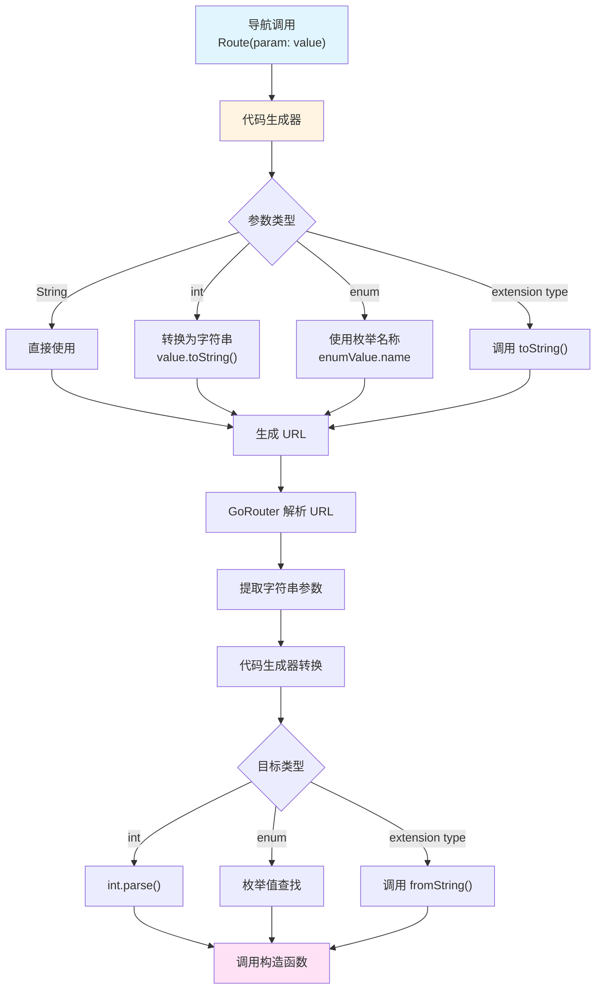
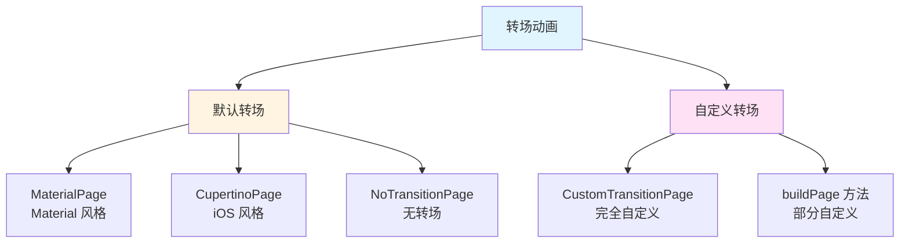
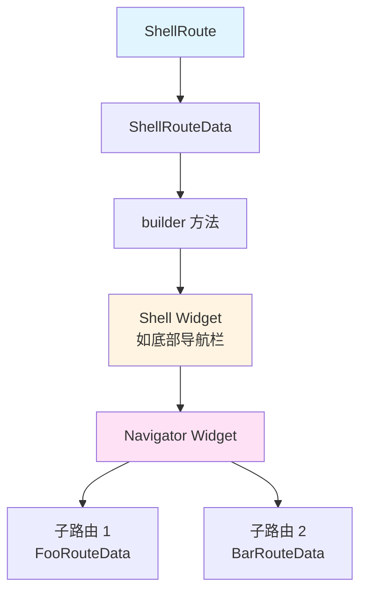
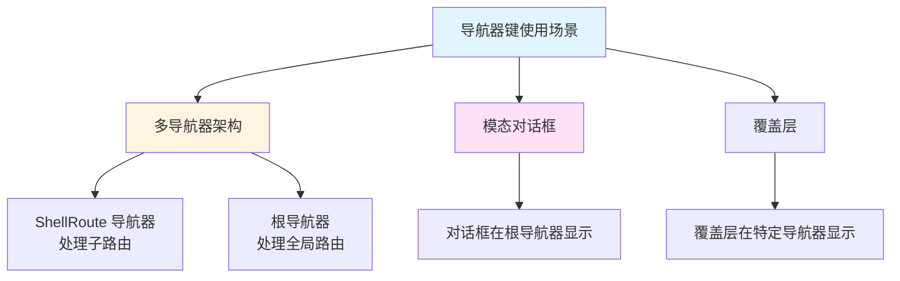
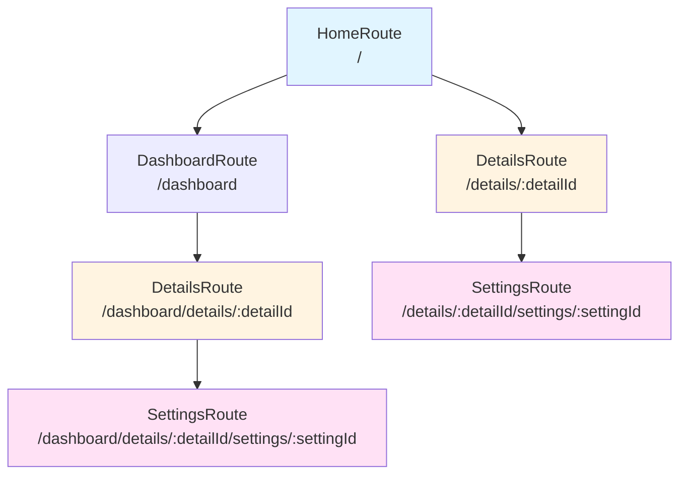

# 高级特性

## 概述

`go_router_builder` 提供了许多高级特性，包括类型转换、自定义转场动画、ShellRoute 支持和相对路由等。这些特性让路由系统更加灵活和强大，能够满足复杂应用的需求。

## 类型转换

### 基本概念

`go_router_builder` 支持将 URL 中的字符串参数自动转换为 Dart 类型，包括 `int`、`enum` 和 `extension type`。这大大简化了参数处理，无需手动解析字符串。

### 支持的类型

代码生成器支持以下类型的自动转换：

1. **基本类型**：`int`、`bool`
2. **枚举类型**：`enum`
3. **扩展类型**：`extension type`

### int 类型转换

路径参数和查询参数都可以使用 `int` 类型：

```dart
@TypedGoRoute<UserRoute>(path: '/user/:userId')
class UserRoute extends GoRouteData with $UserRoute {
  const UserRoute({required this.userId});
  final int userId; // 自动从字符串转换为 int

  @override
  Widget build(BuildContext context, GoRouterState state) {
    return UserScreen(userId: userId);
  }
}

// 使用
void navigateToUser() {
  const UserRoute(userId: 123).go(context);
  // URL: /user/123
  // 代码生成器自动将 123 转换为字符串 "123"
}
```

### enum 类型转换

枚举类型在路径参数和查询参数中都支持：

```dart
enum BookKind { all, popular, recent }

@TypedGoRoute<BooksRoute>(path: '/books')
class BooksRoute extends GoRouteData with $BooksRoute {
  BooksRoute({this.kind = BookKind.popular});
  final BookKind kind; // 枚举类型，自动转换

  @override
  Widget build(BuildContext context, GoRouterState state) {
    return BooksScreen(kind: kind);
  }
}

// 使用
void navigateToBooks() {
  const BooksRoute(kind: BookKind.recent).go(context);
  // URL: /books?kind=recent
  // 代码生成器自动将枚举值转换为字符串
}
```

**枚举转换规则**：

- 枚举值名称直接作为字符串使用
- 例如：`BookKind.popular` → `"popular"`
- 解析时，字符串必须完全匹配枚举值名称

### extension type 类型转换

扩展类型（Dart 3.2+）也支持自动转换：

```dart
extension type UserId(int value) {
  UserId.fromString(String str) : value = int.parse(str);
  String toString() => value.toString();
}

@TypedGoRoute<UserRoute>(path: '/user/:userId')
class UserRoute extends GoRouteData with $UserRoute {
  const UserRoute({required this.userId});
  final UserId userId; // 扩展类型，自动转换

  @override
  Widget build(BuildContext context, GoRouterState state) {
    return UserScreen(userId: userId);
  }
}
```

### 类型转换流程



### 类型转换错误处理

如果类型转换失败（如字符串无法解析为 `int`），`go_router` 会触发错误处理机制。建议在路由的 `build` 方法中进行适当的错误处理：

```dart
@TypedGoRoute<UserRoute>(path: '/user/:userId')
class UserRoute extends GoRouteData with $UserRoute {
  const UserRoute({required this.userId});
  final int userId;

  @override
  Widget build(BuildContext context, GoRouterState state) {
    // 如果 userId 无效，可以显示错误页面
    if (userId <= 0) {
      return ErrorScreen(message: 'Invalid user ID');
    }
    return UserScreen(userId: userId);
  }
}
```

## 转场动画

### 基本概念

转场动画控制页面切换时的视觉效果。`go_router_builder` 支持使用默认转场和自定义转场。

### 默认转场

默认情况下，`GoRouter` 会根据应用类型自动选择转场动画：

- `MaterialApp` → `MaterialPage`
- `CupertinoApp` → `CupertinoPage`
- `WidgetsApp` → `NoTransitionPage`

默认转场还会自动设置：

- `key`：使用 `state.pageKey`
- `restorationId`：使用 `state.pageKey` 的值

### 覆盖 buildPage 方法

如果需要自定义页面创建方式（如使用自定义 key 或不同的页面类型），可以重写 `buildPage` 方法而不是 `build` 方法：

```dart
@TypedGoRoute<MyMaterialRouteWithKey>(path: '/my-material-route-with-key')
class MyMaterialRouteWithKey extends GoRouteData with $MyMaterialRouteWithKey {
  const MyMaterialRouteWithKey();
  static const LocalKey _key = ValueKey<String>('my-route-with-key');
  
  @override
  MaterialPage<void> buildPage(BuildContext context, GoRouterState state) {
    return const MaterialPage<void>(key: _key, child: MyPage());
  }
}
```

**关键点**：

1. 返回类型必须是 `Page` 的子类
2. 可以访问 `state` 获取路由状态
3. 可以设置自定义 `key` 和其他页面属性

### 自定义转场动画

使用 `CustomTransitionPage` 创建自定义转场动画：

```dart
@TypedGoRoute<FancyRoute>(path: '/fancy')
class FancyRoute extends GoRouteData with $FancyRoute {
  const FancyRoute();
  
  @override
  CustomTransitionPage<void> buildPage(
    BuildContext context,
    GoRouterState state,
  ) {
    return CustomTransitionPage<void>(
      key: state.pageKey,
      child: const MyPage(),
      transitionsBuilder: (
        BuildContext context,
        Animation<double> animation,
        Animation<double> secondaryAnimation,
        Widget child,
      ) {
        return RotationTransition(turns: animation, child: child);
      },
    );
  }
}
```

**自定义转场组件**：

- `transitionsBuilder`：定义转场动画
- `transitionDuration`：转场持续时间（可选）
- `reverseTransitionDuration`：反向转场持续时间（可选）
- `opaque`：是否不透明（可选）

### 转场动画类型



### 实际应用示例

#### 示例 1：淡入淡出转场

```dart
@TypedGoRoute<FadeRoute>(path: '/fade')
class FadeRoute extends GoRouteData with $FadeRoute {
  const FadeRoute();
  
  @override
  CustomTransitionPage<void> buildPage(
    BuildContext context,
    GoRouterState state,
  ) {
    return CustomTransitionPage<void>(
      key: state.pageKey,
      child: const FadeScreen(),
      transitionsBuilder: (context, animation, secondaryAnimation, child) {
        return FadeTransition(
          opacity: animation,
          child: child,
        );
      },
      transitionDuration: const Duration(milliseconds: 300),
    );
  }
}
```

#### 示例 2：滑动转场

```dart
@TypedGoRoute<SlideRoute>(path: '/slide')
class SlideRoute extends GoRouteData with $SlideRoute {
  const SlideRoute();
  
  @override
  CustomTransitionPage<void> buildPage(
    BuildContext context,
    GoRouterState state,
  ) {
    return CustomTransitionPage<void>(
      key: state.pageKey,
      child: const SlideScreen(),
      transitionsBuilder: (context, animation, secondaryAnimation, child) {
        const begin = Offset(1.0, 0.0);
        const end = Offset.zero;
        const curve = Curves.ease;

        var tween = Tween(begin: begin, end: end).chain(
          CurveTween(curve: curve),
        );

        return SlideTransition(
          position: animation.drive(tween),
          child: child,
        );
      },
    );
  }
}
```

#### 示例 3：缩放转场

```dart
@TypedGoRoute<ScaleRoute>(path: '/scale')
class ScaleRoute extends GoRouteData with $ScaleRoute {
  const ScaleRoute();
  
  @override
  CustomTransitionPage<void> buildPage(
    BuildContext context,
    GoRouterState state,
  ) {
    return CustomTransitionPage<void>(
      key: state.pageKey,
      child: const ScaleScreen(),
      transitionsBuilder: (context, animation, secondaryAnimation, child) {
        return ScaleTransition(
          scale: animation,
          child: child,
        );
      },
    );
  }
}
```

## TypedShellRoute 和导航器键

### 基本概念

`TypedShellRoute` 允许创建包含多个子路由的容器路由，常用于实现底部导航栏、侧边栏等 UI 模式。导航器键（Navigator Keys）允许子路由在不同的导航器中显示。

### 定义 ShellRoute

使用 `@TypedShellRoute` 注解定义 ShellRoute：

```dart
@TypedShellRoute<MyShellRouteData>(
  routes: <TypedRoute<RouteData>>[
    TypedGoRoute<FooRouteData>(path: '/foo'),
    TypedGoRoute<BarRouteData>(path: '/bar'),
  ],
)
class MyShellRouteData extends ShellRouteData {
  const MyShellRouteData();

  @override
  Widget builder(BuildContext context, GoRouterState state, Widget navigator) {
    return MyShellRouteScreen(child: navigator);
  }
}
```

**关键组件**：

1. `@TypedShellRoute`：定义 ShellRoute 和子路由
2. `ShellRouteData`：ShellRoute 数据类
3. `builder` 方法：返回包含 `navigator` 的 Widget

### ShellRoute 架构



### 导航器键

在某些场景下，子路由需要显示在不同的导航器中。可以通过定义静态导航器键来实现：

#### ShellRoute 的导航器键

使用 `$navigatorKey` 为 ShellRoute 指定导航器：

```dart
final GlobalKey<NavigatorState> shellNavigatorKey = GlobalKey<NavigatorState>();

@TypedShellRoute<MyShellRouteData>(
  routes: <TypedRoute<RouteData>>[
    TypedGoRoute<MyGoRouteData>(path: 'my-go-route'),
  ],
)
class MyShellRouteData extends ShellRouteData {
  const MyShellRouteData();

  static final GlobalKey<NavigatorState> $navigatorKey = shellNavigatorKey;

  @override
  Widget builder(BuildContext context, GoRouterState state, Widget navigator) {
    return MyShellRoutePage(navigator);
  }
}
```

#### GoRoute 的父导航器键

使用 `$parentNavigatorKey` 为 GoRoute 指定父导航器：

```dart
final GlobalKey<NavigatorState> rootNavigatorKey = GlobalKey<NavigatorState>();

class MyGoRouteData extends GoRouteData with $MyGoRouteData {
  const MyGoRouteData();

  static final GlobalKey<NavigatorState> $parentNavigatorKey = rootNavigatorKey;

  @override
  Widget build(BuildContext context, GoRouterState state) => const MyPage();
}
```

### 导航器键使用场景



### 实际应用示例

#### 示例 1：底部导航栏

```dart
@TypedShellRoute<MainShellRoute>(
  routes: <TypedRoute<RouteData>>[
    TypedGoRoute<HomeRouteData>(path: '/home'),
    TypedGoRoute<SearchRouteData>(path: '/search'),
    TypedGoRoute<ProfileRouteData>(path: '/profile'),
  ],
)
class MainShellRoute extends ShellRouteData {
  const MainShellRoute();

  @override
  Widget builder(BuildContext context, GoRouterState state, Widget navigator) {
    return MainShellScreen(child: navigator);
  }
}

class MainShellScreen extends StatelessWidget {
  const MainShellScreen({required this.child, super.key});
  final Widget child;

  int _getCurrentIndex(BuildContext context) {
    final location = GoRouterState.of(context).uri.path;
    if (location == '/search') return 1;
    if (location == '/profile') return 2;
    return 0;
  }

  @override
  Widget build(BuildContext context) {
    return Scaffold(
      body: child,
      bottomNavigationBar: BottomNavigationBar(
        currentIndex: _getCurrentIndex(context),
        items: const [
          BottomNavigationBarItem(icon: Icon(Icons.home), label: 'Home'),
          BottomNavigationBarItem(icon: Icon(Icons.search), label: 'Search'),
          BottomNavigationBarItem(icon: Icon(Icons.person), label: 'Profile'),
        ],
        onTap: (index) {
          switch (index) {
            case 0:
              const HomeRouteData().go(context);
              break;
            case 1:
              const SearchRouteData().go(context);
              break;
            case 2:
              const ProfileRouteData().go(context);
              break;
          }
        },
      ),
    );
  }
}
```

## 相对路由

### 基本概念

相对路由允许在路由树的不同位置重用相同的路由定义。这对于需要在多个父路由下使用相同子路由的场景非常有用。

### 定义相对路由

相对路由继承 `RelativeGoRouteData` 并使用 `@TypedRelativeGoRoute` 注解：

```dart
@TypedRelativeGoRoute<DetailsRoute>(path: 'details')
class DetailsRoute extends RelativeGoRouteData with $DetailsRoute {
  const DetailsRoute();

  @override
  Widget build(BuildContext context, GoRouterState state) =>
      const DetailsScreen();
}
```

### 在多个位置使用相对路由

相对路由可以在路由树的不同位置使用：

```dart
const TypedRelativeGoRoute<DetailsRoute> detailRoute =
    TypedRelativeGoRoute<DetailsRoute>(
      path: 'details/:detailId',
      routes: <TypedRoute<RouteData>>[
        TypedRelativeGoRoute<SettingsRoute>(path: 'settings/:settingId'),
      ],
    );

@TypedGoRoute<HomeRoute>(
  path: '/',
  routes: <TypedRoute<RouteData>>[
    TypedGoRoute<DashboardRoute>(
      path: '/dashboard',
      routes: <TypedRoute<RouteData>>[detailRoute],
    ),
    detailRoute, // 在多个位置使用
  ],
)
class HomeRoute extends GoRouteData with $HomeRoute {
  @override
  Widget build(BuildContext context, GoRouterState state) {
    return const HomeScreen();
  }
}
```

### 相对路由导航

使用 `goRelative` 或 `pushRelative` 进行相对路径导航：

```dart
void onTapRelative() => const DetailsRoute(detailId: '123').goRelative(context);
```

**重要提示**：

- 相对路由导航方法**不是幂等的**
- 如果相对位置不匹配任何路由，会导致错误
- 相对路由的完整路径取决于当前路由位置

### 相对路由结构



### 相对路由的优势

1. **代码复用**：同一个路由定义可以在多个位置使用
2. **维护简单**：修改路由定义时，所有使用位置都会更新
3. **灵活性**：根据当前路由位置自动计算完整路径

### 相对路由的限制

1. **非幂等性**：相对导航方法不是幂等的，可能在不同位置产生不同结果
2. **路径依赖**：相对路径依赖于当前路由位置
3. **调试困难**：相对路径可能不如绝对路径直观

### 实际应用示例

```dart
// 定义相对路由
const TypedRelativeGoRoute<EditRoute> editRoute =
    TypedRelativeGoRoute<EditRoute>(path: 'edit/:itemId');

// 在用户路由下使用
@TypedGoRoute<UserRoute>(
  path: '/user/:userId',
  routes: <TypedRoute<RouteData>>[editRoute],
)
class UserRoute extends GoRouteData with $UserRoute {
  const UserRoute({required this.userId});
  final String userId;
  // ...
}

// 在产品路由下使用
@TypedGoRoute<ProductRoute>(
  path: '/product/:productId',
  routes: <TypedRoute<RouteData>>[editRoute],
)
class ProductRoute extends GoRouteData with $ProductRoute {
  const ProductRoute({required this.productId});
  final String productId;
  // ...
}

// 使用相对路由导航
void navigateToEdit(String itemId) {
  // 从 UserRoute 调用：/user/:userId/edit/:itemId
  // 从 ProductRoute 调用：/product/:productId/edit/:itemId
  const EditRoute(itemId: itemId).goRelative(context);
}
```

## 实际应用场景

### 场景 1：电商应用

```dart
// 使用枚举类型表示产品分类
enum ProductCategory { electronics, clothing, books }

@TypedGoRoute<ProductListRoute>(path: '/products')
class ProductListRoute extends GoRouteData with $ProductListRoute {
  const ProductListRoute({
    this.category,
    this.sortBy = 'price',
  });
  final ProductCategory? category; // 枚举类型
  final String sortBy;

  @override
  Widget build(BuildContext context, GoRouterState state) {
    return ProductListScreen(category: category, sortBy: sortBy);
  }
}

// 使用自定义转场
@TypedGoRoute<ProductDetailRoute>(path: '/product/:productId')
class ProductDetailRoute extends GoRouteData with $ProductDetailRoute {
  const ProductDetailRoute({required this.productId});
  final int productId; // int 类型自动转换

  @override
  CustomTransitionPage<void> buildPage(
    BuildContext context,
    GoRouterState state,
  ) {
    return CustomTransitionPage<void>(
      key: state.pageKey,
      child: ProductDetailScreen(productId: productId),
      transitionsBuilder: (context, animation, secondaryAnimation, child) {
        return SlideTransition(
          position: Tween<Offset>(
            begin: const Offset(1.0, 0.0),
            end: Offset.zero,
          ).animate(animation),
          child: child,
        );
      },
    );
  }
}
```

### 场景 2：社交媒体应用

```dart
// 使用 ShellRoute 实现底部导航
@TypedShellRoute<MainShellRoute>(
  routes: <TypedRoute<RouteData>>[
    TypedGoRoute<FeedRouteData>(path: '/feed'),
    TypedGoRoute<ExploreRouteData>(path: '/explore'),
    TypedGoRoute<MessagesRouteData>(path: '/messages'),
    TypedGoRoute<ProfileRouteData>(path: '/profile'),
  ],
)
class MainShellRoute extends ShellRouteData {
  const MainShellRoute();

  @override
  Widget builder(BuildContext context, GoRouterState state, Widget navigator) {
    return MainShellScreen(child: navigator);
  }
}
```

## 常见问题

### Q1：类型转换失败会怎样？

**A**：如果类型转换失败（如字符串无法解析为 `int`），`go_router` 会触发错误处理。建议在路由的 `build` 方法中进行适当的错误处理，或使用全局错误构建器。

### Q2：可以混合使用默认转场和自定义转场吗？

**A**：可以。不同的路由可以使用不同的转场方式。默认情况下使用默认转场，需要自定义时重写 `buildPage` 方法。

### Q3：ShellRoute 和普通路由有什么区别？

**A**：主要区别：

- **ShellRoute**：包含多个子路由的容器，常用于实现底部导航栏等 UI 模式
- **普通路由**：单一页面路由

### Q4：相对路由什么时候使用？

**A**：相对路由适用于需要在多个父路由下使用相同子路由的场景，如编辑页面、详情页面等。

### Q5：导航器键是必需的吗？

**A**：不是。只有在需要将路由显示在不同导航器中时才需要定义导航器键。大多数情况下，使用默认导航器即可。

## 延伸阅读

- [go_router ShellRoute 文档](https://pub.dev/documentation/go_router/latest/go_router/ShellRoute-class.html)
- [Flutter 转场动画指南](https://docs.flutter.dev/development/ui/animations)
- [Dart 扩展类型文档](https://dart.dev/language/extension-types)
