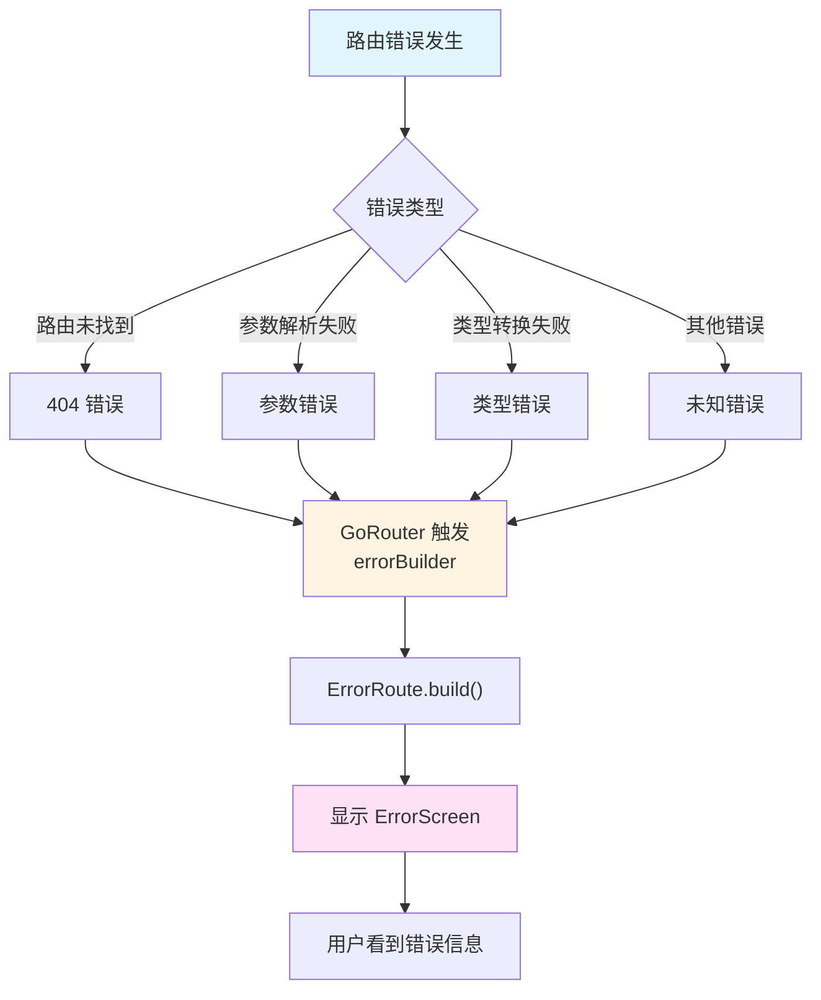

# 错误处理与最佳实践

## 概述

错误处理和最佳实践是构建健壮 Flutter 应用的关键。`go_router_builder` 提供了错误构建器机制，同时遵循一些最佳实践可以确保路由系统的稳定性和可维护性。

## 错误构建器

### 基本概念

错误构建器（Error Builder）用于处理路由错误，如路由未找到、参数解析失败等情况。使用类型安全的路由类可以创建统一的错误处理机制。

### 定义错误路由

创建一个专门的路由类来处理错误：

```dart
class ErrorRoute extends GoRouteData {
  ErrorRoute({required this.error});
  final Exception error;

  @override
  Widget build(BuildContext context, GoRouterState state) {
    return ErrorScreen(error: error);
  }
}
```

**关键点**：

1. 错误路由不需要 `@TypedGoRoute` 注解（因为它不会被自动注册）
2. 通过构造函数接收错误信息
3. 在 `build` 方法中显示错误界面

### 配置错误构建器

在 `GoRouter` 初始化时配置 `errorBuilder`：

```dart
final routerWithErrorBuilder = GoRouter(
  routes: $appRoutes,
  errorBuilder: (BuildContext context, GoRouterState state) {
    return ErrorRoute(error: state.error!).build(context, state);
  },
);
```

### 错误处理流程



### 错误类型处理

可以根据不同的错误类型显示不同的错误界面：

```dart
class ErrorRoute extends GoRouteData {
  ErrorRoute({required this.error});
  final Exception error;

  @override
  Widget build(BuildContext context, GoRouterState state) {
    if (error is GoException) {
      final goError = error as GoException;
      if (goError.type == GoExceptionType.matchedLocation) {
        // 路由未找到
        return NotFoundScreen(message: '页面未找到');
      } else if (goError.type == GoExceptionType.uri) {
        // URI 解析错误
        return ErrorScreen(message: 'URL 格式错误');
      }
    }
    // 其他错误
    return ErrorScreen(error: error);
  }
}
```

### 实际应用示例

```dart
class AppErrorRoute extends GoRouteData {
  AppErrorRoute({
    required this.error,
    this.errorType,
  });
  final Exception error;
  final ErrorType? errorType;

  @override
  Widget build(BuildContext context, GoRouterState state) {
    return ErrorScreen(
      error: error,
      errorType: errorType ?? _detectErrorType(error),
      onRetry: () {
        // 重试逻辑
        const HomeRoute().go(context);
      },
    );
  }

  ErrorType _detectErrorType(Exception error) {
    if (error is GoException) {
      switch (error.type) {
        case GoExceptionType.matchedLocation:
          return ErrorType.notFound;
        case GoExceptionType.uri:
          return ErrorType.invalidUrl;
        default:
          return ErrorType.unknown;
      }
    }
    return ErrorType.unknown;
  }
}

enum ErrorType { notFound, invalidUrl, network, unknown }

class ErrorScreen extends StatelessWidget {
  const ErrorScreen({
    required this.error,
    required this.errorType,
    this.onRetry,
    super.key,
  });

  final Exception error;
  final ErrorType errorType;
  final VoidCallback? onRetry;

  @override
  Widget build(BuildContext context) {
    return Scaffold(
      appBar: AppBar(title: const Text('错误')),
      body: Center(
        child: Column(
          mainAxisAlignment: MainAxisAlignment.center,
          children: [
            Icon(
              _getErrorIcon(),
              size: 64,
              color: Colors.red,
            ),
            const SizedBox(height: 16),
            Text(
              _getErrorTitle(),
              style: Theme.of(context).textTheme.headlineSmall,
            ),
            const SizedBox(height: 8),
            Text(
              _getErrorMessage(),
              style: Theme.of(context).textTheme.bodyMedium,
              textAlign: TextAlign.center,
            ),
            if (onRetry != null) ...[
              const SizedBox(height: 24),
              ElevatedButton(
                onPressed: onRetry,
                child: const Text('重试'),
              ),
            ],
          ],
        ),
      ),
    );
  }

  IconData _getErrorIcon() {
    switch (errorType) {
      case ErrorType.notFound:
        return Icons.error_outline;
      case ErrorType.invalidUrl:
        return Icons.link_off;
      case ErrorType.network:
        return Icons.wifi_off;
      case ErrorType.unknown:
        return Icons.warning;
    }
  }

  String _getErrorTitle() {
    switch (errorType) {
      case ErrorType.notFound:
        return '页面未找到';
      case ErrorType.invalidUrl:
        return 'URL 格式错误';
      case ErrorType.network:
        return '网络错误';
      case ErrorType.unknown:
        return '发生错误';
    }
  }

  String _getErrorMessage() {
    switch (errorType) {
      case ErrorType.notFound:
        return '抱歉，您访问的页面不存在。';
      case ErrorType.invalidUrl:
        return 'URL 格式不正确，请检查链接。';
      case ErrorType.network:
        return '网络连接失败，请检查网络设置。';
      case ErrorType.unknown:
        return error.toString();
    }
  }
}
```

## 测试

### 单元测试

测试路由定义和导航逻辑：

```dart
void main() {
  group('路由测试', () {
    test('HomeRoute 路径正确', () {
      const route = HomeRoute();
      expect(route.location, '/');
    });

    test('FamilyRoute 包含路径参数', () {
      const route = FamilyRoute(fid: 'f1');
      expect(route.location, '/family/f1');
    });

    test('LoginRoute 包含查询参数', () {
      final route = LoginRoute(from: '/home');
      expect(route.location, '/login?from=%2Fhome');
    });
  });
}
```

### 集成测试

测试完整的路由流程：

```dart
void main() {
  testWidgets('导航到产品详情页', (WidgetTester tester) async {
    await tester.pumpWidget(
      MaterialApp.router(
        routerConfig: GoRouter(routes: $appRoutes),
      ),
    );

    // 导航到产品详情页
    final context = tester.element(find.byType(MaterialApp));
    const ProductRoute(productId: '123').go(context);

    await tester.pumpAndSettle();

    // 验证页面显示
    expect(find.text('Product 123'), findsOneWidget);
  });
}
```

### 路由测试最佳实践

1. **测试路径生成**：验证路由生成的 URL 是否正确
2. **测试参数传递**：验证参数是否正确传递到页面
3. **测试导航流程**：验证导航是否按预期工作
4. **测试错误处理**：验证错误情况下的行为

## 最佳实践

### 1. 路由组织

#### 按功能模块组织

将相关的路由组织在一起：

```dart
// user_routes.dart
@TypedGoRoute<UserListRoute>(path: '/users')
class UserListRoute extends GoRouteData with $UserListRoute {
  // ...
}

@TypedGoRoute<UserDetailRoute>(path: '/user/:userId')
class UserDetailRoute extends GoRouteData with $UserDetailRoute {
  // ...
}

// product_routes.dart
@TypedGoRoute<ProductListRoute>(path: '/products')
class ProductListRoute extends GoRouteData with $ProductListRoute {
  // ...
}

@TypedGoRoute<ProductDetailRoute>(path: '/product/:productId')
class ProductDetailRoute extends GoRouteData with $ProductDetailRoute {
  // ...
}
```

#### 使用路由常量

定义路由路径常量，避免硬编码：

```dart
class RoutePaths {
  static const String home = '/';
  static const String login = '/login';
  static const String userDetail = '/user/:userId';
  static const String productDetail = '/product/:productId';
}

@TypedGoRoute<HomeRoute>(path: RoutePaths.home)
class HomeRoute extends GoRouteData with $HomeRoute {
  // ...
}
```

### 2. 参数验证

#### 在 build 方法中验证参数

```dart
@TypedGoRoute<UserRoute>(path: '/user/:userId')
class UserRoute extends GoRouteData with $UserRoute {
  const UserRoute({required this.userId});
  final int userId;

  @override
  Widget build(BuildContext context, GoRouterState state) {
    // 验证参数有效性
    if (userId <= 0) {
      return ErrorScreen(message: 'Invalid user ID');
    }
    return UserScreen(userId: userId);
  }
}
```

#### 使用重定向验证

```dart
@TypedGoRoute<ArticleRoute>(path: '/article/:articleId')
class ArticleRoute extends GoRouteData {
  ArticleRoute({required this.articleId});
  final String articleId;

  @override
  String? redirect(BuildContext context, GoRouterState state) {
    // 验证文章是否存在
    final article = articleService.getArticle(articleId);
    if (article == null) {
      return NotFoundRoute().location;
    }
    if (article.isDeleted) {
      return ArticleDeletedRoute(articleId: articleId).location;
    }
    return null;
  }

  @override
  Widget build(BuildContext context, GoRouterState state) {
    return ArticleScreen(articleId: articleId);
  }
}
```

### 3. 性能优化

#### 延迟加载路由

对于大型应用，可以考虑延迟加载路由：

```dart
@TypedGoRoute<LazyRoute>(path: '/lazy')
class LazyRoute extends GoRouteData with $LazyRoute {
  const LazyRoute();

  @override
  Widget build(BuildContext context, GoRouterState state) {
    // 使用 FutureBuilder 延迟加载
    return FutureBuilder<Widget>(
      future: _loadLazyScreen(),
      builder: (context, snapshot) {
        if (snapshot.connectionState == ConnectionState.waiting) {
          return const LoadingScreen();
        }
        if (snapshot.hasError) {
          return ErrorScreen(error: snapshot.error!);
        }
        return snapshot.data!;
      },
    );
  }

  Future<Widget> _loadLazyScreen() async {
    // 延迟加载逻辑
    await Future.delayed(const Duration(seconds: 1));
    return const LazyScreen();
  }
}
```

#### 避免不必要的重建

使用 `const` 构造函数减少重建：

```dart
// ✅ 好的做法
const HomeRoute().go(context);

// ❌ 避免的做法
HomeRoute().go(context); // 每次创建新实例
```

### 4. 代码生成最佳实践

#### 不要手动编辑生成的文件

`.g.dart` 文件是自动生成的，不要手动编辑。任何修改都会在下次代码生成时被覆盖。

#### 定期运行代码生成

在开发过程中，定期运行代码生成以确保路由定义是最新的：

```console
dart run build_runner watch
```

#### 处理代码生成错误

如果代码生成失败，检查：

1. 路由类是否正确继承 `GoRouteData`
2. 是否正确混入了生成的 mixin
3. `@TypedGoRoute` 注解是否正确
4. 路径参数是否与构造函数参数匹配

### 5. 类型安全实践

#### 使用类型化的参数

优先使用类型化的参数，而不是字符串：

```dart
// ✅ 好的做法
@TypedGoRoute<UserRoute>(path: '/user/:userId')
class UserRoute extends GoRouteData with $UserRoute {
  const UserRoute({required this.userId});
  final int userId; // 类型化参数
  // ...
}

// ❌ 避免的做法
final String userId = state.pathParameters['userId']!; // 字符串参数
```

#### 使用枚举类型

对于有限的选择，使用枚举类型：

```dart
enum SortOrder { ascending, descending }

@TypedGoRoute<SearchRoute>(path: '/search')
class SearchRoute extends GoRouteData with $SearchRoute {
  const SearchRoute({this.sortOrder = SortOrder.ascending});
  final SortOrder sortOrder; // 枚举类型
  // ...
}
```

### 6. 错误处理最佳实践

#### 统一的错误处理

创建统一的错误处理机制：

```dart
class AppErrorHandler {
  static Widget buildErrorScreen(
    BuildContext context,
    GoRouterState state,
  ) {
    final error = state.error;
    if (error == null) {
      return const ErrorScreen(message: '未知错误');
    }

    return AppErrorRoute(error: error).build(context, state);
  }
}

final router = GoRouter(
  routes: $appRoutes,
  errorBuilder: AppErrorHandler.buildErrorScreen,
);
```

#### 错误日志记录

记录错误信息以便调试：

```dart
class ErrorRoute extends GoRouteData {
  ErrorRoute({required this.error});
  final Exception error;

  @override
  Widget build(BuildContext context, GoRouterState state) {
    // 记录错误日志
    _logError(error);
    return ErrorScreen(error: error);
  }

  void _logError(Exception error) {
    // 使用日志框架记录错误
    logger.error('路由错误', error: error);
  }
}
```

## 常见陷阱和解决方案

### 陷阱 1：忘记运行代码生成

**问题**：修改路由定义后忘记运行代码生成，导致导航方法不可用。

**解决方案**：

- 使用 `watch` 模式自动生成：`dart run build_runner watch`
- 在 CI/CD 流程中自动运行代码生成

### 陷阱 2：路径参数名称不匹配

**问题**：路径中的参数名与构造函数参数名不一致。

**解决方案**：

- 确保路径参数名（如 `:userId`）与构造函数参数名（如 `userId`）完全一致
- 使用 IDE 的重构功能重命名，确保一致性

### 陷阱 3：使用额外参数进行深度链接

**问题**：使用 `$extra` 参数传递数据，导致无法深度链接。

**解决方案**：

- 对于需要深度链接的场景，使用路径参数或查询参数
- 仅在不需要深度链接的场景下使用 `$extra` 参数

### 陷阱 4：错误处理不完善

**问题**：没有配置错误构建器，导致错误时显示空白页面。

**解决方案**：

- 始终配置 `errorBuilder`
- 提供友好的错误界面
- 记录错误日志以便调试

### 陷阱 5：路由参数验证不足

**问题**：没有验证路由参数的有效性，导致运行时错误。

**解决方案**：

- 在 `build` 方法中验证参数
- 使用 `redirect` 方法进行预验证
- 提供清晰的错误信息

## 迁移指南

### 从传统 go_router 迁移

1. **添加依赖**：在 `pubspec.yaml` 中添加 `go_router_builder`
2. **定义路由类**：将 `GoRoute` 转换为路由类
3. **运行代码生成**：运行 `build_runner` 生成代码
4. **更新导航调用**：将 `context.go()` 替换为路由类的 `go()` 方法
5. **测试验证**：确保所有路由正常工作

### 迁移检查清单

- [ ] 所有路由都已转换为路由类
- [ ] 代码生成成功运行
- [ ] 所有导航调用已更新
- [ ] 错误处理已配置
- [ ] 测试通过
- [ ] 深度链接正常工作

## 性能优化建议

### 1. 路由懒加载

对于大型应用，考虑实现路由懒加载：

```dart
@TypedGoRoute<HeavyRoute>(path: '/heavy')
class HeavyRoute extends GoRouteData with $HeavyRoute {
  const HeavyRoute();

  @override
  Widget build(BuildContext context, GoRouterState state) {
    return FutureBuilder<Widget>(
      future: _loadHeavyWidget(),
      builder: (context, snapshot) {
        if (snapshot.connectionState == ConnectionState.waiting) {
          return const LoadingScreen();
        }
        return snapshot.data ?? const ErrorScreen();
      },
    );
  }

  Future<Widget> _loadHeavyWidget() async {
    // 延迟加载重组件
    return await compute(_buildHeavyWidget, null);
  }
}
```

### 2. 路由缓存

对于频繁访问的路由，可以考虑缓存：

```dart
class CachedRoute extends GoRouteData with $CachedRoute {
  const CachedRoute();

  @override
  Widget build(BuildContext context, GoRouterState state) {
    return _cachedWidget ??= _buildWidget();
  }

  Widget? _cachedWidget;

  Widget _buildWidget() {
    return const CachedScreen();
  }
}
```

## 常见问题

### Q1：代码生成失败怎么办？

**A**：检查以下几点：

1. 路由类是否正确继承 `GoRouteData`
2. 是否正确混入了生成的 mixin
3. `@TypedGoRoute` 注解是否正确
4. 路径参数是否与构造函数参数匹配
5. 查看错误信息，根据提示修复问题

### Q2：如何调试路由问题？

**A**：

1. 检查生成的 `.g.dart` 文件
2. 使用 `GoRouterState` 查看当前路由状态
3. 启用路由日志：`GoRouter.optionURLReflectsImperativeAPIs = true`
4. 使用 Flutter DevTools 查看路由栈

### Q3：如何处理路由参数验证？

**A**：

1. 在 `build` 方法中验证参数
2. 使用 `redirect` 方法进行预验证
3. 提供清晰的错误信息
4. 配置错误构建器处理验证失败

### Q4：如何优化路由性能？

**A**：

1. 使用 `const` 构造函数
2. 实现路由懒加载
3. 避免不必要的重建
4. 使用路由缓存（如适用）

### Q5：迁移到 go_router_builder 需要多长时间？

**A**：迁移时间取决于应用规模：

- 小型应用（< 10 个路由）：1-2 小时
- 中型应用（10-50 个路由）：半天到一天
- 大型应用（> 50 个路由）：1-3 天

建议分阶段迁移，先迁移核心路由，再逐步迁移其他路由。

## 延伸阅读

- [go_router 官方文档](https://pub.dev/packages/go_router)
- [build_runner 文档](https://pub.dev/packages/build_runner)
- [迁移到 4.0.0 指南](https://flutter.dev/go/go-router-builder-v4-breaking-changes)
- [Flutter 性能优化指南](https://docs.flutter.dev/perf)
