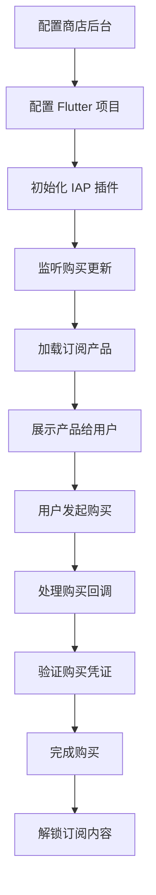

# 第 1 章：简介和准备工作

## 本章目标

- 理解订阅和其他类型内购的区别
- 了解 `in_app_purchase` 插件的架构
- 掌握订阅相关的基本概念和术语
- 准备好开发和测试环境

## 什么是应用内购买（IAP）

应用内购买（In-App Purchase，简称 IAP）是指用户在应用内直接购买数字内容或服务的功能。通过 IAP，开发者可以在应用中销售：

- **消耗型产品**：可以多次购买的产品，如游戏币、能量点等
- **非消耗型产品**：一次购买永久拥有的产品，如去广告、解锁专业版等
- **订阅**：按周期付费的服务，如会员、云存储等

## 订阅 vs 其他类型的内购

### 订阅的特点

订阅是一种特殊的应用内购买类型，具有以下特点：

1. **周期性计费**：按月、季、年等周期自动续费
2. **自动续订**：用户订阅后会自动续费，直到取消
3. **跨设备同步**：用户在一个设备上订阅，其他设备也可以使用
4. **试用期**：可以提供免费试用期吸引用户
5. **优惠价格**：支持首次订阅优惠、促销价等

### 与其他类型的对比

| 特性 | 订阅 | 非消耗型产品 | 消耗型产品 |
|------|------|------------|-----------|
| 购买次数 | 自动续订 | 一次性 | 多次 |
| 跨设备同步 | ✅ | ✅ | ❌ |
| 可退款 | ✅ | ✅ | 部分支持 |
| 试用期 | ✅ | ❌ | ❌ |
| 优惠价格 | ✅ | ❌ | ❌ |

## 订阅的基本概念和术语

### 订阅类型

#### 自动续订订阅（Auto-Renewable Subscription）

- iOS 和 Android 都支持
- 到期后自动续订
- 用户主动取消前会持续计费
- 本教程主要讲解此类型

#### 非续订订阅（Non-Renewable Subscription）

- 仅 iOS 支持
- 固定时长，到期后不自动续订
- 需要开发者自己管理订阅状态
- 较少使用

### 订阅周期

常见的订阅周期包括：

- 周订阅（1 周）
- 月订阅（1 个月）
- 季度订阅（3 个月）
- 半年订阅（6 个月）
- 年订阅（1 年）

### 订阅组（Subscription Group）

**iOS 特有概念**

- 一个订阅组包含多个等级的订阅产品
- 用户同时只能订阅组内的一个产品
- 在组内升级或降级订阅时，系统会自动处理
- 例如：银卡会员、金卡会员、白金会员属于同一订阅组

**Android 处理方式**

- Android 没有订阅组概念
- 需要在代码中手动处理订阅的升级和降级
- 通过 `ChangeSubscriptionParam` 指定旧订阅

### 试用期（Free Trial）

- 用户首次订阅可以享受的免费试用期
- 常见时长：3 天、7 天、14 天、1 个月
- 试用期结束后自动转为付费订阅
- 用户可以在试用期内取消

### 优惠价格（Introductory Price）

- 首次订阅或重新订阅时的优惠价格
- 可以是折扣价或者首周期免费
- iOS 称为 Introductory Offer
- Android 称为 Introductory Pricing

### 促销优惠（Promotional Offer）

**iOS 特有**

- 给现有或过期订阅用户的特殊优惠
- 需要在 App Store Connect 中配置
- 通过优惠代码（Offer Code）激活

### SKU / Product ID

- SKU：Stock Keeping Unit，库存单位
- Product ID：产品标识符
- 用于在代码中标识和查询订阅产品
- 必须在商店后台配置时创建
- 示例：`monthly_premium`、`yearly_vip`

## `in_app_purchase` 插件架构

### 插件结构

`in_app_purchase` 采用了联合插件（Federated Plugin）架构：

```
in_app_purchase (主包)
├── in_app_purchase_platform_interface (平台接口)
├── in_app_purchase_android (Android 实现)
└── in_app_purchase_storekit (iOS/macOS 实现)
```

### 为什么使用联合插件架构？

1. **平台解耦**：各平台实现独立，互不影响
2. **易于维护**：可以单独更新某个平台的实现
3. **代码复用**：平台接口层定义了统一的 API
4. **灵活性**：需要时可以访问平台特定功能

### 统一 API vs 平台特定 API

#### 统一 API（推荐）

```dart
import 'package:in_app_purchase/in_app_purchase.dart';

// 适用于 iOS 和 Android
final InAppPurchase inAppPurchase = InAppPurchase.instance;
```

优点：

- 代码简洁，一套代码双平台运行
- 自动处理平台差异
- 适合大多数使用场景

#### 平台特定 API（高级）

```dart
// Android 特定
import 'package:in_app_purchase_android/in_app_purchase_android.dart';

// iOS 特定
import 'package:in_app_purchase_storekit/in_app_purchase_storekit.dart';
```

使用场景：

- 需要访问平台独有功能
- 需要更精细的控制
- 处理平台特定的边缘情况

### 支持的平台版本

| 平台 | 最低版本 |
|------|---------|
| Android | SDK 21+ (Android 5.0) |
| iOS | 12.0+ |
| macOS | 10.15+ |

## 开发环境准备

### 必需的账号

#### iOS 开发

- **Apple Developer Account**（付费会员）
  - 个人或公司账号：$99/年
  - 用于创建 App ID、配置订阅产品
  - 访问 App Store Connect

#### Android 开发

- **Google Play Console 开发者账号**
  - 一次性注册费：$25
  - 用于创建应用、配置订阅产品

### 开发工具

1. **Flutter SDK**
   - 版本 3.29.0 或更高
   - 配置好 iOS 和 Android 开发环境

2. **IDE**
   - Android Studio 或 VS Code
   - 安装 Flutter 和 Dart 插件

3. **真机设备**
   - iOS 真机（订阅功能无法在模拟器上测试）
   - Android 真机或模拟器（推荐真机）

### 测试环境

#### iOS 沙盒测试

- 在 App Store Connect 中创建沙盒测试账号
- 不会真实扣费
- 订阅自动续订周期加速（1 个月 = 5 分钟）

#### Android 测试

- 使用测试轨道（Internal Testing）
- 添加测试账号到许可测试员列表
- 不会真实扣费
- 支持快速测试续订

### 关键注意事项

⚠️ **重要提醒**

1. **不要在生产环境使用测试账号**
   - iOS 沙盒账号一旦登录 iTunes 等生产服务会永久失效
   - 使用专门的测试设备

2. **应用必须签名**
   - Android 必须使用签名的 APK/AAB
   - Debug 签名也可以，但必须签名

3. **订阅产品必须激活**
   - 商店后台的产品状态必须是"活跃"
   - iOS 需要提交首个版本后才能测试

4. **网络环境**
   - 测试时需要稳定的网络连接
   - iOS 在中国大陆可能需要特殊网络环境

## 订阅开发流程概览

完整的订阅功能开发流程包括以下步骤：



本教程将详细讲解每一个步骤。

## 开发前的准备清单

在开始编码前，请确保：

- [ ] 拥有 Apple Developer 账号（iOS）
- [ ] 拥有 Google Play Console 账号（Android）
- [ ] 安装了 Flutter 3.29.0+
- [ ] 配置好 iOS 和 Android 开发环境
- [ ] 准备好测试用的真机设备
- [ ] 理解了订阅的基本概念

## 学习资源

### 官方文档

- [in_app_purchase 插件](https://pub.dev/packages/in_app_purchase)
- [Apple In-App Purchase](https://developer.apple.com/in-app-purchase/)
- [Google Play Billing](https://developer.android.com/google/play/billing)

### 相关教程

- [Flutter In-App Purchase Codelab](https://codelabs.developers.google.com/codelabs/flutter-in-app-purchases)

## 小结

在本章中，我们学习了：

- 订阅与其他类型内购的区别
- 订阅相关的核心概念和术语
- `in_app_purchase` 插件的架构设计
- 开发环境和测试环境的准备

掌握这些基础知识后，我们就可以开始配置商店后台了。

## 下一步

[第 2 章：iOS App Store Connect 配置](02-ios-setup.md) - 学习如何在 App Store Connect 中创建和配置订阅产品。
