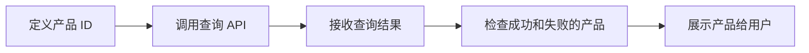

# 第 7 章：加载订阅产品

## 本章目标

- 了解产品查询的工作原理
- 实现产品加载功能
- 处理查询结果和错误
- 访问平台特定的产品属性

## 产品查询概述

### 为什么需要查询产品？

在商店后台配置的订阅产品信息（价格、描述、试用期等）需要通过查询 API 获取：

- ✅ 价格会根据用户地区自动本地化
- ✅ 描述和名称支持多语言
- ✅ 确保产品确实存在且可购买
- ✅ 获取优惠和试用期信息

### 查询流程



## 步骤 1：定义产品 ID

### 更新产品常量

编辑 `lib/utils/subscription_constants.dart`：

```dart
class SubscriptionConstants {
  SubscriptionConstants._();

  // ==================== 产品 ID ====================
  
  // 基础订阅
  static const String monthlyBasic = 'monthly_basic';
  
  // 高级订阅
  static const String monthlyPremium = 'monthly_premium';
  static const String yearlyPremium = 'yearly_premium';
  
  // VIP 订阅
  static const String monthlyVIP = 'monthly_vip';

  // ==================== 产品集合 ====================
  
  /// 所有订阅产品 ID
  static const Set<String> allSubscriptionIds = {
    monthlyBasic,
    monthlyPremium,
    yearlyPremium,
    monthlyVIP,
  };

  /// 仅月度订阅
  static const Set<String> monthlySubscriptionIds = {
    monthlyBasic,
    monthlyPremium,
    monthlyVIP,
  };

  /// 仅年度订阅
  static const Set<String> yearlySubscriptionIds = {
    yearlyPremium,
  };

  // ==================== 产品元数据 ====================
  
  /// 获取产品的显示名称（本地化后备）
  static String getProductDisplayName(String productId) {
    switch (productId) {
      case monthlyBasic:
        return '基础月度会员';
      case monthlyPremium:
        return '高级月度会员';
      case yearlyPremium:
        return '高级年度会员';
      case monthlyVIP:
        return '旗舰月度会员';
      default:
        return '未知产品';
    }
  }

  /// 获取产品的本地化描述（后备）
  static String getProductDescription(String productId) {
    switch (productId) {
      case monthlyBasic:
        return '解锁基础功能';
      case monthlyPremium:
        return '解锁所有高级功能';
      case yearlyPremium:
        return '解锁所有高级功能，按年订阅更优惠';
      case monthlyVIP:
        return '解锁全部功能，享受 VIP 特权';
      default:
        return '';
    }
  }
}
```

## 步骤 2：实现产品查询

### 扩展 SubscriptionService

更新 `lib/services/subscription_service.dart`，添加产品查询功能：

```dart
import 'dart:async';
import 'dart:io';
import 'package:in_app_purchase/in_app_purchase.dart';
import '../../../../utils/subscription_constants.dart';

class SubscriptionService {
  // ==================== 单例模式 ====================
  static final SubscriptionService _instance = SubscriptionService._internal();
  factory SubscriptionService() => _instance;
  SubscriptionService._internal();

  // ==================== 私有属性 ====================
  final InAppPurchase _inAppPurchase = InAppPurchase.instance;
  StreamSubscription<List<PurchaseDetails>>? _subscription;
  bool _isInitialized = false;
  bool _isAvailable = false;

  // 产品列表
  List<ProductDetails> _products = [];
  bool _productsLoaded = false;

  // ==================== 公共属性 ====================
  bool get isInitialized => _isInitialized;
  bool get isAvailable => _isAvailable;
  List<ProductDetails> get products => _products;
  bool get productsLoaded => _productsLoaded;

  // ==================== 初始化方法（之前已实现） ====================
  
  Future<bool> initialize() async {
    // ... 之前的实现 ...
    if (!_isInitialized) {
      _isAvailable = await _inAppPurchase.isAvailable();
      if (_isAvailable) {
        _listenToPurchaseUpdates();
      }
      _isInitialized = true;
    }
    return _isAvailable;
  }

  void _listenToPurchaseUpdates() {
    // ... 之前的实现 ...
  }

  // ==================== 产品查询 ====================
  
  /// 加载所有订阅产品
  Future<bool> loadProducts() async {
    if (!_isAvailable) {
      print('商店不可用，无法加载产品');
      return false;
    }

    print('开始加载订阅产品...');

    try {
      // 查询产品详情
      final ProductDetailsResponse response = 
          await _inAppPurchase.queryProductDetails(
        SubscriptionConstants.allSubscriptionIds,
      );

      // 检查是否有查询失败的产品
      if (response.notFoundIDs.isNotEmpty) {
        print('以下产品 ID 未找到: ${response.notFoundIDs}');
        // 可以记录到分析工具
      }

      // 检查查询错误
      if (response.error != null) {
        print('查询产品时出错: ${response.error}');
        return false;
      }

      // 保存产品列表
      _products = response.productDetails;
      _productsLoaded = true;

      print('成功加载 ${_products.length} 个产品');
      _logProducts();

      return true;
    } catch (e, stackTrace) {
      print('加载产品时出现异常: $e');
      print('堆栈跟踪: $stackTrace');
      return false;
    }
  }

  /// 根据 ID 获取产品
  ProductDetails? getProductById(String productId) {
    try {
      return _products.firstWhere(
        (product) => product.id == productId,
      );
    } catch (e) {
      print('未找到产品: $productId');
      return null;
    }
  }

  /// 获取月度订阅产品
  List<ProductDetails> getMonthlyProducts() {
    return _products.where((product) {
      return SubscriptionConstants.monthlySubscriptionIds.contains(product.id);
    }).toList();
  }

  /// 获取年度订阅产品
  List<ProductDetails> getYearlyProducts() {
    return _products.where((product) {
      return SubscriptionConstants.yearlySubscriptionIds.contains(product.id);
    }).toList();
  }

  /// 记录产品信息（调试用）
  void _logProducts() {
    print('==================== 已加载的产品 ====================');
    for (final product in _products) {
      print('ID: ${product.id}');
      print('标题: ${product.title}');
      print('描述: ${product.description}');
      print('价格: ${product.price}');
      print('价格字符串: ${product.rawPrice}');
      print('货币代码: ${product.currencyCode}');
      print('---');
    }
    print('====================================================');
  }

  // ==================== 资源清理 ====================
  
  void dispose() {
    _subscription?.cancel();
    _subscription = null;
  }
}
```

## 步骤 3：理解 ProductDetails 对象

### 通用属性

所有平台都支持的属性：

```dart
class ProductDetails {
  // 基本信息
  final String id;                    // 产品 ID
  final String title;                 // 产品标题
  final String description;           // 产品描述
  final String price;                 // 格式化的价格字符串（如 "¥18.00"）
  final double rawPrice;              // 原始价格数字（如 18.00）
  final String currencyCode;          // 货币代码（如 "CNY"）
  final String currencySymbol;        // 货币符号（如 "¥"）
}
```

### 使用示例

```dart
void displayProduct(ProductDetails product) {
  print('产品名称: ${product.title}');
  print('产品描述: ${product.description}');
  print('价格: ${product.price}');  // 已本地化："¥18.00"
  
  // 或者自己格式化
  print('价格: ${product.currencySymbol}${product.rawPrice}');
}
```

## 步骤 4：访问平台特定属性

### iOS 特定属性

```dart
import 'package:in_app_purchase_storekit/in_app_purchase_storekit.dart';
import 'package:in_app_purchase_storekit/store_kit_wrappers.dart';

void displayIOSSpecificInfo(ProductDetails productDetails) {
  if (productDetails is AppStoreProductDetails) {
    final SKProductWrapper skProduct = productDetails.skProduct;

    print('订阅组 ID: ${skProduct.subscriptionGroupIdentifier}');
    print('订阅周期: ${skProduct.subscriptionPeriod}');
    
    // 介绍性价格优惠
    if (skProduct.introductoryPrice != null) {
      final intro = skProduct.introductoryPrice!;
      print('优惠价格: ${intro.price}');
      print('优惠周期: ${intro.subscriptionPeriod}');
      print('优惠数量: ${intro.numberOfPeriods}');
      print('优惠类型: ${intro.paymentMode}');
    }

    // 折扣信息
    if (skProduct.discounts.isNotEmpty) {
      for (final discount in skProduct.discounts) {
        print('折扣 ID: ${discount.identifier}');
        print('折扣价格: ${discount.price}');
      }
    }
  }
}
```

### Android 特定属性

```dart
import 'package:in_app_purchase_android/in_app_purchase_android.dart';
import 'package:in_app_purchase_android/billing_client_wrappers.dart';

void displayAndroidSpecificInfo(ProductDetails productDetails) {
  if (productDetails is GooglePlayProductDetails) {
    final ProductDetailsWrapper productWrapper = productDetails.productDetails;

    print('产品类型: ${productWrapper.productType}');
    print('产品标题: ${productWrapper.title}');
    print('产品描述: ${productWrapper.description}');

    // 订阅优惠详情
    if (productWrapper.subscriptionOfferDetails != null) {
      for (final offer in productWrapper.subscriptionOfferDetails!) {
        print('优惠 ID: ${offer.offerId}');
        print('优惠标签: ${offer.offerTags}');

        // 定价阶段
        for (final phase in offer.pricingPhases) {
          print('价格: ${phase.formattedPrice}');
          print('计费周期: ${phase.billingPeriod}');
          print('计费周期数: ${phase.billingCycleCount}');
        }
      }
    }
  }
}
```

## 步骤 5：创建产品模型类

为了更方便地使用产品信息，创建一个包装类。

创建 `lib/models/subscription_product.dart`：

```dart
import 'package:in_app_purchase/in_app_purchase.dart';

/// 订阅产品模型
class SubscriptionProduct {
  final ProductDetails productDetails;

  const SubscriptionProduct(this.productDetails);

  // ==================== 基本属性 ====================
  
  String get id => productDetails.id;
  String get title => productDetails.title;
  String get description => productDetails.description;
  String get price => productDetails.price;
  double get rawPrice => productDetails.rawPrice;
  String get currencyCode => productDetails.currencyCode;
  String get currencySymbol => productDetails.currencySymbol;

  // ==================== 辅助方法 ====================
  
  /// 是否为月度订阅
  bool get isMonthly {
    return id.contains('monthly');
  }

  /// 是否为年度订阅
  bool get isYearly {
    return id.contains('yearly');
  }

  /// 获取订阅周期描述
  String get periodDescription {
    if (isMonthly) return '每月';
    if (isYearly) return '每年';
    return '未知周期';
  }

  /// 获取短标题（移除应用名称）
  String get shortTitle {
    // App Store 的标题通常包含应用名称，需要清理
    return title.split('(').first.trim();
  }

  /// 格式化的完整描述
  String get fullDescription {
    return '$shortTitle - $price/$periodDescription';
  }

  // ==================== 比较方法 ====================
  
  @override
  bool operator ==(Object other) {
    if (identical(this, other)) return true;
    return other is SubscriptionProduct && other.id == id;
  }

  @override
  int get hashCode => id.hashCode;

  @override
  String toString() {
    return 'SubscriptionProduct(id: $id, price: $price)';
  }
}
```

### 在服务中使用

```dart
class SubscriptionService {
  // ...

  /// 获取所有订阅产品（包装后）
  List<SubscriptionProduct> getSubscriptionProducts() {
    return _products.map((p) => SubscriptionProduct(p)).toList();
  }

  /// 按价格排序
  List<SubscriptionProduct> getProductsSortedByPrice({bool ascending = true}) {
    final products = getSubscriptionProducts();
    products.sort((a, b) {
      return ascending 
          ? a.rawPrice.compareTo(b.rawPrice)
          : b.rawPrice.compareTo(a.rawPrice);
    });
    return products;
  }
}
```

## 步骤 6：处理查询错误

### 常见错误场景

1. **产品 ID 不存在**

```dart
Future<bool> loadProducts() async {
  final response = await _inAppPurchase.queryProductDetails(productIds);

  if (response.notFoundIDs.isNotEmpty) {
    print('警告：以下产品未找到: ${response.notFoundIDs}');
    
    // 根据业务需求决定如何处理
    // 选项1：仍然显示找到的产品
    // 选项2：显示错误并不允许继续
    
    // 记录到分析工具
    _logMissingProducts(response.notFoundIDs);
  }

  return response.productDetails.isNotEmpty;
}
```

2. **网络错误**

```dart
Future<bool> loadProducts() async {
  try {
    final response = await _inAppPurchase.queryProductDetails(productIds);
    
    if (response.error != null) {
      print('查询错误: ${response.error}');
      return false;
    }
    
    _products = response.productDetails;
    return true;
  } on TimeoutException {
    print('查询超时');
    return false;
  } catch (e) {
    print('查询异常: $e');
    return false;
  }
}
```

3. **空结果**

```dart
Future<bool> loadProducts() async {
  final response = await _inAppPurchase.queryProductDetails(productIds);

  if (response.productDetails.isEmpty) {
    print('错误：没有加载到任何产品');
    
    // 可能的原因：
    // - 产品 ID 全都错误
    // - 商店配置问题
    // - 网络问题
    
    return false;
  }

  _products = response.productDetails;
  return true;
}
```

## 步骤 7：在 UI 中加载和显示产品

### 创建订阅页面

创建 `lib/screens/subscription_screen.dart`：

```dart
import 'package:flutter/material.dart';
import '../../../../services/subscription_service.dart';
import '../../../../models/subscription_product.dart';

class SubscriptionScreen extends StatefulWidget {
  const SubscriptionScreen({super.key});

  @override
  State<SubscriptionScreen> createState() => _SubscriptionScreenState();
}

class _SubscriptionScreenState extends State<SubscriptionScreen> {
  final SubscriptionService _service = SubscriptionService();
  bool _isLoading = true;
  String? _errorMessage;

  @override
  void initState() {
    super.initState();
    _loadProducts();
  }

  Future<void> _loadProducts() async {
    setState(() {
      _isLoading = true;
      _errorMessage = null;
    });

    final success = await _service.loadProducts();

    setState(() {
      _isLoading = false;
      if (!success) {
        _errorMessage = '加载产品失败，请稍后重试';
      }
    });
  }

  @override
  Widget build(BuildContext context) {
    return Scaffold(
      appBar: AppBar(
        title: const Text('选择订阅'),
      ),
      body: _buildBody(),
    );
  }

  Widget _buildBody() {
    if (_isLoading) {
      return const Center(
        child: CircularProgressIndicator(),
      );
    }

    if (_errorMessage != null) {
      return _buildErrorWidget();
    }

    if (_service.products.isEmpty) {
      return const Center(
        child: Text('暂无可用的订阅产品'),
      );
    }

    return _buildProductList();
  }

  Widget _buildErrorWidget() {
    return Center(
      child: Column(
        mainAxisAlignment: MainAxisAlignment.center,
        children: [
          const Icon(Icons.error_outline, size: 64, color: Colors.red),
          const SizedBox(height: 16),
          Text(_errorMessage!),
          const SizedBox(height: 16),
          ElevatedButton.icon(
            onPressed: _loadProducts,
            icon: const Icon(Icons.refresh),
            label: const Text('重试'),
          ),
        ],
      ),
    );
  }

  Widget _buildProductList() {
    final products = _service.getSubscriptionProducts();

    return ListView.builder(
      padding: const EdgeInsets.all(16),
      itemCount: products.length,
      itemBuilder: (context, index) {
        return _buildProductCard(products[index]);
      },
    );
  }

  Widget _buildProductCard(SubscriptionProduct product) {
    return Card(
      margin: const EdgeInsets.only(bottom: 12),
      child: ListTile(
        contentPadding: const EdgeInsets.all(16),
        title: Text(
          product.shortTitle,
          style: const TextStyle(
            fontSize: 18,
            fontWeight: FontWeight.bold,
          ),
        ),
        subtitle: Column(
          crossAxisAlignment: CrossAxisAlignment.start,
          children: [
            const SizedBox(height: 8),
            Text(product.description),
            const SizedBox(height: 8),
            Text(
              product.periodDescription,
              style: TextStyle(
                color: Colors.grey[600],
                fontSize: 12,
              ),
            ),
          ],
        ),
        trailing: Column(
          mainAxisAlignment: MainAxisAlignment.center,
          crossAxisAlignment: CrossAxisAlignment.end,
          children: [
            Text(
              product.price,
              style: const TextStyle(
                fontSize: 20,
                fontWeight: FontWeight.bold,
                color: Colors.blue,
              ),
            ),
            Text(
              product.periodDescription,
              style: TextStyle(
                fontSize: 12,
                color: Colors.grey[600],
              ),
            ),
          ],
        ),
        onTap: () {
          // 将在第 9 章实现购买功能
          print('选择产品: ${product.id}');
        },
      ),
    );
  }
}
```

## 测试产品加载

### 测试清单

- [ ] 在真机上测试（模拟器可能无法加载产品）
- [ ] 验证所有产品都能正确加载
- [ ] 检查价格是否正确本地化
- [ ] 测试网络错误情况
- [ ] 验证产品 ID 不存在的情况

### 调试技巧

1. **记录详细日志**

```dart
void _logProductDetails(ProductDetails product) {
  print('==================');
  print('产品 ID: ${product.id}');
  print('标题: ${product.title}');
  print('描述: ${product.description}');
  print('价格: ${product.price}');
  print('原始价格: ${product.rawPrice}');
  print('货币: ${product.currencyCode}');
  print('==================');
}
```

2. **使用断言验证**

```dart
assert(response.productDetails.isNotEmpty, '产品列表不应为空');
assert(response.notFoundIDs.isEmpty, '所有产品 ID 都应该存在');
```

## 常见问题

### Q1：为什么产品加载失败？

可能的原因：

1. **产品 ID 不匹配**：检查代码中的 ID 与商店后台一致
2. **产品未激活**：确保商店后台的产品已激活
3. **应用未提交**：iOS 需要至少提交一次应用
4. **签名问题**：Android 需要使用正确签名的 APK

### Q2：产品价格显示不正确怎么办？

使用 `product.price` 而不是手动格式化，这样可以确保价格按照用户地区正确显示。

### Q3：如何缓存产品信息？

可以将产品信息保存到本地：

```dart
import 'package:shared_preferences/shared_preferences.dart';
import 'dart:convert';

Future<void> cacheProducts(List<ProductDetails> products) async {
  final prefs = await SharedPreferences.getInstance();
  final json = products.map((p) => {
    'id': p.id,
    'title': p.title,
    'price': p.price,
    'description': p.description,
  }).toList();
  await prefs.setString('cached_products', jsonEncode(json));
}
```

⚠️ **注意**：缓存的产品信息可能过期，应该定期更新。

### Q4：可以同时查询多个产品组吗？

可以，只需要将所有产品 ID 放在同一个 Set 中：

```dart
final allIds = {
  ...SubscriptionConstants.monthlySubscriptionIds,
  ...SubscriptionConstants.yearlySubscriptionIds,
};

final response = await InAppPurchase.instance.queryProductDetails(allIds);
```

## 小结

在本章中，我们学习了：

- 如何定义和管理产品 ID
- 如何查询订阅产品信息
- 如何处理查询结果和错误
- 如何访问平台特定的产品属性
- 如何在 UI 中展示产品列表

成功加载产品后，下一步是设计美观的产品展示界面。

## 下一步

[第 8 章：展示订阅产品](08-display-products.md) - 学习如何设计和实现美观的订阅产品展示界面。
