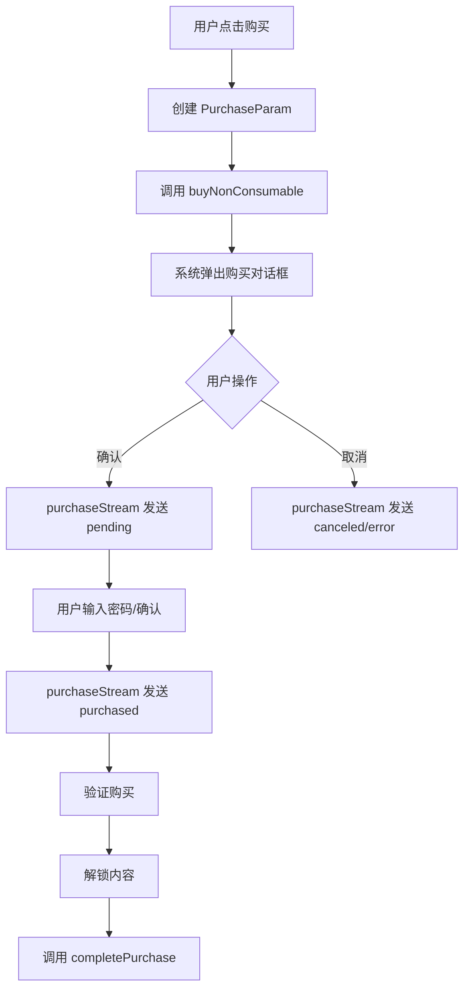

# 第 9 章：发起订阅购买

## 本章目标

- 理解购买流程的工作原理
- 实现订阅购买功能
- 处理购买过程中的用户交互
- 区分消耗型和非消耗型产品的购买

## 购买流程概述

### 完整的购买流程



### 关键步骤

1. 创建购买参数（`PurchaseParam`）
2. 调用购买 API（`buyNonConsumable` 或 `buyConsumable`）
3. 等待购买更新（通过 `purchaseStream`）
4. 验证和完成购买

## 步骤 1：区分消耗型和非消耗型产品

### 产品类型说明

```dart
class ProductType {
  // 非消耗型产品（订阅属于此类）
  // - 一次购买，持续拥有
  // - 自动跨设备同步
  // - 可以恢复购买
  static const nonConsumable = 'non_consumable';
  
  // 消耗型产品
  // - 可以多次购买
  // - 使用后消失
  // - 不可恢复
  static const consumable = 'consumable';
}
```

### 订阅是非消耗型产品

⚠️ **重要**：订阅必须使用 `buyNonConsumable()` 方法。

```dart
// ✅ 正确 - 订阅使用 buyNonConsumable
await InAppPurchase.instance.buyNonConsumable(
  purchaseParam: purchaseParam,
);

// ❌ 错误 - 不要对订阅使用 buyConsumable
await InAppPurchase.instance.buyConsumable(
  purchaseParam: purchaseParam,
);
```

## 步骤 2：创建购买参数

### 基本购买参数

```dart
import 'package:in_app_purchase/in_app_purchase.dart';

PurchaseParam createPurchaseParam(ProductDetails productDetails) {
  return PurchaseParam(
    productDetails: productDetails,
  );
}
```

### 带应用账户 Token 的购买参数

应用账户 Token 用于将购买关联到你的用户账户：

```dart
PurchaseParam createPurchaseParamWithToken(
  ProductDetails productDetails,
  String userId,
) {
  return PurchaseParam(
    productDetails: productDetails,
    applicationUserName: userId, // 用户唯一标识
  );
}
```

⚠️ **注意**：

- `applicationUserName` 长度限制：iOS 128 字符，Android 无限制
- 不要使用邮箱等敏感信息，使用用户 ID
- 用于服务器端验证时关联用户

## 步骤 3：实现购买方法

### 扩展 SubscriptionService

更新 `lib/services/subscription_service.dart`：

```dart
import 'dart:async';
import 'dart:io';
import 'package:in_app_purchase/in_app_purchase.dart';

class SubscriptionService {
  // ... 之前的代码 ...

  // ==================== 购买方法 ====================
  
  /// 购买订阅产品
  /// 
  /// [productDetails] 要购买的产品
  /// [userId] 可选，用户 ID 用于服务器验证
  Future<bool> purchaseSubscription(
    ProductDetails productDetails, {
    String? userId,
  }) async {
    if (!_isAvailable) {
      print('商店不可用，无法购买');
      return false;
    }

    print('开始购买: ${productDetails.id}');

    try {
      // 创建购买参数
      final PurchaseParam purchaseParam = PurchaseParam(
        productDetails: productDetails,
        applicationUserName: userId,
      );

      // 调用购买 API（订阅是非消耗型产品）
      final bool success = await _inAppPurchase.buyNonConsumable(
        purchaseParam: purchaseParam,
      );

      if (success) {
        print('购买请求已发送');
      } else {
        print('购买请求失败');
      }

      return success;
    } catch (e, stackTrace) {
      print('购买时出错: $e');
      print('堆栈跟踪: $stackTrace');
      return false;
    }
  }

  /// 根据产品 ID 购买
  Future<bool> purchaseByProductId(String productId, {String? userId}) async {
    final product = getProductById(productId);
    
    if (product == null) {
      print('未找到产品: $productId');
      return false;
    }

    return purchaseSubscription(product, userId: userId);
  }

  // ==================== 辅助方法 ====================
  
  /// 检查是否可以购买
  bool canPurchase() {
    return _isInitialized && _isAvailable;
  }

  /// 获取购买不可用的原因
  String? getPurchaseUnavailableReason() {
    if (!_isInitialized) {
      return '服务未初始化';
    }
    if (!_isAvailable) {
      return '应用内购买服务不可用';
    }
    return null;
  }
}
```

## 步骤 4：在 UI 中实现购买

### 基础购买按钮

```dart
import 'package:flutter/material.dart';
import '../../../../services/subscription_service.dart';
import '../../../../models/subscription_product.dart';

class PurchaseButton extends StatefulWidget {
  final SubscriptionProduct product;

  const PurchaseButton({
    super.key,
    required this.product,
  });

  @override
  State<PurchaseButton> createState() => _PurchaseButtonState();
}

class _PurchaseButtonState extends State<PurchaseButton> {
  final SubscriptionService _service = SubscriptionService();
  bool _isPurchasing = false;

  Future<void> _handlePurchase() async {
    // 检查是否可以购买
    if (!_service.canPurchase()) {
      _showError(_service.getPurchaseUnavailableReason() ?? '无法购买');
      return;
    }

    // 显示购买中状态
    setState(() => _isPurchasing = true);

    try {
      // 发起购买
      final success = await _service.purchaseSubscription(
        widget.product.productDetails,
        userId: 'user_123', // 替换为实际用户 ID
      );

      if (!success) {
        _showError('购买请求失败，请重试');
      }
      // 注意：购买成功的处理在 purchaseStream 监听器中
    } finally {
      if (mounted) {
        setState(() => _isPurchasing = false);
      }
    }
  }

  void _showError(String message) {
    if (!mounted) return;
    
    ScaffoldMessenger.of(context).showSnackBar(
      SnackBar(
        content: Text(message),
        backgroundColor: Colors.red,
      ),
    );
  }

  @override
  Widget build(BuildContext context) {
    return ElevatedButton(
      onPressed: _isPurchasing ? null : _handlePurchase,
      style: ElevatedButton.styleFrom(
        padding: const EdgeInsets.symmetric(vertical: 16),
        shape: RoundedRectangleBorder(
          borderRadius: BorderRadius.circular(12),
        ),
      ),
      child: _isPurchasing
          ? const SizedBox(
              width: 20,
              height: 20,
              child: CircularProgressIndicator(
                strokeWidth: 2,
                valueColor: AlwaysStoppedAnimation<Color>(Colors.white),
              ),
            )
          : Text(
              widget.product.hasFreeTrial ? '开始免费试用' : '立即订阅',
              style: const TextStyle(
                fontSize: 16,
                fontWeight: FontWeight.bold,
              ),
            ),
    );
  }
}
```

### 带确认对话框的购买

```dart
class PurchaseButtonWithConfirmation extends StatefulWidget {
  final SubscriptionProduct product;

  const PurchaseButtonWithConfirmation({
    super.key,
    required this.product,
  });

  @override
  State<PurchaseButtonWithConfirmation> createState() =>
      _PurchaseButtonWithConfirmationState();
}

class _PurchaseButtonWithConfirmationState
    extends State<PurchaseButtonWithConfirmation> {
  final SubscriptionService _service = SubscriptionService();
  bool _isPurchasing = false;

  Future<void> _handlePurchase() async {
    // 显示确认对话框
    final confirmed = await _showConfirmationDialog();
    if (confirmed != true) return;

    setState(() => _isPurchasing = true);

    try {
      final success = await _service.purchaseSubscription(
        widget.product.productDetails,
      );

      if (!success) {
        _showError('购买请求失败');
      }
    } finally {
      if (mounted) {
        setState(() => _isPurchasing = false);
      }
    }
  }

  Future<bool?> _showConfirmationDialog() {
    return showDialog<bool>(
      context: context,
      builder: (context) => AlertDialog(
        title: const Text('确认订阅'),
        content: Column(
          mainAxisSize: MainAxisSize.min,
          crossAxisAlignment: CrossAxisAlignment.start,
          children: [
            Text('订阅：${widget.product.shortTitle}'),
            const SizedBox(height: 8),
            Text('价格：${widget.product.price}/${widget.product.periodDescription}'),
            const SizedBox(height: 8),
            if (widget.product.hasFreeTrial)
              Text(
                widget.product.freeTrialDescription!,
                style: const TextStyle(
                  color: Colors.orange,
                  fontWeight: FontWeight.bold,
                ),
              ),
            const SizedBox(height: 16),
            Text(
              '订阅将自动续费，您可以随时在系统设置中取消。',
              style: TextStyle(
                fontSize: 12,
                color: Colors.grey[600],
              ),
            ),
          ],
        ),
        actions: [
          TextButton(
            onPressed: () => Navigator.of(context).pop(false),
            child: const Text('取消'),
          ),
          ElevatedButton(
            onPressed: () => Navigator.of(context).pop(true),
            child: const Text('确认订阅'),
          ),
        ],
      ),
    );
  }

  void _showError(String message) {
    if (!mounted) return;
    ScaffoldMessenger.of(context).showSnackBar(
      SnackBar(content: Text(message), backgroundColor: Colors.red),
    );
  }

  @override
  Widget build(BuildContext context) {
    return ElevatedButton(
      onPressed: _isPurchasing ? null : _handlePurchase,
      style: ElevatedButton.styleFrom(
        padding: const EdgeInsets.symmetric(vertical: 16),
        shape: RoundedRectangleBorder(
          borderRadius: BorderRadius.circular(12),
        ),
      ),
      child: _isPurchasing
          ? const SizedBox(
              width: 20,
              height: 20,
              child: CircularProgressIndicator(
                strokeWidth: 2,
                valueColor: AlwaysStoppedAnimation<Color>(Colors.white),
              ),
            )
          : const Text(
              '立即订阅',
              style: TextStyle(fontSize: 16, fontWeight: FontWeight.bold),
            ),
    );
  }
}
```

## 步骤 5：处理购买状态

### 创建购买状态管理

创建 `lib/providers/purchase_provider.dart`：

```dart
import 'package:flutter/foundation.dart';
import 'package:in_app_purchase/in_app_purchase.dart';

class PurchaseProvider with ChangeNotifier {
  PurchaseDetails? _currentPurchase;
  bool _isPurchasing = false;
  String? _errorMessage;

  PurchaseDetails? get currentPurchase => _currentPurchase;
  bool get isPurchasing => _isPurchasing;
  String? get errorMessage => _errorMessage;
  bool get hasError => _errorMessage != null;

  void startPurchase() {
    _isPurchasing = true;
    _errorMessage = null;
    notifyListeners();
  }

  void updatePurchase(PurchaseDetails purchase) {
    _currentPurchase = purchase;
    
    switch (purchase.status) {
      case PurchaseStatus.pending:
        _isPurchasing = true;
        _errorMessage = null;
        break;
      
      case PurchaseStatus.purchased:
      case PurchaseStatus.restored:
        _isPurchasing = false;
        _errorMessage = null;
        break;
      
      case PurchaseStatus.error:
        _isPurchasing = false;
        _errorMessage = purchase.error?.message ?? '购买失败';
        break;
      
      case PurchaseStatus.canceled:
        _isPurchasing = false;
        _errorMessage = null;
        break;
    }
    
    notifyListeners();
  }

  void clearError() {
    _errorMessage = null;
    notifyListeners();
  }

  void reset() {
    _currentPurchase = null;
    _isPurchasing = false;
    _errorMessage = null;
    notifyListeners();
  }
}
```

### 在 UI 中使用状态管理

```dart
import 'package:flutter/material.dart';
import 'package:provider/provider.dart';
import '../../../../providers/purchase_provider.dart';
import '../../../../services/subscription_service.dart';
import '../../../../models/subscription_product.dart';

class SubscriptionScreenWithProvider extends StatefulWidget {
  const SubscriptionScreenWithProvider({super.key});

  @override
  State<SubscriptionScreenWithProvider> createState() =>
      _SubscriptionScreenWithProviderState();
}

class _SubscriptionScreenWithProviderState
    extends State<SubscriptionScreenWithProvider> {
  final SubscriptionService _service = SubscriptionService();

  @override
  Widget build(BuildContext context) {
    return Scaffold(
      appBar: AppBar(
        title: const Text('选择订阅'),
      ),
      body: Consumer<PurchaseProvider>(
        builder: (context, provider, child) {
          return Stack(
            children: [
              // 产品列表
              _buildProductList(),
              
              // 购买中遮罩
              if (provider.isPurchasing)
                _buildPurchasingOverlay(),
              
              // 错误提示
              if (provider.hasError)
                _buildErrorBar(provider.errorMessage!),
            ],
          );
        },
      ),
    );
  }

  Widget _buildProductList() {
    // ... 产品列表实现 ...
    return Container();
  }

  Widget _buildPurchasingOverlay() {
    return Container(
      color: Colors.black54,
      child: const Center(
        child: Card(
          child: Padding(
            padding: EdgeInsets.all(24.0),
            child: Column(
              mainAxisSize: MainAxisSize.min,
              children: [
                CircularProgressIndicator(),
                SizedBox(height: 16),
                Text(
                  '正在处理购买...',
                  style: TextStyle(fontSize: 16),
                ),
                SizedBox(height: 8),
                Text(
                  '请不要关闭应用',
                  style: TextStyle(fontSize: 12, color: Colors.grey),
                ),
              ],
            ),
          ),
        ),
      ),
    );
  }

  Widget _buildErrorBar(String message) {
    return Positioned(
      top: 0,
      left: 0,
      right: 0,
      child: Material(
        elevation: 4,
        color: Colors.red,
        child: SafeArea(
          child: Padding(
            padding: const EdgeInsets.all(16.0),
            child: Row(
              children: [
                const Icon(Icons.error, color: Colors.white),
                const SizedBox(width: 12),
                Expanded(
                  child: Text(
                    message,
                    style: const TextStyle(color: Colors.white),
                  ),
                ),
                IconButton(
                  icon: const Icon(Icons.close, color: Colors.white),
                  onPressed: () {
                    context.read<PurchaseProvider>().clearError();
                  },
                ),
              ],
            ),
          ),
        ),
      ),
    );
  }
}
```

## 步骤 6：Android 特定优惠选择

在 Android 上，一个订阅可以有多个基础方案和优惠，需要指定购买哪个：

```dart
import 'dart:io';
import 'package:in_app_purchase/in_app_purchase.dart';
import 'package:in_app_purchase_android/in_app_purchase_android.dart';

Future<bool> purchaseAndroidSubscription(
  ProductDetails productDetails, {
  String? offerId,
}) async {
  if (!Platform.isAndroid) {
    // iOS 使用普通购买
    return InAppPurchase.instance.buyNonConsumable(
      purchaseParam: PurchaseParam(productDetails: productDetails),
    );
  }

  // Android 需要指定基础方案和优惠
  if (productDetails is GooglePlayProductDetails) {
    final offerDetails = productDetails.productDetails.subscriptionOfferDetails;
    
    if (offerDetails == null || offerDetails.isEmpty) {
      print('没有可用的订阅优惠');
      return false;
    }

    // 选择第一个优惠（或根据 offerId 选择）
    final selectedOffer = offerId != null
        ? offerDetails.firstWhere(
            (offer) => offer.offerId == offerId,
            orElse: () => offerDetails.first,
          )
        : offerDetails.first;

    final purchaseParam = GooglePlayPurchaseParam(
      productDetails: productDetails,
      changeSubscriptionParam: null, // 新订阅不需要
    );

    return InAppPurchase.instance.buyNonConsumable(
      purchaseParam: purchaseParam,
    );
  }

  return false;
}
```

## 步骤 7：防止重复购买

```dart
class SubscriptionService {
  // ...
  
  bool _isPurchaseInProgress = false;

  Future<bool> purchaseSubscription(
    ProductDetails productDetails, {
    String? userId,
  }) async {
    // 防止重复购买
    if (_isPurchaseInProgress) {
      print('已有购买正在进行中');
      return false;
    }

    _isPurchaseInProgress = true;

    try {
      final purchaseParam = PurchaseParam(
        productDetails: productDetails,
        applicationUserName: userId,
      );

      final success = await _inAppPurchase.buyNonConsumable(
        purchaseParam: purchaseParam,
      );

      return success;
    } finally {
      // 延迟重置标志，避免立即重复点击
      Future.delayed(const Duration(seconds: 2), () {
        _isPurchaseInProgress = false;
      });
    }
  }
}
```

## 测试购买流程

### 测试清单

- [ ] 在真机上测试（模拟器无法购买）
- [ ] 使用测试账号（iOS 沙盒 / Android 许可测试）
- [ ] 测试购买成功流程
- [ ] 测试用户取消购买
- [ ] 测试网络错误情况
- [ ] 测试重复购买
- [ ] 测试应用在购买过程中被关闭

### 调试技巧

1. **记录详细日志**

```dart
print('开始购买: ${productDetails.id}');
print('用户 ID: $userId');
print('购买参数创建完成');
print('调用 buyNonConsumable...');
```

2. **模拟不同场景**

```dart
// 模拟商店不可用
if (!_isAvailable) {
  print('商店不可用');
  return false;
}

// 模拟产品不存在
if (product == null) {
  print('产品不存在');
  return false;
}
```

## 常见问题

### Q1：为什么点击购买没有反应？

可能的原因：

1. 商店未初始化或不可用
2. 设备未登录商店账号
3. 产品未正确加载
4. 网络连接问题

### Q2：如何处理家长控制限制？

iOS 和 Android 都可能因家长控制而禁用应用内购买。购买会失败并返回相应错误。应该向用户显示友好的错误消息。

### Q3：purchaseStream 何时收到更新？

调用 `buyNonConsumable()` 后：

1. 立即或几秒后收到 `pending` 状态
2. 用户确认后收到 `purchased` 或 `error` 状态
3. 如果应用被关闭，重新打开时也会收到更新

### Q4：可以在购买前显示系统价格确认吗？

不需要。调用购买 API 后，系统会自动显示原生的购买确认对话框。

## 小结

在本章中，我们学习了：

- 订阅购买的完整流程
- 如何创建购买参数
- 如何实现购买功能
- 如何在 UI 中处理购买状态
- 如何防止重复购买

发起购买后，下一步是验证和完成购买。

## 下一步

[第 10 章：验证和完成购买](10-verify-purchase.md) - 学习如何验证购买凭证并完成购买流程。
