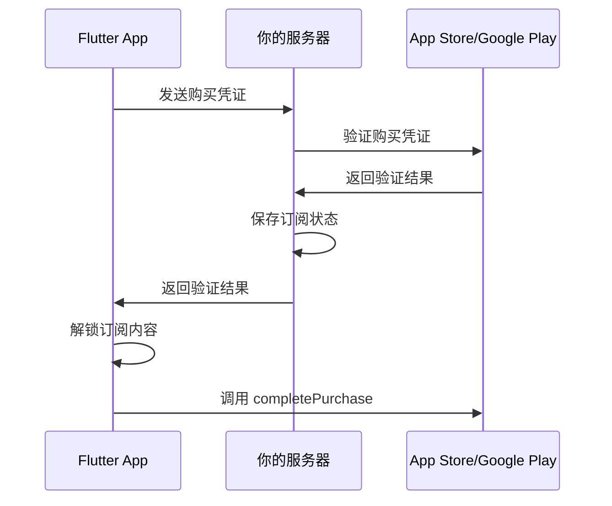

# 第 10 章：验证和完成购买

## 本章目标

- 理解购买验证的重要性
- 实现服务器端验证（推荐）
- 实现客户端验证（临时方案）
- 正确调用 completePurchase
- 解锁订阅内容

## 购买验证概述

### 为什么需要验证购买？

⚠️ **安全第一**：未经验证的购买可能是伪造的！

1. **防止欺诈**
   - 恶意用户可能伪造购买凭证
   - 可能通过破解 App 绕过支付

2. **确保购买合法**
   - 向 Apple/Google 服务器确认购买真实性
   - 获取购买的详细信息和状态

3. **业务需求**
   - 需要在服务器记录用户的订阅状态
   - 用于跨设备同步订阅

### 验证方式对比

| 方式 | 安全性 | 复杂度 | 推荐度 |
|------|--------|--------|--------|
| 服务器端验证 | ⭐⭐⭐⭐⭐ | 高 | ✅ 强烈推荐 |
| 客户端验证 | ⭐⭐ | 低 | ⚠️ 仅用于测试 |
| 不验证 | ⭐ | 无 | ❌ 绝不推荐 |

## 步骤 1：理解验证数据

### PurchaseDetails 中的验证数据

```dart
class PurchaseDetails {
  // ...
  
  // 验证数据
  final PurchaseVerificationData verificationData;
}

class PurchaseVerificationData {
  // 本地验证数据（通常是原始收据）
  final String localVerificationData;
  
  // 服务器验证数据（用于发送到你的服务器）
  final String serverVerificationData;
  
  // 数据来源
  final String source; // 'app_store' 或 'google_play'
}
```

### iOS 验证数据

```dart
if (purchaseDetails.verificationData.source == 'app_store') {
  // localVerificationData 和 serverVerificationData 都是 receipt data
  final receiptData = purchaseDetails.verificationData.serverVerificationData;
  // 这是 base64 编码的收据数据
  print('iOS 收据: $receiptData');
}
```

### Android 验证数据

```dart
if (purchaseDetails.verificationData.source == 'google_play') {
  // serverVerificationData 是 JSON 格式的购买数据
  final purchaseData = purchaseDetails.verificationData.serverVerificationData;
  // 包含 purchase token, order ID 等信息
  print('Android 购买数据: $purchaseData');
}
```

## 步骤 2：服务器端验证（推荐）

### 验证流程



### 实现服务器验证

#### 1. 创建 API 服务

创建 `lib/services/api_service.dart`：

```dart
import 'dart:convert';
import 'package:http/http.dart' as http;
import 'package:in_app_purchase/in_app_purchase.dart';

class ApiService {
  static const String baseUrl = 'https://your-api.com';

  /// 验证购买
  Future<VerificationResult> verifyPurchase(
    PurchaseDetails purchaseDetails,
    String userId,
  ) async {
    try {
      final response = await http.post(
        Uri.parse('$baseUrl/api/verify-purchase'),
        headers: {
          'Content-Type': 'application/json',
          'Authorization': 'Bearer YOUR_API_TOKEN',
        },
        body: jsonEncode({
          'userId': userId,
          'productId': purchaseDetails.productID,
          'purchaseId': purchaseDetails.purchaseID,
          'verificationData': {
            'source': purchaseDetails.verificationData.source,
            'localData': purchaseDetails.verificationData.localVerificationData,
            'serverData': purchaseDetails.verificationData.serverVerificationData,
          },
          'transactionDate': purchaseDetails.transactionDate,
        }),
      );

      if (response.statusCode == 200) {
        final data = jsonDecode(response.body);
        return VerificationResult.fromJson(data);
      } else {
        print('验证失败: ${response.statusCode}');
        return VerificationResult.failure('验证失败');
      }
    } catch (e) {
      print('验证异常: $e');
      return VerificationResult.failure('网络错误');
    }
  }
}

/// 验证结果
class VerificationResult {
  final bool isValid;
  final String? errorMessage;
  final Map<String, dynamic>? subscriptionInfo;

  VerificationResult({
    required this.isValid,
    this.errorMessage,
    this.subscriptionInfo,
  });

  factory VerificationResult.success({
    Map<String, dynamic>? subscriptionInfo,
  }) {
    return VerificationResult(
      isValid: true,
      subscriptionInfo: subscriptionInfo,
    );
  }

  factory VerificationResult.failure(String message) {
    return VerificationResult(
      isValid: false,
      errorMessage: message,
    );
  }

  factory VerificationResult.fromJson(Map<String, dynamic> json) {
    return VerificationResult(
      isValid: json['valid'] == true,
      errorMessage: json['error'],
      subscriptionInfo: json['subscriptionInfo'],
    );
  }
}
```

#### 2. 在服务类中集成

更新 `lib/services/subscription_service.dart`：

```dart
class SubscriptionService {
  final ApiService _apiService = ApiService();
  
  // ... 之前的代码 ...

  /// 验证购买（完整实现）
  Future<bool> _verifyPurchase(PurchaseDetails purchaseDetails) async {
    print('开始验证购买: ${purchaseDetails.productID}');

    try {
      // 调用服务器验证
      final result = await _apiService.verifyPurchase(
        purchaseDetails,
        'user_123', // 替换为实际用户 ID
      );

      if (result.isValid) {
        print('购买验证成功');
        
        // 保存订阅信息（可选）
        if (result.subscriptionInfo != null) {
          await _saveSubscriptionInfo(result.subscriptionInfo!);
        }
        
        return true;
      } else {
        print('购买验证失败: ${result.errorMessage}');
        return false;
      }
    } catch (e) {
      print('验证过程中出错: $e');
      // 根据业务需求决定：
      // 选项1：验证失败就拒绝解锁（更安全）
      // 选项2：验证失败但仍然解锁（用户体验优先，风险更高）
      return false;
    }
  }

  /// 保存订阅信息到本地
  Future<void> _saveSubscriptionInfo(Map<String, dynamic> info) async {
    // 使用 SharedPreferences 或数据库保存
    print('保存订阅信息: $info');
    // 实现本地存储逻辑
  }
}
```

### 服务器端实现示例

#### Node.js + Express 示例

```javascript
// server.js
const express = require('express');
const app = express();
app.use(express.json());

// iOS 收据验证
async function verifyAppleReceipt(receiptData) {
  const https = require('https');
  
  // 生产环境和沙盒环境的验证 URL
  const urls = [
    'https://buy.itunes.apple.com/verifyReceipt', // 生产
    'https://sandbox.itunes.apple.com/verifyReceipt', // 沙盒
  ];
  
  for (const url of urls) {
    try {
      const response = await fetch(url, {
        method: 'POST',
        headers: { 'Content-Type': 'application/json' },
        body: JSON.stringify({
          'receipt-data': receiptData,
          'password': 'YOUR_SHARED_SECRET', // 从 App Store Connect 获取
        }),
      });
      
      const data = await response.json();
      
      if (data.status === 0) {
        return { valid: true, receipt: data.receipt };
      }
    } catch (error) {
      console.error('验证失败:', error);
    }
  }
  
  return { valid: false };
}

// Android 购买验证
async function verifyGooglePurchase(purchaseToken, productId, packageName) {
  const { google } = require('googleapis');
  
  // 使用服务账号认证
  const auth = new google.auth.GoogleAuth({
    keyFile: 'path/to/service-account-key.json',
    scopes: ['https://www.googleapis.com/auth/androidpublisher'],
  });
  
  const androidpublisher = google.androidpublisher({
    version: 'v3',
    auth: auth,
  });
  
  try {
    const response = await androidpublisher.purchases.subscriptions.get({
      packageName: packageName,
      subscriptionId: productId,
      token: purchaseToken,
    });
    
    return {
      valid: true,
      subscription: response.data,
    };
  } catch (error) {
    console.error('验证失败:', error);
    return { valid: false };
  }
}

// 验证端点
app.post('/api/verify-purchase', async (req, res) => {
  const { userId, productId, verificationData } = req.body;
  
  let result;
  
  if (verificationData.source === 'app_store') {
    // 验证 iOS 购买
    result = await verifyAppleReceipt(verificationData.serverData);
  } else if (verificationData.source === 'google_play') {
    // 验证 Android 购买
    const purchaseData = JSON.parse(verificationData.serverData);
    result = await verifyGooglePurchase(
      purchaseData.purchaseToken,
      productId,
      'com.your.package',
    );
  } else {
    return res.status(400).json({ error: '不支持的平台' });
  }
  
  if (result.valid) {
    // 保存到数据库
    await saveSubscription(userId, productId, result);
    
    res.json({
      valid: true,
      subscriptionInfo: {
        productId: productId,
        expiryDate: extractExpiryDate(result),
      },
    });
  } else {
    res.json({ valid: false, error: '验证失败' });
  }
});

app.listen(3000, () => {
  console.log('服务器运行在端口 3000');
});
```

## 步骤 3：客户端验证（仅用于测试）

⚠️ **警告**：客户端验证不安全，仅用于开发测试！

### 简单的客户端验证

```dart
Future<bool> _verifyPurchaseLocally(PurchaseDetails purchaseDetails) async {
  print('警告：使用客户端验证，仅用于测试！');

  // 基本检查
  if (purchaseDetails.productID.isEmpty) {
    print('产品 ID 为空');
    return false;
  }

  if (purchaseDetails.purchaseID == null || purchaseDetails.purchaseID!.isEmpty) {
    print('购买 ID 为空');
    return false;
  }

  if (purchaseDetails.verificationData.serverVerificationData.isEmpty) {
    print('验证数据为空');
    return false;
  }

  // 在生产环境中，这些检查都不够安全
  // 必须使用服务器验证！
  
  print('客户端验证通过（不安全）');
  return true;
}
```

## 步骤 4：完成购买

### 何时调用 completePurchase？

⚠️ **关键**：必须在以下步骤完成后调用：

1. ✅ 验证购买凭证
2. ✅ 通知服务器（如适用）
3. ✅ 解锁内容给用户
4. ✅ 保存订阅状态

### 实现 completePurchase

```dart
class SubscriptionService {
  // ...

  /// 完成购买
  Future<void> _completePurchase(PurchaseDetails purchaseDetails) async {
    if (!purchaseDetails.pendingCompletePurchase) {
      print('购买已经完成，无需再次完成');
      return;
    }

    try {
      await _inAppPurchase.completePurchase(purchaseDetails);
      print('购买已完成: ${purchaseDetails.productID}');
    } catch (e) {
      print('完成购买时出错: $e');
      // 不要抛出异常，因为购买已经成功
      // 下次应用启动时会重试
    }
  }

  /// 处理成功的购买（完整流程）
  Future<void> _handleSuccessfulPurchase(PurchaseDetails purchaseDetails) async {
    print('处理购买: ${purchaseDetails.productID}');

    try {
      // 1. 验证购买
      final bool valid = await _verifyPurchase(purchaseDetails);

      if (!valid) {
        print('购买验证失败: ${purchaseDetails.productID}');
        _showErrorToUser('购买验证失败，请联系客服');
        return;
      }

      // 2. 解锁订阅内容
      await _unlockSubscription(purchaseDetails);

      // 3. 通知用户
      _showSuccessToUser('订阅已激活！');

    } catch (e) {
      print('处理购买时出错: $e');
      _showErrorToUser('激活订阅时出错，请重启应用');
    } finally {
      // 4. 完成购买（必须调用）
      if (purchaseDetails.pendingCompletePurchase) {
        await _completePurchase(purchaseDetails);
      }
    }
  }
}
```

### 未完成购买的后果

如果不调用 `completePurchase()`：

1. ❌ 每次应用启动都会收到该购买更新
2. ❌ iOS 超过 3 天会自动退款
3. ❌ 用户体验差（重复弹窗）

## 步骤 5：解锁订阅内容

### 保存订阅状态

```dart
import 'package:shared_preferences/shared_preferences.dart';

class SubscriptionManager {
  static const String _keyActiveSubscription = 'active_subscription';
  static const String _keyExpiryDate = 'subscription_expiry';

  /// 激活订阅
  Future<void> activateSubscription(String productId) async {
    final prefs = await SharedPreferences.getInstance();
    await prefs.setString(_keyActiveSubscription, productId);
    await prefs.setString(
      _keyExpiryDate,
      DateTime.now().add(const Duration(days: 30)).toIso8601String(),
    );
    print('订阅已激活: $productId');
  }

  /// 检查订阅是否激活
  Future<bool> isSubscriptionActive() async {
    final prefs = await SharedPreferences.getInstance();
    final productId = prefs.getString(_keyActiveSubscription);
    
    if (productId == null) return false;

    final expiryString = prefs.getString(_keyExpiryDate);
    if (expiryString == null) return false;

    final expiry = DateTime.parse(expiryString);
    return DateTime.now().isBefore(expiry);
  }

  /// 获取当前订阅
  Future<String?> getCurrentSubscription() async {
    final prefs = await SharedPreferences.getInstance();
    return prefs.getString(_keyActiveSubscription);
  }

  /// 取消订阅（本地状态）
  Future<void> clearSubscription() async {
    final prefs = await SharedPreferences.getInstance();
    await prefs.remove(_keyActiveSubscription);
    await prefs.remove(_keyExpiryDate);
    print('订阅已清除');
  }
}
```

### 在服务类中使用

```dart
class SubscriptionService {
  final SubscriptionManager _subscriptionManager = SubscriptionManager();

  // ...

  /// 解锁订阅内容
  Future<void> _unlockSubscription(PurchaseDetails purchaseDetails) async {
    print('解锁订阅: ${purchaseDetails.productID}');

    // 激活订阅
    await _subscriptionManager.activateSubscription(purchaseDetails.productID);

    // 通知 UI 更新
    _notifySubscriptionChanged(purchaseDetails.productID);

    print('订阅已解锁: ${purchaseDetails.productID}');
  }

  /// 检查用户是否有活跃订阅
  Future<bool> hasActiveSubscription() async {
    return await _subscriptionManager.isSubscriptionActive();
  }

  /// 获取当前订阅产品 ID
  Future<String?> getCurrentSubscriptionId() async {
    return await _subscriptionManager.getCurrentSubscription();
  }
}
```

## 步骤 6：处理验证失败

### 验证失败的处理策略

```dart
Future<void> _handleSuccessfulPurchase(PurchaseDetails purchaseDetails) async {
  // 验证购买
  final bool valid = await _verifyPurchase(purchaseDetails);

  if (!valid) {
    print('购买验证失败');
    
    // 策略1：拒绝解锁，通知用户
    _showErrorToUser('购买验证失败，请联系客服');
    
    // 策略2：临时解锁，稍后重试验证
    // await _unlockSubscriptionTemporarily(purchaseDetails);
    // _scheduleRetryVerification(purchaseDetails);
    
    // 策略3：离线模式，记录待验证
    // await _savePendingVerification(purchaseDetails);
    
    // 仍然要完成购买，避免重复弹窗
    if (purchaseDetails.pendingCompletePurchase) {
      await _completePurchase(purchaseDetails);
    }
    
    return;
  }

  // 验证成功，正常解锁
  await _unlockSubscription(purchaseDetails);
  
  if (purchaseDetails.pendingCompletePurchase) {
    await _completePurchase(purchaseDetails);
  }
}
```

## 测试验证流程

### 测试清单

- [ ] 测试正常购买和验证
- [ ] 测试网络错误时的验证
- [ ] 测试服务器返回失败时的处理
- [ ] 验证 completePurchase 被正确调用
- [ ] 测试应用重启后的购买恢复

### 模拟验证场景

```dart
// 用于测试的模拟验证
Future<bool> _mockVerifyPurchase(
  PurchaseDetails purchaseDetails,
  {bool shouldSucceed = true, int delaySeconds = 2}
) async {
  print('模拟验证开始...');
  await Future.delayed(Duration(seconds: delaySeconds));
  
  if (shouldSucceed) {
    print('模拟验证成功');
    return true;
  } else {
    print('模拟验证失败');
    return false;
  }
}
```

## 常见问题

### Q1：必须有服务器才能实现订阅吗？

**技术上不是必须的**，但强烈推荐：

- 没有服务器：安全性低，容易被破解
- 有服务器：安全可靠，支持跨设备同步

### Q2：验证需要多长时间？

- 服务器端验证：通常 1-3 秒
- Apple 服务器响应：快（通常 < 1 秒）
- Google Play 响应：稍慢（1-2 秒）

### Q3：用户在没有网络时购买了怎么办？

购买会成功，但验证会失败。应该：

1. 保存购买为"待验证"状态
2. 提示用户连接网络
3. 有网络后自动重试验证

### Q4：completePurchase 可以多次调用吗？

可以，但没必要。多次调用不会有问题，插件会忽略重复调用。

## 小结

在本章中，我们学习了：

- 购买验证的重要性和方式
- 如何实现服务器端验证
- 如何正确调用 completePurchase
- 如何解锁和管理订阅状态
- 如何处理验证失败的情况

完成验证流程后，下一步是实现恢复购买功能。

## 下一步

[第 11 章：恢复购买](11-restore-purchase.md) - 学习如何实现购买恢复功能，让用户在新设备上恢复订阅。
