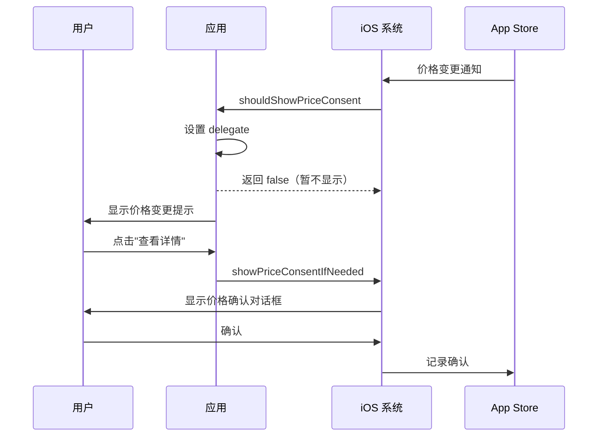

# 第 13 章：处理订阅价格变更

## 本章目标

- 理解价格变更的通知机制
- 实现 iOS 价格确认流程
- 处理 Android 价格变更通知
- 优化用户体验

## 价格变更概述

### 为什么会有价格变更？

开发者可能因以下原因调整订阅价格：

- 💰 市场策略调整
- 💰 成本增加
- 💰 增加功能或服务
- 💰 货币汇率变化

### 平台政策

#### iOS App Store

- **价格上涨**：需要用户明确同意
- **价格下降**：自动应用，无需确认
- **通知方式**：系统弹窗或应用内弹窗
- **未确认后果**：订阅到期后不再续订

#### Google Play

- **价格上涨**：需要用户确认
- **价格下降**：自动应用
- **通知方式**：邮件和通知
- **未确认后果**：订阅继续按旧价格，直到用户确认

## iOS 价格变更处理

### 工作流程



### 实现价格变更处理

#### 1. 设置 Payment Queue Delegate

```dart
import 'dart:io';
import 'package:in_app_purchase/in_app_purchase.dart';
import 'package:in_app_purchase_storekit/in_app_purchase_storekit.dart';
import 'package:in_app_purchase_storekit/store_kit_wrappers.dart';

class PriceChangeDelegate implements SKPaymentQueueDelegateWrapper {
  /// 是否应该继续交易
  /// 
  /// 当 StoreKit 想要在不同的 storefront 处理交易时调用
  @override
  bool shouldContinueTransaction(
    SKPaymentTransactionWrapper transaction,
    SKStorefrontWrapper storefront,
  ) {
    // 通常返回 true 允许继续
    return true;
  }

  /// 是否应该显示价格确认对话框
  /// 
  /// 当价格变更需要用户确认时调用
  @override
  bool shouldShowPriceConsent() {
    // 返回 false 表示我们要自己控制何时显示
    // 返回 true 表示让系统立即显示
    print('检测到价格变更需要确认');
    return false; // 我们稍后手动显示
  }
}
```

#### 2. 注册 Delegate

```dart
class SubscriptionService {
  InAppPurchaseStoreKitPlatformAddition? _iosPlatformAddition;
  PriceChangeDelegate? _priceChangeDelegate;

  Future<bool> initialize() async {
    // ... 其他初始化代码 ...

    if (Platform.isIOS) {
      _setupIOSPriceChangeHandling();
    }

    return _isAvailable;
  }

  void _setupIOSPriceChangeHandling() {
    _iosPlatformAddition = _inAppPurchase
        .getPlatformAddition<InAppPurchaseStoreKitPlatformAddition>();

    _priceChangeDelegate = PriceChangeDelegate();
    _iosPlatformAddition?.setDelegate(_priceChangeDelegate);

    print('iOS 价格变更处理已设置');
  }

  @override
  void dispose() {
    // 清理 delegate
    if (Platform.isIOS) {
      _iosPlatformAddition?.setDelegate(null);
    }
    _subscription?.cancel();
  }
}
```

#### 3. 显示价格确认对话框

```dart
class SubscriptionService {
  // ...

  /// 显示 iOS 价格确认对话框
  Future<void> showIOSPriceConsent() async {
    if (!Platform.isIOS) {
      print('只有 iOS 支持价格确认对话框');
      return;
    }

    if (_iosPlatformAddition == null) {
      print('iOS 平台扩展未初始化');
      return;
    }

    try {
      print('显示价格确认对话框...');
      await _iosPlatformAddition!.showPriceConsentIfNeeded();
      print('价格确认对话框已显示');
    } catch (e) {
      print('显示价格确认对话框时出错: $e');
    }
  }

  /// 检查是否需要显示价格确认
  Future<bool> needsPriceConsent() async {
    if (!Platform.isIOS) return false;
    
    // iOS 没有直接的 API 检查是否需要确认
    // 可以通过调用 showPriceConsentIfNeeded 来尝试
    // 如果不需要，它会立即返回
    return false; // 占位符
  }
}
```

### UI 实现

#### 价格变更提示横幅

```dart
import 'package:flutter/material.dart';
import '../../../../services/subscription_service.dart';

class PriceChangeBanner extends StatelessWidget {
  final VoidCallback? onDismiss;

  const PriceChangeBanner({super.key, this.onDismiss});

  @override
  Widget build(BuildContext context) {
    return Container(
      color: Colors.orange[100],
      padding: const EdgeInsets.all(16),
      child: Row(
        children: [
          const Icon(Icons.info_outline, color: Colors.orange),
          const SizedBox(width: 12),
          const Expanded(
            child: Column(
              crossAxisAlignment: CrossAxisAlignment.start,
              children: [
                Text(
                  '订阅价格调整',
                  style: TextStyle(
                    fontWeight: FontWeight.bold,
                    color: Colors.orange,
                  ),
                ),
                SizedBox(height: 4),
                Text(
                  '您的订阅价格即将调整，请查看并确认。',
                  style: TextStyle(fontSize: 12),
                ),
              ],
            ),
          ),
          TextButton(
            onPressed: () => _handleShowPriceConsent(context),
            child: const Text('查看'),
          ),
          if (onDismiss != null)
            IconButton(
              icon: const Icon(Icons.close, size: 20),
              onPressed: onDismiss,
              padding: EdgeInsets.zero,
              constraints: const BoxConstraints(),
            ),
        ],
      ),
    );
  }

  Future<void> _handleShowPriceConsent(BuildContext context) async {
    final service = SubscriptionService();
    await service.showIOSPriceConsent();
  }
}
```

#### 在主页显示横幅

```dart
class HomeScreen extends StatefulWidget {
  const HomeScreen({super.key});

  @override
  State<HomeScreen> createState() => _HomeScreenState();
}

class _HomeScreenState extends State<HomeScreen> {
  bool _showPriceBanner = false;

  @override
  void initState() {
    super.initState();
    _checkPriceChange();
  }

  Future<void> _checkPriceChange() async {
    if (!Platform.isIOS) return;

    // 检查是否需要显示价格确认
    final service = SubscriptionService();
    final needsConsent = await service.needsPriceConsent();

    if (needsConsent && mounted) {
      setState(() => _showPriceBanner = true);
    }
  }

  @override
  Widget build(BuildContext context) {
    return Scaffold(
      body: Column(
        children: [
          if (_showPriceBanner)
            PriceChangeBanner(
              onDismiss: () {
                setState(() => _showPriceBanner = false);
              },
            ),
          Expanded(
            child: _buildContent(),
          ),
        ],
      ),
    );
  }

  Widget _buildContent() {
    // 主要内容
    return Container();
  }
}
```

## Android 价格变更处理

### Android 机制

Android 的价格变更处理相对简单：

1. **Google Play 自动通知用户**
   - 通过邮件
   - 通过推送通知
   - 在 Play 商店应用中

2. **开发者的职责**
   - 在应用中提供深链接到订阅管理
   - 提供清晰的价格信息
   - 可选：应用内提醒

### 实现 Android 价格变更提示

```dart
import 'dart:io';
import 'package:url_launcher/url_launcher.dart';

class SubscriptionService {
  // ...

  /// 打开 Android 订阅管理页面
  Future<void> openAndroidSubscriptionManagement({
    required String packageName,
    required String subscriptionId,
  }) async {
    if (!Platform.isAndroid) {
      print('只有 Android 支持此功能');
      return;
    }

    final url = Uri.parse(
      'https://play.google.com/store/account/subscriptions'
      '?package=$packageName&sku=$subscriptionId',
    );

    try {
      if (await canLaunchUrl(url)) {
        await launchUrl(url, mode: LaunchMode.externalApplication);
      } else {
        print('无法打开订阅管理页面');
      }
    } catch (e) {
      print('打开订阅管理页面时出错: $e');
    }
  }

  /// 打开通用订阅管理（不需要具体订阅 ID）
  Future<void> openSubscriptionSettings() async {
    if (Platform.isAndroid) {
      final url = Uri.parse(
        'https://play.google.com/store/account/subscriptions',
      );

      try {
        await launchUrl(url, mode: LaunchMode.externalApplication);
      } catch (e) {
        print('打开订阅设置时出错: $e');
      }
    } else if (Platform.isIOS) {
      // iOS 订阅管理
      final url = Uri.parse('https://apps.apple.com/account/subscriptions');
      
      try {
        await launchUrl(url, mode: LaunchMode.externalApplication);
      } catch (e) {
        print('打开订阅设置时出错: $e');
      }
    }
  }
}
```

### Android 价格变更 UI

```dart
class AndroidPriceChangeDialog extends StatelessWidget {
  final String oldPrice;
  final String newPrice;
  final String effectiveDate;

  const AndroidPriceChangeDialog({
    super.key,
    required this.oldPrice,
    required this.newPrice,
    required this.effectiveDate,
  });

  @override
  Widget build(BuildContext context) {
    return AlertDialog(
      title: const Text('订阅价格调整'),
      content: Column(
        mainAxisSize: MainAxisSize.min,
        crossAxisAlignment: CrossAxisAlignment.start,
        children: [
          const Text('您的订阅价格即将调整：'),
          const SizedBox(height: 16),
          _buildPriceRow('当前价格', oldPrice),
          const SizedBox(height: 8),
          _buildPriceRow('新价格', newPrice, highlight: true),
          const SizedBox(height: 16),
          Text(
            '生效日期：$effectiveDate',
            style: TextStyle(
              fontSize: 12,
              color: Colors.grey[600],
            ),
          ),
          const SizedBox(height: 16),
          const Text(
            'Google Play 已向您发送邮件通知。您可以在 Google Play 中管理订阅。',
            style: TextStyle(fontSize: 12),
          ),
        ],
      ),
      actions: [
        TextButton(
          onPressed: () => Navigator.of(context).pop(),
          child: const Text('稍后处理'),
        ),
        ElevatedButton(
          onPressed: () {
            Navigator.of(context).pop();
            _openSubscriptionManagement();
          },
          child: const Text('管理订阅'),
        ),
      ],
    );
  }

  Widget _buildPriceRow(String label, String price, {bool highlight = false}) {
    return Row(
      mainAxisAlignment: MainAxisAlignment.spaceBetween,
      children: [
        Text(label),
        Text(
          price,
          style: TextStyle(
            fontWeight: FontWeight.bold,
            color: highlight ? Colors.orange : null,
            fontSize: highlight ? 18 : 16,
          ),
        ),
      ],
    );
  }

  Future<void> _openSubscriptionManagement() async {
    final service = SubscriptionService();
    await service.openSubscriptionSettings();
  }
}
```

## 最佳实践

### 1. 提前通知用户

```dart
class PriceChangeNotification {
  /// 发送应用内通知
  static void notifyPriceChange({
    required String productName,
    required String oldPrice,
    required String newPrice,
    required DateTime effectiveDate,
  }) {
    // 保存通知到本地
    _savePriceChangeNotification(
      productName: productName,
      oldPrice: oldPrice,
      newPrice: newPrice,
      effectiveDate: effectiveDate,
    );

    // 可选：发送推送通知
    _sendPushNotification(
      title: '订阅价格调整',
      body: '$productName 的价格将从 $oldPrice 调整为 $newPrice',
    );
  }

  static Future<void> _savePriceChangeNotification({
    required String productName,
    required String oldPrice,
    required String newPrice,
    required DateTime effectiveDate,
  }) async {
    // 保存到本地存储
    final prefs = await SharedPreferences.getInstance();
    await prefs.setString('price_change_product', productName);
    await prefs.setString('price_change_old', oldPrice);
    await prefs.setString('price_change_new', newPrice);
    await prefs.setString('price_change_date', effectiveDate.toIso8601String());
  }

  static Future<void> _sendPushNotification({
    required String title,
    required String body,
  }) async {
    // 实现推送通知逻辑
  }
}
```

### 2. 提供清晰的信息

```dart
class PriceChangeInfoScreen extends StatelessWidget {
  const PriceChangeInfoScreen({super.key});

  @override
  Widget build(BuildContext context) {
    return Scaffold(
      appBar: AppBar(
        title: const Text('价格调整说明'),
      ),
      body: ListView(
        padding: const EdgeInsets.all(16),
        children: [
          const Text(
            '为什么价格会调整？',
            style: TextStyle(fontSize: 18, fontWeight: FontWeight.bold),
          ),
          const SizedBox(height: 8),
          const Text(
            '我们持续改进服务，增加新功能，确保为您提供最佳体验。'
            '价格调整有助于我们继续提供高质量的服务。',
          ),
          const SizedBox(height: 24),
          const Text(
            '调整详情',
            style: TextStyle(fontSize: 18, fontWeight: FontWeight.bold),
          ),
          const SizedBox(height: 8),
          _buildDetailRow('生效时间', '下次续订时'),
          _buildDetailRow('当前价格', '¥18.00/月'),
          _buildDetailRow('新价格', '¥25.00/月'),
          const SizedBox(height: 24),
          const Text(
            '您的选择',
            style: TextStyle(fontSize: 18, fontWeight: FontWeight.bold),
          ),
          const SizedBox(height: 8),
          const Text(
            '• 接受新价格继续订阅\n'
            '• 在下次续订前取消订阅',
          ),
          const SizedBox(height: 24),
          ElevatedButton(
            onPressed: () {
              // 确认价格变更
            },
            child: const Text('接受新价格'),
          ),
          const SizedBox(height: 8),
          TextButton(
            onPressed: () {
              // 打开订阅管理
            },
            child: const Text('管理订阅'),
          ),
        ],
      ),
    );
  }

  Widget _buildDetailRow(String label, String value) {
    return Padding(
      padding: const EdgeInsets.symmetric(vertical: 4),
      child: Row(
        mainAxisAlignment: MainAxisAlignment.spaceBetween,
        children: [
          Text(label),
          Text(
            value,
            style: const TextStyle(fontWeight: FontWeight.bold),
          ),
        ],
      ),
    );
  }
}
```

### 3. 尊重用户选择

```dart
class SubscriptionService {
  // ...

  /// 用户选择不接受价格变更
  Future<void> handlePriceChangeRejection() async {
    // 1. 记录用户决定
    await _recordUserDecision(accepted: false);

    // 2. 提供取消订阅的选项
    await _showCancellationOptions();

    // 3. 通知服务器
    await _notifyServerOfDecision(accepted: false);
  }

  /// 用户接受价格变更
  Future<void> handlePriceChangeAcceptance() async {
    // 1. 记录用户决定
    await _recordUserDecision(accepted: true);

    // 2. 显示确认消息
    _showAcceptanceConfirmation();

    // 3. 通知服务器
    await _notifyServerOfDecision(accepted: true);
  }

  Future<void> _recordUserDecision({required bool accepted}) async {
    final prefs = await SharedPreferences.getInstance();
    await prefs.setBool('price_change_accepted', accepted);
    await prefs.setString(
      'price_change_decision_date',
      DateTime.now().toIso8601String(),
    );
  }

  Future<void> _showCancellationOptions() async {
    // 显示取消订阅的说明和链接
  }

  void _showAcceptanceConfirmation() {
    // 显示感谢消息
    print('感谢您继续支持我们！');
  }

  Future<void> _notifyServerOfDecision({required bool accepted}) async {
    // 通知服务器用户的决定
  }
}
```

## 测试价格变更

### iOS 测试

在沙盒环境中测试价格变更：

1. 在 App Store Connect 中创建价格变更
2. 设置生效日期
3. 使用沙盒账号测试
4. 验证价格确认对话框显示

⚠️ **注意**：沙盒环境的价格变更测试可能不完全可靠。

### Android 测试

1. 在 Play Console 中调整订阅价格
2. 使用测试账号订阅
3. 等待 Google Play 发送通知
4. 验证通知和确认流程

## 常见问题

### Q1：价格变更通知何时显示？

- **iOS**：由系统决定，通常在应用启动时
- **Android**：通过邮件和系统通知

### Q2：用户必须确认价格变更吗？

**是的**（对于价格上涨）。未确认的订阅会在当前周期结束后停止续订。

### Q3：价格下降需要确认吗？

**不需要**。价格下降会自动应用，对用户有利。

### Q4：如何获知价格变更的详情？

- iOS：通过 StoreKit 的 delegate 回调
- Android：通过 Play Developer API 或用户通知

### Q5：可以在应用内完成价格确认吗？

- **iOS**：可以，使用 `showPriceConsentIfNeeded()`
- **Android**：需要跳转到 Play 商店

## 小结

在本章中，我们学习了：

- 订阅价格变更的通知机制
- iOS 价格确认对话框的实现
- Android 价格变更的处理方式
- 如何提供良好的用户体验
- 价格变更的最佳实践

完成价格变更处理后，最后一章将总结最佳实践和常见问题。

## 下一步

[第 14 章：最佳实践和常见问题](14-best-practices.md) - 总结订阅开发的最佳实践和常见问题解答。
