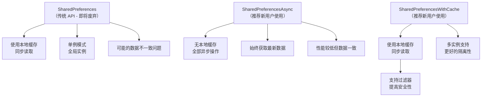
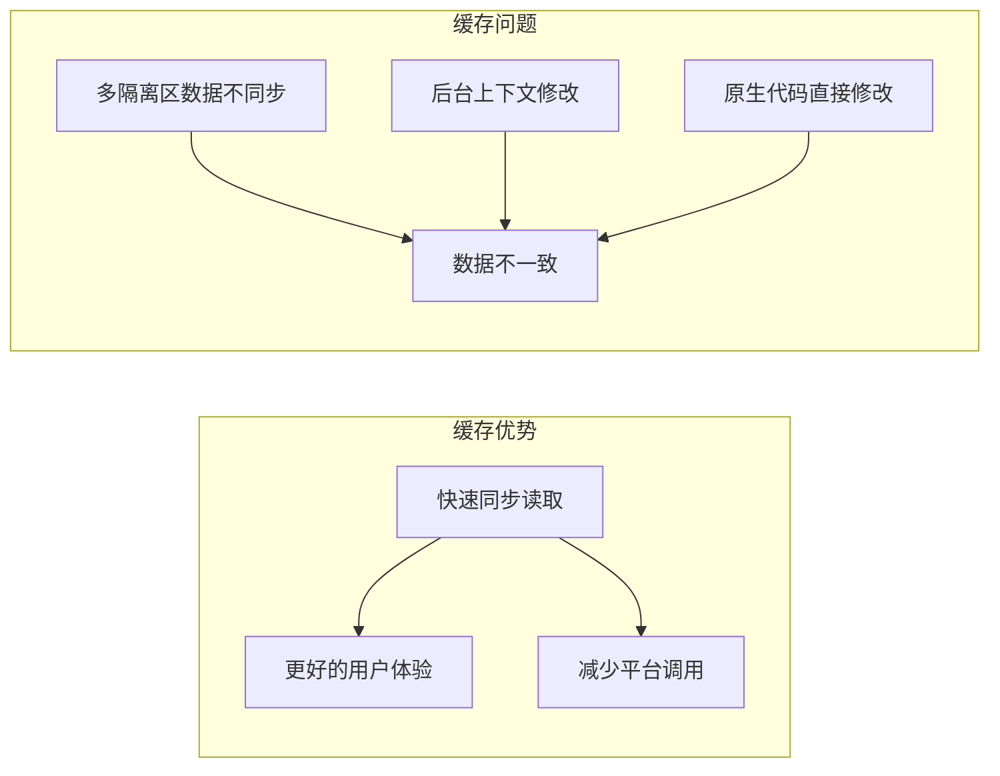
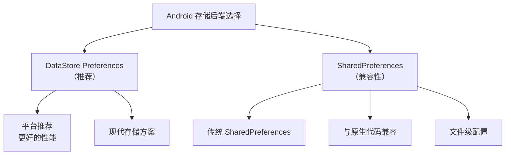
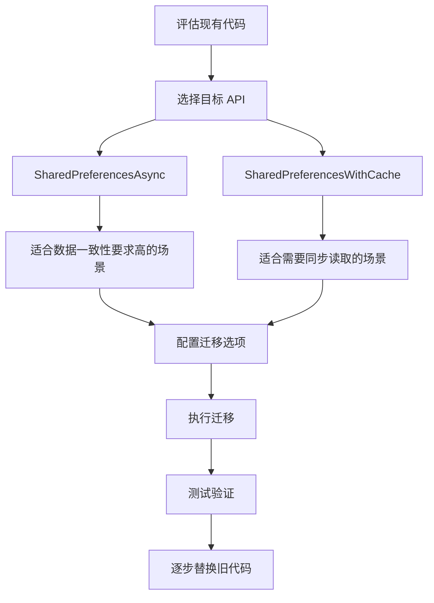

# Shared Preferences 插件详解

## 概述

Shared Preferences 插件是 Flutter 中用于处理简单数据持久化存储的官方插件。它提供了跨平台的本地存储解决方案，支持在设备上异步持久化存储简单数据类型。

### 核心特性

- **跨平台支持**：支持 Android、iOS、Linux、macOS、Web 和 Windows 平台
- **异步存储**：数据写入磁盘是异步操作，不保证立即持久化
- **数据类型限制**：仅支持 `int`、`double`、`bool`、`String` 和 `List<String>` 五种基本数据类型
- **非关键数据**：不适用于存储关键数据，因为没有持久化保证

### 平台最低版本要求

| 平台      | 版本要求 |
| --------- | ------- |
| Android   | SDK 24+ |
| iOS       | 13.0+  |
| Linux     | 任意版本 |
| macOS     | 10.15+  |
| Web       | 任意版本 |
| Windows   | 任意版本 |

## 三种 API 对比分析

从 2.3.0 版本开始，插件提供了三种不同的 API。以下是它们的核心区别和适用场景：



### API 特性对比

| 特性 | SharedPreferences | SharedPreferencesAsync | SharedPreferencesWithCache |
| --- | --- | --- | --- |
| **缓存机制** | ✅ 本地缓存 | ❌ 无缓存 | ✅ 本地缓存 |
| **读取方式** | 同步 | 异步 | 同步 |
| **数据一致性** | 可能不一致 | 始终一致 | 可能不一致 |
| **多隔离区支持** | ❌ | ✅ | ✅ |
| **过滤器支持** | ❌ | ✅ | ✅ |
| **推荐程度** | 即将废弃 | 推荐使用 | 推荐使用 |

## 缓存机制详解

### 缓存的优势与问题

SharedPreferences 和 SharedPreferencesWithCache 都使用了本地缓存机制，这带来了性能优势但也可能导致数据不一致问题：



### 缓存问题解决方案

```dart
// 解决方案：主动调用 reload() 方法
final SharedPreferences prefs = await SharedPreferences.getInstance();

// 在需要最新数据时主动刷新缓存
await prefs.reload();

// 然后进行读取操作
final String? value = prefs.getString('key');
```

### SharedPreferencesAsync 的优势

SharedPreferencesAsync 不使用本地缓存，每次操作都直接调用平台存储，因此：

- **始终获取最新数据**：不受缓存影响
- **多进程安全**：不同隔离区或进程间的修改都能正确反映
- **性能代价**：每次读取都是异步平台调用

## Android 平台存储选项

Android 平台提供了两种存储后端选择：



### 使用 Android SharedPreferences 后端

```dart
import 'package:shared_preferences_android/shared_preferences_android.dart';

// 配置使用传统 SharedPreferences 后端
const SharedPreferencesAsyncAndroidOptions options =
    SharedPreferencesAsyncAndroidOptions(
      backend: SharedPreferencesAndroidBackendLibrary.SharedPreferences,
      originalSharedPreferencesOptions: AndroidSharedPreferencesStoreOptions(
        fileName: 'the_name_of_a_file',
      ),
    );

// 创建实例时传入选项
final asyncPrefs = SharedPreferencesAsync(options: options);
```

## 代码示例详解

### SharedPreferences（传统 API）

#### 数据写入

```dart
// 1. 获取 SharedPreferences 实例
final SharedPreferences prefs = await SharedPreferences.getInstance();

// 2. 写入不同类型的数据
await prefs.setInt('counter', 10);        // 整数
await prefs.setBool('repeat', true);      // 布尔值
await prefs.setDouble('decimal', 1.5);    // 浮点数
await prefs.setString('action', 'Start'); // 字符串
await prefs.setStringList('items', <String>['Earth', 'Moon', 'Sun']); // 字符串列表
```

**关键点说明**：

- `getInstance()` 返回单例实例
- 所有设置操作都是异步的，返回 `Future<void>`
- 支持五种基本数据类型

#### 数据读取

```dart
// 尝试读取数据，如果键不存在返回 null
final int? counter = prefs.getInt('counter');
final bool? repeat = prefs.getBool('repeat');
final double? decimal = prefs.getDouble('decimal');
final String? action = prefs.getString('action');
final List<String>? items = prefs.getStringList('items');
```

**关键点说明**：

- 读取操作是同步的（因为有缓存）
- 不存在的值返回 `null`
- 需要使用可空类型接收返回值

#### 数据删除

```dart
// 删除指定键的值
await prefs.remove('counter');

// 清空所有数据
await prefs.clear();
```

### SharedPreferencesAsync（异步 API）

```dart
final asyncPrefs = SharedPreferencesAsync();

// 写入数据
await asyncPrefs.setBool('repeat', true);
await asyncPrefs.setString('action', 'Start');

// 读取数据
final bool? repeat = await asyncPrefs.getBool('repeat');
final String? action = await asyncPrefs.getString('action');

// 删除数据
await asyncPrefs.remove('repeat');

// 清空数据（推荐使用过滤器）
await asyncPrefs.clear(allowList: <String>{'action', 'repeat'});
```

**关键点说明**：

- 所有操作都是异步的
- `clear()` 方法支持 `allowList` 参数，只清除指定键的数据
- 提供了更好的数据安全性控制

### SharedPreferencesWithCache（带缓存的 API）

```dart
final SharedPreferencesWithCache prefsWithCache =
    await SharedPreferencesWithCache.create(
  cacheOptions: const SharedPreferencesWithCacheOptions(
    // 白名单：只允许访问指定键
    allowList: <String>{'repeat', 'action'},
  ),
);

// 使用方式与传统 API 类似，但更安全
await prefsWithCache.setBool('repeat', true);
await prefsWithCache.setString('action', 'Start');

// 同步读取
final bool? repeat = prefsWithCache.getBool('repeat');
final String? action = prefsWithCache.getString('action');

await prefsWithCache.remove('repeat');
await prefsWithCache.clear();
```

**关键点说明**：

- 创建时可以设置 `allowList` 白名单
- 白名单外的键无法访问，提高了安全性
- 支持多种过滤选项

## 迁移指南

### 从 SharedPreferences 迁移到新 API

```dart
import 'package:shared_preferences/util/legacy_to_async_migration_util.dart';

// 1. 准备迁移选项
const sharedPreferencesOptions = SharedPreferencesOptions();

// 2. 获取传统实例
final SharedPreferences prefs = await SharedPreferences.getInstance();

// 3. 执行迁移
await migrateLegacySharedPreferencesToSharedPreferencesAsyncIfNecessary(
  legacySharedPreferencesInstance: prefs,
  sharedPreferencesAsyncOptions: sharedPreferencesOptions,
  migrationCompletedKey: 'migrationCompleted',
);
```

**迁移注意事项**：

- 迁移是幂等的，可以重复执行
- 使用 `migrationCompletedKey` 标记迁移完成状态
- 迁移完成后即可使用新的 API

### 最佳迁移策略



## 前缀管理

### 默认行为

SharedPreferences 默认只读写以 `flutter.` 开头的键值：

```dart
// 实际存储的键名
// 'counter' -> 'flutter.counter'
// 'user.name' -> 'flutter.user.name'
```

### 自定义前缀

```dart
// 在创建任何实例前设置前缀
SharedPreferences.setPrefix('myapp.');

// 现在键名变为：'myapp.counter' 等

// 设置为空字符串可以访问所有偏好设置
SharedPreferences.setPrefix('');
```

**前缀管理注意事项**：

- `setPrefix()` 必须在使用前调用
- 设置为空字符串可以访问非 Flutter 应用的数据
- 可能遇到不支持的数据类型导致初始化失败
- 可以使用 `allowList` 限制只访问支持类型的键

## 平台存储位置

不同平台的存储位置和机制：

| 平台 | SharedPreferences | SharedPreferencesAsync/WithCache |
| --- | --- | --- |
| **Android** | SharedPreferences | DataStore Preferences 或 SharedPreferences |
| **iOS** | NSUserDefaults | NSUserDefaults |
| **Linux** | XDG_DATA_HOME 目录 | XDG_DATA_HOME 目录 |
| **macOS** | NSUserDefaults | NSUserDefaults |
| **Web** | LocalStorage | LocalStorage |
| **Windows** | 漫游 AppData 目录 | 漫游 AppData 目录 |

## 实际应用场景

### 用户偏好设置存储

```dart
class UserPreferences {
  static const String _themeKey = 'theme_mode';
  static const String _languageKey = 'language';
  static const String _notificationsKey = 'notifications_enabled';

  final SharedPreferencesAsync _prefs = SharedPreferencesAsync();

  Future<ThemeMode> getThemeMode() async {
    final String? theme = await _prefs.getString(_themeKey);
    return ThemeMode.values.firstWhere(
      (mode) => mode.name == theme,
      orElse: () => ThemeMode.system,
    );
  }

  Future<void> setThemeMode(ThemeMode mode) async {
    await _prefs.setString(_themeKey, mode.name);
  }

  Future<String> getLanguage() async {
    return await _prefs.getString(_languageKey) ?? 'en';
  }

  Future<void> setLanguage(String language) async {
    await _prefs.setString(_languageKey, language);
  }

  Future<bool> getNotificationsEnabled() async {
    return await _prefs.getBool(_notificationsKey) ?? true;
  }

  Future<void> setNotificationsEnabled(bool enabled) async {
    await _prefs.setBool(_notificationsKey, enabled);
  }
}
```

### 应用状态缓存

```dart
class AppStateManager {
  final SharedPreferencesWithCache _prefs;

  AppStateManager(this._prefs);

  static Future<AppStateManager> create() async {
    final prefs = await SharedPreferencesWithCache.create(
      cacheOptions: const SharedPreferencesWithCacheOptions(
        allowList: <String>{'last_screen', 'user_session'},
      ),
    );
    return AppStateManager(prefs);
  }

  Future<void> saveLastScreen(String screenName) async {
    await _prefs.setString('last_screen', screenName);
  }

  String? getLastScreen() {
    return _prefs.getString('last_screen');
  }

  Future<void> saveUserSession(Map<String, dynamic> session) async {
    await _prefs.setString('user_session', jsonEncode(session));
  }

  Map<String, dynamic>? getUserSession() {
    final sessionStr = _prefs.getString('user_session');
    return sessionStr != null ? jsonDecode(sessionStr) : null;
  }
}
```

## 最佳实践与注意事项

### 性能优化

1. **选择合适的 API**：
   - 数据一致性要求高 → SharedPreferencesAsync
   - 频繁读取且能接受缓存 → SharedPreferencesWithCache
   - 遗留代码 → SharedPreferences（尽快迁移）

2. **批量操作**：

   ```dart
   // 推荐：批量设置减少平台调用
   await Future.wait([
     prefs.setString('key1', 'value1'),
     prefs.setString('key2', 'value2'),
   ]);
   ```

3. **错误处理**：

   ```dart
   try {
     await prefs.setString('key', 'value');
   } catch (e) {
     // 处理存储失败的情况
     debugPrint('Failed to save preference: $e');
   }
   ```

### 数据安全

1. **使用过滤器**：限制可访问的键范围
2. **敏感数据**：不要存储密码、令牌等敏感信息
3. **数据验证**：读取时验证数据完整性

### 内存管理

1. **及时清理**：删除不再需要的偏好设置
2. **避免大对象**：不要存储大量数据
3. **定期清理**：清理过期的缓存数据

## 常见问题解答

### Q: SharedPreferences 能存储复杂对象吗？

**A**: 不可以。SharedPreferences 只支持五种基本数据类型。对于复杂对象，需要先序列化为 JSON 字符串存储。

```dart
// 存储复杂对象
final user = {'name': 'John', 'age': 30};
await prefs.setString('user', jsonEncode(user));

// 读取复杂对象
final userStr = prefs.getString('user');
final user = userStr != null ? jsonDecode(userStr) : null;
```

### Q: 多隔离区（isolate）使用时数据会不一致吗？

**A**: 会。每个隔离区都有自己的 SharedPreferences 实例和缓存。建议：

- 使用 SharedPreferencesAsync 确保数据一致性
- 或在读取前调用 `reload()` 刷新缓存

### Q: Web 平台的数据存储在哪？

**A**: Web 平台使用浏览器的 LocalStorage API 存储数据。这些数据会持久化在用户的浏览器中。

### Q: 如何处理存储失败的情况？

**A**: SharedPreferences 的存储操作可能失败（比如磁盘空间不足）。应该添加错误处理：

```dart
try {
  await prefs.setString('important_data', data);
  // 验证存储成功
  final stored = prefs.getString('important_data');
  if (stored != data) {
    throw Exception('Data verification failed');
  }
} catch (e) {
  // 处理错误：显示用户提示、重试逻辑等
}
```

### Q: 能存储的 List<String\> 有多大限制？

**A**: 理论上没有固定限制，但建议避免存储过大的数据。大量数据应该考虑使用专门的数据库解决方案如 SQLite。

## 总结

Shared Preferences 插件是 Flutter 应用中处理简单数据持久化的标准解决方案。通过理解三种 API 的区别和适用场景，开发者可以根据具体需求选择最合适的存储策略。

**核心要点**：

- SharedPreferencesAsync：数据一致性优先，适合关键数据
- SharedPreferencesWithCache：性能和安全性并重，适合大多数场景
- 合理使用前缀和过滤器提高数据安全性
- 注意平台差异和存储限制

通过遵循最佳实践，可以构建出稳定可靠的数据持久化层，为 Flutter 应用提供良好的用户体验。
